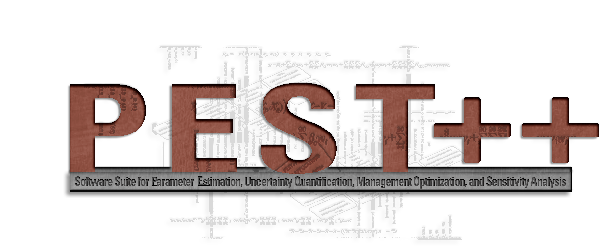

  

# PEST++

## Tools for non-intrusive and scalable parameter estimation and uncertainty quantification

PEST++ is a software suite aimed at supporting complex numerical models in the decision-support context.  Much focus has been devoted to supporting environmental models (groundwater, surface water, etc) but these tools are readily applicable to any computer model.

   

## Documentation

The lastest PEST++ users manual is available [here](https://github.com/jtwhite79/pestpp/tree/develop/documentation). Direct zip download [here](https://minhaskamal.github.io/DownGit/#/home?url=https://github.com/jtwhite79/pestpp/tree/develop/documentation)

## Links to latest binaries

As of version 4.3.11, PEST++ pre-compiled binaries for windows and mac are available as a github release.  For older version of PEST++, precompiled binaries are in the `bin` directory

## Compiling
The develop branch includes a Visual Studio solution, as well as CMake files for cross-compilation on all operating systems.

See details [here](documentation/cmake.md) to compile using CMake.

## Overview
The PEST++ software suite includes several stand-alone tools for model-independent (non-intrusive) computer model parameter estimation and uncertainty analysis.  Codes include:

* ``pestpp-glm``: deterministic GLM parameter estimation using "on-the-fly" subspace reparameterization, effectively reproducing the SVD-Assist methodology of PEST without any user intervention and FOSM-based parameter and (optional) forecast uncertainty estimation with support for generating posterior parameter realizations.

* ``pestpp-sen``: Global sensitivity analysis using either Morris or Sobol

* ``pestpp-swp``: a generic parallel run utility driven by a CSV file of parameter values

* ``pestpp-opt``: chance-constrainted linear programming

* ``pestpp-ies``: iterative ensemble smoother implementation of GLM (based on the work Chen and Oliver 2013) with support for generic localization (local analysis and/or covariance localization)

* ``pestpp-pso``: particle-swarm based inversion.

All members of the software suite can be compiled for PC, MAC, or Linux and have several run managers to support parallelization.  precompiled binaries are available in the "bin" folder.  Windows users with older OS versions should use the ``iwin`` binaries (starting "i", compiled with intel C++) to avoid the dreaded MSVC missing runtime DLL issue.

## Funding

Funding for PEST++ has been provided by the U.S. Geologial Survey. The New Zealand Strategic Science Investment Fund as part of GNS Science’s (https://www.gns.cri.nz/) Groundwater Research Programme has also funded contributions 2018-present.

## Recent developements

PEST++ version 5 will be released soon!

The PEST++ suite has been refactored to remove the fortran dependancy.  This includes the template and instruction file processing routines.

An updated control file format has been implemented.  All the existing PEST++ tools are still backward compatible with the standard control file format.  However, new tools that are in developement to support sequential data assimilation need the external file format.  Additional, new functionality is being developed that will require the updated control file format.  The new control file format is described in documentation and pyEMU can operate on this new format interchangeably.

## PEST++ References:

White, J. T., 2018, A model-independent iterative ensemble smoother for efficient history-matching and uncertainty quantification in very high dimensions. Environmental Modelling & Software. 109. 10.1016/j.envsoft.2018.06.009. <a ref="http://dx.doi.org/10.1016/j.envsoft.2018.06.009">http://dx.doi.org/10.1016/j.envsoft.2018.06.009</a>.

White, J. T., Fienen, M. N., Barlow, P. M., and Welter, D.E., 2017, A tool for efficient, model-independent management optimization under uncertainty. Environmental Modeling and Software.  <a ref="http://dx.doi.org/10.1016/j.envsoft.2017.11.019">http://dx.doi.org/10.1016/j.envsoft.2017.11.019</a>.

Welter, D.E., White, J.T., Hunt, R.J., and Doherty, J.E., 2015, Approaches in highly parameterized inversion— PEST++ Version 3, a Parameter ESTimation and uncertainty analysis software suite optimized for large environmental models: U.S. Geological Survey Techniques and Methods, book 7, chap. C12, 54 p., <a ref="http://dx.doi.org/10.3133/tm7C12">http://dx.doi.org/10.3133/tm7C12</a>.

Welter, D.E., Doherty, J.E., Hunt, R.J., Muffels, C.T., Tonkin, M.J., and Schreüder, W.A., 2012, Approaches in highly parameterized inversion—PEST++, a Parameter ESTimation code optimized for large environmental models: U.S. Geological Survey Techniques and Methods, book 7, section C5, 47 p., available only at <a ref="http://pubs.usgs.gov/tm/tm7c5">http://pubs.usgs.gov/tm/tm7c5</a>.

### Related Links:

* <a ref="http://www.pesthomepage.org">http://www.pesthomepage.org </a>
* <a ref="https://github.com/pypest/pyemu">https://github.com/pypest/pyemu </a>

## Testing

The ``benchmarks`` folder contains a simple worked example and basic testing routines that are used for basic CI testing.  Many full-worked test problems of varying problem sizes are now located in separate repos:

* [https://github.com/usgs/pestpp_benchmarks](https://github.com/usgs/pestpp_benchmarks)
* [https://github.com/usgs/pestpp-ies_benchmarks](https://github.com/usgs/pestpp-ies_benchmarks)
* [https://github.com/usgs/pestpp-opt_benchmarks](https://github.com/usgs/pestpp-opt_benchmarks)

## Dependencies

Much work has been done to avoid additional external dependencies in PEST++.  As currently designed, the project is fully self-contained.  

# optional ``++`` arguments

## please see the PEST++ users manual in the ``documentation`` directory for a current and complete description of all ``++`` options

### USGS disclaimer

This software has been approved for release by the U.S. Geological Survey (USGS). Although the software has been subjected to rigorous review, the USGS reserves the right to update the software as needed pursuant to further analysis and review. No warranty, expressed or implied, is made by the USGS or the U.S. Government as to the functionality of the software and related material nor shall the fact of release constitute any such warranty. Furthermore, the software is released on condition that neither the USGS nor the U.S. Government shall be held liable for any damages resulting from its authorized or unauthorized use
