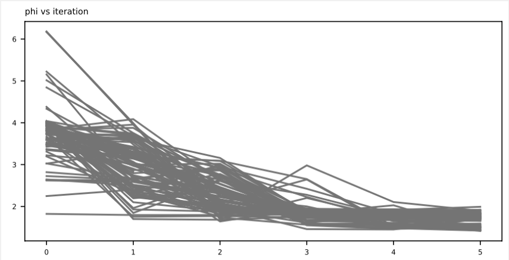

 

# <a id='s1' />Version 5.2.22

PEST++ Development Team

August 2025

# <a id='s2' />Acknowledgements

Initial funding for the development of PEST++ was provided by the United States Geological Survey (USGS). Further support for development of programs comprising the PEST++ suite was provided by the USGS, GNS Science (New Zealand), and Intera, Inc.

The writing of this manual, and improvements to the PEST++ parallel run manager, were funded by the Queensland Water Modelling Network. A little funding was also provided by the GMDSI project overseen by National Centre for Groundwater Research and Training and sponsored by BHP-Billiton and Rio Tinto.

The original basis for the parallel run manager is PEST++ is based on the PANTHER run manager developed by Dave Welter and Chas Egan.

On a personal note, thanks are also due to the following people who have contributed in the distant or more recent past to the development of the PEST++ suite, and to modelling education based on the PEST++ suite:

- Chas Egan (Queensland Department of Environment and Science)

- Mike Toews (GNS Science)

- Mike Fienen (USGS)

- Randy Hunt (USGS)

- Wes Kitlasten (GNS Science)

- Matt Knowling (GNS Science)

- Brioch Hemmings (GNS Science)

- Chris Muffels (SS Papadopoulos and Associates)

- Damian Merrick (HydroAlgorithmics)

- Chis Nicol (Groundwater Logic)

- Ayman Alzraiee (USGS)

- Joe Hughes (INTERA)

- Rui Hugman (INTERA)

- Katie Markovich (INTERA)

- Reygie Macasieb (INTERA)

# <a id='s3' />Preface

Interoperability between programs of the PEST++ suite and those of the PEST suite has been greatly improved with the release of version 15 of PEST. This, it is hoped, will promulgate conjunctive use of these two suites. In particular, many of the utility programs that comprise the PEST suite (including its ground and surface water utilities) can perform the same support roles for programs of the PEST++ suite that they do for PEST itself. At the same time, the ever-expanding functionality of the PyEMU suite (White et al, 2016) can facilitate use of PEST as it does the same for PEST++.

The present document serves as manual the current version of PEST++.

The term “PEST++” describes a suite of programs which have certain things in common. Chief among these is their ability to conduct many model runs in parallel on a single computer, over an office network, on a high performance cluster and on the computing cloud. Members of the PEST++ suite employ the same protocol for communicating with a model as PEST does. They all employ a modular, fault-tolerant parallel run manager named.

A theme that runs through all members of the PEST++ suite is that of adding value to environmental modelling as it is conducted in the decision-making context. Programs which comprise the PEST++ suite apply state-of-the-art methods to model calibration and exploration of post-calibration parameter and predictive uncertainty, and advanced management optimization under uncertainty techniques. Their algorithms are capable of handling large numbers of parameters, of deploying advanced regularisation devices, and of exploring parameter and predictive uncertainty. One member of the suite optimizes environmental system management in a modelling context that respects the (sometimes high) levels of uncertainty that accompany all model predictions.

The PEST++ suite is still under active development. Anyone interested in encouraged to join us – the water is fine, jump in!

# <a id='s4' />License

Programs of the PEST++ suite are distributed under the following license. This is the so-called “MIT license”. It is explained at the following site.

<https://opensource.org/licenses/MIT>

Permission is hereby granted, free of charge, to any person obtaining a copy of this software and associated documentation files (the "Software"), to deal in the Software without restriction, including without limitation the rights to use, copy, modify, merge, publish, distribute, sublicense, and/or sell copies of the Software, and to permit persons to whom the Software is furnished to do so, subject to the following conditions:

The above copyright notice and this permission notice shall be included in all copies or substantial portions of the Software.

THE SOFTWARE IS PROVIDED "AS IS", WITHOUT WARRANTY OF ANY KIND, EXPRESS OR IMPLIED, INCLUDING BUT NOT LIMITED TO THE WARRANTIES OF MERCHANTABILITY, FITNESS FOR A PARTICULAR PURPOSE AND NONINFRINGEMENT. IN NO EVENT SHALL THE AUTHORS OR COPYRIGHT HOLDERS BE LIABLE FOR ANY CLAIM, DAMAGES OR OTHER LIABILITY, WHETHER IN AN ACTION OF CONTRACT, TORT OR OTHERWISE, ARISING FROM, OUT OF OR IN CONNECTION WITH THE SOFTWARE OR THE USE OR OTHER DEALINGS IN THE SOFTWARE.

# Table of Contents

- [Version 5.2.21](#s1)
- [Acknowledgements](#s2)
- [Preface](#s3)
- [License](#s4)
- [1. Introduction](#s5)
    - [1.1 PEST++ and PEST](#s5-1)
    - [1.2 Software Installation](#s5-2)
    - [1.3 This Document](#s5-3)
    - [1.4 A Model: Some Considerations](#s5-4)
        - [1.4.1 Running a Model](#s5-4-1)
        - [1.4.2 Model Input and Output Files](#s5-4-2)
        - [1.4.3 Differentiability of Model Outputs](#s5-4-3)
        - [1.4.4 Observations and Predictions](#s5-4-4)
- [2.  The PEST(++) Model Interface](#s6)
    - [2.1 Introduction](#s6-1)
    - [2.2 PEST++ Input Files](#s6-2)
    - [2.3 Template Files](#s6-3)
        - [2.3.1 Model Input Files](#s6-3-1)
        - [2.3.2 An Example](#s6-3-2)
        - [2.3.3 The Parameter Delimiter](#s6-3-3)
        - [2.3.4 Parameter Names](#s6-3-4)
        - [2.3.5 Setting the Parameter Space Width ](#s6-3-5)
        - [2.3.6 How a Parameter Space is Filled with a Number](#s6-3-6)
        - [2.3.7 Multiple Occurrences of the Same Parameter](#s6-3-7)
        - [2.3.8 Preparing a Template File](#s6-3-8)
    - [2.4 Instruction Files](#s6-4)
        - [2.4.1 Precision in Model Output Files](#s6-4-1)
        - [2.4.2 How Model Output Files are Read](#s6-4-2)
        - [2.4.3 An Example Instruction File](#s6-4-3)
        - [2.4.4 The Marker Delimiter](#s6-4-4)
        - [2.4.5 Observation Names](#s6-4-5)
        - [2.4.6 The Instruction Set](#s6-4-6)
        - [2.4.7 Making an Instruction File](#s6-4-7)
- [3. Some Important PEST++ Features](#s7)
    - [3.1 General](#s7-1)
    - [3.2 Parameter Adjustment](#s7-2)
        - [3.2.1 Parameter Transformation](#s7-2-1)
        - [3.2.2 Fixed and Tied Parameters](#s7-2-2)
        - [3.2.3 Upper and Lower Parameter Bounds](#s7-2-3)
        - [3.2.4 Scale and Offset](#s7-2-4)
        - [3.2.5 Parameter Change Limits](#s7-2-5)
    - [3.3 Calculation of Derivatives](#s7-3)
        - [3.3.1 General](#s7-3-1)
        - [3.3.2 Forward or Central Differences ](#s7-3-2)
        - [3.3.3 Parameter Increments for Two and Three-Point Derivatives](#s7-3-3)
        - [3.3.4 Settings for Three-Point Derivatives](#s7-3-4)
        - [3.3.5 How to Obtain Derivatives You Can Trust](#s7-3-5)
        - [3.3.6 Looking at Model Outputs under the Magnifying Glass](#s7-3-6)
    - [3.4 The Jacobian Matrix File](#s7-4)
    - [3.5 The Objective Function](#s7-5)
- [4. The PEST Control File](#s8)
    - [4.1 General](#s8-1)
    - [4.2 Naming Conventions](#s8-2)
    - [4.3 Sections](#s8-3)
    - [4.4 Control Variables](#s8-4)
    - [4.5 The PESTCHEK Utility](#s8-5)
    - [4.6 Control Data Section](#s8-6)
        - [4.6.1 General](#s8-6-1)
        - [4.6.2 First Line](#s8-6-2)
        - [4.6.3 Second Line](#s8-6-3)
        - [4.6.4 Third Line ](#s8-6-4)
        - [4.6.5 Fourth Line ](#s8-6-5)
        - [4.6.6 Fifth Line](#s8-6-6)
        - [4.6.7 Sixth Line](#s8-6-7)
        - [4.6.8 Seventh Line](#s8-6-8)
        - [4.6.9 Eighth Line](#s8-6-9)
        - [4.6.10 Ninth Line](#s8-6-10)
    - [4.7 Singular Value Decomposition Section](#s8-7)
    - [4.8 Parameter Groups Section](#s8-8)
        - [4.8.1 General](#s8-8-1)
        - [4.8.2 Parameter Group Variables](#s8-8-2)
    - [4.9 Parameter Data Section](#s8-9)
        - [4.9.1 General](#s8-9-1)
        - [4.9.2 First Part](#s8-9-2)
        - [4.9.3 Second Part](#s8-9-3)
    - [4.10 Observation Groups Section](#s8-10)
    - [4.11 Observation Data Section](#s8-11)
    - [4.12 Model Command Line Section](#s8-12)
    - [4.13 Model Input Section](#s8-13)
    - [4.14 Model Output Section](#s8-14)
    - [4.15 Prior Information Section](#s8-15)
    - [4.16 Regularization Section](#s8-16)
    - [4.17 Control Variables for PEST++ Programs ](#s8-17)
    - [4.18 Keyword and External File Control File Format](#s8-18)
        - [4.18.1 Keyword and Consolidated Algorithmic Variables](#s8-18-1)
        - [4.18.2 External file support](#s8-18-2)
- [5. Running PEST++ Programs](#s9)
    - [5.1 General](#s9-1)
    - [5.2 Model Runs in Serial](#s9-2)
        - [5.2.1 Concepts](#s9-2-1)
        - [5.2.2 Running PESTPP-XXX](#s9-2-2)
    - [5.3 Model Runs in Parallel](#s9-3)
        - [5.3.1 Concepts](#s9-3-1)
        - [5.3.2 Manager to Agent Communication](#s9-3-2)
        - [5.3.3 Running PESTPP-XXX as Manager and Agent](#s9-3-3)
        - [5.3.4 Run Management Record File](#s9-3-4)
        - [5.3.5 Run Management Control Variables ](#s9-3-5)
    - [5.4 Run Book-Keeping Files](#s9-4)
- [6. PESTPP-GLM](#s10)
    - [6.1 Introduction](#s10-1)
        - [6.2.1 Basic Equations](#s10-1-1)
        - [6.2.2 Choosing the Regularization Weight Factor](#s10-1-2)
        - [6.2.3 Inter-Regularization Group Weighting](#s10-1-3)
        - [6.2.4 Choosing Values for the Marquardt Lambda](#s10-1-4)
        - [6.2.5 Singular Value Decomposition](#s10-1-5)
        - [6.2.6 SVD-Assist ](#s10-1-6)
        - [6.2.7 Expediting the First Iteration](#s10-1-7)
        - [6.2.8 First Order, Second Moment Uncertainty Analysis and Monte Carlo](#s10-1-8)
        - [6.2.9 Model Run Failure](#s10-1-9)
        - [6.2.10 Composite Parameter Sensitivities](#s10-1-10)
        - [6.2.11 Other Controls](#s10-1-11)
        - [6.2.12 Running PESTPP-GLM](#s10-1-12)
        - [6.2.13 PESTPP-GLM Output Files](#s10-1-13)
        - [6.3.4 Running PESTPP](#s10-1-14)
        - [6.3.5 PESTPP-GLM Output Files](#s10-1-15)
    - [6.4 Summary of PESTPP-GLM Control Variables](#s10-2)
        - [6.4.1 General](#s10-2-1)
        - [6.4.2 Control Variables in the PEST Control File ](#s10-2-2)
        - [6.4.3 PEST++ Control Variables](#s10-2-3)
- [7. PESTPP-SEN](#s11)
    - [7.1 Introduction](#s11-1)
        - [7.1.1 General](#s11-1-1)
        - [7.1.2 Grouped Parameters](#s11-1-2)
    - [7.2 Method of Morris](#s11-2)
        - [7.2.1 Elementary Effects](#s11-2-1)
        - [7.2.2 Sampling Scheme](#s11-2-2)
        - [7.2.3 Control Variables](#s11-2-3)
    - [7.3 Method of Sobol](#s11-3)
        - [7.3.1 Sensitivity Indices](#s11-3-1)
        - [7.3.2 Control Variables](#s11-3-2)
    - [7.4 PESTPP-SEN Output Files](#s11-4)
- [8. PESTPP-OPT](#s12)
    - [8.1 Introduction](#s12-1)
        - [8.1.1 A Publication](#s12-1-1)
        - [8.1.2 Overview](#s12-1-2)
        - [8.1.3 Calculation of Uncertainty](#s12-1-3)
        - [8.1.4 Optimization](#s12-1-4)
        - [8.1.5 Chance Constraints](#s12-1-5)
    - [8.2 Using PESTPP-OPT](#s12-2)
        - [8.2.1The PEST Control File ](#s12-2-1)
        - [8.2.2 Decision Variables and Parameters](#s12-2-2)
        - [8.2.3 Defining the Objective Function](#s12-2-3)
        - [8.2.4 Constraints](#s12-2-4)
        - [8.2.5 Observations](#s12-2-5)
        - [8.2.6 Regularization ](#s12-2-6)
        - [8.2.7 Prior Covariance Matrix](#s12-2-7)
        - [8.2.8 Risk](#s12-2-8)
        - [8.2.9 Jacobian and Response Matrices](#s12-2-9)
        - [8.2.10 Solution Convergence](#s12-2-10)
        - [8.2.11 Other Control Variables](#s12-2-11)
        - [8.2.12 Final Model Run](#s12-2-12)
        - [8.2.13 Restarts](#s12-2-13)
        - [8.2.14 Zero Run Solution](#s12-2-14)
    - [8.3 PESTPP-OPT Output Files](#s12-3)
    - [8.4 Summary of Control Variables](#s12-4)
- [9. PESTPP-IES](#s13)
    - [9.1 Introduction](#s13-1)
        - [9.1.1 Publications](#s13-1-1)
        - [9.1.2 Overview](#s13-1-2)
        - [9.1.3 Ensemble Kalman Filters and Ensemble Smoothers](#s13-1-3)
        - [9.1.4 Some Repercussions of Using Ensembles](#s13-1-4)
        - [9.1.5 Iterations](#s13-1-5)
        - [9.1.6 Measurement Noise](#s13-1-6)
        - [9.1.7 Regularization](#s13-1-7)
        - [9.1.8 Base Realization](#s13-1-8)
        - [9.1.9 Parameter Transformation Status](#s13-1-9)
        - [9.1.10 Inequality Observations](#s13-1-10)
        - [9.1.11 Localization](#s13-1-11)
        - [9.1.12 Use of observation noise covariance matrices](#s13-1-12)
        - [9.1.13 Detecting and resolving prior-data conflict](#s13-1-13)
        - [9.1.14 Multi-modal solution process](#s13-1-14)
        - [9.1.15 Covariance Reinflation](#s13-1-15)
    - [9.2 Using PESTPP-IES](#s13-2)
        - [9.2.1 General](#s13-2-1)
        - [9.2.2 Initial Realizations](#s13-2-2)
        - [9.2.3 “Regularization”](#s13-2-3)
        - [9.2.4 Prior Parameter Scaling](#s13-2-4)
        - [9.2.5 The Marquardt Lambda](#s13-2-5)
        - [9.2.6 Restarting](#s13-2-6)
        - [9.2.7 Failed Model Runs and Fitlering of Bad Realizations](#s13-2-7)
        - [9.2.8 Reporting ](#s13-2-8)
        - [9.2.9 Termination Criteria, Objective Functions, and Upgrade Acceptance ](#s13-2-9)
        - [9.2.10 Internal Weight Adjustment ](#s13-2-10)
        - [9.2.11 Selective Updates ](#s13-2-11)
    - [9.3 PESTPP-IES Output Files](#s13-3)
        - [9.3.1 CSV Output Files](#s13-3-1)
        - [9.3.2 Non-CSV Output Files](#s13-3-2)
    - [9.4 Summary of Control Variables](#s13-4)
- [10. PESTPP-SWP](#s14)
    - [10.1 Introduction](#s14-1)
    - [10.2 Using PESTPP-SWP](#s14-2)
    - [10.3 Summary of Control Variables](#s14-3)
    - [11.1 Introduction](#s14-4)
        - [11.1.2 Multi-Objective Particle Swarm optimization](#s14-4-1)
        - [11.1.2 Decision Variable Transformations](#s14-4-2)
    - [11.1 Using PESTPP-PSO](#s14-5)
        - [11.1.1 General](#s14-5-1)
        - [11.1.2 Estimation Mode](#s14-5-2)
        - [11.2.3. Pareto mode](#s14-5-3)
    - [11.2 PESTPP-PSO Output Files](#s14-6)
- [12. PESTPP-DA](#s15)
    - [12.1 Introduction](#s15-1)
    - [12.2 Theory](#s15-2)
        - [12.2.1 Background and Basic Equations](#s15-2-1)
        - [12.2.2 Schemes for Assimilating Temporal Data](#s15-2-2)
        - [12.2.2.1 Batch Data Assimilation with PESTPP-DA](#s15-2-3)
        - [12.2.2.2 Sequential Data Assimilation with PESTPP-DA](#s15-2-4)
        - [12.2.4 State estimation, parameter estimation and joint state-parameter estimation](#s15-2-5)
        - [12.2.4 Parameter, Observation and Weight Cycle Tables](#s15-2-6)
        - [12.2.5 Steps for Data Assimilation implementation](#s15-2-7)
        - [12.2.12 Running PESTPP-DA](#s15-2-8)
        - [12.2.13 Other uses for PESTPP-DA](#s15-2-9)
        - [12.2.14 PESTPP-DA Output Files](#s15-2-10)
    - [12.4 Summary of PESTPP-DA Control Variables](#s15-3)
        - [12.4.1 General](#s15-3-1)
        - [12.4.2 Control Variables in the PEST Control File ](#s15-3-2)
        - [12.4.3 PEST++ Control Variables](#s15-3-3)
- [13. PESTPP-MOU](#s16)
    - [13.1 Introduction](#s16-1)
    - [13.2 Theory](#s16-2)
        - [13.2.1 Background and Basic Equations](#s16-2-1)
        - [13.2.2 Evaluating chances in a population-based algorithm](#s16-2-2)
        - 
        - [13.2.3 PESTPP-MOU workflow](#s16-2-4)
        - [13.2.4 Advanced functionality](#s16-2-5)
        - [13.2.5 Running PESTPP-MOU](#s16-2-6)
        - [13.2.6 PESTPP-DA Output Files](#s16-2-7)
    - [13.4 Summary of PESTPP-MOU Control Variables](#s16-3)
        - [13.4.1 General](#s16-3-1)
        - [13.4.2 Control Variables in the PEST Control File ](#s16-3-2)
        - [13.4.3 PEST++ Control Variables](#s16-3-3)
- [14. References](#s17)

# <a id='s5' />1. Introduction

## <a id='s5-1' />1.1 PEST++ and PEST

The name “PEST++” refers to a suite of programs which have some things in common but which are also very different from each other. The names of all programs which comprise the suite begin with “PESTPP”. PEST stands for “Parameter ESTimation”.

PEST was released in 1995; it has been continually improved since then. It undertakes highly parameterized inversion of environmental models. In doing so, it runs a model many times, either sequentially or in parallel. It does this in a non-intrusive manner. Before it runs a model, it records parameter values that it wishes the model to use on that particular run via input files required by the model. User-prepared template files of model input files guide it in this task. After the model run is complete, PEST reads numbers from model output files which it then compares with field measurements. User-prepared instruction files guide it in this task. All other information which PEST requires is recorded in a PEST control file.

PESTPP-GLM is the original member of the PEST++ suite; it was originally named “PEST++” itself. Like PEST, PESTPP-GLM undertakes non-intrusive, highly parameterized inversion of an environmental model. As such, it can be considered as a direct replacement for PEST. While omitting some PEST functionality, it includes significant functionality that is absent from PEST. It uses the same template and instruction files that PEST uses to interact with a model. It reads a PEST control file to acquire information on problem definition. Like PEST, it can conduct model runs in serial or in parallel.

For all members of the PEST++ suite, parallelization of model runs follows the “manager” and “agent” concept. A user must start up agents in all folders in which he/she wishes that model runs be carried out. Agents can run on the same computer as the manager, on network-connected personal computers, on nodes of a high-performance computing cluster, and on the cloud. Agents communicate with their manager using the TCP/IP protocol. If the manager’s machine can be “pinged” from the agent’s machine, and if an agent’s machine can be “pinged” from the manager’s machine, then communication channels are open for parallelization of model runs. Whenever a member of the PEST++ suite requires that a model run be undertaken, its parallel run manager chooses a agent for the task, and then sends to the agent the numbers that must be written to model input files. Using template files, the agent writes these numbers to model input files; then it commands its local operating system to run the model. When the model run is complete, it reads model output files using instruction files. It then sends the numbers which it reads from these files back to the manager using TCP/IP.

One of the original design specifications of PESTPP-GLM was that its parallel run manager be modular, and separate from PESTPP-GLM, so that it could be used by any program that conducts non-intrusive, parallelized model runs for any purpose. It is this facet of its design that has spawned the development of other members of the PEST++ suite. At the time of writing, the composition of the PEST++ suite is listed in table 1.1.

| Program Name | Function                                                                                                  |
|------------------|---------------------------------------------------------------------------------------------------------------|
| PESTPP           | Highly parameterized inversion, and global optimization using differential evolution                          |
| PESTPP-SEN       | Global sensitivity analysis using the methods of Morris and Saltelli                                          |
| PESTPP-OPT       | Decision optimization under uncertainty using sequential linear programming and linearized chance constraints |
| PESTPP-IES       | Iterative ensemble smoother for production of a suite of calibration-constrained parameter fields             |
| PESTPP-SWP       | Undertakes a suite of parallelized model runs for any reason                                                  |
| PESTPP-DA        | Iterative ensemble filter and smoother data assimilation                                                      |
| PESTPP-MOU       | Single and multiple constrained optimization under uncertainty using evolutionary heuristics                  |

Table 1.1 Programs comprising of the PEST++ suite.

As well as containing a build-in parallel run manager (and hence of template and instruction files as a mechanism for non-intrusive communication with a model), the programs listed in table 1.1 have other commonalities. They all manipulate model parameters (which sometimes play the roles of decision variables). Most of them quantify mismatch between model outputs and field data. Information on parameters and field data is obtained from a PEST control file. So too is information that controls the way in which their algorithms operate.

Use of a PEST control file for storage of parameter, observation and control data was an important design consideration for the original version of PESTPP-GLM. This allowed interchangeable use with PEST. This remains a consideration for many members of the PEST++ suite.

When reading a PEST control file, most programs of the PEST++ suite obtain the values of control variables that are unique to that program from lines within the PEST control file that begin with the “++” string. PEST, and most of its associated utility software, ignores these lines. Interoperability of the PEST and PEST++ suites is thereby maintained.

If salient to the tasks which they implement, members of the PEST++ suite write two other file types that are compatible with PEST-suite files that hold the same information. These are parameter value files (i.e., PAR files) and Jacobian matrix files (i.e., JCO files). This, together with compatibility of the PEST control file, allows utilities which support the use of PEST to perform the same roles for members of the PEST++ suite. See Doherty et al (2018c) for an overview of PEST utility support software.

## <a id='s5-2' />1.2 Software Installation

Copy PEST++ executable programs to a suitable folder on your hard disk. Then make sure that this folder is cited in the PATH environment variable, so that your computer can find them regardless of your current working folder.

Source code, Visual Studio solution files and UNIX makefiles for PEST++ suite programs are also freely available.

With the exception of PESTPP-PSO, the PEST++ tools are C++. Users who want to compile PEST++ will need a C++11 or greater compiler (MSVC for windows, gcc 4.9 or greater, intel C++). Users who want to compile PESTPP-PSO will also need a fortran compiler.

## <a id='s5-3' />1.3 This Document

This document constitutes a manual for programs of the PEST++ suite. As such, it records their capabilities and lists variables that control their operation. However, while it discusses the algorithms which they implement to some extent, it does not describe them in detail. Instead, reference is made to publications where these explanations are made. These texts thus constitute recommended reading for those who wish to take full advantage of PEST++ software. Another relevant publication is the “PEST Book” (Doherty, 2015). This provides an extensive theoretical overview of model calibration and linear/nonlinear predictive uncertainty analysis. It also discusses the role that modelling can play in environmental decision support.

To avoid excessive cross-referencing, parts of the PEST manual are reproduced in this document. This allows a user of the PEST++ suite to dispense with the need to read the manual for PEST in addition to the present text. However, the reader’s attention is drawn to Part 2 of the PEST manual (Doherty, 2018b) which describes PEST utility support software. Attention should also be given to documentation of the PEST Groundwater Data Utilities. At the time of writing, both of these utility suites are undergoing expansion in order to provide better support for members of the PEST++ suite.

PEST++ users should also be aware of setup and processing assistance provided by the Python PyEMU library. This is discussed by White et al (2016).

## <a id='s5-4' />1.4 A Model: Some Considerations

### <a id='s5-4-1' />1.4.1 Running a Model

In the course of estimating its parameters, optimizing its decision variables, and/or computing sensitivities of model outputs to its parameters, members of the PEST++ suite must run a model many times. They can do this in “serial” (one at a time), or they can run the model parallel, distributed across several cores and/or multiple machines. In either case, the model is run by submitting its command line to the operating system through a so-called “system call”. This call has the same effect as typing the name of the model (and any arguments required by the model which follow its name) in a command line window. Hence the model must be accessible to a user (and therefore to the pertinent PEST++ program) through the command line. Ideally, the folder (i.e., the directory) in which the model executable resides should be featured in the PATH environment variable so that the operating system knows where to find it.

Some models are not accessible to a user in this way because they can only be run through their own model-specific, graphical user interface; they may be called as a dynamic linked library (i.e., DLL) by this interface. Models which can only be accessed in this way cannot be used with members of the PEST++ suite unless a “driver” program is available (or written) that can call the DLL.

Nevertheless, there is a considerable amount of flexibility in what constitutes “a model” that can be run by programs of the PEST++ suite. A model can be a batch script (on a WINDOWS system) a shell script (on a UNIX system), or a python script (on either system). These scripts can be used to run one or a number of executable programs in succession. Hence, for example, a numerical simulator can be accompanied by pre-processors and postprocessors. The former may manipulate parameters (for example, it may interpolate the values of pilot point parameters to the cells of a model grid), while the latter may manipulate model outputs (for example, it may interpolate model outputs from grid cell centres to the locations of observation points). Alternatively, or as well, the model may actually be comprised of a number of simulators which are run in succession (for example, a flow model followed by a contaminant transport model).

Where simulators and pre/postprocessors are accessed through a script, it is a good idea to commence such a script with commands to delete all files which are written by one executable program and then read by another. Thus, if the first executable program fails to run, the second executable program will not read an old file generated by the first executable program, mistaking it for a new one. It will therefore crash, as will all succeeding executable programs. Some or all of the files which must be read by the PEST++ program which commissioned the model run will then be absent; members of the PEST++ suite delete these files before they run the model. The PEST++ program will then cease execution gracefully with an appropriate error message.

Sometimes, in the WINDOWS environment, a model whose execution is initiated from the command line, or through a system call, returns control to the calling program (or to the user prompt) immediately, even though the model is still running. This would cause the PEST++ program which instigated the model run to look for the model’s output files, thinking that its execution was finished. This can be prevented by using the “start /w” command. Type

start /?

at the command line prompt for “start” command details.

If, on commencement of execution, a model prompts the user for keyboard input, this situation can be easily accommodated through input redirection in the batch or shell script environment. The keyboard responses to a model’s prompts can be placed in a text file. Suppose that this file is named *model.inp*. Suppose also that the name of the model executable file is *model.exe*, or simply *model* on a UNIX platform. Then if the model is run using the command

model \< model.inp

the model will look to file *model.inp*, rather than to the keyboard, for its input. A PEST++ program can therefore run the model without the need for any user involvement. On UNIX-based platforms, the forward run command is a binary or script located in the directory where PEST++ is running, it may be necessary to add a preceding “./” (dot forward slash).

### <a id='s5-4-2' />1.4.2 Model Input and Output Files

As already discussed, programs of the PEST++ suite interact with a model through the model’s own input and output files; these constitute their non-intrusive interface with the model. A model can have many input files and many output files. PEST++ programs can interact with all of these; the number of input and output files does not matter.

A PEST++ user must prepare so-called “template files”, based on model input files, to allow programs of the PEST++ suite to recognize those parts of a model input file which it must change before running the model. Alterations to a model’s input file are only required for the purpose of providing the model with a set of parameter values which are appropriate for a particular model run. A thus-altered model input file must be an ASCII file; it cannot be a binary file. Hence even if a particular model reads much of its input dataset from one or more binary files, the file or files which contain parameter values must be ASCII (i.e., text) files.

Similar considerations apply to model output files. Programs of the PEST++ suite read numbers from model output files using directives contained in so-called “instruction files”. The files from which these numbers are read must be ASCII files. If the model writes its outputs to a binary file, then a postprocessor which follows the model in a batch or script file must be used to rewrite pertinent model outputs in ASCII format.

Template and instruction files are described in detail in the next chapter.

### <a id='s5-4-3' />1.4.3 Differentiability of Model Outputs

Tasks performed by some (but not all) members of the PEST++ suite include regularised inversion, linear parameter and predictive uncertainty analysis, and nonlinear optimization (under uncertainty) through sequential linear programming. These methods are powerful. Furthermore, they can be used to manipulate large numbers of parameters and/or decision variables. The power of some of these methods rests on an ability to employ partial derivatives of model outputs with respect to adjustable parameters or decision variables, for the purpose of estimating these parameters or optimizing these decision variables. Where needed, PEST++ programs calculate these derivatives using finite differences; a PEST++ program varies a parameter or decision variable incrementally, and then divides the incremental change in pertinent model outputs by the incremental change in the parameter or decision variable to approximate the partial derivative.

If numbers calculated by a model are not continuous functions of the model’s parameters or decision variables this process fails. Non-continuity of model outputs with respect to parameters/decision variables can be an outcome of poor model design, or it can be an inadvertent outcome of numerical difficulties that a model may experience – particularly if it employs an iterative scheme to solve the equations which describe the processes which it simulates.

Often some simple steps can (and should) be taken to make use of a model more tractable when it is deployed in conjunction with those members of the PEST++ suite which require continuity of model outputs with respect to adjustable parameters or decision variables. Model-calculated numbers which PEST++ programs read should be recorded on model output files with as much numerical precision as the model allows (seven significant figures if the model uses single precision arithmetic). When a PEST++ program computes a derivative using finite differences, it must subtract numbers which are very similar. Leading significant figures are lost in this process, leaving only the trailing significant figures to carry the value of the derivative. If these are absent from a number, then finite-difference derivatives lose their integrity.

Similarly, convergence criteria of iterative solvers employed by a model should be set tightly. The loss of significant figures incurred by loose convergence matters little in many modelling contexts. However, this can inflict a heavy cost on finite-difference derivatives. Sometimes it may be necessary to limit the use of model numerical devices such as adaptive time stepping if it is felt that they may unwittingly contribute alterations to model outputs that do not arise exclusively from alterations to the values of model parameters or decision variables.

If a PEST++ program which relies on partial derivatives fails to perform well, this may indicate that the integrity of these derivatives is questionable. This can be checked using the JACTEST utility provided with the PEST suite. If derivatives fail the test, then there may be no alternative but to attempt the same task using another methodology that does not require derivatives of model outputs with respect to parameters/decision variables. Both the PEST++ and PEST suites provide global optimizers. The PEST++ suite also provides the powerful PESTPP-IES iterative ensemble smoother whose performance is not hampered by poor numerical derivatives.

### <a id='s5-4-4' />1.4.4 Observations and Predictions

The numbers that PEST++ suite programs read from model output files often (but not always) have measured real-world counterparts. Collectively these numbers comprise a calibration dataset. Sometimes, however, numbers of interest that are read from model output files may comprise predictions for which there are no measured counterparts.

In PEST and PEST++ parlance, any number that is read from a model output file is referred to as “an observation”. “Measured” counterparts to these numbers are provided in the PEST control file. If a measurement is given a weight of zero, it is not actually compared with a model output; the corresponding model output is thus read for its own sake. Hence some “observations” that are provided in a PEST control file can actually be model predictions. As such, they can feature in linear and nonlinear predictive uncertainty analysis, and/or can be used by pertinent PEST utilities and PyEMU functions for purposes such as data worth analysis.

# <a id='s6' />2.  The PEST(++) Model Interface

## <a id='s6-1' />2.1 Introduction

This chapter reproduces material from the seventh edition of the PEST manual. This reflects the fact that programs of both the PEST and PEST++ suites employ template and instruction files as the basis for their non-intrusive model interface.

## <a id='s6-2' />2.2 PEST++ Input Files

Programs of both the PEST and PEST++ suites require three types of input file. These are:

- template files, one for each model input file in which parameters or decision variables reside;

- instruction files, one for each model output file from which numbers must be read; and

- a control file, supplying the PEST or PEST++ program with the names of all template and instruction files, the names of corresponding model input and output files, the values of control variables, initial parameter values, measurement values, weights, etc.

This chapter describes the first two of these file types in detail; the PEST control file is discussed later in this manual Template files and instruction files can be written using a general-purpose text editor following specifications set out in this chapter. Alternatively, they can be written using special-purpose software that is specific to a particular modelling application. Once built, they can be checked for correctness and consistency using the utility programs TEMPCHEK, INSCHEK and PESTCHEK supplied with the PEST suite. These are documented in part II of the PEST manual (Doherty, 2018b).

In order to make the remainder of this chapter easier to read, the word “parameter” will be used to denote both a parameter and a decision variable. The word “observation” will be used to denote a number that is read from a model output file. A field measurement may correspond to this number; in this case the number read from the model output file is the model-generated counterpart of this measurement. In other cases, the number extracted from a model output file may be a model prediction to which a constraint is applied (by PESTPP-OPT), a model prediction for which sensitivities are required (by PESTPP-GLM, PESTPP-SEN, PEST utilities and PyEMU), or simply a model output of interest.

## <a id='s6-3' />2.3 Template Files

### <a id='s6-3-1' />2.3.1 Model Input Files

Whenever a PEST++ program runs a model, as it must do many times in the course of carrying out the parameter estimation, uncertainty analysis, or optimization process for which it was designed, it must first write the values of parameters to the model input files which hold them. The model can thus access these values as it would on any other occasion that it is run.

A model may read many input files; however, a template is needed only for those input files which contain parameters.

Programs of the PEST++ suite can only write parameters to ASCII (i.e., text) input files. If a model requires a binary input file, you must write a program which translates data written to an ASCII file to the binary form expected by the model. The translator program, and then the model, can be run in sequence by listing them in a batch or script file which the PEST++ program runs as “the model”. The ASCII input file to the translator program will then become a model input file as far as PEST++ programs are concerned; a template is required for this file.

It is suggested that template files be provided with the extension *.tpl* in order to distinguish them from other types of file.

### <a id='s6-3-2' />2.3.2 An Example

A template file receives its name from the fact that it is simply a replica of a model input file, except that the space occupied by each parameter in the latter file is replaced by a sequence of characters which identify the space as belonging to that parameter.

Consider the model input file shown in figure 2.1; this file supplies data to a program which computes the “apparent resistivity” on the surface of a layered half-space for different surface electrode configurations. Suppose that we wish to use this program (i.e., model) in an inversion process through which properties of each of three half-space layers are estimated from apparent resistivity data collected on the surface of the half-space. The parameters for which we want estimates are the resistivity and thickness of the upper two layers and the resistivity of the third (its thickness is infinite). A suitable template file appears in figure 2.2.

<table>

<colgroup>
<col style="width: 100%" />
</colgroup>
<thead>
<tr class="header">
<th>
MODEL INPUT FILE 
3, 19 no. of layers, no. of spacings 
1.0, 1.0 resistivity, thickness: layer 1 
40.0, 20.0 resistivity, thickness: layer 2 
5.0 resistivity: layer 3 
1.0 electrode spacings 
1.47 
2.15 
3.16 
4.64 
6.81 
10.0 
14.9 
21.5 
31.6 
46.4 
68.1 
100 
149 
215 
316 
464 
681 

1000 </th>
</tr>
</thead>
<tbody>
</tbody>
</table>

Figure 2.1 A model input file.

<table>

<colgroup>
<col style="width: 100%" />
</colgroup>
<thead>
<tr class="header">
<th>
ptf ~ 
MODEL INPUT FILE 
3, 19 no. of layers, no. of spacings 
~res1 ~,~t1 ~ resistivity, thickness: layer 1 
~res2 ~,~t2 ~ resistivity, thickness: layer 2 
~res3 ~ resistivity: layer 3 
1.0 electrode spacings 
1.47 
2.15 
3.16 
4.64 
6.81 
10.0 
14.9 
21.5 
31.6 
46.4 
68.1 
100 
149 
215 
316 
464 
681 

1000 </th>
</tr>
</thead>
<tbody>
</tbody>
</table>

Figure 2.2 A template file.

### <a id='s6-3-3' />2.3.3 The Parameter Delimiter

As figure 2.2 shows, the first line of a template file must contain the letters “ptf” followed by a space, followed by a single character (“ptf” stands for “<u>P</u>EST <u>t</u>emplate <u>f</u>ile”). The character following the space is the “parameter delimiter”. In a template file, a “parameter space” is identified as the set of characters between and including a pair of parameter delimiters. When a PEST or PEST++ program writes a model input file based on a template file, it replaces all characters between and including these parameter delimiters by a number representing the current value of the parameter that owns the space; that parameter is identified by name within the parameter space, between the parameter delimiters.

You must choose the parameter delimiter yourself. However, your choice is restricted; the characters \[a-z\], \[A-Z\] and \[0-9\] are invalid. *The parameter delimiter character must appear nowhere within the template file except in its capacity as a parameter delimiter*, for whenever a PEST++ program encounters that character in a template file it assumes that it is defining a parameter space.

### <a id='s6-3-4' />2.3.4 Parameter Names

All parameters are referenced by name. Parameter references are required both in template files (where the locations of parameters on model input files are identified), and in the PEST control file (where parameter initial values, lower and upper bounds and other information are provided). Programs of the PEST suite require that parameter names be from 1 to 12 characters in length; however, parameter name lengths are unlimited in the programs of the PEST++ suite. Any characters in a parameter name are legal except for the space character and the parameter delimiter character. Parameter names are case-insensitive.

Each parameter space is defined by two parameter delimiters; the name of the parameter to which the space belongs must be written between the two delimiters.

If a model input file is such that the space available for writing a certain parameter is limited, the parameter name may need to be considerably less than two hundred characters long in order that both the name and the left and right delimiters can be written within the limited space available. The minimum allowable parameter space width is thus three characters, one character for each of the left and right delimiters, and one for the parameter name.

### <a id='s6-3-5' />2.3.5 Setting the Parameter Space Width 

In general, the wider is a parameter space (up to a certain limit - see below), the better it is, for numbers can be represented with greater precision in wider spaces than they can be in narrower spaces. However, unlike the case of model-generated observations where maximum precision is crucial to obtaining useable finite-difference derivatives (see section 3.3.5), PEST++ programs can adjust to limited precision in the representation of parameters on model input files, as long as enough precision is employed such that a parameter value can be distinguished from the value of that same parameter incremented for derivatives calculation. Hence, beyond a certain number of characters, the exact number depending on the parameter value and the size and type of parameter increment employed, extra precision is not critical. Nevertheless, it is good practice to endow parameter values with as much precision as the model is capable of reading them with, so that they can be provided to the model with the same precision with which they are calculated by programs of the PEST++ suite.

Generally, a model reads numbers from an input file in either of two ways, namely from specified fields, or as a sequence of numbers, each of which may be of any length; the latter method is often referred to as “free field” input or as “list-directed” input. If the model uses the former method, then somewhere within the model program the format (i.e., field specification) for data entry is defined for every number which must be read in this fashion.

The FORTRAN code of figure 2.3 directs a program to read five real numbers. The first three are read using a format specifier, whereas the last two are read in free field fashion.

<table>

<colgroup>
<col style="width: 100%" />
</colgroup>
<thead>
<tr class="header">
<th>READ(20,100) A,B,C 

100 FORMAT(3F10.0) 

READ(20,*) D,E </th>
</tr>
</thead>
<tbody>
</tbody>
</table>

Figure 2.3 Formatted and free field input.

The relevant part of the model input file may be as illustrated in figure 2.4.

<table>

<colgroup>
<col style="width: 100%" />
</colgroup>
<thead>
<tr class="header">
<th>
6.32 1.42E-05123.456789 

34.567, 1.2E17 </th>
</tr>
</thead>
<tbody>
</tbody>
</table>

Figure 2.4 Numbers read using the code of figure 2.3.

Notice how no whitespace or comma is needed between numbers which are read using a field specifier. The format statement labelled “100” in figure 2.3 directs that variable *A* be read from the first 10 positions on the line, that variable *B* be read from the next 10 positions, and that variable *C* be read from the 10 positions thereafter. When the program reads any of these numbers it is unconcerned as to what characters lie outside of the field on which its attention is currently focussed. However, the numbers to be read into variables *D* and *E* must be separated by whitespace or a comma in order that the program knows where one number ends and the next number begins.

Suppose all of variables *A* to *E* are model parameters, and that a PEST++ program has been assigned the task of estimating them. For convenience we provide the same names for these parameters as those that are used by the model code (this, of course, will not normally be the case). The template fragment corresponding to figure 2.4 may then be as set out in figure 2.5. Notice how the parameter space for each of parameters *A*, *B* and *C* is 10 characters wide, and that the parameter spaces abut each other in accordance with the expectations of the model as defined through the format specifier of figure 2.3. If the parameter space for any of these parameters is greater than 10 characters in width, then the PEST++ program, when it replaces each parameter space by the current parameter value, would construct a model input file which would be incorrectly read by the model. (You could have designed parameter spaces to be less than 10 characters wide if you wished, as long as you placed enough whitespace between each parameter space in order that the number which will replace each such space when the PEST++ program writes the model input file falls within the field expected by the model. However, defining the parameter spaces in this way would achieve nothing, as there would be no advantage in using less than the full 10 characters allowed by the model.)

<table>

<colgroup>
<col style="width: 100%" />
</colgroup>
<thead>
<tr class="header">
<th>
~ A ~~ B ~~ C ~ 
~ D ~, ~ E ~ 
</th>
</tr>
</thead>
<tbody>
</tbody>
</table>

Figure 2.5 Fragment of a template file corresponding to parameters represented in figure 2.4.

Parameters *D* and *E* are treated very differently to parameters *A*, *B* and *C*. As figure 2.3 shows, the model simply expects two numbers in succession. If the spaces for parameters *D* and *E* appearing in figure 2.5 are replaced by two numbers (each will be 13 characters long) the model’s requirement for two numbers in succession separated by whitespace or a comma will have been satisfied, as will the preference for maximum precision.

Comparing figures 2.4 and 2.5, it is obvious that the spaces for parameters *D* and *E* on the template file are greater than the spaces occupied by the corresponding numbers on the model input file from which the template file was constructed; the same applies for the parameter spaces defined in figure 2.2 pertaining to the model input file of figure 2.1. In most cases of template file construction, a model input file will be used as the starting point. In such a file, numbers read using free field input will often be written with trailing zeros omitted. In constructing the template file, you should recognise which numbers are read using free field input and expand the parameter space (to the right) accordingly beyond the original number, making sure to leave whitespace or a comma between successive spaces, or between a parameter space and a neighbouring character or number.

Similarly, numbers read through field-specifying format statements may not occupy the full field width in a model input file from which a template file is being constructed (e.g., variable *A* in figure 2.4). In such a case you should, again, expand the parameter space beyond the extent of the number (normally to the left of the number only) until the space coincides with the field defined in the format specifier with which the model reads the number. (If you are not sure of this field because the model manual does not inform you of it, or you do not have the model’s source code, you will often, nevertheless, be able to make a pretty good guess as to what the field width is. As long as the parameter space you define does not transgress the bounds of the format-specified field, and the space is wide enough to allow discrimination between a parameter value and an incrementally varied parameter value, this is good enough.)

### <a id='s6-3-6' />2.3.6 How a Parameter Space is Filled with a Number

Programs of the PEST++ suite write as many significant figures to a parameter space as they can. They do this so that even if a parameter space must be small in order to satisfy the input field requirements of a model, there is still every chance that a parameter value can be distinguished from its incrementally varied counterpart so as to allow proper derivatives calculation with respect to that parameter. Also, as has already been discussed, even though PEST++ programs adjust their internal representation of a parameter value to the precision with which the model can read it so that the PEST++ program and the model are using the same number, in general more precision is better.

PEST provides two control variables, PRECIS and DPOINT, that affect the manner in which numbers fill a parameter space. These can optimize representation of numbers that are written to parameter spaces that are very broad or very narrow. Programs of the PEST++ suite do not use these control variables. Instead, the PEST++ suite declares PRECIS to be exclusively “double”. Furthermore, where parameter spaces are greater than about 23 characters in width (which can arise often because of PEST++ support for unlimited length parameter names), numbers are padded to the left with zeroes to fill the space (for example, “000001.2345678901234e+001”). Testing has indicated that most numerical models, as well as pre- and post-processing codes (written in languages such as Python) tolerate this padding. This padding is off by default and is controlled with the *fill_tpl_zeros* option.

In some settings, the model (or its pre-processors) may not tolerate scientific notation representation of numbers. In this case, users can employ the *tpl_force_decimal* option to force template files to be filled with decimal format numbers. This option is off by default.

### <a id='s6-3-7' />2.3.7 Multiple Occurrences of the Same Parameter

The same parameter can appear multiple times on the same template file. It can also appear on multiple template files that are used to transfer numbers to multiple model input files. Where a parameter appears multiple times, and the width of the parameter space differs between these multiple occurrences, the representation of the parameter will nevertheless be the same as it is written to each parameter space. This representation will accord with the shortest of the parameter spaces.

Programs of the PEST++ suite require that each parameter cited in a PEST control file be cited on one or more template files. Conversely, they require that any parameter that is cited in a template file be cited in the PEST control file.

### <a id='s6-3-8' />2.3.8 Preparing a Template File

Preparation of a template file is a simple procedure. For most models it can be done in a matter of moments using a text editor to replace parameter values on a typical model input file by their respective parameter space identifiers.

Once a template file has been prepared, it can be checked for correctness using the utility program TEMPCHEK supplied with PEST; see part II of the PEST manual. TEMPCHEK also has the ability to write a model input file on the basis of a template file and a user-supplied list of parameter values. If you then run your model, providing it with such a TEMPCHEK-prepared input file, you can verify that the model has no difficulties in reading input files written by a program from the PEST++ suite.

Note that TEMPCHEK, like PEST, sets a 12-character limit on the length of parameter names.

## <a id='s6-4' />2.4 Instruction Files

Of the possibly voluminous amounts of information that a model may write to its output file(s), PEST++ programs are interested in only a few numbers. As has already been discussed, these can be numbers for which corresponding field or laboratory data are available. Alternatively, they can be model predictions of particular interest, model-calculated values to which optimization constraints must be applied, model outputs for which sensitivities with respect to parameters are required, or simply model outputs whose values you need to know. These particular model-generated numbers are referred to as “observations” or “model-generated observations” in the discussion which follows.

For every model output file containing observations, you must provide an instruction file containing the directions which PEST++ programs must follow in order to read that file.

Some models write some or all of their output data to the terminal. You can redirect this screen output to a file using the “\>” symbol. You can teach a PEST++ program how to read this file using a matching instruction file in the usual manner.

It is suggested that instruction files be provided with the extension *.ins* in order to distinguish them from other types of files.

### <a id='s6-4-1' />2.4.1 Precision in Model Output Files

If there are any control variables which allow you to vary the precision with which a model’s output data are written, these should be adjusted such that model outputs which are read by PEST++ programs are recorded with maximum available precision. This applies particularly to members of the PEST++ suite which calculate finite difference derivatives, notably PESTPP-GLM and PESTPP-OPT. Unlike parameter values, for which precision is important but not essential, precision in the representation of model-generated observations is crucial for calculation of numerical derivatives. These are calculated by subtracting model-generated numbers of similar magnitude from each other. Subtraction involves loss of precision if differences are small. Unless the numbers which are read from model output files are represented with maximum precision on those files, loss of precision incurred through subtraction may be sufficient to invalidate thus-calculated derivatives. The algorithm which uses these derivatives may fail as a result.

### <a id='s6-4-2' />2.4.2 How Model Output Files are Read

A program of the PEST++ suite must be taught how to read a model output file, and how to identify the numbers that it must extract from that file. For this to happen, model output files read by PEST++ programs must be text files; they cannot be binary files. If your model produces only binary files, you must write a simple program which reads this binary data and rewrites it in ASCII form; PEST++ programs can then search the ASCII file for the numbers they need.

Unfortunately, numbers cannot be read from model output files using the template concept. This is because many models cannot be relied upon to produce an output file of identical structure on each model run. So instead of using an output file template, you must provide programs of the PEST++ suite with a list of instructions on how to find observations on an output file. Basically, programs which use instruction files find observations on a model output file in the same way that a person does. A person runs his/her eye down the file looking for something which he/she recognises - a “marker”; if this marker is properly selected, observations can usually be linked to it in a simple manner. For example, if you are looking for the outcome of a model’s deliberations at an elapsed time of 100 days, you may instruct a PEST++ program to read the model’s output file looking for the following marker:

STRESS CALCULATED AT FINITE ELEMENT NODES: ELAPSED TIME = 100 DAYS

A particular model output which you must read may then be found, for example, between character positions 23 and 30 on the 4th line following the above marker, or as the 5th item on the 3rd line after the marker, etc. Note that for simple models, especially “home-made”, single-purpose models where little development time has been invested in highly descriptive output files, no markers may be necessary, the default initial marker being the top of the file.

Markers can be of either primary or secondary type. PEST++ programs use a primary marker as they scan the model output file line by line, looking for a reference point for subsequent observation identification or further scanning. A secondary marker is used as a reference point as a single line is examined from left to right.

### <a id='s6-4-3' />2.4.3 An Example Instruction File

Figure 2.6 shows an output file written by the model whose input file appears in figure 2.1. Suppose that we wish to estimate the parameters appearing in the template file of figure 2.2 (i.e., the resistivities of the three half-space layers and the thicknesses of the upper two) by comparing apparent resistivities generated by the model with a set of apparent resistivities provided by field measurements. Then we need to provide instructions which teach PEST++ programs how to read each of the apparent resistivities appearing in figure 2.6. An appropriate instruction file is shown in figure 2.7.

<table>

<colgroup>
<col style="width: 100%" />
</colgroup>
<thead>
<tr class="header">
<th>
SCHLUMBERGER ELECTRIC SOUNDING 
Apparent resistivities calculated using the linear filter method 
electrode spacing apparent resistivity 
1.00 1.21072 
1.47 1.51313 
2.15 2.07536 
3.16 2.95097 
4.64 4.19023 
6.81 5.87513 
10.0 8.08115 
14.7 10.8029 
21.5 13.8229 
31.6 16.5158 
46.4 17.7689 
68.1 16.4943 
100. 12.8532 
147. 8.79979 
215. 6.30746 
316. 5.40524 
464. 5.15234 
681. 5.06595 

1000. 5.02980 </th>
</tr>
</thead>
<tbody>
</tbody>
</table>

Figure 2.6 A model output file.

<table>

<colgroup>
<col style="width: 100%" />
</colgroup>
<thead>
<tr class="header">
<th>
pif @ 
@electrode@ 
l1 [ar1]21:27 
l1 [ar2]21:27 
l1 [ar3]21:27 
l1 [ar4]21:27 
l1 [ar5]21:27 
l1 [ar6]21:27 
l1 [ar7]21:27 
l1 [ar8]21:27 
l1 [ar9]21:27 
l1 [ar10]21:27 
l1 [ar11]21:27 
l1 [ar12]21:27 
l1 [ar13]21:27 
l1 [ar14]21:27 
l1 [ar15]21:27 
l1 [ar16]21:27 
l1 [ar17]21:27 
l1 [ar18]21:27 

l1 [ar19]21:27 </th>
</tr>
</thead>
<tbody>
</tbody>
</table>

Figure 2.7 A PEST instruction file.

### <a id='s6-4-4' />2.4.4 The Marker Delimiter

The first line of an instruction file must begin with the three letters “pif” which stand for “<u>P</u>EST <u>i</u>nstruction <u>f</u>ile”. Then, after a single space, must follow a single character, the marker delimiter. The role of the marker delimiter in an instruction file is not unlike that of the parameter delimiter in a template file. Its role is to define the extent of a marker; a marker delimiter must be placed just before the first character of a text string comprising a marker and immediately after the last character of the marker string. In treating the text between a pair of marker delimiters as a marker, PEST++ programs do not try to interpret this text as an instruction.

You can choose the marker delimiter character yourself; however, your choice is limited. A marker delimiter must not be one of the characters A - Z, a - z, 0 - 9, !, \[, \], (, ), :, the space or tab characters, or &; the choice of any of these characters may result in confusion, as they may occur elsewhere in an instruction file in a role other than that of marker delimiter. Note that the character you choose as the marker delimiter should not occur within the text of any markers as this, too, will cause confusion.

### <a id='s6-4-5' />2.4.5 Observation Names

In the same way that each parameter must have a unique name, so too must each observation be provided with a unique name. For PEST, observation names must be 20 characters or less in length; for programs of the PEST++ suite, they are unlimited. These characters can be any ASCII characters except for \[, \], (, ), or the marker delimiter character.

As discussed above, a parameter name can occur more than once within a parameter template file; PEST++ programs simply replace each parameter space in which the name appears with the current value of the pertinent parameter. However, the same does not apply to an observation name. Every observation is unique and must have a unique observation name. In figure 2.7, observations are named “ar1”, “ar2” etc. These same observation names must also be cited in the PEST control file where measurement values and weights are provided.

There is one observation name, however, to which these rules do not apply, namely the dummy observation name “dum”. This name can occur many times, if necessary, in an instruction file; it signifies to a PEST++ program that, although the observation is to be located as if it were a normal observation, the number corresponding to the dummy observation on the model output file is not actually matched with any laboratory or field measurement. Hence an observation named “dum” must not appear in a PEST control file. As is illustrated below, the dummy observation is simply a device for model output file navigation.

### <a id='s6-4-6' />2.4.6 The Instruction Set

Each of the available instructions is now described in detail. When creating your own instruction files, the syntax provided for each instruction must be followed exactly. If a number of instruction items appear on a single line of an instruction file, these items must be separated from each other by at least one space. Instructions pertaining to a single line on a model output file are written on a single line of a PEST instruction file. Thus, the start of a new instruction line signifies that a PEST++ program must read at least one new model output file line; just how many lines it needs to read depends on the first instruction on the new instruction line. Note, however, that if the first instruction on the new line is the character “&”, the new instruction line is simply a continuation of the old one. Like all other instruction items, the “&” character used in this context must be separated from its following instruction item by at least one space.

Programs of the PEST++ suite read a model output file in the forward (top-to-bottom) direction, looking to the instructions in the instruction file to tell it what to do next. Instructions should be written with this in mind; an instruction cannot direct a PEST++ program to “backtrack” to a previous line on the model output file. Also, because PEST++ programs process model output file lines from left to right, an instruction cannot direct this program backwards to an earlier part of a model output file line than the part of the line to which its attention is currently focussed as a result of the previous instruction.

**Primary**
Unless it is a continuation of a previous line, each instruction line must begin with either of two instruction items, namely a primary marker or a line advance item. The primary marker has already been discussed briefly. It is a string of characters, bracketed at each end by a marker delimiter. If a marker is the first item on an instruction line, then it is a primary marker; if it occurs later in the line, following other instruction items, it is a secondary marker, the operation of which is discussed below.

On encountering a primary marker in an instruction file, a PEST++ program reads the model output file, line by line, searching for the string between the marker delimiter characters. When it finds the string it places its “cursor” at the last character of the string. (Note that this cursor is never actually seen by the user; it simply marks the point of current processing of the model output file.) This means that if any further instructions on the same instruction line as the primary marker require further processing of this line, that processing must pertain to parts of the model output file line following the string identified as the primary marker.

Note that if there are blank characters in a primary (or secondary) marker, exactly the same number of blank characters is expected in the matching string on the model output file.

Often, as in figure 2.7, a primary marker will be part or all of some kind of header or label; such a header or label often precedes a model’s listing of the outcomes of its calculations, and thus makes a convenient reference point from which to search for the latter. It should be noted, however, that the search for a primary marker is a time-consuming process as each line of the model output file must be individually read and scanned for the marker. Hence if the same observations are always written to the same lines of a model output file (these lines being invariant from model run to model run), you should use the line advance item in preference to a primary marker.

A primary marker may be the only item on an instruction line, or it may precede a number of other items directing further processing of the line containing the marker. In the former case the purpose of the primary marker is simply to establish a reference point for further downward movement within the model output file as set out in subsequent instruction lines.

Primary markers can provide a useful means of navigating a model output file. Consider the extract from a model output file shown in figure 2.8 (the dots replace one or a number of lines not shown in the example in order to conserve space). The instruction file extract shown in figure 2.9 provides a means to read the numbers comprising the third solution vector. Notice how the “SOLUTION VECTOR” primary marker is preceded by the “PERIOD NO. 3” primary marker. The latter marker is used purely to establish a reference point from which a search can be made for the “SOLUTION VECTOR” marker; if this reference point were not established (using either a primary marker or line advance item) the program which is perusing the file would read the solution vector pertaining to a previous time period.

<table>

<colgroup>
<col style="width: 100%" />
</colgroup>
<thead>
<tr class="header">
<th>
TIME PERIOD NO. 1 ---&gt; 
. 
. 
SOLUTION VECTOR: 
1.43253 6.43235 7.44532 4.23443 91.3425 3.39872 
. 
. 
TIME PERIOD NO. 2 ---&gt; 
. 
. 
SOLUTION VECTOR 
1.34356 7.59892 8.54195 5.32094 80.9443 5.49399 
. 
. 
TIME PERIOD NO. 3 ---&gt; 
. 
. 
SOLUTION VECTOR 

2.09485 8.49021 9.39382 6.39920 79.9482 6.20983 </th>
</tr>
</thead>
<tbody>
</tbody>
</table>

Figure 2.8 Extract from a model output file.

<table>

<colgroup>
<col style="width: 100%" />
</colgroup>
<thead>
<tr class="header">
<th>
pif * 
. 
. 
*PERIOD NO. 3* 
*SOLUTION VECTOR* 
l1 (obs1)5:10 (obs2)12:17 (obs3)21:28 (obs4)32:37 (obs5)41:45 
&amp; (obs6)50:55 
. 

. </th>
</tr>
</thead>
<tbody>
</tbody>
</table>

Figure 2.9 Extract from an instruction file.

**Line**
The syntax for the line advance item is “l*n*” where *n* is the number of lines to advance; note that “l” is “el”, the twelfth letter of the alphabet, not “one”. The line advance item must be the first item of an instruction line; it and the primary marker are the only two instruction items which can occupy this initial spot. As was explained above, the initial item in an instruction line is always a directive to move at least one line further in perusal of a model output file (unless it is a continuation character). In contrast to the use of a primary marker, however, a PEST++ program does not need to examine the entirety of each model output file line as it advances forward in the file. It simply moves forward *n* lines, placing the processing cursor just before the beginning of this new line, this point becoming the new reference point for further processing of the model output file.

Normally a line advance item is followed by other instructions. However, if the line advance item is the only item on an instruction line this does not break any syntax rules.

In figure 2.6 model-calculated apparent resistivities are written on consecutive lines. Hence before reading each observation, the program reading the file is instructed to move to the beginning of a new line using the “l1” line advance item; see figure 2.7.

If a line advance item leads the first line of a PEST instruction file, the reference point for line advance is taken as a “dummy” line just above the first line of the model output file. Thus, if the first instruction line begins with “l1”, processing of the model output file begins on its first line; similarly, if the first instruction line begins with “l8”, processing of the model output file begins at its eighth line.

**Secondary**
A secondary marker is a marker which does not occupy the first position of a PEST instruction line. Hence it does not direct the PEST++ program which reads the file to move downwards in the model output file (though it can be instrumental in achieving this - see below); instead, it instructs this program to move its cursor along the current model output file line until it finds the secondary marker string, and to place its cursor on the last character of that string ready for subsequent processing of that line.

Figure 2.10 shows an extract from a model output file while figure 2.11 shows the instructions necessary to read the potassium concentration from this output file. A primary marker is used to place the cursor on the line above that on which the calculated concentrations are recorded for the distance in which we are interested. Then the program which reads the file is directed to advance one line and read the number following the “K:” string in order to find an observation named “kc”; the exclamation marks surrounding “kc” will be discussed shortly.

<table>

<colgroup>
<col style="width: 100%" />
</colgroup>
<thead>
<tr class="header">
<th>. 

. 
DISTANCE = 20.0: CATION CONCENTRATIONS:- 
Na: 3.49868E-2 Mg: 5.987638E-2 K: 9.987362E-3 
. 

. </th>
</tr>
</thead>
<tbody>
</tbody>
</table>

Figure 2.10 Extract from a model output file.

<table>

<colgroup>
<col style="width: 100%" />
</colgroup>
<thead>
<tr class="header">
<th>
pif ~ 
. 
. 
~DISTANCE = 20.0~ 
l1 ~K:~ !kc! 
. 

. </th>
</tr>
</thead>
<tbody>
</tbody>
</table>

Figure 2.11 Extract from an instruction file.

A useful feature of secondary marker functionality is illustrated in figures 2.12 and 2.13 which represent a model output file extract and a corresponding instruction file extract, respectively. If a particular secondary marker is preceded only by other markers (including, perhaps, one or a number of secondary markers and certainly a primary marker), and the text string corresponding to that secondary marker is not found on a model output file line on which the previous markers’ strings have been located, a PEST++ program will assume that it has not yet found the correct model output line and resume its search for a line which holds the text pertaining to all three markers. Thus, the instruction “%TIME STEP 10%” will cause this program to pause on its downward journey through the model output file at the first line illustrated in figure 2.12. However, when it does not find the string “STRAIN” on the same line, it re-commences its perusal of the model output file, looking for the string “TIME STEP 10” again. Eventually it finds a line containing both the primary and secondary markers and, having done so, commences execution of the next instruction line.

<table>

<colgroup>
<col style="width: 100%" />
</colgroup>
<thead>
<tr class="header">
<th>
. 
. 
TIME STEP 10 (13 ITERATIONS REQUIRED) STRESS ---&gt; 
X = 1.05 STRESS = 4.35678E+03 
X = 1.10 STRESS = 4.39532E+03 
. 
. 
TIME STEP 10 (BACK SUBSTITUTION) STRAIN ---&gt; 
X = 1.05 STRAIN = 2.56785E-03 
X = 1.10 STRAIN = 2.34564E-03 
. 

. </th>
</tr>
</thead>
<tbody>
</tbody>
</table>

Figure 2.12 Extract from a model output file.

It is important to note that if any instruction items other than markers precede an unmatched secondary marker, it will be assumed that the mismatch is an error condition; an appropriate error message will then be generated. Note also that secondary markers may be used sequentially. For example, if the STRAIN variable is always in position 2, then the pertinent line in the instruction file of figure 2.13 could be replaced by "l1 %=% %=% !str1!".  This is handy for comma-delimited output files.

<table>

<colgroup>
<col style="width: 100%" />
</colgroup>
<thead>
<tr class="header">
<th>
pif % 
. 
. 
%TIME STEP 10% %STRAIN% 
l1 %STRAIN =% !str1! 
l1 %STRAIN =% !str2! 
. 

. </th>
</tr>
</thead>
<tbody>
</tbody>
</table>

Figure 2.13 Extract from an instruction file.

**Whitespace**
The whitespace instruction is similar to the secondary marker in that it allows the user to navigate through a model output file line prior to reading a non-fixed observation (see below). It directs a PEST++ program to move its cursor forwards from its current position until it encounters the next blank character. The cursor is then moved forward again until it finds a nonblank character, with the cursor finally placed on the blank character preceding this nonblank character (i.e., on the last blank character in a sequence of blank characters) ready for the next instruction. The whitespace instruction is a simple “w”, separated from its neighbouring instructions by at least one blank space.

Consider the model output file line represented below.

MODEL OUTPUTS: 2.89988 4.487892 -4.59098 8.394843

The following instruction line directs a PEST++ program to read the fourth number on the above line.

%MODEL OUTPUTS:% w w w !obs1!

The instruction line begins with a primary marker, allowing this program to locate the above line on the model output file. After this marker is processed, the cursor rests on the “:” character of “OUTPUTS:”, i.e., on the last character of the marker string. In response to the first whitespace instruction, a PEST++ program finds the next whitespace and then moves its cursor to the end of this whitespace, i.e., just before the “2” of the first number on the above model output file line. The second whitespace instruction moves the cursor to the blank character preceding the first “4” of the second number on the above line; processing of the third whitespace instruction results in the cursor being moved to the blank character just before the negative sign. After the fourth whitespace instruction is implemented, the cursor rests on the blank character preceding the last number; the latter can then be read as a non-fixed observation (see below). Note, unlike PEST, PEST++ treats the comma (“,”) as a whitespace-type character, given its very-common use. Additionally, PEST++ also supports an optional “++” style argument *additional_ins_delimiters* that users can employ to include additional characters to treat as delimiters (in addition to space, tab, and comma). Using these additional delimiters makes instruction file processing much faster than using repeating secondary markers, especially for reading large CSV-format files.

**Tab**
The tab instruction places the cursor at a user-specified character position (i.e., column number) on the model output file line which is currently being processed. The instruction syntax is “tn” where *n* is the column number. The column number is obtained by counting character positions (including blank characters) from the left side of any line, starting at 1. Like the whitespace instruction, the tab instruction can be useful in navigating through a model output file line prior to locating and reading a non-fixed observation. For example, consider the following line from a model output file:

TIME(1): A = 1.34564E-04, TIME(2): A = 1.45654E-04, TIME(3): A = 1.54982E-04

The value of *A* at TIME(3) could be read using the instruction line:

l4 t60 %=% !a3!

Here it is assumed that the fourth line prior to the above line in the model output file was being currently processed; the marker delimiter character is assumed to be “%”. Implementation of the “t60” instruction places the cursor on the “:” following the “TIME(3)” string, for the colon is in the sixtieth character position of the above line. The PEST++ program is then directed to find the next “=” character. From there it can read the last number on the above line as a non-fixed observation (see below).

**Fixed**
An observation reference can never be the first item on an instruction line; either a primary marker or line advance item must come first in order to place the processing cursor on the line on which one or more observations may lie. If there is more than one observation on a particular line of the model output file, these observations must be read from left to right, backward movement along any line being disallowed.

Observations can be identified in one of three ways. The first way is to tell the PEST++ program that a particular observation can be found between, and including, columns *n*1 and *n*2 on the model output file line on which its cursor is currently resting. This is by far the most efficient way to read an observation value because the program that is reading the file does not need to do any searching; it simply reads a number from the space identified. Observations read in this way are referred to as “fixed observations”.

Figure 2.14 shows how the numbers listed in the third solution vector of figure 2.8 can be read as fixed observations. The instruction item informing the PEST++ program how to read a fixed observation consists of two parts. The first part consists of the observation name enclosed in square brackets, while the second part consists of the first and last columns from which to read the observation. Note that no space must separate these two parts of the observation instruction; a space in an instruction file is always construed as marking the end of one instruction item and the beginning of another (unless the space lies between marker delimiters).

<table>

<colgroup>
<col style="width: 100%" />
</colgroup>
<thead>
<tr class="header">
<th>
pif * 
. 
. 
*PERIOD NO. 3* 
*SOLUTION VECTOR* 
l1 [obs1]1:9 [obs2]10:18 [obs3]19:27 [obs4]28:36 [obs5]37:45 
&amp; [obs6]46:54 
. 

. </th>
</tr>
</thead>
<tbody>
</tbody>
</table>

Figure 2.14 Extract from an instruction file.

Reading numbers as fixed observations is useful when the model writes its output in tabular form using fixed field width specifiers. However, you must be very careful when specifying the column numbers from which to read the number. The space defined by these column numbers must be wide enough to accommodate the maximum length that the number will occupy over the many model runs for which the PEST++ program will read the model’s output file; if it is not wide enough, the program which is reading the file may read only a truncated part of the number or omit a negative sign preceding the number. However, the space must not be so wide that it includes part of another number; in this case a run-time error will occur and the PEST++ program which is reading the file will terminate execution with an appropriate error message.

Where a model writes its results as an array of numbers, it is not an uncommon occurrence for these numbers to abut each other. Consider, for example, the following FORTRAN code fragment.

<table>

<colgroup>
<col style="width: 100%" />
</colgroup>
<thead>
<tr class="header">
<th>A=1236.567 
B=8495.0 
C=-900.0 
WRITE(10,20) A,B,C 
20 FORMAT(3(F8.3)) </th>
</tr>
</thead>
<tbody>
</tbody>
</table>

The result is 1236.5678495.000-900.000. In this case there is no choice but to read these numbers as fixed observations. (Both of the alternative ways to read an observation require that the observation be surrounded by either whitespace or a string that is invariant from model run to model run and can thus be used as a marker.) Hence to read the above three numbers as observations *A*, *B* and *C* the following instruction line may be used.

l1 \[A\]1:8 \[B\]9:16 \[C\]17:24

If an instruction line contains only fixed observations there is no need for it to contain any whitespace or tabs; nor will there be any need for a secondary marker, (unless the secondary marker is being used in conjunction with a primary marker in determining which model output file line the processing cursor should settle on - see above). This is because these items are normally used for navigating through a model output file line prior to reading a non-fixed observation (see below); such navigation is not required to locate a fixed observation as its location on a model output file line is defined without ambiguity by the column numbers included within the fixed observation instruction.

**Semi-Fixed**
Figure 2.9 demonstrates the use of semi-fixed observations. Semi-fixed observations are similar to fixed observations in that two numbers are provided in the pertinent instruction item, the purpose of these numbers being to locate the observation’s position by column number on the model output file. However, in contrast to fixed observations, these numbers do not locate the observation exactly. When a PEST++ program encounters a semi-fixed observation instruction, it proceeds to the first of the two nominated column numbers and then, if this column is not occupied by a non-blank character, it searches the output file line from left to right beginning at this column number, until it reaches either the second identified column or a non-blank character. If it reaches the second column before finding a non-blank character, an error condition arises. However, if it finds a non-blank character, it then locates the nearest whitespace or comma (or additional instruction file delimiters) on either side of the character; in this way, it identifies one or a number of non-blank characters sandwiched between whitespace (“whitespace” includes the beginning and/or the end of the model output file line). It tries to read these characters as a number, this number being the value of the observation named in the semi-fixed observation instruction. Obviously, the width of this number can be greater than the difference between the column numbers cited in the semi-fixed observation instruction.

Like a fixed observation, the instruction to read a semi-fixed observation consists of two parts, namely the observation name followed by two column numbers, the latter being separated by a colon; the column numbers must be in ascending order. However, for semi-fixed observations, the observation name is enclosed in round brackets rather than square brackets. Again, there must be no space separating the two parts of the semi-fixed observation instruction.

Reading a number as a semi-fixed observation is useful if you are unsure how large the representation of the number could stretch on a model output file as its magnitude grows and/or diminishes in a series of model runs; it is also useful if you do not know whether the number is left or right justified. However, you must be sure that at least part of the number will always fall between (and including) the two nominated columns and that, whenever the number is written and whatever its size, it will always be surrounded either by whitespace, comma (or additional delimiters) or by the beginning or end of the model output file line. If, when reading the model output file, a PEST++ program encounters only whitespace or comma between (and including) the two nominated column numbers, or if it encounters non-numeric characters or two number fragments separated by whitespace or comma, an error condition will occur and the program will terminate execution with an appropriate error message.

As for fixed observations, it is normally not necessary to have secondary markers, whitespace and tabs on the same line as a semi-fixed observation, because the column numbers provided with the semi-fixed observation instruction determine the location of the observation on the line. As always, observations must be read from left to right on any one instruction line; hence if more than one semi-fixed observation instruction is provided on a single instruction line, the column numbers pertaining to these observations must increase from left to right.

For the case illustrated in figures 2.6 and 2.7, all the fixed observations could have been read as semi-fixed observations, with the difference between the column numbers either remaining the same or being reduced to substantially smaller than that shown in figure 2.7. However, it should be noted that it takes more effort for a PEST++ program to read a semi-fixed observation than it does for it to read a fixed observation as it must establish for itself the extent of the number that it must read.

After a semi-fixed observation has been read, the cursor resides at the end of the number which it has just read. Any further processing of the line must take place to the right of that position.

**Non-Fixed**
Figures 2.11 and 2.13 demonstrate the use of non-fixed observations. A non-fixed observation instruction does not include any column numbers because the number which must be read is found using secondary markers and/or other navigational aids such as whitespace/comma (or additional delimiters) and tabs which precede the non-fixed observation on the instruction line.

If you do not know exactly where, on a particular model output file line, a model will write the number corresponding to a particular observation, but you do know the structure of that line, then you can use this knowledge to navigate your way to the number. In the instruction file, a non-fixed observation is represented simply by the name of the observation surrounded by exclamation marks; as usual, no spaces should separate the exclamation marks from the observation name, as spaces in an instruction file are interpreted as denoting the end of one instruction item and the beginning of another.

When a PEST++ program encounters a non-fixed observation instruction it first searches forward from its current cursor position until it finds a non-blank, non-comma, non-delimiter character; it assumes this character is the beginning of the number representing the non-fixed observation. Then the program searches forward again until it finds either a blank character, non-comma, non-delimiters, the end of the line, or the first character of a secondary marker which follows the non-fixed observation instruction in the instruction file; the PEST++ program assumes that the number representing the non-fixed observation finishes at the previous character position. In this way it identifies a string of characters which it tries to read as a number; if it is unsuccessful in reading a number because of the presence of non-numeric characters or some other problem, the PEST++ program terminates execution with a run-time error message. A run time error message also occurs if it encounters the end of a line while looking for the beginning of a non-fixed observation.

Consider the output file fragment shown in figure 2.15. The species populations at different times cannot be read as either fixed or semi-fixed observations because the numbers representing these populations cannot be guaranteed to fall within a certain range of column numbers on the model output file because “iterative adjustment” may be required in the calculation of any such population. Hence we must find our way to the number using another method; one such method is illustrated in figure 2.16.

<table>

<colgroup>
<col style="width: 100%" />
</colgroup>
<thead>
<tr class="header">
<th>
. 
. 
SPECIES POPULATION AFTER 1 YEAR = 1.23498E5 
SPECIES POPULATION AFTER 2 YEARS = 1.58374E5 
SPECIES POPULATION AFTER 3 YEARS (ITERATIVE ADJUSTMENT REQUIRED)= 1.78434E5 
SPECIES POPULATION AFTER 4 YEARS = 2.34563E5 
. 

. </th>
</tr>
</thead>
<tbody>
</tbody>
</table>

Figure 2.15 Extract from a model output file.

<table>

<colgroup>
<col style="width: 100%" />
</colgroup>
<thead>
<tr class="header">
<th>
pif * 
. 
. 
*SPECIES* *=* !sp1! 
l1 *=* !sp2! 
l1 *=* !sp3! 
l1 *=* !sp4! 
. 

. </th>
</tr>
</thead>
<tbody>
</tbody>
</table>

Figure 2.16 Extract from an instruction file.

A primary marker is used to move the processing cursor to the first of the lines shown in figure 2.15. Then, noting that the number representing the species population always follows a “=” character, the “=” character is used as a secondary marker. After it processes a secondary marker, the processing cursor always resides on the last character of that marker, in this case on the “=” character itself. Hence after reading the “=” character, a PEST++ program is able to process the !sp1! instruction by isolating the string “1.23498E5” in the manner described above.

After it reads the model-calculated value for observation “sp1”, the program that is reading the file moves to the next instruction line. In accordance with the “l1” instruction, it reads into its memory the next line of the model output file. It then searches for a “=” character and reads the number following this character as observation “sp2”. This procedure is then repeated for observations “sp3” and “sp4”.

Successful identification of a non-fixed observation depends on the instructions preceding it. The secondary marker, tab and whitespace/comma/additional delimiter instructions will be most useful in this regard, though fixed and semi-fixed observations may also precede a non-fixed observation; remember that in all these cases the PEST++ program places its cursor over the last character of the string or number it identifies on the model output file corresponding to an instruction item, before proceeding to the next instruction.

Consider the model output file line shown below as a further illustration of the use of non-fixed observations.

| 4.33 -20.3 23.392093 3.394382 |
|-------------------------------|

If we are interested in the fourth of these numbers but we are unsure as to whether the numbers preceding it might not be written with greater precision in some model runs (hence pushing the number in which we are interested to the right), then we have no alternative but to read the number as a non-fixed observation. However, if the previous numbers vary from model run to model run, we cannot use a secondary marker either; nor can a tab be used. Fortunately, whitespace comes to the rescue, with the following instruction line taking the program reading the file to the fourth number:

| l10 w w w !obs1! |
|------------------|

Here it is assumed that, prior to reading this instruction, the processing cursor was located on the 10th preceding line of the model output file. As long as we can be sure that no whitespace will ever precede the first number, there will always be three incidences of whitespace preceding the number in which we are interested. However, if it happens that whitespace may precede the first number on some occasions, while on other occasions it may not, then we can read the first number as a dummy observation as shown below:

| l10 !dum! w w w !obs1! |
|------------------------|

As was explained previously, the number on the model output file corresponding to an observation named “dum” is not actually used; nor can the name “dum” appear in the “observation data” section of a PEST control file. The use of this name is reserved for instances like the present case where a number must be read in order to facilitate navigation along a particular line of the model output file. The number is read according to the non-fixed observation protocol, for only observations of this type can be dummy observations.

An alternative to the use of whitespace in locating the observation “obs1” in the above example could involve using the dummy observation more than once. Hence the instruction line below would also enable the number representing “obs1” to be located and read.

| l10 !dum! !dum! !dum! !obs1! |
|------------------------------|

If the numbers in the above example been separated by commas instead of whitespace, PEST++ would have read this line in the same way

A number not surrounded by whitespace can still be read as a non-fixed observation with the proper choice of secondary markers. Consider the model output file line shown below.

| SOIL WATER CONTENT (NO CORRECTION)=21.345634% |
|-----------------------------------------------|

It may not be possible to read the soil water content as a fixed observation because the “(NO CORRECTION)” string may or may not be present after any particular model run. Reading it as a non-fixed observation appears troublesome as the number is neither preceded nor followed by whitespace. However, a suitable instruction line is

| l5 \*=\* !sws! \*%\* |
|----------------------|

Notice how a secondary marker (i.e., \*%\*) is referenced even though it occurs after the observation we wish to read. If this marker were not present, a run-time error would occur when a PEST++ program tries to read the soil water content because it would define the observation string to include the “%” character and, naturally, would be unable to read a number from a string which includes non-numeric characters. However, by including the “%” character as a secondary marker after the number representing the observation “sws”, the program reading the file is instructed to separate the character from the string before trying to read the number. But note that if a post-observation secondary marker of this type begins with a numerical character, a PEST++ program will include this character with the number representing the value of the observation if there is no whitespace separating it from the observation. The observation will then be read incorrectly.

The fact that there is no whitespace between the “=” character and the number we wish to read causes no problems. After processing of the “=” character as a secondary marker, the processing cursor falls on the “=” character itself. The search for the first non-blank character initiated by the !sws! instruction terminates on the very next character after “=”, i.e., the “2” character. The program reading the file then accepts this character as the left boundary of the string from which it must read the soil moisture content and searches forwards for the right boundary of the string in the usual manner.

After a PEST++ program has read a non-fixed observation, it places its cursor on the last character of the observation number. It can then undertake further processing of the model output file line to read further non-fixed, fixed or semi-fixed observations, or process navigational instructions as directed.

**Continuation**
As line lengths in PEST++ are unlimited, PEST++ does not support the line continuation character of the PEST instruction set.

### <a id='s6-4-7' />2.4.7 Making an Instruction File

An instruction file can be built using a text editor. Alternatively, it can be written by software dedicated to this purpose such as the graphical user interface of a model which supports PEST and/or PEST++. Alternatively, it can be built by members of the PEST Groundwater and Surface Water Utility suites, both which are downloadable from the PEST web pages. Note also that the python module pyEMU contains several approaches to automate the construction of instruction files.

Caution must always be exercised in building an instruction set to read a model output file, especially if navigational instructions such as markers, whitespace, tabs and dummy observations are used. A PEST++ program which reads a model output file will always follow your instructions to the letter, but it may not read the number that you intend it to read if you get an instruction wrong. If this program tries to read an observation but does not find a number where it expects to find one, a run-time error will occur. The program will inform you of where it encountered the error, and of the instruction it was implementing when the error occurred; this should allow you to find the problem. However, if the program actually reads the wrong number from the model output file, this may only become apparent if an unusually high objective function results, or if the objective function cannot be lowered. Alternatively, if the number which the PEST++ program is instructed to read is a model prediction, or if this program is being asked purely to compute sensitivities of this number to model parameters, the error may never become apparent. If in doubt, check run record and/or other files that are written by the pertinent PEST++ program for numbers that it reads from model output files to ensure that they meet expectations. Note that by default, PEST++ programs will check the consistency between observations listed in the control file and the instruction file(s). This functionality can be disable with the *check_tplins* option.

Included in the PEST suite are two programs which can be used to verify that instruction files have been built correctly. Program PESTCHEK reads all the instruction files cited in a PEST control file, ensuring that no syntax errors are present in any of these files. Program INSCHEK, on the other hand, checks a single instruction file for syntax errors. If an instruction file is error-free, INSCHEK can then use that instruction file to read a model output file, recording a list of observation values read from that file to another file. In this way you can be sure that your instruction set “works” before it is actually used by a program from the PEST++ suite. (Note that INSCHEK and PESTCHEK, like PEST, set a 20-character limit on the length of observation names.)

# <a id='s7' />3. Some Important PEST++ Features

## <a id='s7-1' />3.1 General

Before describing the PEST control file, certain features that programs of the PEST++ suite have in common are discussed. This will make the task of explaining the settings of PEST and PEST++ control variables somewhat easier.

As for the previous and ensuing chapters of this manual, parts of the present chapter are taken from version 7 of the PEST manual.

## <a id='s7-2' />3.2 Parameter Adjustment

### <a id='s7-2-1' />3.2.1 Parameter Transformation

All of the programs of the PEST++ suite adjust values ascribed to a model’s parameters (and sometimes its decision variables, though they are given the umbrella name “parameters” in the present chapter). However, behind the scenes, these programs can be asked to adjust the logarithms of parameter values instead of the parameter values themselves. This adjustment strategy often renders an inversion or optimization process more numerically stable, and faster, than it would otherwise be. It also removes large inequalities in sensitivities between parameters which may be an artefact of the units employed for their representation.

Programs of the PEST++ suite require that all parameters that are cited in the “parameter data” section of a PEST control file be designated as untransformed, log-transformed, fixed or tied; the latter two options are discussed below. If a parameter is designated as log-transformed, any prior information pertaining to that parameter must pertain to the log (to base 10) of that parameter. However, despite the fact that programs of the PEST++ suite work with the logarithms of parameters if they are user-designated as log-transformed, these programs record the actual values that are estimated for these parameters rather than the logarithms of these values.

PEST++ programs learn whether a parameter is log-transformed through a parameter-specific variable named PARTRANS. You should never ask PEST to log transform a parameter whose initial value is zero or negative, or to log transform a parameter whose lower bound is zero or less. If you attempt to do this, a PEST++ program will inform you of your mistake.

Note that more complex parameter transformations can be undertaken using the PAR2PAR parameter pre-processor provided with the PEST suite; see part II of the PEST manual.

### <a id='s7-2-2' />3.2.2 Fixed and Tied Parameters

A parameter can be referenced in a template file yet take no part in the parameter estimation or optimization process. In this case it must be declared as “fixed” in the PEST control file so that its value does not vary from that assigned to it in that file. This is accomplished by setting the PARTRANS variable associated with that parameter to “fixed” in the “parameter data” section of the PEST control file.

Programs of the PEST++ suite allow one or more parameters to be tied (i.e., linked) to a “parent” parameter. A value is not estimated for a tied parameter. Instead, a value is estimated for the parent parameter; the ratio of tied parameter value to parent parameter value is then maintained through the inversion or optimization process. Thus, tied parameters “piggyback” on their parents. Note that a parameter cannot be tied to a parameter which is either fixed or tied to another parameter itself. Parameters are tied through setting PARTRANS to “tied”. As is described in the following chapter, parent parameters of tied parameters are specified in the second part of the “parameter data” section of the PEST control file.

Programs of the PEST++ suite allow groups of parameters to be adjusted as a single parameter through use of a PEST++-specific control variable named *tie_by_group()*. This has a similar effect to multiple PARTRANS settings of “tied”, but can be easier to implement in many contexts.

In PEST, the bounds of tied parameters are not enforced. The same is true in PEST++ unless users activate tied parameter bounds enforcement via the *enforce_tied_bounds* option. This option should be used with caution because it can effectively limit the bounds range of the adjustable parameters–this has a number of implications across the various codes of the PEST++ suite. However, under some circumstances, it can be important to maintain all parameters within their bounds for stability reasons.

### <a id='s7-2-3' />3.2.3 Upper and Lower Parameter Bounds

Upper and lower bounds, defining the maximum and minimum values that a parameter is allowed to assume during an inversion or optimization process, must be supplied for all parameters. These are provided through the PARLBND and PARUBND variables in the “parameter data” section of a PEST control file.

It is important that upper and lower parameter bounds be chosen wisely. For many models, parameters can lie only within certain well-defined domains determined by the theory on which the model is based. In such cases model-generated floating-point errors may result if a PEST++ program is not prevented from adjusting a parameter to a value outside its allowed domain. For example if, at some stage during a model run, the logarithm or square root of a particular parameter is taken, then that parameter must be prevented from ever becoming negative (or zero if the model takes the log of the parameter). If the reciprocal is taken of a parameter, that parameter must never be zero.

For some programs belonging to the PEST++ suite, parameter bounds have a significance beyond that of parameter range confinement. Bounds can be used to provide an estimate of prior parameter uncertainty. By default, this estimate is based on the assumption that the difference between a parameter’s upper and lower bound is equal to four standard deviations of its prior probability distribution. (This assumption can be altered using the PEST++ *par_sigma_range()* control variable, discussed in detail elsewhere in this document). If a parameter is log-transformed, the difference is calculated between the logarithms of its bounds, and the standard deviation is applied to the logarithm of parameter values.

### <a id='s7-2-4' />3.2.4 Scale and Offset

A scale and offset (variables SCALE and OFFSET in the “parameter data” section of a PEST control file) must be supplied for all parameters. Before writing the value of a parameter to a model input file, programs of the PEST++ suite multiply the parameter’s value by the scale and add the offset.

The SCALE and OFFSET variables can be very convenient in some situations. For example, in a particular model, a certain parameter may have a non-zero base level; you may wish to re-define the parameter as the actual parameter minus this base level. Elevation may be such a parameter. If a reference elevation is subtracted from the true, model-required elevation, the result may be thickness; this may be a more “natural” parameter to estimate than elevation. In particular, it may make more sense to express a derivative increment (see below) as a fraction of thickness than as a fraction of elevation, to which an arbitrary datum has been added. Also, an inversion or optimization process may be better behaved if the thickness parameter is log-transformed. (In contrast, it would be surprising if log-transformation of elevation improved inversion or optimization performance due to the arbitrary datum with respect to which an elevation must be expressed.) PEST++ programs can thus estimate thickness, converting this thickness to elevation on each occasion that they write a model input file by adding the reference elevation stored as the parameter’s OFFSET.

The SCALE variable is equally useful. A model’s parameter may be such that it can only be ascribed negative values; such a parameter cannot be log-transformed. However, if a new parameter is defined as the negative of the model-required parameter, a program of the PEST++ suite can estimate this new parameter, log-transforming it if necessary to enhance inversion efficiency. Just before it writes the parameter to a model input file, the program multiplies it by its SCALE (-1 in this case) so that the model receives the parameter it expects.

If you do not wish a parameter to be scaled and offset, provide its SCALE as 1 and its OFFSET as zero.

It should be stressed that programs of the PEST++ suite are oblivious to a parameter’s SCALE and OFFSET until the moment its value is written to a model input file. It is at this point (and only this point) that it first multiplies the value of the parameter by the SCALE and then adds the OFFSET; the SCALE and OFFSET take no other part in the parameter adjustment process. Note also that fixed and tied parameters must each be supplied with a SCALE and OFFSET, just like their adjustable (log-transformed and untransformed) counterparts.

### <a id='s7-2-5' />3.2.5 Parameter Change Limits

When programs of the PEST++ suite adjust the value of a parameter, they respect the upper and lower bound of that parameter as recorded in a PEST control file. However, this is not the only limitation that can be placed on the adjustment of a parameter. In common with PEST, the PESTPP-GLM program places a further limit on the amount by which the value of a parameter is permitted to change during any one iteration of the inversion process.

In the course of estimating parameters, PESTPP-GLM attempts to lower an objective function that defines the current level of model-to-measurement misfit. Unless the model whose parameters are being estimated exhibits outrageously nonlinear behaviour, an updated parameter set will result in a lower objective function. However, if a model is highly nonlinear, the parameter upgrade vector may “overshoot” the objective function minimum, and the new value of the objective function may actually be worse than the old one. This is because the equations employed for calculation of the upgrade vector are based on a local linearity assumption which may not extend as far into parameter space from current parameter estimates as the magnitude of the upgrade vector itself.

To obviate the possibility of overshoot, it is good practice to place a reasonable limit on the maximum change that any adjustable parameter is allowed to undergo in any iteration of the inversion process that is undertaken by PESTPP-GLM. The limits imposed by PESTPP-GLM may be of two types, namely “relative”, and “factor”. (PEST allows an “absolute” limit in addition to these.) You must inform PESTPP-GLM through the parameter-specific variable PARCHGLIM (residing in the “parameter data” section of the PEST control file) which type of change limit applies to each adjustable parameter. Meanwhile, the RELPARMAX and FACPARMAX control variables provide the maximum allowed relative and factor changes for all relative-limited and factor-limited parameters respectively. These variables appear in the “control data” section of the PEST control file.

Let *f* represent the user-defined maximum allowed parameter factor change for factor-limited parameters (i.e., FACPARMAX); *f* must be greater than unity. Then if *b*0 is the value of a particular factor-limited parameter at the beginning of a PESTPP-GLM iteration, the value *b* of this same parameter at the beginning of the next iteration will lie between the limits *b*0/*f* ≤ *b* ≤ *fb*0 if *b*0 is positive, and *fb*0 ≤ *b* ≤ *b*0/*f* if *b*0 is negative. Note that if a parameter is subject to factor-limited changes, it can never change sign.

Let *r* represent the user-defined maximum allowed relative parameter change for all relative-limited parameters (i.e., RELPARMAX); *r* can be any positive number. Then if *b*0 is the value of a particular relative-limited parameter at the beginning of a PESTPP-GLM iteration, its value *b* at the beginning of the next iteration will be such that \|b – b0\| / \|b0\|. In this case, unless *r* is less than or equal to unity, a parameter can, indeed, change sign. However, there may be a danger in using a relative limit for some types of parameters. If *r* is one or greater, *b* may fall to a minute fraction of *b*0 (or even to zero), without transgressing the parameter change limit. For some types of parameters in some models this will be fine; in other cases a parameter factor change of this magnitude may significantly transgress model linearity limits.

In implementing the constraints set by the change relations above, PESTPP-GLM limits the magnitude of the parameter upgrade vector such that neither of these equations is violated for any parameter to which the pertinent equation applies. Naturally, if only one type of parameter change limit is featured in a particular PESTPP-GLM inversion process (for example if parameters are all factor-limited or are all relative-limited) only the pertinent one of these limits is invoked.

If, in the course of the inversion process, PESTPP-GLM assigns to a parameter a value which is very small relative to its initial value, then either of change relations may place an undue restriction on subsequent parameter adjustments. Thus, if *b*0 for one parameter is very small, the changes to all parameters may be set intolerably small so that change relations are respected for this one parameter. To circumvent this problem, PESTPP-GLM employs another variable, FACORIG (also residing in the “control data” section of the PEST control file), to limit the effect that an unduly low parameter value can have in this regard. If the absolute value of a parameter is less than FACORIG times its initial absolute value, and if PESTPP-GLM wishes to adjust that parameter such that its absolute value will increase, then the parameter’s current value *b*0 is replaced by FACORIG times its initial value in equation 3.1 and in the denominator of equation 3.2. A suitable value for FACORIG varies from case to case; a value of 0.001 is often appropriate. Note, however, that FACORIG is not used to adjust change limits for log-transformed parameters.

Problems associated with imposing change limits on relative- or factor-limited parameters when their values become very low can sometimes be prevented by providing them with suitable OFFSET values in the “parameter data” section of the PEST control file. Naturally, their upper and lower bounds must also be appropriately offset.

## <a id='s7-3' />3.3 Calculation of Derivatives

### <a id='s7-3-1' />3.3.1 General

The ability to calculate partial derivatives of model outputs with respect to adjustable parameters and/or decision variables is fundamental to implementation of the inversion and linear uncertainty analysis methodologies implemented by PESTPP-GLM, and to management optimization under chance constraints implemented by PESTPP-OPT. Because programs of the PEST++ suite interact with a model non-intrusively, they must evaluate these derivatives themselves, using model outputs calculated on the basis of incrementally varied parameters and/or decision variables.

Accuracy in derivatives calculation is fundamental to good performance of numerical methods that solve an inversion or optimization problem through a series of local linear approximations. Solution of the overall problem is then achieved iteratively. Methods which rely on successive local linearization are often referred to as “gradient methods”.

Reduction of the numerical integrity of finite-difference derivatives may arise from the presence of round-off errors in numbers that are recorded on model output files. It can also be an outcome of poor model numerical performance, whereby changes in model outputs following incremental changes in the value of a parameter are caused not only by alterations to the parameter’s value, but also by problematic convergence of the model’s solver, or by the presence of artificial thresholds and discontinuities in the model’s simulation algorithm. Fortunately, many algorithms which rely on finite-difference derivatives have a moderate tolerance for errors in these derivatives. However, if the numerical behaviour of a model is too degraded, then the performance of programs which require finite difference derivatives may suffer to the point where they cannot be used with that model. In this case alternative estimation/optimization tools must be sought. The differential evolution process supported by PESTPP-GLM, and the randomized Jacobian process supported by PESTPP-IES provide such alternatives.

The variables which control finite-difference derivatives calculation are assigned to parameter groups rather than to individual parameters. Parameters are assigned to groups in a PEST control file. The assignment of derivative-pertinent control variables to groups, rather than to individual parameters, reduces the complexity of a PEST++ input dataset. Furthermore, in many instances, parameters naturally fall into a small number of categories. For example, if the domain of a two- or three-dimensional spatial model is parameterized using pilot points, pilot-point parameters which describe system properties of the same type would normally be assigned to the same group. However, if you wish to treat each parameter differently as far as derivatives calculation is concerned, this can be achieved by assigning each parameter to a group of its own.

### <a id='s7-3-2' />3.3.2 Forward or Central Differences 

The simplest way to calculate numerical derivatives is through the method of forward differences. To calculate derivatives in this manner, a PEST++ program varies each parameter in turn by adding an increment to its current value (unless the current parameter value is at its upper bound, in which case the increment is subtracted). The program then runs the model, reads altered model outputs, and approximates the derivative of each of these outputs with respect to the incrementally varied parameter as the model output increment divided by the parameter value increment. (For log-transformed parameters this quotient is then multiplied by the current parameter value times the natural log of 10.) Hence if derivatives with respect to all parameters are calculated by the method of forward differences, the filling of a Jacobian matrix requires that a number of model runs be carried out equal to the number of adjustable parameters. Generally, this procedure is repeated during each iteration of the inversion or optimization process.

If the parameter increment is properly chosen (see below), this method can work well. However, it is often found that as the solution to a nonlinear inverse or optimization problem is approached, greater accuracy in derivatives calculation than that afforded by the method of forward differences is required to achieve that solution. For this reason, programs of the PEST++ suite also allow for derivatives to be calculated using three incrementally different parameter values rather than two. Experience shows that derivatives calculated on this basis are accurate enough for most occasions provided, once again, that parameter increments are chosen wisely. As three-point derivative calculations are normally carried out by first adding an increment to a current parameter value and then subtracting an increment, the method is referred to herein as the “central” or “three-point” method of derivatives calculation. Note that if a parameter value is at its upper bound, the parameter increment is subtracted once and then twice; if it is at its lower bound, the increment is added once and then twice.

Programs of the PEST++ suite use one of three methods to calculate central derivatives. In the first or “outside points” method, the two outer parameter values (i.e., that for which an increment has been added and that for which an increment has been subtracted) are used in the same finite-difference type of calculation as is used in the forward difference method. This method yields more accurate derivative values than the forward difference method because the (unused) current parameter value is at the centre of the finite-difference interval (except where the parameter is at its upper or lower bound). The second method is to define a parabola through the three parameter-model-output pairs and to calculate the derivative of this parabola with respect to the incrementally varied parameter at the current value of that parameter. This method, referred to as the “parabolic” method, can yield very accurate derivatives if the values of model outputs can be read with sufficient precision. The third method implements the least-squares principal to define a straight line of best fit through the three parameter-model-output pairs, and to take the derivative as the slope of this line. This method may work best where model outputs cannot be read with great precision, because of deficiencies in the model’s numerical solution method, or because the model writes numbers to its output files using a limited number of significant figures.

If the central method of derivatives calculation is used for all parameters, each iteration of an inversion or optimization process requires that at least twice as many model runs be carried out as there are adjustable parameters. If the central method is used for some parameters and the forward method is used for others, the number of model runs will lie somewhere between the number of adjustable parameters and twice the number of adjustable parameters.

### <a id='s7-3-3' />3.3.3 Parameter Increments for Two and Three-Point Derivatives

Because of the importance of reliable finite-difference derivatives calculation, programs of the PEST++ suite (in common with PEST) provide considerable flexibility in the way that parameter increments are chosen. Mathematically, a parameter increment should be as small as possible so that the finite-difference method provides a good approximation to the partial derivative in a theoretical sense (remember that the derivative is defined as the limit of the finite difference as the increment approaches zero). However, if the increment is made too small, accuracy of derivatives calculation suffers because of the effect of round-off errors as two, possibly large, numbers are subtracted to yield a much smaller number. In most cases intuition and experience, backed up by trial and error, will be your best guide in reconciling these conflicting demands on increment size.

As stated above, variables which control derivatives calculation are assigned to parameter groups, rather than to parameters themselves. These variables reside in the “parameter groups” section of the PEST control file.

Three control variables, namely INCTYP, DERINC and DERINCLB are of primary relevance to the setting of parameter increments. INCTYP determines the type of increment to use, for which there are three options, namely “absolute”, “relative” and “rel_to_max”. If the increment type for a parameter group is “absolute”, the increment used for all parameters in the group is supplied as the input variable DERINC; this increment is added (and subtracted for central derivatives calculation) directly to the current value of a particular group member when calculating derivatives with respect to that parameter. However, if the increment type is “relative”, DERINC is multiplied by the current absolute value of a parameter in order to determine the increment for that parameter. In this way the parameter increment is adjusted upwards and downwards as the parameter itself is adjusted upwards and downwards; this may have the effect of maintaining significance in the difference between model outcomes calculated on the basis of the incrementally varied parameter. If the increment type for a group is “rel_to_max”, the increment for all members of that group is calculated as DERINC times the absolute value of the group member of currently greatest absolute value. This can be a useful means by which to calculate increments for parameters whose values can vary widely, including down to zero. The “relative” aspect of the “rel_to_max” option may maintain model outcome difference significance as described above; however, because the increment is calculated as a fraction of the maximum absolute value occurring within a group, rather than as a fraction of the value of each parameter, an individual parameter can attain near-zero values without its increment simultaneously dropping to zero.

Further protection against the occurrence of near-zero increments for “relative” and “rel_to_max” increment types is provided through the variable DERINCLB. This variable provides a standby absolute increment which can be used in place of the “relative” or “rel_to_max” increment if the increment calculated for a particular parameter using either of these latter methods falls below the absolute increment value provided by DERINCLB.

If a parameter is log-transformed then it is wise that its increment be calculated using the “relative” method, though programs of the PEST++ suite do not insist on this.

When choosing an increment for a parameter, care must be taken to ensure that the parameter can be written to the model input file with sufficient precision to distinguish an incremented parameter value from one which has not been incremented. Thus, for example, if a model input file template is such that a particular parameter value must be written to a space which is only four characters wide, and if the increment type for that parameter is “absolute” and the increment value is 0.0001 while the current parameter value is .01, it will not be possible to discriminate between the value of the parameter with and without its increment added. To rectify this situation, you should either increase the parameter field width in the template file (making sure that the model can still read the parameter) or increase the increment to a value whereby the incremented parameter’s value is distinguishable from its non-incremented value in a field width of only four characters.

It will be recalled that programs of the PEST++ suite write parameter values to model input files with the maximum possible precision, given parameter field widths provided in the pertinent template file. Also, for the purposes of derivatives calculation, PEST++ programs adjust a parameter increment to be exactly equal to the difference between a current parameter value and the incremented value of that parameter as represented (possibly with limited precision) in the model input file, as read by the model.

### <a id='s7-3-4' />3.3.4 Settings for Three-Point Derivatives

The FORCEN control variable, featured in the “parameter groups” section of the PEST control file, determines whether derivatives for the parameters belonging to a particular group are calculated using the forward-difference method, the central-difference method, or whether the method should change as the inversion process progresses. FORCEN can be designated as “always_2”, “always_3” or “switch”. If it is supplied as “always_2”, derivatives calculation is through forward differences for all parameters within the group for the duration of the inversion or optimization process; if it is set to “always_3”, central (i.e., three-point) derivatives are used for the entirety of the inversion or optimization process. However, if FORCEN is supplied as “switch”, a PEST++ program will commence the inversion process using forward differences for all members of the group, and switch to using central differences on the first occasion that the relative reduction in the objective function between iterations is less than the value of the variable PHIREDSWH (which resides in the “control data” section of the PEST control file).

Two parameter group variables pertain specifically to the calculation of derivatives using higher order methods. These are DERINCMUL and DERMTHD. If FORCEN is set to “always_3” or “switch”, DERMTHD must be set to one of “outside_pts”, “parabolic” or “best_fit”; this determines the method of central derivatives calculation to be used by programs of the PEST++ suite. These three options are discussed above.

The variable DERINCMUL is the parameter increment multiplier; this is the value by which DERINC is multiplied when it is used to evaluate increments for any of the three central derivatives methods. Sometimes it is useful to employ larger increments for central derivatives calculation than for forward derivatives calculation, especially where the model output dependence on parameter values is “bumpy” (see the next section). However, if the increment is raised too high, derivative precision must ultimately fall. Note that through DERINCMUL you can also reduce the increment used for central derivatives calculation if you wish.

For increments calculated using the “relative” and “rel_to_max” methods, the variable DERINCLB has the same role in central derivatives calculation as it does in forward derivatives calculation, namely to place a lower limit on the absolute increment value. Note, however, that DERINCLB is not multiplied by DERINCMUL when central derivatives are calculated.

### <a id='s7-3-5' />3.3.5 How to Obtain Derivatives You Can Trust

Reliability of derivatives calculation can suffer if the model which you are trying to calibrate, or which you are employing for management optimization, does not write its outcomes to its output file(s) using many significant figures. If you have any control over the precision with which a model writes its output data, you should request that the maximum possible precision of representation be used. Although PESTPP-GLM and PESTPP-OPT will happily attempt adjustment of parameters or decision variables on the basis of limited-precision model outputs, their ability to perform their parameter estimation or decision variable optimization tasks decreases as the precision of model outputs decreases.

If a model is comprised of multiple sub-model executables run through a batch or script file, then you should also ensure that numbers are transferred between these various sub-models with maximum precision. Thus, every sub-model comprising the composite model should record numbers to those of its output files which are read by other sub-models with full numerical precision.

Many models employ finite difference or finite element approximations to partial differential equations. Through these models, problems which are continuous in space and time are approximated by discrete representations of the same problem in order that the partial differential equation(s) describing the original problem can be cast as a matrix equation of high order. The resulting matrix equation is then often solved by an iterative technique in which the system state solution vector is successively approximated until “convergence” is judged to have been attained. Most iterative solvers deem a solution to be acceptable when no element of the solution vector varies by more than a user-specified tolerance between successive iterations. If this threshold is set too large, model output precision is reduced. This may not matter for some model applications. However, it may seriously compromise the numerical integrity of finite-difference derivatives calculated by programs of the PEST++ suite. Hence a model’s solution convergence criterion may need to be set tighter than normal when that model is being used with PESTPP-GLM or PESTPP-OPT than when it is being used on its own. Caution must be exercised, however. If the closure criterion is set too small, this may result in excessively long run times, or even model-perceived failure of the iterative solution process.

Sometimes the adaptive time-stepping scheme employed by a highly non-linear model can contribute to numerical granularity of its outputs. An incremental variation in the value of a particular parameter may lead to adoption of a different time-stepping strategy by a model from that which it employed for the non-incremented parameter. Differences in model outputs at a particular simulation time may then partially reflect the solution trajectory; they may not therefore be a unique function of the difference in parameter values.

If numerical models of these types are to be used with PESTPP-GLM and PESTPP-OPT whose algorithms rely on finite difference derivatives, it is important that model control variables that govern its numerical solution procedure be set in favour of precision over execution speed. Although the model run-time may increase as a result, the time spent in solving an inversion or optimization problem may actually be reduced.

Even after you have instructed the model to write to its output file(s) with as much precision as possible, and you have adjusted the model’s solution settings for heightened precision, model outputs may still be “granular” because of the nature of a simulator’s algorithm. In this case it may be wise to set parameter increments larger than you normally would, in order that local “bumps” in model outputs are bridged by these increments. While use of a large increment incurs penalties due to poor representation of a derivative by a finite difference (especially for highly nonlinear models), this can be mitigated by the use of one of the three-point methods of derivatives calculation offered by programs of the PEST++ suite. Because of its second order representation of the relationship between model output and parameter values, the parabolic method can generate reliable derivatives even for large parameter increments. However, if model outputs are really bumpy, the best-fit method may be more accurate.

### <a id='s7-3-6' />3.3.6 Looking at Model Outputs under the Magnifying Glass

If PESTPP-GLM or PESTPP-OPT does not perform as well as you think it should, then bad numerical derivatives may be the cause of the problem. The PEST suite includes a number of utility programs which allow you to explore the integrity of finite-difference derivatives. See documentation for JACTEST, POSTJACTEST and MULJCOSEN in part II of the PEST manual.

## <a id='s7-4' />3.4 The Jacobian Matrix File

Elements of a Jacobian matrix represent partial derivatives of model outputs with respect to model parameters. In the present context, “model outputs” are model-calculated numbers that are named in the “observation data” section of a PEST control file; these are read from model output files using instruction files. “Parameters” are those which are declared as adjustable in the “parameter data” section of a PEST control file.

Each column of the Jacobian matrix contains partial derivatives of model outputs with respect to a particular parameter. Each row of a Jacobian matrix contains partial derivatives of a particular model output with respect to all adjustable parameters. If a parameter is denoted as log-transformed in a PEST control file, then partial derivatives contained in a Jacobian matrix file are with respect to the log of that parameter.

In common with PEST, programs PESTPP-GLM and PESTPP-OPT of the PEST++ suite record the Jacobian matrix which they calculate in a binary, compressed file named *case.jco* where *case* is the filename base of a PEST control file. (This is commonly referred to as a “JCO file” in PEST parlance.) The protocol used by programs of the PEST++ suite for storage of a Jacobian matrix in a JCO file is identical to that used by PEST; see appendix 3.5. Hence this type of file is interchangeable between the two suites.

A number of utility programs provided with PEST record part or all of the contents of a JCO file in ASCII format where it can be read by a human being. See the JACWRIT, JCO2MAT and JROW2VEC utilities in particular. Another useful PEST utility is JCO2JCO. This builds a JCO file corresponding to a new PEST control file from that corresponding to an existing PEST control file, provided that the contents of the former file are a subset of those of the latter file. Other PEST utilities support the construction of a large JCO file from component JCO files built on the basis of smaller PEST (and hence PEST++) datasets. See part II of the PEST manual for details. PyEMU provides similar capabilities for JCO file manipulation within a Python environment.

A JCO file has many uses. Many of these uses are as important as the model calibration process itself. Hence it is not unusual for PEST or PESTPP-GLM to be run purely for the purpose of filling a Jacobian matrix and writing a JCO file. For either of these programs, this is achieved by setting the NOPTMAX variable in the “control data” section of the PEST control file to -1 or ‑2.

Uses to which a JCO file may be put include the following.

- Examination of local sensitivities of model outputs to parameters and/or decision variables.

- Giving PEST or PESTPP-GLM a “head start” in calibrating a model by providing it with a pre-calculated Jacobian matrix to use in its first iteration. PEST uses this matrix if started with the “/i” switch. For PESTPP-GLM this is achieved through use of the *base_jacobian()* control variable.

- To support the many types of linear analysis implemented by utility programs supplied with PEST, and functions provided by pyEMU; these calculate

  - parameter identifiability;

  - parameter and predictive uncertainty;

  - parameter contributions to predictive uncertainty;

  - data worth;

  - the effects of model defects.

## <a id='s7-5' />3.5 The Objective Function

Most programs of the PEST and PEST++ suites minimize a least-squares objective function. This is calculated as the sum of squared weighted differences between measurements (or prior information equations) and corresponding model outputs. The difference between a measurement and a model output to which it corresponds is referred to as a residual. Let the *i*th residual be designated as *ri*. Let the weight associated with the *i*th observation (which may be a prior information equation) be designated as *wi*. Then the objective function Φ is calculated as

 (3.3)

Obviously, if an observation is ascribed a weight of zero, then the residual associated with that observation makes no contribution to the total objective function. An observation can therefore be removed from an inversion process by assigning it a weight of zero. This provides a far easier mechanism for removal of an observation from the calibration dataset than that of re-building the PEST control file (and the pertinent instruction file) with this observation absent.

Observations can be divided into so-called “observation groups”. (Note that the term “observation group” includes prior information groups. Prior information is, after all, “observations” which pertain directly to parameters, or to linear combinations of parameters; see chapter 4 of this manual for full details.) Where observations and prior information equations are grouped in this manner, programs of the PEST and PEST++ suites calculate an objective function for each such group. These objective function components are listed to the screen and to pertinent run record files. A user can employ this information to ensure that no observation group dominates the overall objective function, or is invisible to the objective function. Either situation can be rectified by adjusting weights assigned to members of pertinent groups. Utility programs supplied with PEST, and functionality provided by PyEMU can facilitate this operation. Programs within the PEST Groundwater and Surface Water Utility suites can also be used for inter-group weights adjustment.

Where Tikhonov regularization is employed to promulgate parameter uniqueness during highly parameterized inversion, the total objective function is further partitioned into two components, namely the measurement objective function and the regularization objective function. The former quantifies model-to-measurement misfit. The latter quantifies departures of parameters from a preferred state which acts as a kind of “parameter fall-back position” which parameters should adopt unless there is information to the contrary in the calibration dataset. See Doherty (2015) for full details.

The philosophy of weights assignment is a complex topic. Obviously, higher weights should be awarded to measurements that are accompanied by less noise. However, measurement noise is not the only consideration to be taken into account when assigning weights. So-called “structural noise” often makes a significant contribution to model-to-measurement misfit. Weighting strategies that can accommodate various types of structural noise are addressed by Doherty (2015), Doherty and Welter (2010) and White et al (2014). A simple procedure that often works well is to assign observations of different types to different observation groups, and to then use a utility program such as PWTADJ1 from the PEST suite to ensure that the contribution made to the objective function by each observation group is about the same as that made by any other observation group at the commencement of the inversion process. Note also that pyEMU contains flexible and general approaches to adjust weights.

When calibrating a surface water model, or when including contaminant concentrations as a component of the calibration dataset of a groundwater model, it may be useful for the magnitudes of weights to reflect the magnitudes of measurements. Using this strategy, small flows/concentrations (which are often high in information content) can be rendered visible in the inversion process. They can therefore influence parameter values that are estimated through that process. Programs supplied with the PEST Ground and Surface Water Utilities provide ideas and assistance in designing a suitable weighting strategy.

Unlike PEST, programs of the PEST++ suite do not (at the time of writing) support use of covariance matrices in formulation of an objective function.

# <a id='s8' />4. The PEST Control File

## <a id='s8-1' />4.1 General

Programs of the PEST++ suite, like PEST itself, require three types of input file. Two of these were discussed in chapter 2 of this manual, namely template and instruction files. On any occasion that a PEST++ program is run, as many of each of these must be provided as there are model input files in which parameters and/or decision variables reside, and model output files from which numbers must be read, respectively. However, there is only one PEST control file.

This chapter describes the PEST control file. However, it will not be discussed in the same detail as in part I of the PEST manual. This is because programs of the PEST++ suite do not read all of the variables that reside in this file. Furthermore, some entire sections of a PEST control file have no relevance for programs of the PEST++ suite because they pertain to functionality which the PEST++ suite does not offer. Programs of the PEST++ suite do require their own specific control variables, however. As will be discussed later in this chapter, these can be provided anywhere in a PEST control file following a line that begins with the “++” character string. Conversely, lines that begin with the “++” string are ignored by programs of the PEST suite.

With the exception of section headers and lines that being with the “++” string, each line of a PEST control file is comprised of the values of variables listed in sequence. These values may be integers, real numbers or text strings, the latter often providing the names of files. Each such item must be separated from its neighbour by whitespace, i.e., spaces or tabs. Multiple consecutive spaces or tabs are permitted. To avoid confusion, a text variable which contains a space must be enclosed in quotes. The variable to which each number or text string pertains is identified by the line on which it resides, and by its position on that line.

The first line of a PEST control file must begin with the string “pcf”; this stands for “PEST control file”. No other variables must appear on this first line. Versions of PEST from 15 onwards, and versions of PEST++ from 4 onwards, allow blank lines to be interspersed with data lines in a PEST control file. They also allow for the presence of comments. Comments are preceded by the “” character. Any text to the right of that character is treated as a comment, and hence ignored by a PEST++ program (including the entirety of a line if the “” character leads the line). However, unless the “” character is the first character on a line, it must be preceded by a space; also, it must not be part of a string that is enclosed in quotes. These precautions prevent the occurrence of the “” character within a filename from being misinterpreted as introducing a comment.

## <a id='s8-2' />4.2 Naming Conventions

A PEST control file must have an extension of *.pst*. Suppose that its filename base is *case*. Then the PEST control file must be named *case.pst*.

As they run, programs of the PEST++ suite produce many files. The number and type of files that are written depend on the program. All of these files have the same filename base as that of the PEST control file on which their run is based (*case* in the present example).

## <a id='s8-3' />4.3 Sections

The PEST control file is subdivided into sections. Each section begins with a header. A header is easily recognized because it begins with the “\*” character followed by a space. Table 4.1 shows sections that can appear in a PEST control file. For PEST, some of these sections are optional and can be omitted. Those that are present must be provided in the order shown in this table. Programs of the PEST++ suite ignore many of these sections.

| Section                  | Status for PEST programs | Status for PEST++ programs | Contents                                                                                                                                                                  |
|------------------------------|------------------------------|--------------------------------|-------------------------------------------------------------------------------------------------------------------------------------------------------------------------------|
| control data                 | mandatory                    | mandatory                      | Problem dimensions, mode of PEST operation, termination criteria, change limits and other control variables.                                                                  |
| automatic user intervention  | optional                     | ignored                        | Variables which govern operation of PEST’s automatic user intervention functionality. Not used by PEST++                                                                      |
| singular value decomposition | optional                     | optional                       | Variables which govern operation of singular value decomposition when used as an inverse problem solution device.                                                             |
| lsqr                         | optional                     | ignored                        | Variables which govern operation of the LSQR algorithm when used as an inverse problem solution device. Not used by PEST++                                                    |
| sensitivity reuse            | optional                     | ignored                        | Variables which determine whether and how PEST re-uses some parameter sensitivities in consecutive iterations. Not used by PEST++                                             |
| svd assist                   | optional                     | ignored                        | Variables which specify the manner in which the SVD-assist methodology is implemented in solving an inverse problem.                                                          |
| parameter groups             | mandatory                    | mandatory                      | Variables which govern the way in which finite-difference derivatives are calculated.                                                                                         |
| parameter data               | mandatory                    | mandatory                      | Parameter initial values, transformation status, bounds, groups, scales and offsets.                                                                                          |
| observation groups           | mandatory                    | mandatory                      | Lists observation groups, and provides the names of files which hold observation covariance matrices.                                                                         |
| observation data             | mandatory                    | mandatory                      | Lists observations, weights and groups to which observations belong.                                                                                                          |
| derivatives command line     | optional                     | ignored                        | Provides the command used to run the model if the model calculates some or all of its own derivatives, and the file from which these derivatives are read. Not used by PEST++ |
| model command line           | mandatory                    | mandatory                      | Provides one or a number of commands used to run the model.                                                                                                                   |
| model input                  | mandatory                    | mandatory                      | Lists template and corresponding model input files.                                                                                                                           |
| model output                 | mandatory                    | mandatory                      | Lists instruction and corresponding model output files.                                                                                                                       |
| prior information            | optional                     | optional                       | Provides linear prior information equations employed in the inversion process.                                                                                                |
| predictive analysis          | optional                     | ignored                        | Contains variables which govern implementation of PEST’s “predictive analysis” functionality. Not used by PEST++                                                              |
| regularization               | optional                     | optional                       | Contains variables which govern implementation of PEST’s “regularization” functionality.                                                                                      |
| pareto                       | optional                     | ignored                        | Contains variables which govern implementation of PEST’s “pareto” functionality. Not used by PEST++                                                                           |

Table 4.1 Sections of a PEST control file.

Note that in table 4.1, separate sections are required for model input files and model output files. In previous versions of the PEST control file, these were combined into a single section. New versions of PEST++ programs tolerate the old convention in order to maintain backwards compatibility with PEST control files prepared for previous versions.

## <a id='s8-4' />4.4 Control Variables

Figure 4.1 names variables which appear in a PEST control file. They are listed according to the position that they occupy in the file. This figure omits sections of the PEST control file that programs of the PEST++ suite ignore. It also omits control variables which are optional for PEST but are ignored by PEST++ programs. It does include some variables, however, which must be present within a PEST control file even though their values are not used by programs of the PEST++ suite. The presence of these variables defines line numbers and/or the locations of variables that follow them on a certain line. A control file provided to a PEST++ suite program should include all of these variables.

In figure 4.1, variables whose values are actually used by a program of the PEST++ suite to control its operations are shaded; these are described below. Of these variables, those which are optional are enclosed in square brackets. The roles of all other variables which appear in figure 4.1 are discussed in PEST documentation. Nevertheless, a number of these variables are discussed herein as PEST-acceptable values for these variables will preclude objections being raised by the PESTCHEK checking utility (see below).

It is also important to note that not all programs of the PEST++ suite use all of the variables that are shaded in figure 4.1. Furthermore, any particular PEST++ program may use a particular PEST control variable under certain circumstances.

<table>

<colgroup>
<col style="width: 100%" />
</colgroup>
<thead>
<tr class="header">
<th>pcf 
* control data 
RSTFLE <mark>PESTMODE</mark> 
<mark>NPAR</mark> NOBS NPARGP NPRIOR NOBSGP 
NTPLFLE NINSFLE PRECIS DPOINT [<mark>NUMCOM</mark>] 
RLAMBDA1 RLAMFAC PHIRATSUF PHIREDLAM NUMLAM 
<mark>RELPARMAX FACPARMAX FACORIG</mark> 
<mark>PHIREDSWH</mark> 
<mark>NOPTMAX PHIREDSTP NPHISTP NPHINORED RELPARSTP NRELPAR</mark> 
ICOV ICOR IEIG 
* singular value decomposition 
SVDMODE 
<mark>MAXSING EIGTHRESH</mark> 
EIGWRITE 
* parameter groups 
<mark>PARGPNME INCTYP DERINC DERINCLB FORCEN DERINCMUL DERMTHD</mark> 
(<em>one such line for each parameter group</em>) 
* parameter data 
<mark>PARNME PARTRANS PARCHGLIM PARVAL1 PARLBND PARUBND PARGP SCALE OFFSET DERCOM</mark> 
(<em>one such line for each parameter</em>) 
<mark>PARNME PARTIED</mark> 
(<em>one such line for each tied parameter</em>) 
* observation groups 
<mark>OBGNME</mark> 
(<em>one such line for each observation group</em>) 
* observation data 
<mark>OBSNME OBSVAL WEIGHT OBGNME</mark> 
(<em>one such line for each observation</em>) 
* model command line 
<mark>COMLINE</mark> 
(<em>one such line for each model command line</em>) 
* model input 
<mark>TEMPFLE INFLE</mark> 
(<em>one such line for each template file</em>) 
* model output 
<mark>INSFLE OUTFLE</mark> 
(<em>one such line for each instruction file</em>) 
* prior information 
<mark>PILBL PIFAC * PARNME + PIFAC * log(PARNME) ... = PIVAL WEIGHT OBGNME</mark> 
(<em>one such line for each article of prior information</em>) 
* regularization 
<mark>PHIMLIM PHIMACCEPT</mark> [<mark>FRACPHIM</mark>] 
<mark>WFINIT WFMIN WFMAX</mark> 
<mark>WFFAC WFTOL</mark> [<mark>IREGADJ]</mark> </th>
</tr>
</thead>
<tbody>
</tbody>
</table>

Figure 4.1 Variables comprising a minimalist PEST control file.

Figure 4.2 provides an example of a simple PEST control file.

<table>

<colgroup>
<col style="width: 100%" />
</colgroup>
<thead>
<tr class="header">
<th>pcf 
* control data 
restart regularization 
5 19 2 2 3 
2 3 single point 
10.0 -3.0 0.3 0.03 10 
10.0 10.0 0.001 
0.1 
50 0.005 4 4 0.005 4 
1 1 1 
* parameter groups 
ro relative 0.01 0.0 switch 2.0 parabolic 
h relative 0.01 0.0 switch 2.0 parabolic 
* parameter data 
ro1 fixed factor 0.5 .1 10 ro 1.0 0.0 
ro2 log factor 5.0 .1 10 ro 1.0 0.0 
ro3 tied factor 0.5 .1 10 ro 1.0 0.0 
h1 none factor 2.0 .05 100 h 1.0 0.0 
h2 log factor 5.0 .05 100 h 1.0 0.0 
ro3 ro2 
* observation groups 
obsgp1 
obsgp2 
prgp1 
* observation data 
ar1 1.21038 1.0 obsgp1 
ar2 1.51208 1.0 obsgp1 
ar3 2.07204 1.0 obsgp1 
ar4 2.94056 1.0 obsgp1 
ar5 4.15787 1.0 obsgp1 
ar6 5.7762 1.0 obsgp1 
ar7 7.7894 1.0 obsgp1 
ar8 9.99743 1.0 obsgp1 
ar9 11.8307 1.0 obsgp2 
ar10 12.3194 1.0 obsgp2 
ar11 10.6003 1.0 obsgp2 
ar12 7.00419 1.0 obsgp2 
ar13 3.44391 1.0 obsgp2 
ar14 1.58279 1.0 obsgp2 
ar15 1.1038 1.0 obsgp2 
ar16 1.03086 1.0 obsgp2 
ar17 1.01318 1.0 obsgp2 
ar18 1.00593 0.0 obsgp2 
ar19 1.00272 0.0 obsgp2 
* model command line 
model.bat 
* model inputoutput 
ves1.tpl a_model.in1 
ves2.tpl a_model.in2 
* model output 
ves1.ins a_model.ot1 
ves2.ins a_model.ot2 
ves3.ins a_model.ot3 
* prior information 
pi1 1.0 * h1 = 1.0 3.0 prgp1 
pi2 1.0 * log(ro2) + 1.0 * log(h2) = 2.6026 2.0 prgp1 
* regularization 
125.0 130.0 0.1000000 
1.0 1.0e-10 1.0e10 
1.3 1.0e-2 1 </th>
</tr>
</thead>
<tbody>
</tbody>
</table>

Figure 4.2 Example of a PEST control file.

## <a id='s8-5' />4.5 The PESTCHEK Utility

PESTCHEK is a utility program that is supplied with the PEST suite. It reads an entire PEST input dataset, this being comprised of a PEST control file and all template and instruction files cited therein. It checks all of these files for correctness and consistency. In doing so, it performs all of the tasks performed by the TEMPCHEK and INSCHEK utilities that were mentioned in chapter 2 of this manual. However, it goes further than this. It ensures that any parameter that is cited in a template file is also cited in a PEST control file (and vice versa), and that any observation that is cited in an instruction file is also cited in the PEST control file (and vice versa). The benefits of such checking are obvious.

PESTCHEK also subjects a PEST control file to thorough error and consistency checking. For example, it informs a user if a parameter is not between its upper and lower bounds, or if a parameter which is denoted as being log-transformed is endowed with a zero or negative initial value. It checks that the number of tied-parent parameter relationships that are provided in the second half of the “parameter data” section of a PEST control file are in accordance with the number of parameters that are denoted as being tied in the first half of this section. Consistency checks are made between equations comprising the “prior information” section of a PEST control file and the transformation status of parameters in the “parameter data” section of the PEST control file.

PESTCHEK ignores lines in a PEST control file that begin with the “++” string. Hence it performs no checking of control variables that are specific to members of the PEST++ suite. The above examples of its checking functionality indicate, however, that it can still be used to at least partially ensure the quality of a PEST++ input dataset. However, if it is to provide this service, certain conditions must be met. These include the following.

- Variables such as NOBS, NPARGP, NOBSGP and NPRIOR that are ignored by programs of the PEST++ suite, but that are read by PESTCHEK (and PEST), should have the correct values. These indicate the number of observations, parameter groups, observation groups and prior information equations respectively that are featured in a PEST control file. (Programs of the PEST++ suite evaluate these numbers themselves based on the contents of respective sections of a PEST control file.)

- Control variables such as those which govern PEST’s calculation of the Marquardt lambda (RLAMBDA1, RLAMFAC, PHIRATSUF, PHIREDLAM and NUMLAM) should be coherent. Suitable values are suggested below for these and other variables, though little will be said about their usage by PEST.

Variables appearing in a PEST control file which are used by members of the PEST++ suite are now described. At the same time, sensible, PESTCHEK-safe placeholder values are provided for all variables whose presence is required in a PEST control file, but which are not actually used by members of the PEST++ suite. The interested reader is referred to part I of the PEST manual for further details.

Note that all of the PEST++ tools will check that the parameters and observations between the control file and template/instruction files are aligned. This checking can be disabled by setting *CHECK_TPLINS* to false.

## <a id='s8-6' />4.6 Control Data Section

### <a id='s8-6-1' />4.6.1 General

Variables appearing in the “control data” section of a minimalist PEST control file are shown in figure 4.3 (which is reproduced from figure 4.1).

<table>

<colgroup>
<col style="width: 100%" />
</colgroup>
<thead>
<tr class="header">
<th>* control data 
RSTFLE PESTMODE 
<mark>NPAR</mark> NOBS NPARGP NPRIOR NOBSGP 
NTPLFLE NINSFLE PRECIS DPOINT [<mark>NUMCOM</mark>] 
RLAMBDA1 RLAMFAC PHIRATSUF PHIREDLAM NUMLAM 
<mark>RELPARMAX FACPARMAX FACORIG</mark> 
<mark>PHIREDSWH</mark> 
<mark>NOPTMAX PHIREDSTP NPHISTP NPHINORED RELPARSTP NRELPAR</mark> 
ICOV ICOR IEIG </th>
</tr>
</thead>
<tbody>
</tbody>
</table>

Figure 4.3 Variables appearing in the “control data” section of a PEST control file.

### <a id='s8-6-2' />4.6.2 First Line

The first line of the “control data” section of a PEST control file must contain the string “\* control data”. Note that the “\*” character is followed by a space.

### <a id='s8-6-3' />4.6.3 Second Line

This line holds two variables, namely RSTFLE and PESTMODE. The first of these variables informs PEST whether it should record files that hold restart information. Set this to “restart”. The second variable sets the mode of PEST behaviour. Set this to “estimation” unless you wish to run PESTPP-GLM in “regularization” mode. If this is the case, then PESTPP-GLM will read the “regularization” section of the PEST control file if it is present; if a “regularization” section is not present, PESTPP-GLM provides default values for all regularization control variables.

### <a id='s8-6-4' />4.6.4 Third Line 

Although programs of the PEST++ suite read only the first variable on this line, the other variables that are featured on this line in figure 4.3 must be set to correct values to pass the scrutiny of PESTCHEK. All of these variables are integers. Their values must be greater than zero, except for NPRIOR which can be zero.

NPAR is the number of parameters featured in the “parameter data” section of a PEST control file. NOBS is the number of observations featured in the “observation data” section of a PEST control file. NPARGP is the number of parameter groups featured in the “parameter groups” section, while NPRIOR is the number of prior information equations featured in the “prior information” section of a PEST control file. The final variable on this line (NOBSGP) is the number of observation groups featured in the “observation groups” section of a PEST control file.

### <a id='s8-6-5' />4.6.5 Fourth Line 

The two leading variables on this line are NTPFLE and NINSFLE. Both of these are integers. Both must be greater than 0. Even though these variables are not read by programs of the PEST++ suite, both should be given correct values to ensure that a PEST control file is PESTCHEK-friendly. NTPFLE is the number of template files featured in the “model input” section of the PEST control file, while NINSFLE is the number of instruction files featured in the “model output” section of the PEST control file.

PRECIS and DPOINT are text variables which guide PEST in the writing of parameter values on model input files. Programs of the PEST++ suite do not use these variables. Set them to “single” and “point” respectively to render a PEST control file PESTCHEK-friendly.

NUMCOM, an integer variable, is the number of model command lines featured in the “model command line” section of a PEST control file. If there is only a single command line, set this to 1 or omit it altogether.

### <a id='s8-6-6' />4.6.6 Fifth Line

The fifth line of the “control data” section of a PEST control file contains variables which control the way in which PEST selects a Marquardt lambda. Programs of the PEST++ suite which employ a Marquardt lambda do not read this line because they use their own lambda control variables. For PESTCHEK-friendliness, set RLAMBDA1, RLAMFAC, PHIRATSUF, PHIREDLAM and NUMLAM to 10.0, -2.0, 0.3, 0.01 and 10 respectively.

### <a id='s8-6-7' />4.6.7 Sixth Line

This line contains the three real-valued variables, RELPARMAX, FACPARMAX and FACORIG. As is discussed in section 3.2.5 of this manual, these are used by PESTPP-GLM to limit the change that any parameter can undergo during any iteration of an inversion process. Where a model is highly nonlinear, and where adjustments to parameter values are calculated using local gradients (i.e., using a Jacobian matrix that is based on current parameter values), the calculated amounts by which parameters should change in order to accrue a reduction in an objective function may actually cause the objective function to rise because of large changes in the objective function gradient along the trajectory of parameter adjustment. Use of these control variables to limit the change that any parameter can undergo during any iteration of an inversion process can safeguard that process from severe oscillations caused by successive parameter over-adjustment and ensuing over-compensation. All parameters are subject to a change limit. The length of the overall parameter adjustment vector is reduced (but its direction is not changed) to ensure that these limits are respected.

Values of 10.0 are often suitable for both RELPARMAX and FACPARMAX. Note, however, that FACPARMAX can never be less than 1.0; RELPARMAX can be less than 1.0 as long as no parameter’s upper and lower bounds are of opposite sign. PESTCHEK will inform you if you get this wrong.

A suitable value for FACORIG is 0.001. See section 3.2.5 for further details.

### <a id='s8-6-8' />4.6.8 Seventh Line

The seventh line of the minimalist “control data” section of figure 4.3 contains only one variable, namely PHIREDSWH. The only program of the PEST++ suite which reads this variable is PESTPP-GLM. Furthermore, it is ignored by PESTPP-GLM if it implements global optimization using differential evolution.

If the parameter-group-specific FORCEN variable appearing in the “parameter groups” section of the PEST control file is set to “switch”, then PESTPP-GLM will automatically switch from forward to central derivatives calculation if progress of an inversion process appears to be slowing. Switching takes place if the relative reduction in the objective function between successive iterations is less than the user-supplied value for PHIREDSWH. Thus if, for the *i*th iteration of an inversion process implemented by PESTPP-GLM,

(Φ*i-*1 - Φ*i* )/Φ*i-*1 ≤ PHIREDSWH (4.1)

(where Φ*i* is the objective function achieved at the end of the *i*th iteration), then PESTPP-GLM will use three-point derivatives in iteration *i+*1 (and all successive iterations) for all parameter groups for which FORCEN is set to “switch”.

A value of 0.1 is often suitable for PHIREDSWH.

### <a id='s8-6-9' />4.6.9 Eighth Line

The eighth line of the “control data” section of a PEST control file holds variables which control termination of an inversion process. These are NOPTMAX, PHIREDSTP, NPHISTP, NPHINORED, RELPARSTP and NRELPAR. Suitable (PESTCHEK-friendly) values for these variables are provided in figure 4.2, namely 50, 0.005, 4, 4, 0.005 and 4. PESTPP-GLM uses all of these variables; PESTPP-IES uses all except RELPARSTP and NRELPAR. Other programs of the PEST++ suite use only NOPTMAX.

NOPTMAX, an integer variable, sets the maximum number of iterations that an inversion or optimization process is allowed to run. However, values of 0, -1 and -2 trigger behaviour that is dependent on the PEST++ program that reads the PEST control file.

If NOPTMAX is set to 0, PESTPP-GLM does not estimate parameters. Instead it completes one model run using parameter values supplied in the “parameter data” section of the PEST control file. It computes objective function components based on the result of this single model run. This can be used to ensure that PESTPP-GLM setup is correct, and that weights assigned to observations in the “observation data” section of the PEST control file are suitable.

If NOPTMAX is set to -1 or -2, PESTPP-GLM calculates a Jacobian matrix and stores it in a Jacobian matrix file (i.e., a JCO file). If asked to do so, it also calculates linear statistics based on that Jacobian matrix. It then ceases execution. The same Jacobian matrix is available for more complex linear analysis using pertinent PEST utilities, as well as PyEMU. The Jacobian matrix that is stored in the JCO file can also be put to other uses; see section 3.4.

PHIREDSTP is a real variable whereas NPHISTP is an integer variable. If, in the course of a PESTPP-GLM inversion process, there have been NPHISTP optimization iterations for which (Φ*i* - Φ*min* )/Φ*i* ≤ PHIREDSTP (Φ*i* being the objective function value at the end of the *i*th optimization iteration and Φmin being the lowest objective function achieved to date), PESTPP-GLM considers that the inversion process is at an end. Alternatively, if PESTPP-GLM has failed to lower the objective function over NPHINORED successive iterations, it ceases execution. PESTPP-IES supplies these same termination criteria to ensemble-mean objective functions.

If the magnitude of the maximum relative parameter change is less than RELPARSTP over NRELPAR successive iterations, then PESTPP-GLM ceases execution. The relative parameter change between iterations for any parameter is calculated using equation 3.2. PESTPP-GLM evaluates this change for all adjustable parameters at the end of all iterations, and determines the relative parameter change with the highest magnitude. If this maximum relative change is less than RELPARSTP, a counter is advanced by one; if it is greater than RELPARSTP, the counter is zeroed.

### <a id='s8-6-10' />4.6.10 Ninth Line

The integer ICOV, ICOR and IEIG variables recorded on the 9th line of the control data section of a PEST control file are not used by any members of the PESTPP-GLM suite. Set all of these to 0 for PESTCHEK-friendliness.

## <a id='s8-7' />4.7 Singular Value Decomposition Section

Singular value decomposition (i.e., SVD) as a solution device, and as a mechanism for ensuring numerical stability in solution of an ill-posed inverse problem, is discussed at length by Doherty (2015).

PESTPP-GLM always uses singular value decomposition, or a closely related numerical device, to solve an inverse problem. It uses default settings to govern the operation of this process. However, these can be over-ridden by a user if he/she includes a “singular value decomposition” section in a PEST control file.

If a PEST control file includes a “singular value decomposition” section, then PESTPP-GLM only reads the MAXSING and EIGTHRESH variables from this section. These are used to determine the dimensionality of the calibration solution space, that is the number of combinations of parameters that are estimated through the inversion process. MAXSING sets the dimensionality of this space directly. EIGTHRESH sets it implicitly to the index immediately preceding that at which the square of the singular value is EIGTHRESH times the maximum singular value. Singular values pertain to Q½J, where Q is the weight matrix and J is the Jacobian matrix. The squares of these singular values pertain to JtQJ. See Doherty (2015), and section 6 of this manual, for further details.

Unless you wish to over-ride internal PESTPP-GLM settings for implementation of singular value decomposition, it is best to omit the “singular value decomposition” section from the PEST control file. If you do decide to include it, PESTCHEK-friendly values for control variables are those shown in figure 4.2. However, set MAXSING to a number equal to, or greater than, the number of parameters featured in the PEST control file unless you specifically wish to reduce the dimensionality of the inverse problem solution space.

An issue that sometimes causes confusion is the different roles played by the PEST MAXSING and EIGTHRESH variables on the one hand, and the PEST++ *max_n_super()* and *super_eigthresh()* control variables on the other hand. As is described later in this manual, the latter two variables are used to determine how many super parameters are used in SVD-assisted inversion. MAXSING and EIGTHRESH, on the other hand, control the operation of the singular value decomposition solution process, regardless of whether this is being used to estimate base parameters or super parameters.

Note that PESTPP-GLM, PESTPP-IES, and PESTPP-DA support only SVD-based inversion and contain internal default values for the SVD truncation arguments. If this section exists, then MAXSING and EIGTHRESH override internal defaults, even if SVDMODE is set to 0.

## <a id='s8-8' />4.8 Parameter Groups Section

### <a id='s8-8-1' />4.8.1 General

Every parameter must belong to a parameter group; the group to which each parameter belongs is denoted by the parameter-specific PARGP variable supplied in the “parameter data” section of the PEST control file.

Each parameter group must possess a unique name. For PEST this name must be 12 characters or less in length; for programs of the PEST++ suite it must be 200 characters or less in length. However, certain advantages accrue if the name is less than six characters in length. As is described in part II of the PEST manual, the PEST ADDREG1 utility (which adds Tikhonov regularization to a PEST control file) groups prior information equations associated with different parameter groups into different regularization groups. A prefix of “regul\_” is appended to parameter group names in formulating prior information group names. The last six characters of a parameter group name are lost (if they exist) in formulating these names. If the first six characters of two parameter group names are the same, prior information group names formulated in this way are not unique.

Notwithstanding the role of the PEST ADDREG1 utility, the primary purpose of parameter groups is to provide a basis for assignment of variables which govern calculation of finite-difference derivatives. These variables are assigned to parameter groups, rather than to individual parameters, because the number of the latter may be very large in many inversion contexts. At the time of writing, programs of the PEST++ suite which calculate derivatives using finite parameter differences are PESTPP-GLM (unless it us implementing global optimization) and PESTPP‑OPT. Note that PESTPP-OPT calculates derivatives with respect to both model parameters and decision variables; the word “parameter” is used to refer to both of these in the discussion that follows.

Tied and fixed parameters must also be assigned to groups; however, as derivatives are not calculated with respect to these parameters, the groups to which they belong are of no significance (except in calculating the derivative increment for adjustable members belonging to the same group if the increment type is “rel_to_max”).

The many options available for finite-difference derivatives calculation are discussed in section 3.3 of this manual, as are the variables which control these options. That discussion is not repeated here; only a short description of the role of each variable is presented below.

Minimalist specifications (i.e., specifications which pertain only to functionality offered by members of the PEST++ suite) of the “parameter groups” section of a PEST control file are provided in figure 4.4.

<table>

<colgroup>
<col style="width: 100%" />
</colgroup>
<thead>
<tr class="header">
<th>* parameter groups 
PARGPNME INCTYP DERINC DERINCLB FORCEN DERINCMUL DERMTHD 
(<em>one such line for each parameter group</em>) </th>
</tr>
</thead>
<tbody>
</tbody>
</table>

Figure 4.4 Minimalist specifications for the “parameter groups” section of a PEST control file.

### <a id='s8-8-2' />4.8.2 Parameter Group Variables

**PARGPNME**
PARGPNME is the parameter group name. This must be a maximum of 200 characters in length. However, if compatibility with the PEST suite is sought, it should be 12 characters or less in length, though for reasons stated above, there are occasions when its length is best limited to six characters.

If a group is featured in the “parameter groups” section of a PEST control file it is not essential that any parameters belong to that group. However, if, in the “parameter data” section of a PEST control file, a parameter is declared as belonging to a group that is not featured in the “parameter groups” section of the same PEST control file, an error condition will arise.

**INCTYP**
INCTYP is a character variable which can assume the values “relative”, “absolute” or “rel_to_max”. If it is “relative”, the increment used for forward-difference calculation of derivatives with respect to any parameter belonging to the group is calculated as a fraction of the current value of that parameter; that fraction is provided as the real variable DERINC. However, if INCTYP is “absolute” the parameter increment for parameters belonging to the group is fixed, being again provided as the variable DERINC. Alternatively, if INCTYP is “rel_to_max”, the increment for any group member is calculated as a fraction of the group member with highest absolute value, that fraction again being DERINC.

Thus, for example, if INCTYP is “relative” and DERINC is 0.01 (a suitable value in many cases), the parameter increment for each group member is calculated as 0.01 times the current value of that parameter; this applies in all iterations of the inversion or optimization process. However, if INCTYP is “absolute” and DERINC is 0.01, the parameter increment is the same for all members of the group over all iterations, this being 0.01. If INCTYP is “rel_to_max” and DERINC is again 0.01, the parameter increment for all group members is the same for any one iteration, this being 0.01 times the absolute value of the group member of highest current magnitude; however, the increment may vary from iteration to iteration.

If a group contains members which are fixed and/or tied, it is important to note that the values of these parameters are taken into account when calculating parameter increments using the “rel_to_max” option.

For the “relative” and “rel_to_max” options, a DERINC value of between 0.01 and 0.02 is often appropriate. However, no suggestion for an appropriate DERINC value can be provided for the “absolute” increment option; the most appropriate increment will depend on parameter magnitudes and types.

**DERINCLB**
If a parameter increment is calculated as “relative” or “rel_to_max”, it is possible that it may become too low if the parameter’s value becomes very small or, in the case of the “rel_to_max” option, if the magnitude of the largest parameter in the group becomes very small. A parameter increment becomes “too low” if it does not allow reliable derivatives to be calculated with respect to that parameter because of round-off errors incurred in the subtraction of nearly equal model outputs.

To circumvent this possibility, an absolute lower bound can be placed on parameter increments; this lower bound is the same for all group members, and is provided as the value of the DERINCLB control variable. Thus, if a parameter value is currently 1000.0 and it belongs to a group for which INCTYP is “relative”, DERINC is 0.01, and DERINCLB is 15.0, the parameter increment will be 15.0 instead of 10.0 calculated on the basis of DERINC alone. If you do not wish to place a lower bound on parameter increments in this fashion, you should provide DERINCLB with a value of 0.0.

Note that if INCTYP is “absolute”, DERINCLB is ignored.

**FORCEN**
The character variable FORCEN (an abbreviation of “<u>for</u>ward/<u>cen</u>tral”) determines whether derivatives for group members are calculated using forward differences, or using one of the variants of the central difference method.

If FORCEN for a particular group is “always_2”, derivatives for all parameters belonging to that group will always be calculated using the forward difference method; filling of the columns of the Jacobian matrix corresponding to members of the group will require as many model runs as there are adjustable parameters in the group. If FORCEN is provided as “always_3”, the filling of these same columns will require twice as many model runs as there are parameters within the group. However, the derivatives will be calculated with greater numerical precision.

If FORCEN is set to “switch”, derivatives calculation for all adjustable group members begins using the forward difference method. However, it switches to the central difference method for the remainder of the inversion process on the iteration after which the relative objective function reduction between successive iterations is less than PHIREDSWH. A value for PHIREDSWH is supplied in the “control data” section of the PEST control file.

Experience has shown that in most instances, the most appropriate value for FORCEN is “switch”. This allows speed to take precedence over accuracy in the early stages of an inversion or optimization process when accuracy is not critical to objective function improvement, and accuracy to take precedence over speed later in the process when achievement of an objective function improvement requires that derivatives be calculated with as much precision as possible.

**DERINCMUL**
If derivatives are calculated using one of the three-point methods, the parameter increment is added to the current parameter value prior to a model run, and then subtracted prior to another model run. In some cases it may be desirable to increase the value of the increment when calculating derivatives using a three-point method. The real variable DERINCMUL allows you to do this. If three-point derivatives calculation is employed, the value of DERINC is multiplied by DERINCMUL; this applies whether DERINC holds the increment factor, as it does for the “relative” or “rel_to_max” increment types, or holds the parameter increment itself, as it does for the “absolute” increment type.

A DERINCMUL value of between 1.0 and 2.0 is usually satisfactory.

**DERMTHD**
As is described in section 3.3 of this manual, the three-point method of derivatives calculation implemented by programs of the PEST++ suite has three variants. If FORCEN for a particular parameter group is set to “always_3” or “switch”, the program must be informed of which alternative to employ. This is accomplished through the character variable DERMTHD, which must be supplied as “parabolic”, “best_fit” or “outside_pts”. If FORCEN is set to “always_2” for a particular group, you must still provide one of these three legal values for DERMTHD; however, for such a parameter group, the value of DERMTHD has no bearing on derivatives calculation for its member parameters.

On most occasions, FORCEN should be set to “switch” while DERMTHD should be set to “parabolic”.

**PESTCHEK-Friendly**
Programs of the PEST++ suite which do not calculate finite difference derivatives ignore the contents of the “parameter groups” section of a PEST control file. Nevertheless, as was discussed above, sensible values should still be provided for variables appearing in this section so that PESTCHEK does not object. PESTCHEK will raise no objections to the values listed in figure 4.2 unless the initial values of some parameters are zero. Then a non-zero value for DERINCLB is required.

## <a id='s8-9' />4.9 Parameter Data Section

### <a id='s8-9-1' />4.9.1 General

It is the task of programs of the PEST++ suite to adjust parameters or decision variables in order to achieve some goal. This goal varies from program to program. They include

- achievement of a good fit with a calibration dataset (PESTPP);

- management optimization under chance constraints (PESTPP-OPT);

- exploration of global sensitivity (PESTPP-SEN);

- sampling of a posterior parameter distribution (PESTPP-IES).

For the sake or brevity in the following discussion, the term “parameter” refers to both parameters and decision variables.

For every parameter that is cited in a template file, ten pieces of information must be provided in the PEST control file in which the name of that parameter file is cited. Conversely, every parameter featured in a PEST control file must be cited at least once in a template file.

The “parameter data” section of a PEST control file is divided into two parts; in the first part of this section a line must be dedicated to each parameter. The second part of this section provides extra information for tied parameters, namely the name of the parameter to which each such tied parameter is linked. If there are no tied parameters, the second part of the “parameter data” section of a PEST control file is omitted.

Each item of parameter data is now discussed in detail. Specifications of the “parameter data” section of a PEST control file are provided in figure 4.5.

<table>

<colgroup>
<col style="width: 100%" />
</colgroup>
<thead>
<tr class="header">
<th>* parameter data 
PARNME PARTRANS PARCHGLIM PARVAL1 PARLBND PARUBND PARGP SCALE OFFSET DERCOM 
(<em>one such line for each parameter</em>) 
PARNME PARTIED 
(<em>one such line for each tied parameter</em>) </th>
</tr>
</thead>
<tbody>
</tbody>
</table>

Figure 4.5 Specifications of the “parameter data” section of a PEST control file.

### <a id='s8-9-2' />4.9.2 First Part

**PARNME**
PARNME is the parameter name. Each parameter name must be unique. For PEST-suite programs a parameter name must be 12 characters or less in length while for programs of the PEST++ suite, its name can extend to 200 characters in length. The name is case insensitive.

**PARTRANS**
PARTRANS is a character variable which must assume one of four values, these being “none”, “log”, “fixed” or “tied”.

If you wish that a parameter be log-transformed throughout an inversion or uncertainty analysis process, the value “log” must be provided. (Note that PESTPP-OPT does not allow log transformation of decision variables.) Logarithmic transformation of some parameters may have a profound effect on the success of these processes. If a parameter is log-transformed, programs of the PEST++ suite adjust the log of the parameter rather than the parameter itself. For those programs which calculate derivatives, the column of the Jacobian matrix pertaining to that parameter actually contains derivatives with respect to the log of the parameter. However, when you supply the parameter’s initial value (PARVAL1), and its upper and lower bounds (PARUBND and PARLBND), these must pertain to the parameter itself; likewise, at the end of the inversion or uncertainty analysis process, a PEST++ program provides the value of the parameter value itself rather than the log of its value.

Experience has shown repeatedly that log transformation of at least some parameters can make the difference between a successful inversion process and an unsuccessful one. This is because, in many cases, the relationship between model outputs and parameters is more linear if certain parameters are log-transformed. It also follows from the fact that, implied in log-transformation is normalization of parameters with respect to their innate variability. An inversion process is thereby able to access, to some extent at least, the benefits which follow from Kahunen-Loève transformation of parameters; see Doherty (2015).

However, caution must be exercised when designating parameters as log-transformed. A parameter which can become zero or negative in the course of an inversion process must not be log-transformed; hence if a parameter’s lower bound is zero or less, programs of the PEST++ suite will disallow logarithmic transformation of that parameter. (Note, however, that by using an appropriate SCALE and OFFSET, you can ensure that parameters never become negative. Thus, if you are estimating the value for a parameter whose domain, as far as the model is concerned, is the interval \[‑9.99, 10\], you can shift its effective domain to \[0.01, 20\] by designating a SCALE of 1.0 and an OFFSET of -10.0. Similarly, if a parameter’s domain is entirely negative, you can make its effective domain entirely positive by supplying a SCALE of -1.0 and an OFFSET of 0.0.)

If a parameter is fixed, it takes no part in an inversion, uncertainty analysis or optimization process. This is implemented by endowing PARTRANS for that parameter with a value of “fixed”. If a parameter is linked to another parameter, this is signified by a PARTRANS value of “tied”. In the latter case the parameter plays only a limited role in the inversion or optimization process. However, the parameter to which the tied parameter is linked (this “parent” parameter must be neither fixed nor tied itself) takes an active part in this process; the tied parameter simply “piggy-backs” on the parent parameter, the value of the tied parameter maintaining at all times the same ratio to the parent parameter as the ratio of their initial values. The parent parameter of each tied parameter must be provided in the second part of the “parameter data” section of the PEST control file.

If a parameter is neither fixed nor tied, and is not log-transformed, the parameter transformation variable PARTRANS must be supplied as “none”.

If a particular inversion, uncertainty analysis or optimization problem would benefit from a more complex parameter transformation type than logarithmic, and/or if more complex relationships between parameters than ratio maintenance are required, these can be accomplished through use of the parameter pre-processor PAR2PAR supplied with the PEST suite; see part II of the PEST manual for details. It can also be accommodated using “secondary parameter” functionality available through PEST_HP; see documentation of PEST_HP for details.

**PARCHGLIM**
This character variable is used to designate whether an adjustable parameter is relative-limited, factor-limited or absolute-limited; see section 3.2.5 of this manual, and the discussion of the RELPARMAX and FACPARMAX control variables. PARCHGLIM must be provided with a value of “relative” or “factor”. The former designates that alterations to a parameter’s value are factor-limited whereas the latter designates that alterations to its value are relative-limited.

The following aspects of change limit specifications should be noted.

- The only members of the PEST++ suite which imposes limits on parameter changes in this way are PESTPP-GLM and (optionally) PESTPP-IES (through the *ies_enforce_chglim* option).

- If a parameter is tied or fixed, its change limit is ignored.

- Parameters that are log-transformed cannot be assigned a relative change limit; they can only be assigned a factor change limit.

- At the end of each iteration of the inversion process, PESTPP-GLM lists the maximum factor and relative change undergone by any parameter.

**PARVAL1**
PARVAL1, a real variable, is a parameter’s initial value. For a fixed parameter, this value remains invariant during an inversion, uncertainty analysis or optimization process. For a tied parameter, the ratio of PARVAL1 to the parent parameter’s PARVAL1 sets the ratio between these two parameters that is maintained throughout the inversion, uncertainty analysis or optimization process. For an adjustable parameter PARVAL1 is the parameter’s starting value which, together with the starting values of all other adjustable parameters, is successively improved during an inversion or optimization process.

If using PESTPP-GLM or PESTPP-IES, the initial value of a parameter should be the pre-calibration estimate of the parameter’s value based on expert knowledge alone. Through use of the PEST ADDREG1 utility (see part II of the PEST manual), this value can also be specified as the parameter’s “preferred value” when implementing Tikhonov regularization.

Caution should be exercised in choosing an initial parameter value of zero for the following reasons.

- If using PESTPP-GLM, a parameter cannot be subjected to relative or factor change limits during the first iteration of an inversion process if its value at the start of that iteration is zero. Furthermore, FACORIG cannot be used to modify the action of RELPARMAX and FACPARMAX (the relative- and factor-limiting control variables) in later iterations.

- A relative increment for derivatives calculation cannot be evaluated during the first iteration of parameter adjustment for a parameter whose initial value is zero. If the parameter belongs to a group for which derivatives are specified as “relative”, a non-zero DERINCLB variable must be provided for that group.

- If a parameter has an initial value of zero, the parameter can be neither a tied nor a parent parameter as the tied:parent parameter ratio cannot be calculated.

**PARLBND**
These two real variables represent a parameter’s lower and upper bound respectively. For adjustable parameters the initial parameter value (PARVAL1) must lie between these two bounds. However, for fixed and tied parameters the values you provide for PARLBND and PARUBND are ignored. (The upper and lower bounds for a tied parameter are determined by the upper and lower bounds of the parameter to which it is tied, and by the ratio between the two.)

**PARGP**
PARGP is the name of the group to which a parameter belongs. As discussed above, parameter group names must be twelve characters or less in length and are case-insensitive. Any group which is cited in the “parameter data” section of a PEST control file must be properly defined in the “parameter groups” section of that file.

**SCALE**
Just before a parameter value is written to a model input file, it is multiplied by the real variable SCALE, after which the real variable OFFSET is added. The use of these two variables allows you to redefine the domain of a parameter. Because they operate on the parameter value “at the last moment” before it is written to a model input file, they take no part in an inversion/optimization process; in fact they can “conceal” from programs of the PEST++ suite the true value of a parameter as seen by the model. Instead, a PEST++ program adjusts the parameter *kp* where *kp* = (*km* - *o*)/*s*. Here *kp* is the parameter adjusted by a PEST++ program, *km* is the parameter seen by the model, and *s* and *o* are the SCALE and OFFSET for that parameter. If you wish to leave a parameter unaffected by SCALE and OFFSET (the usual case), set the SCALE to 1.0 and the OFFSET to 0.0.

**DERCOM**
PESTPP-GLM (but not PESTPP-OPT) can use different commands to run a model when calculating derivatives with respect to different parameters. The value of the DERCOM variable associated with a particular parameter is the number of that command. Commands are listed in the “model command line” section of a PEST control file. They are implicitly numbered in order of appearance, starting at 1.

In most instances of PEST++ usage, only one command is used to run the model. DERCOM should be set to 1 for all parameters.

### <a id='s8-9-3' />4.9.3 Second Part

The second part of the “parameter data” section of a PEST control file is comprised of one line for each tied parameter; if there are no tied parameters, the second part of the “parameter data” section must be omitted.

Each line within the second part of the “parameter data” section of a PEST control file consists of two entries. The first is PARNME. This is the name of a parameter already cited in the first part of the “parameter data” section of the PEST control file; PARTRANS must be “tied” for this parameter. The second entry on the line, the character variable PARTIED, holds the name of the parameter to which the first-mentioned parameter is tied, i.e., the “parent parameter” of the first-mentioned parameter. The parent parameter must not be a tied or fixed parameter itself.

Note that multiple tied parameters can be linked to a single parent parameter. However, a tied parameter can, naturally, be linked to only one parent parameter.

Programs of the PEST++ suite support a protocol for tying parameters together that may be convenient in some contexts. This is activated using the *tie_by_groups()* control variable. Denoting this variable as *true* effectively ties all parameters in a group to a single member of that group so that initial, intra-group parameter ratios are maintained as parameters are adjusted. However, it is important to note that this action does not affect any parameters that a user designates as tied to another parameter, or that has another parameter tied to it.

## <a id='s8-10' />4.10 Observation Groups Section

Specifications for the “observation groups” section of a PEST control file are provided in figure 4.6.

<table>

<colgroup>
<col style="width: 100%" />
</colgroup>
<thead>
<tr class="header">
<th>* observation groups 
OBGNME 
(<em>one such line for each observation group</em>) </th>
</tr>
</thead>
<tbody>
</tbody>
</table>

Figure 4.6 Specifications of the “observation groups” section of a PEST control file.

In the “observation groups” section of a PEST control file, a name is supplied for every observation group. These names must be provided one to a line. Observation group names must be 12 characters or less in length for PEST-suite programs. In contrast, for programs of the PEST++ suite, observation group names can extend to 200 characters in length. In both cases these names are case insensitive. A name assigned to one observation group must not be assigned to any other observation group.

Note that prior information equations are also collected into groups; these groups are also referred to as “observation groups” as they perform an identical role to the groups that represent collected observations.

The same observation group cannot contain both observations and prior information equations.

Observation groups whose name begins with “regul” are special. Observations belonging to these groups are considered to comprise regularization constraints on an inverse problem. Programs of the PEST++ suite (and PEST itself), give these groups special treatment when PESTMODE is set to “regularization”. At a minimum, two objective functions are computed. One of these is named the “regularization objective function”; it is calculated using observations that belong to regularization groups, i.e., observation groups whose names begin with “regul”. The other objective function (i.e., that computed using members of observation groups whose names do not begin with “regul”) is named the “measurement objective function”.

## <a id='s8-11' />4.11 Observation Data Section

The “observation data” section of a PEST control file is particularly simple. Its specifications are provided in figure 4.7.

<table>

<colgroup>
<col style="width: 100%" />
</colgroup>
<thead>
<tr class="header">
<th>* observation data 
OBSNME OBSVAL WEIGHT OBGNME 
(<em>one such line for each observation</em>) </th>
</tr>
</thead>
<tbody>
</tbody>
</table>

Figure 4.7 Specifications of the “observation data” section of a PEST control file.

For every observation cited in a PEST instruction file, there must be one line of data in the “observation data” section of the PEST control file. Conversely, every observation for which data is supplied in the PEST control file must be represented in an instruction file.

Each line within the “observation data” section of a PEST control file must contain four entries. Each of these four entries is now discussed.

**OBSNME**
OBSNME, character variable, contains the observation name. For programs of the PEST suite an observation name must be 20 characters or less in length; for programs of the PEST++ suite, an observation name can extend to 200 characters in length. In both cases it must contain no spaces, and is case-insensitive. Observation names must be unique.

**OBSVAL**
OBSVAL, a real variable, is the field or laboratory measurement corresponding to a model-generated observation. It is the role of many programs of the PEST++ suite to minimize the difference between this number and the corresponding model-calculated number through adjustment of parameter values. This difference is referred to as a residual.

**WEIGHT**
WEIGHT, a real variable, is the weight attached to each residual in calculation of an objective function. The manner in which weights are used in objective function formulation is discussed in section 3.5 of this manual. See also chapter 6.

**OBGNME**
OBGNME is the name of the observation group to which an observation is assigned. When recording objective functions in their respective output files, programs of the PEST++ suite list the contribution made to the total objective function by all observation groups. It is good practice to assign observations of different types to different observation groups. This gives you the ability to choose observation weights in a way that ensures that one observation type does not dominate others in the inversion process by virtue of a vastly greater contribution to the objective function, or that one observation group is not dominated by others because of a diminutive contribution to the objective function.

The observation group name supplied through OBGNME must also be listed in the “observation groups” section of a PEST control file. As has been previously stated, observation group names must be 12 characters or less in length if PEST compatibility is sought. However, PEST++ allows an observation group name to extend to 200 characters in length.

## <a id='s8-12' />4.12 Model Command Line Section

The “model command line” section of a PEST control file supplies the command which programs of the PEST++ suite must use to run the model. Optionally, this section can contain multiple commands; note however, that, at the time of writing, not all programs of the PEST++ suite support multiple command line functionality.

PESTPP-GLM (like PEST) supports the use of different commands for running a model to compute derivatives with respect to different parameters. The model command number associated with each parameter is provided by the parameter-specific DERCOM variable which appears in the “parameter data” section of a PEST control file.

Figure 4.8 shows specifications for the “model command line” section of a PEST control file.

<table>

<colgroup>
<col style="width: 100%" />
</colgroup>
<thead>
<tr class="header">
<th>* model command line 
COMLINE 
(<em>one such line for each model command line</em>) </th>
</tr>
</thead>
<tbody>
</tbody>
</table>

Figure 4.8 Specifications of the “model command line” section of a PEST control file.

The model command line may be simply the name of an executable file, or it may be the name of a batch or script file containing a complex sequence of steps. You may include the path name in a model command if you wish. If a program of the PEST++ suite is to be successful in running the model, then the model batch or script file, and all executable programs cited therein, must reside in the working folder (i.e., directory) of that program. Alternatively, full paths must be provided for all of these, or it must be ensured that the model batch or script file, and all executable programs cited therein, reside in a folder that is cited in the PATH environment variable. The safest option when parallelizing model runs over many computers is to include the batch/script file, and all executable programs cited therein, in the folder of each PEST++ agent.

## <a id='s8-13' />4.13 Model Input Section

The “model input” section of a PEST control file relates PEST template files to model input files Its specifications are provided in figure 4.9.

<table>

<colgroup>
<col style="width: 100%" />
</colgroup>
<thead>
<tr class="header">
<th>* model input 
TEMPFLE INFLE 
(<em>one such line for each template file</em>) </th>
</tr>
</thead>
<tbody>
</tbody>
</table>

Figure 4.9 Specifications of the “model input” section of a PEST control file.

For each template file - model input file pair, there should be a line within the “model input” section of the PEST control file containing two entries, namely the character variables TEMPFLE and INFLE. The first of these is the name of a PEST template file while the second is the name of the model input file to which the template file is matched. Filenames which contain a space should be enclosed in quotes. Pathnames should be provided for both the template file and the model input file if they do not reside in the current working folder. Construction details for template files are provided in chapter 2 of this manual.

It is possible for a single template file to be linked to more than one model input file; a separate line must be provided for each such pair of files in the “model input” section of the PEST control file. A model input file cannot be linked to more than one template file.

## <a id='s8-14' />4.14 Model Output Section

The “model output” section of a PEST control file relates PEST instruction files to model output files.

Specifications of the “model output” section of a PEST control file are provided in figure 4.10.

<table>

<colgroup>
<col style="width: 100%" />
</colgroup>
<thead>
<tr class="header">
<th>* model output 
INSFLE OUTFLE 
(<em>one such line for each instruction file</em>) </th>
</tr>
</thead>
<tbody>
</tbody>
</table>

Figure 4.10 Specifications of the “model output” section of a PEST control file.

The “model output” section of the PEST control file contains instruction file - model output file pairs. If a filename contains a space, its name must be enclosed in quotes. Pathnames must be provided for both instruction files and model output files if they do not reside in the current working folder. Construction details for instruction files are provided in chapter 2 of this manual.

A single model output file may be read by more than one instruction file. However, any particular observation can only be read once; hence an instruction file cannot be matched to more than one model output file.

## <a id='s8-15' />4.15 Prior Information Section

Prior information can be thought of as observations which pertain directly to parameters themselves. As such, they comprise part of a calibration dataset which, together with the observations themselves, assists in the estimation of parameters. An “observation” which comprises a prior information equation can involve more than one parameter. Relationships between parameters that are encapsulated in prior information equations must be linear. If parameter-constraining “observations” pertain to nonlinear relationships between parameters, these relationships must be calculated by the model itself. The PEST PAR2PAR utility can accomplish this task; see part II of the PEST manual.

The manner in which prior information equations are recorded in the “prior information” section of a PEST control file is not unlike that in which you would write an equation on paper yourself; however, certain strict protocols must be observed. Refer to figure 4.2 for an instance of a PEST control file containing prior information. (Note that PEST utilities such as ADDREG1 and ADDREG2, as well as some of the programs comprising the Groundwater Data Utility suite, add prior information to a PEST control file automatically, this saving you the trouble of having to add it yourself. Similar functionality is available through the PyEMU library.)

Each item on a prior information line must be separated from its neighbouring items by at least one space. Each new article of prior information must begin on a new line. Note that while programs of the PEST suite require that no item of prior information exceed 300 characters in length, this limit does not apply to programs of the PEST++ suite. A continuation character (“&” followed by a space at the start of a line) allows you to write a lengthy prior information equation over several successive lines.

Prior information lines must adhere to the syntax set out in figure 4.11.

<table>

<colgroup>
<col style="width: 100%" />
</colgroup>
<thead>
<tr class="header">
<th>PILBL PIFAC * PARNME + PIFAC * log(PARNME) ... = PIVAL WEIGHT OBGNME 
(one such line for each article of prior information) </th>
</tr>
</thead>
<tbody>
</tbody>
</table>

Figure 4.11. The syntax of a prior information line.

Each prior information article must begin with a prior information label; this is the character variable PILBL depicted in figure 4.11. Like observation names, this label must be no more than 20 characters in length if PEST-compatibility is required. However, programs of the PEST++ suite will permit a 200-character length for prior information labels. Prior information labels must be unique to each prior information equation.

Following the prior information label is the prior information equation. To the left of the “=” sign there are one or more combinations of a factor (PIFAC) plus parameter name (PARNME), with a “log” prefix to the parameter name if appropriate. PIFAC and PARNME are separated by a “\*” character (which must be separated from PIFAC and PARNME by at least one space) signifying multiplication. All parameters referenced in a prior information equation must be adjustable parameters; i.e., you must not include any fixed or tied parameters in an article of prior information. Furthermore, any particular parameter can be referenced only once in any one prior information equation; however, it can be referenced in more than one equation.

The parameter factor must never be omitted. Suppose, for example, that a prior information equation consists of only a single term, namely that an untransformed, adjustable parameter named “par1” has a preferred value of 2.305, and that you would like this information included in the inversion process with a weight of 1.0. If this article of prior information is given the label “pi1”, the pertinent prior information line can be written as

| pi1 1.0 \* par1 = 2.305 1.0 pr_info |
|-------------------------------------|

If you had simply written

| pi1 par1 = 2.305 1.0 pr_info |
|------------------------------|

programs of the PEST++ suite would have objected, complaining of a syntax error.

If a parameter is log-transformed, you must provide prior information pertinent to the log of that parameter, rather than to the parameter itself. Furthermore, the parameter name must be placed in brackets and preceded by “log” (note that there is no space between “log” and the following opening bracket). Thus, in the above example, if parameter “par1” is log-transformed, the prior information equation should be rewritten as

| pi1 1.0 \* log(par1) = .362671 1.0 pr_info |
|--------------------------------------------|

Note that logs are taken to base 10.

The left side of a prior information equation can be comprised of the sum and/or difference of a number of factor-parameter pairs of the type already illustrated; these pairs must be separated from each other by a “+” or “-” sign, with a space to either side of the sign. For example

| pi2 1.0 \* par2 + 3.43435 \* par4 - 2.389834 \* par3 = 1.09e3 3.00 group_pr |
|-----------------------------------------------------------------------------|

Prior information equations which include log-transformed parameters must express a relationship between the logs of those parameters. For example, if you would like the ratio between the estimated values of parameters “par1” and “par2” to be about 40.0, the prior information equation may be written as

| pi3 1.0 \* log(par1) - 1.0 \* log(par2) = 1.60206 2.0 group_pr |
|----------------------------------------------------------------|

To the right of the “=” sign of each article of prior information are two real variables and a character variable, namely PIVAL, WEIGHT and OBGNME. The first of these is the “observed value” of the prior information equation. The second is the weight assigned to the article of prior information in the parameter estimation process. This can be zero if you wish (thereby removing the prior information equation from consideration); however, it must not be negative.

The final item associated with each article of prior information must be the observation group to which the prior information equation belongs. Recall that each observation, and each prior information equation, cited in a PEST control file must be assigned to an observation group. In the course of implementing an inversion process, programs such as PESTPP-GLM and PESTPP-IES calculate the contribution made to the objective function by each such observation group. The name of any observation group to which an item of prior information is assigned must also be cited in the “observation groups” section of the PEST control file. As was discussed above, the name of an observation group must be 12 characters or less in length for PEST-compatibility; however, programs of the PEST++ suite allow observation group names of 200 characters in length.

When adding prior information to a PEST control file, you should note that no two prior information equations should say the same thing. Thus, the following pair of prior information lines is illegal.

<table>

<colgroup>
<col style="width: 100%" />
</colgroup>
<thead>
<tr class="header">
<th>pi1 2.0 * log(par1) + 2.5 * log(par2) - 3.5 * log(par3) = 1.342 1.00 obgp1 
pi2 4.0 * log(par1) + 5.0 * log(par2) - 7.0 * log(par3) = 2.684 1.00 obgp2 </th>
</tr>
</thead>
<tbody>
</tbody>
</table>

If you wish to break a single prior information equation into more than one line, use the continuation character “&”. This must be placed at the beginning of each continuation line, separated from the item which follows it by a space. The line break must be placed between individual items of a prior information equation, not within an item. Thus, the following lines convey the same information as does the first of the above pair of prior information lines.

<table>

<colgroup>
<col style="width: 100%" />
</colgroup>
<thead>
<tr class="header">
<th>pi1 
&amp; 2.0 
&amp; * 
&amp; log(par1) 
&amp; + 
&amp; 2.5 
&amp; * 
&amp; log(par2) 
&amp; - 
&amp; 3.5 
&amp; * 
&amp; log(par3) 
&amp; = 
&amp; 1.342 
&amp; 1.00 
&amp; obgp1 </th>
</tr>
</thead>
<tbody>
</tbody>
</table>

However, the following article of prior information is illegal because of the break between “log” and “par2":

<table>

<colgroup>
<col style="width: 100%" />
</colgroup>
<thead>
<tr class="header">
<th>pi1 2.0 * log(par1) + 2.5 * log 
&amp; (par2) - 3.5 * log(par3) = 1.342 1.00 obgp1 </th>
</tr>
</thead>
<tbody>
</tbody>
</table>

## <a id='s8-16' />4.16 Regularization Section

The regularization section of a PEST control file is optional. If PESTMODE is not set to “regularization”, it is redundant. If it is set to “regularization” and a “regularization” section is not provided, the PESTPP-GLM program (the only program of the PEST++ suite which uses this section) provides default values for the control variables that are featured in it. These variables are now described. To clarify the meanings of some of the terms that appear in the following explanation, see the description of PESTPP-GLM in chapter 6 of this manual. For more general information on regularization, see Doherty (2015).

**PHIMLIM**
PHILIM is the target measurement objective function; it is the measurement objective function that PESTPP-GLM “aims for” while keeping the regularization objective function as low as possible. During every iteration of the inversion process, PESTPP-GLM calculates a regularization weight factor that attempts to achieves this balance.

If you do not know how good a fit can be achieved between model outputs and the calibration dataset, set PHIMLIM very low (for example 1.0E-10) just to see how good a fit you can get between model outputs and field measurements. Meanwhile, the FRACPHIM control variable (see below) can be set to a value such as 0.1; this prevents regularization constraints on parameter values from being totally ignored on the way to achieving the best possible fit with the data. If it turns out that the fit between model outcomes and the calibration dataset is poor, this may indicate that the model needs refinement; by seeking the best possible fit with the calibration dataset you get to find this out early in the calibration process. However, if the fit is good, then PHIMLIM can be set to a value 5 percent to 10 percent higher than the best measurement objective function attained during this PESTPP-GLM run, before running PESTPP-GLM again. Parameter values achieved during the next PESTPP-GLM run should be far more pleasing than those achieved during the first run; it is normally in achieving the last 5 percent to 10 percent reduction in the measurement objective function that parameters are assigned values that violate sensibility constraints as over-fitting occurs.

**PHIMACCEPT**
During PHIMACCEPT each iteration, just after it has linearized the inverse problem through calculating the Jacobian matrix, and just before it begins calculation of the parameter upgrade vector, PESTPP-GLM calculates the optimal value of the regularization weight factor for that iteration. This is the value which, under the linearity assumption encapsulated in the Jacobian matrix, results in a parameter upgrade vector for which the measurement objective function is equal to PHIMLIM. However, due to the approximate nature of the linearity assumption, PESTPP-GLM may not be able to lower the measurement objective function to PHIMLIM in spite of the fact that it uses a number of different values for the Marquardt lambda in attempting to do so. If it cannot lower the measurement objective function to an acceptable level, it simply accepts the upgraded parameters, proceeds to the next iteration and tries again. However, if it does succeed in lowering PHIMLIM to an acceptable level, or if it has succeeded in doing this on previous iterations, then PESTPP-GLM slightly alters its philosophy of choosing new Marquardt lambdas, in that it now attempts to lower the regularization objective function while maintaining the measurement objective below this acceptable level. This acceptable level is PHIMACCEPT; it should be set slightly higher than PHIMLIM in order to give PESTPP-GLM some “room to move” in its attempts to lower the regularization objective function while keeping the measurement objective function below, or close to, PHIMLIM. It needs this “room to move” because of the fact that it bases its calculations on a linearity assumption that is only approximately satisfied.

Normally PHIMACCEPT should be set between 2 percent and 5 percent greater than PHIMLIM.

**FRACPHIM**
The FRACPHIM variable allows you to set PHIMLIM very low (possibly lower than is achievable), but still retain the benefits of regularization.

If FRACPHIM is provided with a value of zero or less (or if this variable is omitted from the PEST control file), then it has no effect on the inversion process. However, if FRACPHIM is provided with a value of between 0.0 and 1.0 (values of 1.0 or greater are illegal), then PESTPP-GLM calculates a new value for PHIMLIM at the beginning of each iteration of the inversion process. This value is calculated as the current value of the measurement objective function times FRACPHIM, or the user-supplied value of PHIMLIM, whichever is higher. Thus, PESTPP-GLM always “aims for” a measurement objective function that is lower than the current one. However, it does not pursue a target that is so low as to require the complete abandonment of regularization.

As well as adjusting the value of PHIMLIM during every iteration, PESTPP-GLM also adjusts the value of PHIMACCEPT. This adjustment is made such that, during every iteration, the ratio of PHIMACCEPT to PHIMLIM is the same as that supplied in the PEST control file.

The recommended value for FRACPHIM is 0.1.

**WFINIT**
WFINIT is the initial regularization weight factor. During every iteration of the inversion process PESTPP-GLM calculates a suitable regularization weight factor to employ during that iteration using an iterative, numerical solution procedure; its initial value when implementing this procedure for the first iteration is WFINIT. If there are many adjustable parameters, calculation of the regularization weight factor for the first iteration can be time-consuming if WFINIT is far from optimal. Hence if you have any idea of what the weight factor should be (for example from a previous PESTPP-GLM run), then you should provide WFINIT with this value. Otherwise simply set it to 1.0.

**WFMIN,**
WFMIN and WFMAX are the minimum and maximum permissible values that the regularization weight factor is allowed to take. Normally settings of 1.0E-10 and 1.0E10 are suitable; settings of 1.0E-15 and 1.0E15 are normally fine as well. If PESTPP-GLM wishes to transgress these limits it will notify you of this. This normally indicates that regularization constraints are too weak to ensure inverse problem uniqueness (if the upper weight factor limit is encountered), or that measurement weights are too low (if the lower weight factor limit is encountered).

**WFFAC,**
In order to calculate an appropriate regularization weight factor to use during any iteration of the inversion process, PESTPP-GLM uses an iterative procedure which begins at the value of the regularization weight factor calculated during the previous iteration; for the first iteration it uses WFINIT to start the procedure. In the process of finding the weight factor which, under the linearity assumption used in its calculation, will result in a measurement objective function of PHIMLIM, PESTPP-GLM first travels along a path of progressively increasing or decreasing weight factor (it decides which one of these alternatives to explore on the basis of the value of the current measurement objective function with respect to PHIMLIM). In undertaking this exploration, it either multiplies or divides the weight factor by WFFAC; it continues to do this until it has found two successive weight factors which lie on either side of the optimal weight factor for that iteration. Once it has done this, it uses Newton’s method to calculate the optimal weight factor, through a series of successive approximations. When two subsequent weight factors calculated in this way differ from each other by no more than a relative amount of WFTOL, the optimal weight factor is deemed to have been calculated.

Experience has shown that a suitable value for WFFAC is about 1.3; it must be greater than 1.0. WFTOL is best set to somewhere between 1.0E-3 and 1.0E-2. However, if there are many adjustable parameters and PESTPP-GLM consumes a large amount of time in determining the optimal weight factor, a tolerance of somewhat higher than 1E-2 may prove suitable.

**IREGADJ**
PESTPP-GLM does not support the same range of values for IREGADJ as does PEST. When using PESTPP-GLM, IREGADJ should be set to 1 or 0; omitting it from the PEST control file has the same effect as setting it to 0. An IREGADJ setting of 1 instructs PESTPP-GLM to adjust relatively of weighting between regularization groups prior to calculating an overall, regularization weight factor. See section 6.2.3 for further details.

## <a id='s8-17' />4.17 Control Variables for PEST++ Programs 

Each of the programs comprising the PEST++ suite requires its own control variables. Unlike variables that control the operation of PEST, variables that are specific to PEST++ programs are not identified by their position in the PEST control file. Instead, they are introduced through a variable-specific keyword.

Any line in a PEST control file that begins with the character string “++” is ignored by PEST-suite programs, and by PESTCHEK. However, programs of the PEST++ suite read these lines, expecting to find one or more keywords.

Figure 4.12 shows a PEST control file that includes the values of some PEST++ control variables (and a comment line). Wherever a PEST++ keyword is supplied, one or more values for the control variable that is associated with that keyword must follow it in brackets. Where more than one value is associated with a keyword, these values must be comma-delimited within the brackets. More than one keyword can be supplied on a “++” line. If so, they must be separated by one or more whitespace characters.

<table>

<colgroup>
<col style="width: 100%" />
</colgroup>
<thead>
<tr class="header">
<th>pcf 
* control data 
restart estimation 
5 19 2 2 3 
2 3 single point 
10.0 -3.0 0.3 0.03 10 
10.0 10.0 0.001 
0.1 
50 0.005 4 4 0.005 4 
1 1 1 
* parameter groups 
ro relative 0.01 0.0 switch 2.0 parabolic 
h relative 0.01 0.0 switch 2.0 parabolic 
* parameter data 
ro1 fixed factor 0.5 .1 10 ro 1.0 0.0 
ro2 log factor 5.0 .1 10 ro 1.0 0.0 
ro3 tied factor 0.5 .1 10 ro 1.0 0.0 
h1 none factor 2.0 .05 100 h 1.0 0.0 
h2 log factor 5.0 .05 100 h 1.0 0.0 
ro3 ro2 
* observation groups 
obsgp1 
obsgp2 
prgp1 
* observation data 
ar1 1.21038 1.0 obsgp1 
ar2 1.51208 1.0 obsgp1 
ar3 2.07204 1.0 obsgp1 
ar4 2.94056 1.0 obsgp1 
ar5 4.15787 1.0 obsgp1 
ar6 5.7762 1.0 obsgp1 
ar7 7.7894 1.0 obsgp1 
ar8 9.99743 1.0 obsgp1 
ar9 11.8307 1.0 obsgp2 
ar10 12.3194 1.0 obsgp2 
ar11 10.6003 1.0 obsgp2 
ar12 7.00419 1.0 obsgp2 
ar13 3.44391 1.0 obsgp2 
ar14 1.58279 1.0 obsgp2 
ar15 1.1038 1.0 obsgp2 
ar16 1.03086 1.0 obsgp2 
ar17 1.01318 1.0 obsgp2 
ar18 1.00593 0.0 obsgp2 
ar19 1.00272 0.0 obsgp2 
* model command line 
model.bat 
* model inputoutput 
ves1.tpl a_model.in1 
ves2.tpl a_model.in2 
* model output 
ves1.ins a_model.ot1 
ves2.ins a_model.ot2 
ves3.ins a_model.ot3 
* prior information 
pi1 1.0 * h1 = 1.0 3.0 prgp1 
pi2 1.0 * log(ro2) + 1.0 * log(h2) = 2.6026 2.0 prgp1 
~ This is a comment line 
++ forecasts(ar18,ar19) parcov(param.unc) 
++ lambdas(0.1, 1.0, 10,100) 
++ n_iter_base(-1) 
++ n_iter_super(4) 
++ base_jacobian(pest.jco) 
++ par_sigma_range(6) </th>
</tr>
</thead>
<tbody>
</tbody>
</table>

Figure 4.12 A PEST control file which includes PEST++ control variables.

Values that are supplied with a keyword can be integer, real or text (for example filenames), this depending on the keyword. Text can be optionally surrounded by single or double quotes; this option becomes a necessity if a filename provided with a keyword includes blanks.

If a program of the PEST++ suite does not use a keyword, it simply ignores it. Hence a PEST control file can contain keywords that are pertinent to a number of members of the suite. The PEST++ program that is currently using the PEST control file only reads values for control variables that it recognizes. If a ++ argument is not recognized, this will raise an exception; if users want to “forgive” unrecognized ++ args, the “++forgive_unknown_args(true)” should be supplied.

## <a id='s8-18' />4.18 Keyword and External File Control File Format

As of version 4.3.0, the programs in the PEST++ suite support an enhanced control file format, which has been designed to support an increasingly diverse set of tools. This new format requires significantly less “in depth” knowledge of the algorithmic controls over the PEST++ tools from the user as all of these control variables now have internal default values, so arguments that are not specified in the control file simply use these internal defaults. Additionally, the sections of the control file with listed of data (e.g., “\* parameter data”, “\* observation data”, among others) can now be stored in external files; only the name of this file and some optional parsing information is needed in the control file.

Empty blanks lines are tolerated in the enhanced format as are lines that start with “#” as comment lines. Note once a “#” is encountered on a line, the remaining characters to the right are ignored. This allows users to have both full comment lines and partial comment lines.

Below is a more detailed description of this enhanced format.

### <a id='s8-18-1' />4.18.1 Keyword and Consolidated Algorithmic Variables

The enhanced control file format now accepts a “\* control data keyword” section. This section replaces the following section in the standard control file format:

- \* control data

- \* singular value decomposition

- \* regularization

- ++ arguments

Therefore, if users construct a “\* control data keyword” section, these cannot also be listed–an error message will be issued if you try. The format of the “\* control data keyword”, as expected is by keywords. An example section is shown on Figure 4.13. Keyword-value pairs should be separated by one or more whitespace (tabs acceptable as well). For values that have multiple entries (like the PESTPP-GLM control variable “lambdas”), users should comma separate each separate value (as shown on Figure 4.13). If a ++ argument is not recognized, this will raise an exception; if users want to “forgive” unrecognized ++ args, the “forgive_unknown_args true” should be supplied.

### <a id='s8-18-2' />4.18.2 External file support

As shown in Figure 4.13, the enhanced control file format allows users to store list-directed input in external files. These files must have the same number of entries on each line and the location of these files in the user’s directory structure must be the path from where the control file is located to where the external file is located. For example, if the control file is saved in the directory “model” and parameter data is stored in the file “parameters.csv”, the entry in the “\* parameter data external” must be “parameters.csv”, regardless of where the calling program is instantiated.

Users will no doubt realize that counters for the number of parameters, observations, etc are no longer needed. Additionally, the \* parameter group and \* observation group sections are now optional – default values for all \* parameter group entries are available internally for each PEST++ tool that needs parameter group information.

The external file support for listed-directed sections of control file is activated by appending “external” to the section name (Figure 4.13). Multiple external files can be listed for each external section, allowing users to group inputs into separate files if desired.

Each line in the external sections is required to have one entry and may have additional, optional entries. The one required entry is the filename, the optional entries provide instructions for how to parse the file. Currently supported optional entries are:

- “sep” (for separator). Default is “,” (comma). For whitespace-delimited (one or more whitespaces) use “w”

- “missing_values”. Default is empty/whitespace (for comma-separated). Users are strongly encouraged to supply this option for whitespace-delimited files.

These options should be supplied as whitespace-separated options on the same line as the filename (see Figure 4.13 for an example)

Using the “sep”, each line of the external file must have the same number entries. Additionally, each external file must have a header line for the first row that labels the fields in the file. The names of the fields must be either the formal PEST variable names or an alias. The formal names (and aliases in parentheses if available) for each are listed below:

- \* parameter data external

  - parnme(name) – parameter name

  - partrans(transform) – parameter transformation

  - parval1(value) – initial parameter value

  - parubnd(upper_bound) – parameter upper bound

  - parlbnd(lower_bound) – parameter lower bound

  - pargp(group) – parameter group

- \* observation data external

  - obsnme(name) – observation name

  - obsval(value) – observation value

  - weight – observation weight

  - obgnme(group) – observation group

- \* model input external

  - pest_file – template file name

  - model_file – corresponding model input file name

- \* model output external

  - pest_file – instruction file name

  - model_file – corresponding model output file name

- \* prior information external

  - pilbl – the name of the PI equation

  - equation – the PI equation, including both LHS and RHS

  - weight – the PI equation weight

  - obgnme – the PI equation group

Each of the listed formal names (or its alias) must be found in the header row of the external file. Users can put any additional columns in these external files that they wish – this is a nice way to carry metadata through a PEST++ analysis. It is anticipated that current and future PEST++ tools may require additional columns in external files – those requirements will be listed in the individual tool sections of this manual.

Through the use of these external files, PEST++ programs support the use of following optional quantities:

- *standard_deviation*: If this column appears in any external file for either \* *parameter data external* or *\* observation data external* section, then the rows of that external file with values in the *standard_deviation* column that can be parsed to double-precision floating point values will be used as the prior parameter standard deviation and observation noise standard deviation, respectively. This is to allow the parameter bounds to serve solely an algorithmic function and the weights to be used solely to define a composite objective function. In this way, users can define a prior uncertainty for parameters separate from the parameter bounds and an observation noise separate from observation weights

- *upper_bound, lower_bound*: if this column appears in any external file for *\* observation data external* section, then the rows of that external file with values in the *upper_bound* and/or *lower_bound* column that can be parsed to double-precision floating point values will be used to limit the values of realized observation ensemble values. This is primarily used in the ensemble tools where realizations of noise are drawn and added to the observation values in the control file; In some cases, extreme noise values may be drawn and the use of *upper_bound* and *lower_bound* can reduce the effect of these extreme values by replacing realized observation values greater than *upper_bound* with the value of ­*upper_bound* and visa versa from *lower_bound*.

Note that not all external files or even every row in an external file must have a valid value for these optional quantities. For rows where the values are “missing”, the standard operating procedure is applied.

<table>

<colgroup>
<col style="width: 100%" />
</colgroup>
<thead>
<tr class="header">
<th>~ comment line 
pcf 
* control data keyword ~ more comments here: 
pestmode estimation 
maxsing 100 
~Phimlim 1234 variable commented out 
forecasts ar18,ar19 
Parcov param.unc ~ the prior cov matrix in unc file format 
lambdas 0.1, 1.0, 10,100 ~some lambda values 
n_iter_base -1 
n_iter_super 4 
base_jacobian pest.jcb 
par_sigma_range 6 
ies_par_en par.jcb 
* parameter data external 
Par_hk.csv 
Par_rech.dat sep w missing_values nan 
~ observation data split into separate file for each type 
* observation data external 
head_obs.dat sep w missing_values missing 
flux_obs.csv 
additional_valuable_obs.csv 
* model command line 
model.bat 
* model input external 
Model_input.csv 
* model output external 
Model_output.csv 
* prior information external 
Pi.csv </th>
</tr>
</thead>
<tbody>
</tbody>
</table>

Figure 4.13 An enhanced PEST control file.

# <a id='s9' />5. Running PEST++ Programs

## <a id='s9-1' />5.1 General

To simplify the following discussion, let PESTPP-XXX signify the name of a program belonging to the PEST++ suite. This can be any of the programs listed in table 1.1.

## <a id='s9-2' />5.2 Model Runs in Serial

### <a id='s9-2-1' />5.2.1 Concepts

Programs of the PEST++ suite have in common the fact that they run a model many times. These runs can be undertaken in serial or in parallel. Where a PEST++ program undertakes model runs in serial, it issues a command directly to the operating system whenever it requires that a model run be undertaken. The command which it issues is provided in the “model command line” section of the PEST control file.

On most occasions of its use, execution of PESTPP-XXX should be initiated from the folder in which a PEST control file resides. In many cases, this folder will also contain all files that are needed by the model. Once the model has run to completion, this folder may then contain all files that the model produces. For this simple setup there is no need to prefix template, instruction and model input/output filenames with relative or absolute paths when referencing them in the PEST control file. However, where setup is not so simple, pathnames must be prefixed to model input and/or output files which do not reside in the PESTPP-XXX working folder.

If the model program resides in the folder from which PESTPP-XXX is run, or resides in a folder that is cited in the PATH environment variable, there is no need to prefix the model command with an absolute or relative pathname in the PEST control file. If the model is a batch or shell script, the same applies to executable programs which are cited in this script. However, if this is not the case, then pathnames are required.

### <a id='s9-2-2' />5.2.2 Running PESTPP-XXX

Where model runs are undertaken in serial, PESTPP-XXX is run using the command

| pestpp-xxx *case* |
|-------------------|

where *case* is the filename base of the PEST control file. If you wish, you can include the *.pst* extension at the end of the name of the PEST control file.

Note that all members of the PEST++ suite support multithreaded template and instruction file processing, which can be an important consideration for very high-dimensional problems where the number of template and instruction files may number in the hundreds. The number of threads to use for processing template and instruction files is controlled by the *num_tpl_ins_threads* option, which is set to 1 by default. Note the parallel agents also use this argument. Also note that using multiple threads to process template and instruction files can consume significantly more memory and clock cycles than a single thread.

## <a id='s9-3' />5.3 Model Runs in Parallel

### <a id='s9-3-1' />5.3.1 Concepts

Tasks that are carried out by programs of the PEST++ suite require that a model be run many times. By undertaking these model runs in parallel, the time required for completion of an inversion or optimization task can be reduced considerably. Nowadays, most modellers have ready access to parallel computing facilities. Modern-day personal computers have multiple CPUs. Most offices have multiple computers connected to each other through an office network. Many modellers have access to a high-performance computing cluster which may provide hundreds of cores. All modellers have access to the computing cloud.

Where model runs that are commissioned by a program of the PEST++ suite are parallelised, each instance of the model must run in its own working folder. It can therefore read its own input files and write its own output files with no interference from other instances of the model. Working folders for these model runs may be situated on one or many different computers. In each case, the computer which owns the folder is the one on which the model should be run. The system command to run the model is issued by the same member of the PEST++ suite, but acting in the capacity of a local supervising program.

Execution of PESTPP-XXX when acting as a local run supervisor (or “agent”) should be initiated in all folders in which parallel model runs are to be undertaken. Hence as many instances of PESTPP-XXX must be initiated as there are folders which are set up for the undertaking of these runs. As stated above, these folders will normally be equipped with a complete set of model input files. Meanwhile, execution of the PESTPP-XXX program that is undertaking inversion, optimization, sensitivity, or uncertainty analysis (referred to as the PETPP-XXX “manager”) is initiated in its own working folder on its own computer. There is no reason why this folder cannot coincide with the folder of one of its agents.

In ways which will be described shortly, each instance of a PESTPP-XXX agent establishes communication with the PESTPP-XXX manager as soon as both of these programs are running. (It does not matter which of them is started first. Nor does it matter if agents are added belatedly to a computing pool, or are subtracted from that pool if their computers are needed for other tasks.) The PESTPP-XXX manager is thus always aware of the agents that it has at its disposal. Furthermore, before it notifies the PESTPP-XXX manager of its existence, each agent performs some local calculations in order to find out how fast is its local machine. It provides this information to the PESTPP-XXX manager so that the latter is aware whether some of the machines to which it has access are faster than others. Note however, that the PESTPP-XXX manager updates its database of relative computing speeds as model runs are completed so that it always knows which agent can commission the fastest model run. (Model execution speed can be affected by other tasks that a agent’s computer may be carrying out, including that of undertaking other model runs under the control of other agents.)

When the PESTPP-XXX manager wishes that a model run be carried out, it chooses one of its agents to carry out that run. This is normally the agent that is operating on the fastest available machine. It then informs the agent of the values of the parameters that it would like the model to use for that particular run. If there is more than one model command line option, it also informs the agent which command must be used to run the model on this particular occasion. On receipt of this information, the local instance of the PESTPP-XXX agent writes model input files using local copies of model template files. It then issues the system command to run the model. When the model has completed execution, the PESTPP-XXX agent reads pertinent numbers from model output files using local copies of instruction files. Once it has read these numbers, it transmits them back to the PESTPP-XXX manager. Having completed its run supervisory tasks, the PESTPP-XXX agent awaits a request from the PESTPP-XXX manager to supervise another model run.

In order to write model input files and read model output files, each instance of the PESTPP-XXX agent must have access to template files and instruction files. Normally copies of all template and instruction files that are listed in the PEST control file used by the PESTPP-XXX manager are placed in the working folder of each PESTPP-XXX agent, together with files required by the model. As will be discussed shortly, the PESTPP-XXX agent knows of the existence of these template and instruction files because it reads the PEST control pertaining to the current problem as it commences execution.

### <a id='s9-3-2' />5.3.2 Manager to Agent Communication

The PESTPP-XXX manager and the PESTPP-XXX agent communicate with each other using the TCP/IP communications protocol. Where a agent resides on a different machine from that of the manager, network management must permit this kind of communication between them. If the manager’s machine can be “pinged” from the agent’s machine, and if the agent’s machine can be “pinged” from the manager’s machine, then you have this permission.

When the PESTPP-XXX manager commences execution, it opens a so-called “port”. Agents must be informed of the IP address or hostname of the machine on which the manager is operating, and of the number of this port (see below). In contrast, the PESTPP-XXX manager does not need to know the locations of its agents. It knows that a agent exists through the TCP/IP connection which the agent initiates when it commences execution. Acceptance of this connection is sufficient for the communications pathway to exist. Then, whenever the manager requires that a agent carry out a model run, it sends parameter values to that agent through this connection. When the model run that is supervised by the agent is complete, the manager receives the values of model-calculated observations read from model output files by the agent through the same connection. It is oblivious to the location of the agent, and hence of the computer and folder in which these model runs are being carried out.

### <a id='s9-3-3' />5.3.3 Running PESTPP-XXX as Manager and Agent

When model runs are parallelized, execution of the PESTPP-XXX manager must be initiated using the following command:

| pestpp-xxx case /h :port |
|--------------------------|

As usual, *case* is the filename base of the PEST control file. *port* in the above command signifies a TCP/IP port number that has not already been opened by another program on the machine on which the PESTPP-XXX manager is running. Choosing a high number such as 4000 or above generally forestalls conflicts. “/h” is case-insensitive; “/H” is also acceptable.

When it is run using the above command, the PESTPP-XXX manager opens the nominated port for communication, and then “listens” on that port for any agents that try to connect to it. Once a connection has been established by a particular agent, communication between the manager and that agent can take place freely.

Execution of each instance of the PESTPP-XXX agent must be initiated as follows:

| pestpp-xxx case /h textstring:port |
|------------------------------------|

*case* is the filename base of the PEST control file. *textstring* can be any of the following:

- the IP version 4 address of the machine on which the PESTPP-XXX manager is running;

- the IP version 6 address of the machine on which the PESTPP-XXX manager is running;

- the UNC (uniform naming convention) hostname of the machine on which the PESTPP-XXX manger is running.

If you are running the manager together with multiple agent instances on the same machine, and if that machine is not connected to the internet, then the last of the above three options is the only one available to you. Type

| hostname |
|----------|

in a command line window to ascertain the hostname of a machine.

If, for some reason, a agent ceases execution, or the computer on which it resides loses its connection with the manager, it should be re-started using the above command. A agent does not have to be restarted using the “/r” switch as its tasks are repetitive and simple, namely to receive parameters, run the model, and then send model outputs to the PESTPP-XXX manager.

### <a id='s9-3-4' />5.3.4 Run Management Record File

The PESTPP-XXX manager records all communications between it and its agents in a run management record file. This file is named *case.rmr* where *case* is the filename base of the PEST control file. The agent that execute runs write all information related to communications with the master to the *panther_agent.rec* file, which is written in the local agent directory.

### <a id='s9-3-5' />5.3.5 Run Management Control Variables 

A number of PESTPP-XXX control variables are used to control parallel run management. These are now described.

As has already been discussed, on commencement of execution PESTPP-XXX reads a PEST control file. Variables in a PEST control file that are specific to programs of the PEST++ suite are provided on lines that begin with “++”. Those variables which control parallel run management are passed directly to the parallel run manager used by all members of the PEST++ family; their action is thus the same, regardless of the PEST++ program which reads the PEST control file.

As was discussed in section 4.17, the value of a PEST++ control variable must be supplied as an argument to a keyword. It must be surrounded by brackets immediately following the keyword that announces its presence.

**overdue_resched_fac()**
Suppose that the value of *overdue_resched_fac()* is supplied as *r*, where *r* is a real number. If the run manager is still awaiting completion of a simulation that has already been running for more than *r* times the average model run time (calculated on the basis of previous successful runs), then it will ask another agent to start the same run if one is available. The maximum number of concurrent runs that employ the same set of parameters is set by the *max_run_fail()* control variable (this variable is further discussed below). The re-running of a simulation using another agent is done as a precautionary measure. It guards against the possibility that the computer on which the delayed model run is executing has become busy with other tasks. A competition is started between agents. The first of the concurrent model runs to finish successfully is accepted; meanwhile, the remaining concurrent model run (or runs) is terminated by PESTPP-XXX. Note, however, that if *max_run_fail()* is set to 1, concurrent model run scheduling is not undertaken.

The value supplied for the *overdue_resched_fac()* variable must be a real number that is 1.0 or greater. Its default value is 1.15; this is the value which the run manager uses if you do not supply a value for this control variable yourself. A value greater than 1.15 may be desirable in circumstances where the time required for completion of a simulation is sensitive to parameter values.

**overdue_giveup_fac()**
The value of *overdue_giveup_fac()* is also a real number. Suppose that it is *r*. If an overdue simulation has already taken *r* times the average model run time but is still not complete, then the run manager declares the run to have failed. It instructs the agent that is supervising the run to kill it. The agent is then free to supervise another model run based on another set of parameters. Handling of run failure by programs of the PEST++ suite is discussed in more detail below. The default value for *overdue_giveup_fac()* is 100.0 for all programs in the suite except for PESTPP-IES, which uses a default value of 2.0.

**overdue_giveup_minutes()**
This control variable can be used to place a “hard” upper bound on the acceptable model run time. The value supplied for *overdue_giveup_minutes()*must be a real number. Suppose that it is *r*. Then a model run is deemed to have failed if it has been executing for more than *r* minutes. This model run time criterion works as an “or” condition with *overdue_giveup_fac()*; if the duration of a given model run exceeds *overdue_giveup_minutes()* or *overdue_giveup_fac()* times the average model run time, it is marked as a failure. The default value for *overdue_giveup_fac()* is 1.0E+30, this effectively disabling it.

**max_run_fail()**
A model run is declared to have failed if PESTPP-WRK cannot read one or more of the model’s output files. Excessive execution time can also be deemed as model run failure, as discussed above. Run failure is normally an outcome of model hostility to the set of parameters with which it was provided. However, sometimes it can be caused by external problems that are not the model’s fault, for example operating system quirks or network failure. Hence, the parallel run manager can be instructed to attempt a failed model run again using another agent. However, only a certain number of model run failures can be tolerated. This “certain number” (an integer) must be supplied as the value of the *max_run_fail()* control variable. A value of 1 is used to request no repetition of model runs. The default value of 3 is used for all programs except PESTPP-IES, which uses a default value of 1.

As discussed above, *max_run_fail()* is also used to control the number of concurrent runs that are allowed when the *overdue_resched_fac()* criterion is exceeded.

**panther_agent_restart_on_error()**
In certain Wide Area Network (WAN) environments, manager-agent communications can become “broken”, or “half-open”, where one side does not know that the other has closed the connection. This can happen with TCP/IP connections when there are long periods of no communication, such as during extended periods when the PEST++ manager is busy calculating parameter upgrades or undertaking localization calculations in PESTPP-IES. To help alleviate this, a discrete run manager ping thread is invoked which pings agents at least once every two minutes when the run manager is idle (i.e., when the manager is not communicating with agents as they undertake model runs but is busy doing other intensive calculations). In addition, agents can optionally be restarted in the case that communication errors still occur, instead of terminating or remaining in a half-open state. By default, this option is activated (i.e., it is set to *true)* but can be inactivated using the ++*panther_agent_restart_on_error(false)* control variable.

**panther_agent_no_ping_timeout_secs()**
Related to the above agent restart option, agent can be instructed to terminate (if *panther_agent_restart_on_error()* is set to *false*) or restart (if *panther_agent_restart_on_error()* is set to *true*), if no ping message has been received from the run manager in more than a specified time interval. This interval is configurable in seconds via the *panther_agent_no_ping_timeout_secs()* control variable, with a default value of 300 (i.e., 5 minutes).

**panther_agent_freeze_on_fail()**
In some settings, when starting to use PEST++, it can be difficult to debug why runs may be failing in a parallel run environment. This is especially true when agents are on separate physical hosts, which can make monitoring agent progress difficult and when a run fails, the panther run manager will immediate try to schedule another run on that same agent, which will cause the template files to be rewritten (nearly immediately) and any temporary files to be erased, making it nearly impossible to investigate the cause of the run failure. If users want to “slow down the process” so they debug run failures, adding *panther_agent_freeze_on_fail* as *true* to a (agent) control file will cause a agent to “freeze” on the occurrence of a run failure. This freeze can only be undone by forcing the agent to exit and restarting it, but, nevertheless, freezing a agent when a run failure occurs can be very useful to diagnosing issues related to parallelization of the PEST++ process because it allows direct inspection of all (temporary) files related to the failed run.

**panther_echo()**
If users are piping the master instance stdout and stderr to a file (through a redirect), then the panther master run summary, which echoes to the file with a line return to overwrite the output (in place using a carriage return), can fill up these file because the carriage return character is ignored or converted to a line return. In this case, suppling *panther_echo(false)* will turn off this stdout updating during the run sequence. Users can still inspect the run management process through the run management record.

**num_tpl_ins_threads**
When using the PEST++ tools for very high-dimensional problems, the time required to process template and/or instruction files can be considerable. To speed things up, the parallel agents can multithread these input and output processing operations. By default, only one thread is used and the number of threads to use is controlled by the *num_tpl_ins_threads* arg. Note that the number of threads used to process template and/or instruction files is set to the minimum of the number files and the value of *num_tpl_ins_threads*. Also note that using multithreading to process template and/or instruction files can consume significantly more memory and clock cycles.

**pest.stp**
Sometimes, users may want to stop a pest++ tool at a certain stage of the algorithm. Of course, you can use the ctrl+c, but this option will quit (nearly) immediately without recording any results regarding the current stage of the algorithm. For example, during an ensemble evaluation for pestpp-ies or pestpp-da, users may not want to wait for one or more (really) slow model runs to finish, but still want the results of the completed runs to be written to files. In this case, users can place a file named “pest.stp” (case sensitive – use lower case!) in the directory where PESTPP-XXX master is running and the first line of “pest.stp” should have a “1” or a “2” as the first whitespace-delimited token on the first line. If this file is found and meets the first-token requirement, then the PESTPP-XXX master instance will exit gracefully. If the file’s presence is detected during run management, all remaining runs (queued or being run) are marked as fails (supported by both parallel and serial run manager). Then the algorithm records any relevant results are recorded and the pestpp-xxx exits gracefully.

Alternatively, users may want to the run manager to stop waiting on one or more runs that are progressing slowly but don’t want to quit running the pestpp-xxx tool. In this case, users can create the “pest.stp” file and put a “4” as the first whitespace-delimited token on the first line. In the case, the run manager will mark any remaining runs as fails and return control to the calling program. This program will then continue its execution and remove the pest.stp file. In this way, the next time the run manager is called, the pest.stp file is gone and execution will continue.

**panther_transfer_on_finish/panther_transfer_on_fail**
In some cases, users may want to retrieve one or more model output files from the agent working directories and collect those files in the master directory. For example, users may want an entire model output binary file for further processing after a successful model run. Or, if a model run fails to complete, users may wish to see certain model input/output files to diagnose issues. In a parallel run setting, both of these tasks can be difficult to complete. To support these use cases, the PEST++ tools allow transferring files from the agent directories to the master directory through the *panther_transfer_on_finish* and *panther_transfer_on_fail* options. Both of these options can be supplied as comma-separated lists of files or single file names. After successful completion or run failure, respectively, the panther run manager will transfer the nominated files found in the agent control file to the master working directory. This is worth saying again – the values of *panther_transfer_on_finish* and *panther_transfer_on_fail* listed in the agent’s control file are transferred to the master. This approach allows users to potentially transfer different files from each agent. To avoid naming conflicts in the master directory, the name of the file saved in the master directory is prepended with a unique tag staring with “ftx\_” and a counter. Additional metadata information including agent hostname, agent working directory, run manager run id value, run manager group id value and run manager information text (this information text usually includes information like realization name from pestpp-ies/pestpp-da and parameter name for Jacobian filling and global sensitivity analysis) are added to the run management record file along with the unique “ftx\_” tag, to that users can piece together which agent and in what context a file originated. Users are encouraged to study the .rmr file because it lists several valuable pieces of information regarding any file transfers.

**panther_poll_interval**
Once a panther agent is initialized, it will start to try to connect to the master instance. On some operating systems, this act of trying connect actually results in a OS-level “file handle” being opened, which, if substantial time passes, can accumulate to a large number of open file handles. To prevent this, the panther agents will “sleep” for a given number of seconds before trying to connect to the master again. The length of time the agent sleeps is controlled by the *panther_poll_interval*, which an integer value of seconds to sleep. By default, this value is 1 second.

**panther_persistent_workers**
Part of the run management design for panther is that workers persist for the duration of any long-term PESTPP run. All PESTPP-XXX programs have iterative steps involved that can result in idle workers at some times. With long and potentially variable runtimes the worker idle time can be significant. As users start to pay for cloud resources, for example, that idle time can be wasteful. *panther_persistent_workers* is a Boolean parameter (default value is True) that, if False, will shut down workers when no more forward runs are requested. This decreases idle time of workers but also requires users to manually restart workers for the next batch of forward runs as, at completion of a batch, all workers will be shut down. It is recommended to set *panther_master_timeout_milliseconds* to a higher value (\>=1000) if setting *panther_persistent_workers* to False to prevent overloading the master.

**panther_master_timeout_milliseconds**
In situations where the forward model runtime is very short, it is advantageous to have the panther master be as responsive as possible. But in other situations, where network traffic is heavy and latency is high, it is important for the panther master to be patience when communicating with workers. The *panther_master_timeout_milliseconds* option controls how quickly the panther master responds to requests. The default is 500 milliseconds. If users are experiencing “deadlock” on the master, you may need to increase the value.

**panther_master_echo_interval_milliseconds**
In situations where the forward model runtime is very short, allowing the master to echo as quickly as workers communicate can slow down responsiveness of physical host machine. The panther_master_echo_interval\_*milliseconds* option controls how often the panther master reports to the terminal screen. Default is 500 milliseconds.

## <a id='s9-4' />5.4 Run Book-Keeping Files

After running a program of the PEST++ suite, you may notice a number of (possibly large) files in the folder from which it was run. These are *case.rns*, *case.rnu* and *case.rnj*, where *case* is the filename base of the PEST control file. These are binary files that are used for temporary storage of “raw” run results. They contain information that assists in parallel run management, and that facilitates restart of an interrupted PEST++ run – if PESTPP-XXX exits gracefully, these files are removed. These run storage files can be read and processed using pyEMU.

# <a id='s10' />6. PESTPP-GLM

## <a id='s10-1' />6.1 Introduction

PESTPP-GLM was the original member of the PEST++ suite; its original name was “PESTPP”. The intention behind its creation was to reproduce much of the functionality of PEST in code that is modular, object oriented and supportive of collaborative programming. At the same time, it was hoped that certain aspects of PEST’s performance could be improved by taking advantage of the “new slate” that was offered by PESTPP-GLM.

Like all versions of the PEST++ suite, PESTPP-GLM is written in C++. PESTPP-GLM uses a built-in parallel run manager.

Like PEST, PESTPP-GLM undertakes highly parameterized inversion. However, if requested, it can also undertake global optimization using the differential evolution (DE) method. The task that it implements on any given run is determined by the values that are supplied for pertinent control variables.

 6.2 Highly Parameterized Inversion

### <a id='s10-1-1' />6.2.1 Basic Equations

When used to undertake highly parameterized inversion, PESTPP-GLM implements theory and methodologies that are programmed into PEST. However, many implementation details have been improved. In order to explain these details, it is necessary to present some theory. This theory employs matrices and vectors. These are used to describe the linearized inverse problem on which so-called “gradient methods” are based. Through repeated linearization of the inverse problem over successive iterations, these methods achieve their purpose of model calibration, notwithstanding the nonlinear relationship that exists between model outputs and model parameters. Full details of this theory are presented in Doherty (2015).

Let the matrix Z represent the (linearized) action of the model on its parameters; let these parameters be characterized by the vector k. The action of a model under calibration conditions can be described by the following equation:

h = Zk + ε (6.1)

In equation 6.1, the vector h represents observations comprising the calibration dataset, while ε represents measurement noise associated with these observations.

Tikhonov regularization may be introduced to an inverse problem to promulgate parameter uniqueness and sensibility. This can be comprised of observations and/or prior information equations that pertain directly to parameters and/or to relationships between parameters. For PEST and PESTPP-GLM, an observation or prior information equation is classed as “regularization” if the following conditions are met:

- The PESTMODE control variable is set to “regularization”;

- The observation group to which the observation or prior information equation belongs has a name that begins with “regul”.

If regularization constraints are referenced explicitly in equation 6.1, it becomes

$\begin{bmatrix}
\mathbf{h} \\
\mathbf{h}_{r}
\end{bmatrix} = \ \begin{bmatrix}
\mathbf{Z} \\
\mathbf{Z}_{r}
\end{bmatrix}\mathbf{k} + \ \begin{bmatrix}
\mathbf{\varepsilon} \\
\mathbf{\varepsilon}_{\mathbf{r}}
\end{bmatrix}\ $ (6.2)

In equation 6.2, the elements of hr are “regularization observations” (which can include the “observed” values of prior information equations). They normally penalize departure from a preferred parameter condition. This condition may be comprised of a set of values that parameters should adopt unless there is information to the contrary in the calibration dataset. εr is the “noise” associated with this condition; it reflects the tolerance of a modeller for departures from this condition incurred by the necessity for model outputs to fit a calibration dataset. Generally a modeller does not know this tolerance ahead of the calibration process. Instead, he/she knows his/her tolerance for model-to-measurement misfit, and is prepared to adjust his/her tolerance for parameter departures from preferred values (at least to some extent) on that basis.

We employ the symbol <u>k</u> to designate the parameter set (hopefully of minimum error variance) estimated through the inversion process. <u>k</u> can be calculated using the following equation.

<u>k</u> = \[ZQZt + *μ*2ZrQr­Ztr\]-1\[ZtQh + *μ*2ZrQrhr\] (6.3)

In equation 6.3 Q is a weight matrix ascribed to measurement noise while Qr is a weight matrix ascribed to “regularization noise”. Ideally

  (6.4a)   
  (6.4b)   
where C() signifies a covariance matrix. The *μ*2 term in equation 6.3 accommodates flexibility in the strength with which regularization constraints are enforced. Like PEST, PESTPP-GLM is given permission to calculate the value of *μ*2 itself. It is referred to herein as the “regularization weight factor”.

In practice, the Jacobian matrix J replaces the Z matrix of equation (6.3). This is the matrix of partial derivatives of model outputs with respect to parameter values. As such, it constitutes a local linearization of the action of the model. As was discussed in previous chapters of this manual, the Jacobian matrix is filled through finite parameter differencing. Where parameters are large in number, this can be by far the most laborious component of the inversion process.

Because calculation of <u>k</u> using equation 6.3 relies on a linearity assumption that is invoked when J replaces Z, solution of the overall inverse problem of model calibration becomes an iterative procedure. Once <u>k</u> is calculated using 6.3, a new J is calculated using that <u>k</u>. An improved <u>k</u> is then calculated. When <u>k</u> stops changing, or when model-to-measurement misfit stops improving, the inversion process is terminated.

Nonlinear model behaviour is also accommodated by introducing a so-called Marquardt lambda to equation 6.3. The equation becomes

<u>k</u> = \[ZQZt + *μ*2ZrQr­Ztr + *λ*I\]-1\[ZtQh + *μ*2ZrQrhr\] (6.5)

A nonzero lambda increases diagonal elements of the matrix \[ZQZt + *μ*2ZrQr­Ztr + *λ*I\]. It is apparent from equation 6.5 that this matrix must be inverted. Increasing its diagonal elements has two effects. Firstly, it contributes to invertibility of the matrix. Secondly, it migrates the direction of parameter improvement so that it is more aligned with the gradient (with respect to parameters k) of the objective function which is used to characterize model-to-measurement and parameter-to-preferred-value misfit. This increases the efficiency of early iterations of the inversion process when implemented in conjunction with a nonlinear model.

The objective function that is employed by PEST and PESTPP-GLM (designated herein as Փ) represents model-to-measurement misfit as a sum of weighted squared discrepancies between model outputs and field observations h, and between model parameters and regularization observations hr. It is calculated using the following equation:

Փ = (h – Zk)tQ(h – Zk) + *μ*2(hr – Zrk)tQr(hr – Zrk) (6.6)

That is

Փ = Փm + *μ*2Փr (6.7)

where Փm is referred to as the “measurement objective function” and Փr is referred to as the “regularization objective function”.

If PESTPP-GLM is not run in “regularization” mode then, or course, regularization terms in the above equations are omitted. This does not preclude the use of prior information in the inversion process; however, the ability of PESTPP-GLM to adjust the importance that it gives to prior information through the regularization weight factor *μ*2 is lost.

PESTPP-GLM also offers users the option of using “regularized Gauss Levenburg Marquardt” of Hanke (1996), where prior parameter covariance matrix based regularization is “baked in” to the upgrade calculation process. This form of upgrade calculations is activated with the *glm_normal_form(prior)* option. Users can specify a prior parameter covariance matrix via the *parcov* option; if a covariance matrix is not supplied, then one is constructed on the fly using the parameter bounds and the optional *par_sigma_range* argument. In this case, MAXSING and EIGTHRESH become the “knobs” to control regularization – “regularization” mode and the associated variables in the “\* regularization” section are not allowed in this mode of operation.

### <a id='s10-1-2' />6.2.2 Choosing the Regularization Weight Factor

The value that is assigned to *μ*2 strongly influences the inversion process. If it is too small, then overfitting may occur. If it is too large, then the fit that is attained with the calibration dataset may not be satisfactory.

When using PESTPP-GLM (and PEST), a user does not have to choose a value for *μ*2 him/herself. Instead, he/she must choose a value for the target measurement objective function. This is the PEST variable PHIMLIM that appears in the “regularization” section of the PEST control file. PESTPP-GLM then calculates the regularization weight factor itself. This is done through an iterative procedure that is controlled by the values supplied for the PHIMACCEPT, WFINIT, WFMIN, WFMAX, WFFAC and WFTOL regularization control variables that are described in section 4.16 of this document. These play the same roles for PESTPP-GLM that they do for PEST.

As was discussed in section 4.16, the level of fit that can be achieved with a calibration dataset is often difficult to predict. To accommodate this, it may be useful to endow PHIMLIM with a very low value (for example 1.0E-10). This allows you to find out just how good a fit you can get with the calibration dataset, possibly at the cost of over-fitting that dataset. At the same time, the value of the FRACPHIM control variable should be set to 0.1. If FRACPHIM is set to a value greater than zero, PESTPP-GLM adjusts the target measurement objective function internally to be FRACPHIM times the current value of the actual measurement objective function. Hence regularization is operative, notwithstanding the pursuit of what may turn out to be too good a fit with the calibration dataset. Then, on a subsequent PESTPP-GLM run, PHIMLIM should be set about five percent greater than the best measurement objective function attained through the preceding “range finder” run.

### <a id='s10-1-3' />6.2.3 Inter-Regularization Group Weighting

Experience gained in using PEST suggests that a Tikhonov-regularised inversion process can benefit from automatic balancing of weights between different regularization groups (i.e., observation groups that contain regularisation observations). Ideally, a higher weight factor should be applied to regularization groups that feature parameters that are mildly influenced by the calibration dataset than to groups which feature parameters whose values are heavily influenced by the calibration dataset. Not only can this ensure that the former set of parameters do not depart much from their preferred values (which should also be their initial values); it can contribute to numerical stability of the inversion process.

The IREGADJ variable supplied in the “regularization” section of a PEST control file controls this aspect of the regularized inversion process implemented by PESTPP-GLM. If IREGADJ is set to zero, or omitted from the PEST control file, then no inter-regularization group weight factor adjustment takes place. Alternatively, if it is set to 1, then weight factor adjustment is implemented. Note however, that, unlike PEST, PESTPP-GLM does not modify its weights balancing behaviour if the value supplied for IREGADJ is greater than 1; it simply reduces it internally to 1.

For a particular observation or prior information equation (let us specify its index as *j*), the “composite observation sensitivity” is defined as

csoj = ((Q0.5JJTQ0.5)0.5)j/m. (6.9)

where *m* is the number of adjustable parameters featured in the PEST control file. Equation 6.9 specifies that the composite sensitivity of observation *j* is the magnitude of the *j*th row of the Jacobian matrix multiplied by the weight associated with that observation; this magnitude is then divided by the number of adjustable parameters. It is thus a measure of the sensitivity of the model output corresponding to that observation to all parameters involved in the inversion process. The total composite observation sensitivity of a particular regularization group can be calculated by summing the composite sensitivities of all observations or prior information equations that comprise the group.

If IREGADJ is set to 1, PESTPP-GLM multiplies the weights pertaining to all members of each regularization group by a group-specific factor. This factor is chosen so that, after this operation has been performed, the total composite sensitivities of all regularization groups are the same.

### <a id='s10-1-4' />6.2.4 Choosing Values for the Marquardt Lambda

In contrast to PEST, PESTPP-GLM does not use the control variables specified on the fifth line of the “control data” section of the PEST control file to govern how it chooses Marquardt lambdas. Instead, it receives Marquardt lambda control information from PEST++ control variables. Two of these are *lambdas()* and *lambda_scale_fac()*. Default settings for these variables are as follows:

*lambdas(0.1, 1, 10,100,100)*

*lambda_scale_fac(0.9, 0.8, 0.7, 0.5)*

As is apparent, more than one value can be associated with each of these control variables. Values supplied for *lambdas()* specify the Marquardt lambdas that PESTPP-GLM must use during each iteration of the inversion process. Then, if values are supplied for *lambda_scale_fac()*, PESTPP-GLM calculates multiple upgraded parameter sets for each Marquardt lambda. These sets are those that correspond to various fractional lengths along the upgrade vector that is calculated on the basis of the Marquardt lambda alone, the latter corresponding to a *lambda_scale_fac()* value of 1.0. Note that parameter change limits and parameter bounds are not enforced on scale factors greater than 1.0.

If only a single value is supplied for *lambdas()*, then this value of lambda is used in all iterations of the inversion process. In contrast, if more than one value is supplied for *lambdas()*, then PESTPP-GLM expands the user-supplied lambda list over the course of the inversion process. The expanded list includes other lambda values that are above and/or below those already comprising the list. A lambda is added to the list if the best parameters obtained during any particular iteration of the inversion process were calculated using an end member of the current list. The value chosen for a new lambda ensures that the previous best lambda is bracketed by members of the expanded list.

### <a id='s10-1-5' />6.2.5 Singular Value Decomposition

In order to simplify the following equations, it is assumed that regularization observations and/or prior information equations are assimilated into the rows of Z using a weight factor that has already been evaluated.

If the Marquardt lambda is ignored, equation 6.5 becomes

<u>k</u> = (ZtQZ)-1ZtQh (6.10)

This equation cannot be employed if an inverse problem is nonunique, or borders on nonuniqueness despite inclusion of Tikhonov regularization. Under these circumstances ZtQZ is a singular or near-singular matrix. As such, it cannot be inverted, or can be inverted only with a high potential for numerical error. Attempts to solve an inverse problem through direct use of equation 6.10 under these circumstances can lead to numerical instability at best, and cessation of progress of the inversion process at worst. However, while these problems may afflict PEST if using its default solver (that has been in place since its inception), they will never afflict programs of the PEST++ suite. This is because they employ singular value decomposition (or methods closely related to it) for solution of the inverse problem.

A matrix has a null space if there exists at least one non-zero vector δk for which

0 = Zδk (6.11)

By adding equation 6.10 to 6.11, it is readily apparent that the existence of a null space promulgates nonuniqueness of solution of an inverse problem; if <u>k</u> is a solution to that problem, then so is <u>k</u>+δk.

Like any matrix, the matrix Q½Z can, through singular value decomposition, be expressed as

Q½Z = USVt (6.12)

For convenience of the following discussion, let us suppose that Q½Z has more columns than rows. It will definitely have a null space under these circumstances. Equation 6.12 can then be expanded as

Q½Z = US1Vt1 + US2Vt2 (6.13)

where S1 contains only positive singular values and S2 contains singular values which are zero or near-zero. The columns of V2 then span the (effective) null space of Q½Z while the columns of V1 span its orthogonal complement which we describe herein as “the solution space”.

A unique solution of minimum error variance to the inverse problem posed by equation 6.1 can then be calculated as

<u>k</u> = V1S-11Ut Q½h (6.14)

Numerical stability of the solution process implemented through equation 6.14 is guaranteed because the only matrix that needs to be inverted is S1; this has positive-valued diagonal entries and zero-valued off-diagonal entries.

It is easy to show that singular value decomposition of ZtQZ of equation 6.10 leads to

ZtQZ = VS2Vt (6.15)

where V and S in equation 6.15 are the same as those of equation 6.12. The same solution <u>k</u> to the inverse problem as that obtained through equation 6.14 can then be calculated as

<u>k</u> = (V1S-21Vt1)ZtQh (6.16)

Like the solution calculated using equation 6.14, the solution to the inverse problem calculated using 6.16 is numerically stable regardless of the ill-posedness of the inverse problem. This is because the solution is restricted to the orthogonal complement of the null space of Q½Z, and because no singular or near-singular matrices need to be inverted in obtaining this solution. While the solution is not unique, it is of minimized error variance. See Doherty (2015) for details.

As stated above, PESTPP-GLM uses singular value decomposition, or variants thereof, to solve the inverse problem that is defined through the PEST control file with which it is provided. However, only one of the above options are available - ZtQZ. That is, singular value decomposition can only be undertaken on ZtQZ. (Actually, although not discussed in the present sub-section, the Marquardt lambda is included in these matrices before they are decomposed in order to enhance inversion performance in nonlinear contexts.)

A PEST++ control variable governs the way in which singular value decomposition is undertaken by PESTPP-GLM - *svd_pack()*. Two choices are available for the *svd_pack()* control variable. These select the numerical library that is employed for implementing singular value decomposition. Options are as follows.

- “eigen”. This uses a Jacobi method supplied with the Eigen library. Eigen is a C++ template library for linear algebra; see <http://eigen.tuxfamily.org>

- “redsvd”. This uses the redsvd library available from <https://github.com/cequencer/redsvd>. Randomized methods are employed to undertake singular value decomposition. These are very fast; where matrices are large and sparse, their performance is outstanding. Furthermore, randomized methods only solve the factorization problem to the number of singular components needed. This means the variable MAXSING can be used to increase the efficient of large SVD factorizations.

The default values for *svd_pack()* is “redsvd”. This is the method which PESTPP-GLM uses if you do not supply values for this control variable.

Two variables that are recorded in the PEST control file can also affect PESTPP’s deployment of singular value decomposition to solve an inverse problem. These are the MAXSING and EIGTHRESH variables featured in the “singular value decomposition” section of that file. If a “singular value decomposition” section is not provided in the PEST control file that is read by PESTPP-GLM, then PESTPP-GLM assigns MAXSING a value that is equal to the number of adjustable parameters that define the current inverse problem; at the same time, EIGTHRESH is assigned a value of 1.0E-7. (Recall from section 4.7 that MAXSING and EIGTHRESH are used to define the singular value truncation point.) However, if the PEST control file includes a “singular value decomposition” section, then PESTPP-GLM employs values for MAXSING and EIGTHRESH that it reads from this file. Note also that if *glm_normal_form(prior)* is specified, then MAXSING and EIGTHRESH also function as the consolidated regularization controls.

### <a id='s10-1-6' />6.2.6 SVD-Assist 

Use of PEST’s “SVD-assist” methodology can promulgate significant increases in the numerical efficiency of highly parameterized inversion. In implementing this methodology, PEST estimates the values of so-called “super parameters” in place of the parameters themselves.

From equation 6.14, the minimum error variance solution <u>k</u> to an ill-posed inverse problem can be written as:

<u>k</u> = V1p (6.17)

In equation 6.17 the elements *pi* of p are the coefficients by which the vectors v*i* comprising the columns of V1 are multiplied before these columns are added to achieve <u>k</u>. Where an inverse problem is ill-posed, the dimensionality of the calibration solution space may be far smaller than the number of elements of k (i.e., the dimensionality of parameter space). The same therefore holds for the number of elements comprising the vector p. If these elements are estimated directly, finite differences can be taken with respect to them instead of with respect to base parameters comprising the elements of k. Filling of the super parameter Jacobian matrix therefore requires only a relatively small number of model runs. Once <u>p</u> has been estimated, <u>k</u> can be obtained using equation 6.17.

It is apparent, therefore, that estimation of super parameters can reduce the computational burden of highly parameterized inversion considerably. However, a Jacobian matrix based on the full parameter set k must be calculated prior to commencement of the super parameter inversion process so that V1 can be obtained through singular value decomposition of that matrix.

Unfortunately, the large computational savings accrued through SVD-assisted inversion are accompanied by a number of costs. Chief among these is that, for a nonlinear model, the partitioning of parameter space into solution and null spaces based on singular decomposition of a full Jacobian matrix calculated on the basis of initial parameter values may not remain valid as parameter values change. Hence, as the super parameter inversion process progresses, it may become necessary to recalculate a full Jacobian matrix so that super parameters can be re-defined. For moderately to highly nonlinear models, super parameter redefinition may be required every few iterations. With intermittent super parameter redefinition, model run savings accrued through SVD-assisted inversion may still be considerable; however, they will not be as great as for a linear model where re-computation of a full Jacobian matrix is never required.

A second problem that is associated with SVD-assisted inversion using PEST is that of inconvenience. The SVDAPREP utility must be employed to construct a special PEST input dataset based on super parameters. If re-definition of super parameters is required after a few iterations of an inversion process because of model nonlinearity, then SVDAPREP must be run again.

PESTPP-GLM eradicates the second of these problems completely. There is no need to construct a PEST input dataset based on super parameters, as this is all done behind the scenes. Furthermore, PESTPP-GLM can be instructed to undertake intermittent re-construction of a full-scale Jacobian matrix, and subsequent redefinition of super parameters automatically and unattended.

Four PEST++ control variables govern the operation of SVD-assisted inversion as undertaken by PESTPP-GLM. If any of these are present, SVD-assisted inversion is implemented; default values are supplied for any of these control variables that a user fails to supply.

The number of super parameters to estimate can be set using either or both of the *max_n_super()* and ­*super_eigthresh()* control variables. The value supplied for *max_n_super* must be an integer greater than zero. This sets an upper limit on the number of super parameters to employ. *super_eigthresh()* performs a similar role to the PEST EIGTHRESH variable. The number of estimated super parameters is set by the singular value index at which the ratio of the corresponding singular value of JtQJ to the maximum singular value of this matrix is equal to the user-supplied value of *super_eigthresh()*. The default value for *super_eigthresh()* is 1.0E‑8. The default value for *max_n_super()* is the number of adjustable parameters so that the number of super parameters is determined by the value of *super_eigthresh()*.

If *glm_normal_form(prior)* is supplied, activating the regularized GLM solution process, the super parameters are formed from the normal matrix JtQJ + Cp where Cp is the prior parameter covariance matrix (which is optionally supplied via the *parcov* argument). This effectively builds some prior parameter covariance matrix eigen components into the super parameter vectors.

As was mentioned above, PESTPP-GLM allows mixing of inversion iterations based on base parameters and super parameters. Where an iteration is used to estimate base parameters the Jacobian matrix that is computed during that iteration is used to define super parameters for ensuing iterations in which the latter are estimated; however, base parameters are adjusted in any iteration in which a base Jacobian matrix is calculated before the ensuing super parameter iterations are commenced. The *n_iter_base()* control variable sets the number of base parameter iterations that are done in succession. These are followed by *n_iter_super()* super parameter iterations. The cycle is then repeated.

A special setting for *n_iter_base()* instructs PESTPP-GLM to vary from this behavior. If *n_iter_base()* is set to -1, then PESTPP-GLM carries out only one base parameter iteration. This comprises the first iteration of the inversion process. Furthermore, it does not upgrade base parameters using this Jacobian matrix before proceeding to the next iteration (which is a super parameter iteration). Instead the Jacobian matrix is used only for definition of super parameters; parameter upgrades are restricted to super parameter iterations. (This is the same behavior as that undertaken by PEST when it implements SVD-assisted inversion using a super parameter PEST control file constructed by SVDAPREP).

The number of super parameters to form is controlled by *max_n_super* variable. When used judiciously and combined with the RedSVD package, the formation of the super parameter problem can be very efficient since the RedSVD solver only factorize the normal matrix to the number of specified components.

Two other aspects of PESTPP’s behavior in undertaking SVD-assisted inversion are worth mentioning.

Like PEST, PESTPP-GLM writes a parameter value file (i.e., a PAR) file at the end of every iteration of the inversion process, this containing best parameters achieved to date. (The filename base of this file is the same as that of the PEST control file.) Unlike PEST however, PESTPP-GLM does not need to write a separate BPA file containing best parameters. This is because the PAR file that it records when undertaking super parameter iterations does not contain best-fit values of super parameters. Instead it contains the best values of base parameters. Nevertheless, for the sake of conformity with PEST, it also records best parameters in a BPA file (as well as in a file named *case.parb* whose contents are identical to those of *case.bpa* and *case.par*).

The handling of Jacobian matrix files (i.e., JCO files) is also somewhat different from that of PEST. PESTPP-GLM records a Jacobian matrix file at the completion of every iteration of the inversion process. For those iterations in which it adjusts super parameters, this file is named *case.jco*, where *case* is the filename base of the PEST control file. The elements of this Jacobian matrix are comprised of partial derivatives of model outputs with respect to super parameters. For those iterations in which it computes sensitivities with respect to base parameters this file is named *case.jcb*. The elements of this Jacobian matrix are comprised of partial derivatives of model outputs with respect to native (i.e., base) model parameters.

Note, however, that if PESTPP-GLM is not undertaking SVD-assisted inversion, then the JCO file that is recorded at the end of each iteration of the inversion process is named *case.jco*. Under these circumstances, this file contains sensitivities with respect to base model parameters.

### <a id='s10-1-7' />6.2.7 Expediting the First Iteration

In the normal course of events, PESTPP-GLM commences an inversion process by running the model in order to determine the value of the objective function based on initial parameter values. In doing this, it also determines the reference values of all model outputs for use in finite difference derivatives calculation. It then commences the long process of filling the Jacobian matrix. As has been explained, this requires at least as many model runs as there are adjustable parameters.

If model runs are parallelized (see section 5.3), then the first batch of parallelized model runs commissioned by PESTPP-GLM actually includes the initial model run, as well as those required for filling of the initial Jacobian matrix. However, if this initial model run has already been completed, then PESTPP-GLM can use the outcomes of this already-completed run rather than having to repeat it at the start of the inversion process. This action is instigated through use of the *hotstart_resfile()* control variable. The argument for this variable is the name of the residuals file (see below) which PESTPP-GLM recorded when it completed the initial model run. As is explained elsewhere in this manual, PESTPP-GLM can be run with the NOPTMAX termination control variable set to 0 specifically to undertake a single model run for the purpose of writing this (and other) files. A residuals file is named *case.res* where *case* is the filename base of the PEST control file.

Significant savings can also be made by employing an already-calculated Jacobian matrix for the first iteration of an inversion process. The *base_jacobian()* control variable instructs PESTPP-GLM to take this action. The value of this variable is the name of a Jacobian matrix (i.e., JCO) file. This file is named *case.jco* or *case.jcb* where *case* is the filename base of the PEST control file on which its calculation was based. This file can be produced by running PESTPP-GLM with the NOPTMAX control variable set to -1 or -2. (NOPTMAX is the first variable appearing on the eighth line of the “control data” section of a PEST control file.)

If both of the *hotstart_resfile()* and *base_jacobian()* options are selected at the same time, PESTPP-GLM does not need to run the model at all prior to calculating and testing parameter upgrades. This can sometimes be useful when fine-tuning PESTPP-GLM settings for optimal inversion performance.

### <a id='s10-1-8' />6.2.8 First Order, Second Moment Uncertainty Analysis and Monte Carlo

A Jacobian matrix calculated by PESTPP-GLM can be used as a basis for first-order, second-moment (FOSM) parameter and predictive uncertainty analysis as well as FOSM-based Monte Carlo. The equations used by PESTPP-GLM for implementation of FOSM analysis are derived from Bayes equation. They are outlined by Fienen et al (2010) and Doherty (2015). These same equations form the basis for analyses undertaken by the PEST PREDUNC suite of utility programs and by the PyEMU library.

The integrity of FOSM analysis is based on the following assumptions:

- The relationship between model outputs and parameters is linear;

- Prior parameter uncertainties (and hence posterior parameter uncertainties) are described by multi-Gaussian probability distributions;

- Measurement noise is also Gaussian.

When implemented by PESTPP-GLM, an additional assumption is made. It is that the standard deviation of measurement noise associated with each observation is proportional current observation residual. This attempts to account for how well (or otherwise) the model reproduces the observations. If the model is not fitting a given observation, then that implies a large uncertainty for that observation, which in turn prevents the observation from conditioning the parameter(s) it is sensitive to. Note, the residual weight adjustment process will never increase weights (measurement noise standard deviations will never be decreased).

FOSM analysis is implemented by PESTPP-GLM if the *uncertainty()* control variable is set to *true* (it is *true* by default). In implementing FOSM analysis, PESTPP-GLM ignores regularization observations and prior information equations. However, this does not prevent a user from denoting prior correlation between parameters; this can be supplied through a covariance matrix prescribed through the *parcov()* control variable. As presently coded, PESTPP-GLM will undertake FOSM-based uncertainty analyses during each iteration (base or super) and also at the end of iterations.

If parameters are log-transformed in a PEST control file, then FOSM-based analyses pertains to the log (to base 10) of these parameters. Calculations that involve log-transformation are invisible to the user. However, if a user elects to provide prior parameter uncertainties (through a prior parameter covariance matrix or uncertainty file), these must pertain to the logs of log-transformed parameters. Similarly variances that appear in the parameter covariance matrix that is produced by PESTPP-GLM pertain to the logs of log-transformed parameters.

FOSM-based uncertainty analysis requires a Jacobian matrix. PESTPP-GLM uses the last base parameter Jacobian matrix that it has calculated (or read using the *base_jacobian()* control variable) as a basis for this analysis. It also requires that prior parameter uncertainties be provided. PESTPP-GLM offers a number of options for this.

Unless a *parcov()* control variable is provided in the PEST control file, PESTPP-GLM assumes that all adjustable parameters are statistically independent. In this case, by default, the prior standard deviation of each parameter is calculated as a quarter of the difference between its upper and lower bounds as provided in the PEST control file. However, the *par_sigma_range()* control variable (the default value for which is 4.0) can be used to specify that the difference between parameter bounds is equivalent to a different number of standard deviations from this. If a parameter is log-transformed, the prior standard deviation of its log is calculated from the difference between the logs of its bounds.

Alternatively, the name of a file can be supplied as the value of the *parcov()* control variable. If so, PESTPP-GLM reads prior parameter uncertainties from this file. Options for this file are as follows:

- A parameter uncertainty file; see appendix B of this manual for the format of this type of file. PESTPP-GLM recognizes this file type through the fact that it possesses an extension of *.unc*.

- A file holding a single prior covariance matrix; see appendix B of this manual for the format of this type of file. PESTPP-GLM recognizes this file type through an extension of *.cov*.

- A binary file in JCO or JCB format that stores a covariance matrix. PESTPP-GLM recognizes this type of file by an extension of *.jco* or *.jcb*. (See Appendix B.)

When asked to undertake FOSM analysis, PESTPP-GLM calculates a current-iteration posterior parameter covariance matrix. This is stored in a file named *case.N.post.cov* where *case* is the filename base of the PEST control file and *N* is the current iteration. As already stated, posterior variances and covariances pertaining to parameters that are log-transformed in the PEST control file, pertain to the logs of these respective parameters. Note that this is the same posterior covariance matrix as that calculated by the PEST PREDUNC7 utility, and by the PyEMU Schur object.

The PESTPP-GLM posterior parameter (and optional forecast) uncertainty analyses require an observation noise covariance matrix. As presently coded, this matrix is formed from the observation weights (e.g., it is diagonal). However, these weights assume that the final measurement objective function is equal to the number of non-zero weighted observations – this almost never happens, largely as a result of model error. This is a problem for posterior FOSM-based uncertainty analyses because the weights in the control imply a more complete transfer of information from observations to parameters than was actually achieved. To rectify this issue, PESTPP-GLM will scale the weights used for posterior FOSM analysis to account for the final residuals, adopting Morozov’s discrepancy principal. The scaled weights are written to separate residuals file for inspection named *case.fosm_reweight.rei.*

PESTPP-GLM-calculated prior and posterior parameter uncertainties are recorded in the run record file. They are also recorded in a comma delimited file named *case.par.usum.csv* (“usum” stands for “uncertainty summary”). Prior and posterior means, standard deviations and bounds in the latter file pertain to the logs (to base 10) of parameters which are log-transformed in the PEST control file. These upper and lower posterior parameter bounds are calculated as the parameter’s current estimated or initial value (depending on whether or not inversion has been carried out) plus and minus *par_sigma_range* standard deviations.

If the glm\_*num_reals(N)* argument is supplied, then PESTPP-GLM will also generate *N* stochastic realizations from the FOSM-approximated posterior parameter covariance matrix (these realizations comprising a posterior parameter ensemble). It will then calculate model outputs using these realizations by running the model once for each of them (in parallel if PESTPP-GLM is being run in parallel mode). The parameter ensemble is saved to a CSV file named *case.N.paren.csv*, while the resulting model output ensemble is saved to a CSV file named *case.N.obsen.csv*. Alternatively, if the *save_binary()* variable is set to “true”, then the ensembles are saved in binary “enhanced Jacobian” (i.e., JCB) files named *case.N.paren.jcb* and *case.N.obsen.jcb*. This posterior Monte Carlo is undertaken at the completion of PESTPP-GLM iterations, and, also, if the *glm_iter_mc(true)* argument is set, then also, during each iteration­–if the posterior Monte Carlo is being undertaken during an iteration, the realizations are queued up and run with the lambda upgrade vectors.

Through the *glm_accept_mc_phi* argument, PESTPP-GLM will accept the lowest-phi FOSM-based parameter realization if the realization yields a lower phi than the lambda-testing lowest phi. In this way, PESTPP-GLM can be used as a hybrid global-local algorithm which combines efficient local search via subspace (and optionally super parameter) GLM solution process with the randomized search from the FOSM-based Monte Carlo realizations. Note the *glm_accept_mc_phi* option is only applicable to base parameter iterations, although FOSM analytical and Monte Carlo operations are still undertaken during super parameter iterations.

As well as calculating parameter uncertainties, PESTPP-GLM can also be asked to calculate the prior and posterior uncertainties of some predictions. This functionality is activated through use of the *forecasts()* control variable. The values which must be supplied for this variable are the names of predictions whose uncertainties are sought, or, optionally, the name of a file that stores multiple entries. For example, *forecasts(ar10,ar11)* requests that prior and predictive uncertainties be evaluated for model outputs named “ar10” and “ar11” in the PEST control file on which PESTPP-GLM’s operations are based. Despite the fact that these model outputs are predictions, they must be listed in the “observation data” section of the PEST control file; hence sensitivities of these model outputs to parameters are available as rows of the Jacobian matrix which is calculated by PESTPP-GLM. Model predictions should be endowed with weights of zero in a PEST control file; this is because predictions are not used to constrain parameters, and hence do not form part of a calibration dataset. (PESTPP-GLM issues a warning message if this is not the case.). If the *forecasts* argument is not supplied and the *uncertainty* flag is true, then PESTPP-GLM will treat all zero-weighted observations as forecasts. The uncertainties and lower/upper bounds of forecasts that are specified in this way are listed in the PESTPP-GLM run record file, and in a comma-delimited file named *case.N.pred.usum.csv*. Posterior predictive lower and upper bounds are calculated by subtracting and adding two standard deviations from/to the value of the prediction as calculated by the model using initial or estimated parameter values.

### <a id='s10-1-9' />6.2.9 Model Run Failure

The inversion process implemented by PESTPP-GLM is an iterative procedure. Each iteration is subdivided into two parts. Finite-difference derivatives are calculated in the first part of each iteration; parameter upgrades are calculated and tested in the second part. Model run failure is much more likely to occur during the second of these parts than in the first of these parts as parameter values may vary significantly from model run to model run in the latter case. Where an updated parameter set precipitates model run failure, PESTPP-GLM deems the objective function to be very high; the offending parameter set is therefore judged to be far from optimal.

Model run failure during finite difference derivatives calculation is more worrisome, for a single parameter undergoes only an incremental change from its current value for each model run. A strategy for handling failed model runs under these circumstances is to prevent adjustment of that parameter for the remainder of the current iteration, effectively freezing it at its current value. On some occasions, this may be a shortsighted strategy, for if incremental variation of one parameter instigates model run failure, incremental variation of another parameter may do the same. An alternative strategy is to abandon the inversion process as the likelihood of further parameter improvement has been caste into doubt.

The *der_forgive()* control variable can be used to govern PESTPP’s behavior under these circumstances. It must be supplied as either *true* or *false*. If it is supplied as *true* (its default value) then model run failure when finite difference derivatives are being calculated is accommodated using the first of the above alternatives, that is through temporary freezing of the parameter at its current value. However, if it supplied as *false*, then model run failure during calculation of finite-difference derivatives precipitates cessation of PESTPP-GLM execution.

### <a id='s10-1-10' />6.2.10 Composite Parameter Sensitivities

PESTPP-GLM records composite parameter sensitivities in a file named *case.sen* where *case* is the filename base of the PEST control file. These are recorded during each iteration of the inversion process. Two composite parameter sensitivities are recorded. The first is the *csp* statistic of Doherty (2015), calculated using the equation

cspj= ((JTQJ)0.5)j/n (6.18)

where J is the Jacobian matrix, Q is the weight matrix and *n* is the number of non-zero-weighted observations. PESTPP-GLM also records the composite scaled sensitivity of Hill and Tiedeman (2007) in this same file; see that text for details of its computation. Where regularization is employed in the inversion process, two sets of these two composite sensitivities are calculated. Regularization observations and prior information equations are included in one of them, while these are excluded from the other. Where they are included, the weights applied to regularization are multiplied by the current regularization weight factor.

### <a id='s10-1-11' />6.2.11 Other Controls

If the control variable *iteration_summary()* is set to *true*, then PESTPP-GLM records (and continually updates) a comma-delimited file named *case.upg.csv* (where “upg” stands for “upgrade”). This file lists the values of parameters used for every model run in which parameter upgrades are tested. Iteration numbers, lambda values and fractional lengths along parameter upgrade vectors are also recorded in this file. PESTPP-GLM also records files named *case.ipar*, *case.iobj*, *case.isen* and *case.rid*. The first three of these are comma-delimited files; they list iteration-specific values of parameters, objective function components and composite parameter sensitivities respectively. *case.rid* links model runs undertaken for derivatives calculation to run identifiers in the parallel run management file; a user can thus be informed of the agent that undertook a particular finite-difference model run.

If the *jac_scale()* control variable is set to *true*, the equations that are used for calculating parameter upgrades are slightly modified from those presented in section 6.2.1. Prior to estimation, parameters are scaled by their sensitivities. Estimated scaled parameters then undergo post-estimation back-transformation; see equation 5.4.6 of Doherty (2015). This strategy can reduce numerical errors in some instances; however, it can also increase computation times. The default value for *jac_scale()* is *true*.

### <a id='s10-1-12' />6.2.12 Running PESTPP-GLM

See section 5 of this manual for how to run PESTPP-GLM. As is described in that section, model runs can be undertaken in series or in parallel. In either case, a prematurely terminated PESTPP-GLM run can be restarted by commencing PESTPP-GLM execution using the “/r” command line switch.

### <a id='s10-1-13' />6.2.13 PESTPP-GLM Output Files

The following table summarizes the contents of files that are recorded by PESTPP-GLM when it is asked to undertake highly-parameterized inversion. Most of these have been discussed above. It is assumed that the PEST control file on which the inversion process is based is named *case.pst*.

| File                       | Contents                                                                                                                                                                                                                                                                                                            |
|--------------------------------|-------------------------------------------------------------------------------------------------------------------------------------------------------------------------------------------------------------------------------------------------------------------------------------------------------------------------|
| *case.rec*                     | Run record file. This file records a complete history of the inversion process. It is available for user-inspection at any time during that process.                                                                                                                                                                    |
| *case.rmr*                     | Parallel run management record file.                                                                                                                                                                                                                                                                                    |
| *case.par*                     | Parameter value file. This is compatible with a file of the same name written by PEST. It records the best parameter values obtained up until any point of the inversion process, and at its end.                                                                                                                       |
| *case.parN*                    | Parameter value file for iteration *N*. This file contains best parameters calculated during iteration *N* of the inversion process.                                                                                                                                                                                    |
| *case.bpa*                     | Same as *case.par*. This file records base parameter values (which are actual parameter values) when PESTPP-GLM conducts SVD-assisted inversion. It is included in the set of PESTPP-GLM output files for compatibility with PEST.                                                                                      |
| *case.parb*                    | Same as *case.bpa*.                                                                                                                                                                                                                                                                                                     |
| *case.res*                     | Residuals file. This file lists model outputs, observations, residuals and related data calculated using best parameters achieved through the inversion process. The latter are listed in file *case.par*.                                                                                                              |
| *case.reiN*                    | An intermediate residuals file. This file lists model outputs, observations, residuals and related data calculated using best parameters achieved during iteration *N* of the inversion process. The latter are listed in file *case.parN*.                                                                             |
| *case.rei*                     | The latest incidence of *case.reiN*.                                                                                                                                                                                                                                                                                    |
| *case.sen*                     | Parameter sensitivity file. This file contains composite parameter sensitivities; it is updated during every iteration of the inversion process.                                                                                                                                                                        |
| *case.ipar*                    | This file is recorded unless the *iteration_summary()* control variable is set to *false*. It is a CSV file listing best parameters attained at all iterations of the inversion process.                                                                                                                                |
| *case.iobj*                    | This file is recorded unless the *iteration_summary()* control variable is set to *false*. It is a CSV file listing objective function components attained at the end of all iterations of the inversion process.                                                                                                       |
| *case.isen*                    | This file is recorded unless the *iteration_summary()* control variable is set to *false*. It is a CSV file containing composite parameter sensitivities calculated during all iterations of the inversion process.                                                                                                     |
| *case.upg.csv*                 | This file is recorded unless the *iteration_summary()* control variable is set to *false*. It is a CSV file containing upgraded parameter values calculated for each Marquardt lambda and each scale factor employed for all iterations of the inversion process.                                                       |
| *case.rid*                     | Links model runs undertaken for calculating finite-difference derivatives with respect to each parameter to model run indices recorded in file *case.rmr*.                                                                                                                                                              |
| *case.svd*                     | Information is appended to this file every time a parameter upgrade direction is calculated using a new Marquardt lambda. It lists the singular values of the (JtQJ + λI) matrix.                                                                                                                |
| *case.log*                     | PESTPP-GLM performance record. This file records the times at which PESTPP-GLM commenced and completed various processing tasks.                                                                                                                                                                                        |
| *case.fpr*                     | Records a history of when parameters were frozen at their bounds, and when they were subsequently released.                                                                                                                                                                                                             |
| *case.jco*                     | A PEST-compatible Jacobian matrix file that is refreshed during every iteration of the inversion process. This is a binary file. On iterations that are dedicated to estimation of super parameter parameters, it contains super parameter sensitivities. On other iterations it contains base parameter sensitivities. |
| *case.jcb*                     | A PEST-compatible Jacobian matrix file that contains base parameter sensitivities. It is refreshed on every occasion that base parameter sensitivities are re-calculated.                                                                                                                                               |
| *case.post.cov*                | Contains the posterior parameter covariance matrix if linear uncertainty (i.e., FOSM) analysis is requested.                                                                                                                                                                                                            |
| *case.N.par.usum.csv*          | Summarizes linear uncertainty analysis as it pertains to parameters.                                                                                                                                                                                                                                                    |
| *case.N.pred.usum.csv*         | Summarizes linear uncertainty analysis as it pertains to user-specified predictions.                                                                                                                                                                                                                                    |
| *caseN.post.paren.csv*         | (Optional) posterior parameter ensemble CSV file.                                                                                                                                                                                                                                                                       |
| *case.N.post.obsen.csv*        | (Optional) posterior model output ensemble CSV file.                                                                                                                                                                                                                                                                    |
| *case.N.post.paren.jcb*        | (Optional) posterior parameter ensemble CSV file.                                                                                                                                                                                                                                                                       |
| *case.N.post.obsen.jcb*        | (Optional) posterior model output ensemble CSV file.                                                                                                                                                                                                                                                                    |
| *caseN.fosm_reweight.rei*      | Scaled final weights used in FOSM calculations.                                                                                                                                                                                                                                                                         |
| *case.rst*                     | A binary file containing restart information.                                                                                                                                                                                                                                                                           |
| *case.rns, case.rnj, case.rnu* | Binary files used by the run manager.                                                                                                                                                                                                                                                                                   |

Table 6.1. Files recorded by PESTPP-GLM.

### <a id='s10-1-14' />6.3.4 Running PESTPP

See chapter 5 of this manual for how to run PESTPP-GLM, with model runs undertaken in serial and with model runs undertaken in parallel. At the time of writing, a prematurely terminated PESTPP-GLM run cannot be restarted when implementing differential evolution. If started using the “/r” switch, it re-commences the DE process.

### <a id='s10-1-15' />6.3.5 PESTPP-GLM Output Files

When run in order to implement differential evolution optimization, a number of the output files recorded by PESTPP-GLM are actually empty as they pertain to gradient-based inversion. Other output files pertain to run management; these are discussed in section 6.2.13. The only output files that are relevant to DE-based optimization are those listed in the following table. In this table it is assumed that the PEST control file on which DE optimization is based is named *case.pst*.

| File   | Contents                                                                                                                                                          |
|------------|-----------------------------------------------------------------------------------------------------------------------------------------------------------------------|
| *case.par* | This file (referred to as a “parameter value file”) is available at any stage of the optimization process. It records best parameters that have been achieved so far. |
| *case.rec* | The run record file. This file records a history of the DE optimization process. It is available for inspection at any stage of that process.                         |
| *case.de1* | A binary file to assist in storage of model run outcomes.                                                                                                             |

Table 6.2 PESTPP-GLM output files that are pertinent to DE optimization. It is assumed that the name of the PEST control file is *case.pst*.

## <a id='s10-2' />6.4 Summary of PESTPP-GLM Control Variables

### <a id='s10-2-1' />6.4.1 General

This section summarizes variables that control the operation of PESTPP-GLM. First those that feature in the PEST control file are discussed; see chapter 4 of this manual for a full description of the functions that they perform. The roles of PEST++ variables which control the operation of PESTPP-GLM are listed in table 6.3.

### <a id='s10-2-2' />6.4.2 Control Variables in the PEST Control File 

The PESTMODE variable determines whether PESTPP-GLM runs in “regularization” or “estimation” modes.

When PESTPP-GLM undertakes gradient based inversion, the NOPTMAX, PHIREDSTP, NPHISTP, NPHINORED, RELPARSTP and NRELPAR variables read from the eighth line of the “control data” section of the PEST control file are used as termination criteria. Calculation of finite difference derivatives is governed by the INCTYP, DERINC, DERINCLB, FORCEN, DERINCMUL and DERMTHD variables recorded in the “parameter groups” section of the PEST control file. The PHIREDSWH control variable controls the switch from two to three point derivatives calculation; RELPARMAX, FACPARMAX and FACORIG impose limits on the change that any parameter can undergo during any iteration of the inversion process.

If the PEST control file on which the inversion process is based contains a “singular value decomposition” section, then the variables NUMSING and EIGTHRESH that appear in this section determine the singular value truncation point. If no “singular value decomposition” section is present in the PEST control file, then the default value for NUMSING is the number of adjustable parameters featured in the PEST control file; the default value for EIGTHRESH is 1.0E-7.

### <a id='s10-2-3' />6.4.3 PEST++ Control Variables

Table 6.3 lists PEST++ control variables. All of these are optional. If a variable is not supplied, a default value is employed. The value of the default is presented along with the name of each variable in the table below. Variables are grouped in approximate accordance with their roles.

Variables discussed in section 5.3.6 that control parallel run management are not listed in table 6.1.

Note also that the number of control variables may change with time. Refer to the PEST++ web site for variables used by the latest version of PESTPP-GLM.

| Variable                    | Type               | Role                                                                                                                                                                                                                                                                                                                                                                                                                                                                                                                                                                 |
|---------------------------------|------------------------|--------------------------------------------------------------------------------------------------------------------------------------------------------------------------------------------------------------------------------------------------------------------------------------------------------------------------------------------------------------------------------------------------------------------------------------------------------------------------------------------------------------------------------------------------------------------------|
| *max_n_super(100000)*           | integer                | The maximum number of super parameters to use when conducting SVD-assisted inversion. The default is the number of adjustable parameters, in which case the number of super parameters is effectively set by *super_eigthresh()*.                                                                                                                                                                                                                                                                                                                                        |
| *super_eigthresh(1.0E-6)*       | real                   | The ratio to maximum singular value of JtQJ at which truncation takes place to form super parameters. Note, however, that if the number of super parameters calculated in this way exceeds *max_n_super()* then the value of the latter variable takes precedence.                                                                                                                                                                                                                                                                                    |
| *n_iter_base(100000)*           | integer                | Where super parameters are estimated in some iterations and base parameters are estimated in other iterations, this variable sets the number of sequential base parameter iterations to undertake before commencing an iteration in which super parameters are adjusted. If *n_iter_base()* is set to -1, this instructs PESTPP-GLM to emulate PEST behaviour; a base parameter Jacobian matrix is calculated; then super parameters are estimated as soon as they are defined on the basis of this matrix. Super parameters are estimated in all succeeding iterations. |
| *n_iter_super(0)*               | integer                | Where super parameters are estimated in some iterations and base parameters are estimated in other iterations, this variable sets the number of sequential super parameter iterations to undertake before commencing an iteration in which a base parameter Jacobian matrix is recalculated and base parameters are adjusted.                                                                                                                                                                                                                                            |
| *jac_scale(true)*               | Boolean                | Scale parameters by their sensitivities when calculating parameter upgrades. This can increase numerical precision; however, it may incur a numerical cost.                                                                                                                                                                                                                                                                                                                                                                                                              |
| *svd_pack(redsvd)*              | text                   | This informs PESTPP-GLM of the package that it must employ to undertake singular value decomposition of the JtQJ matrix (appropriately modified to include the Marquardt lambda and regularization). Options are “eigen” and “redsvd”.                                                                                                                                                                                                                                                                                                                |
| *lambdas(0.1,1,10,100,1000)*    | set of real numbers    | Values for the Marquardt lambda used in calculation of parameter upgrades. Note that this base list is augmented with values bracketing the previous iteration’s best lambda. However, if a single value is specified, only that lambda (and no other lambda) is used in all iterations.                                                                                                                                                                                                                                                                                 |
| *lambda_scale_fac(.75,1.0,1.1)* | set of real numbers    | These values are used to scale each parameter upgrade vector calculated using different values of lambda. This results in a line search along each upgrade vector direction. The number of tested parameter upgrades (and hence model runs) is equal to the number of lambdas times the number of scaling factors. Set *lambda_scale_fac()* to 1.0 to disable an upgrade direction line search.                                                                                                                                                                          |
| *base_jacobian()*               | text                   | Provide the name of a JCO file. The Jacobian matrix contained in this file will be used for the first iteration of the inversion process.                                                                                                                                                                                                                                                                                                                                                                                                                                |
| *hotstart_resfile()*            | text                   | Specify the name of a residuals file from a previous PESTPP-GLM run. PESTPP-GLM will assume that these are model outputs corresponding to initial parameter values. It will use these instead of undertaking the initial model run.                                                                                                                                                                                                                                                                                                                                      |
| *uncertainty(true)*             | Boolean                | Flag to active or deactivate FOSM-based parameter and (optionally) forecast uncertainty estimation.                                                                                                                                                                                                                                                                                                                                                                                                                                                                      |
| *parcov()*                      | text                   | Provide the name of a JCO, JCB, UNC or COV file from which the prior parameter covariance matrix used in FOSM analysis is read.                                                                                                                                                                                                                                                                                                                                                                                                                                          |
| *par_sigma_range(4.0)*          | real                   | The difference between a parameter’s upper and lower bounds expressed as standard deviations.                                                                                                                                                                                                                                                                                                                                                                                                                                                                            |
| *forecasts()*                   | series of text strings | Provide the names of one or more observations featured in the “observation data” section of the PEST control file; these are treated as predictions in FOSM predictive uncertainty analysis.                                                                                                                                                                                                                                                                                                                                                                             |
| *glm_num_reals(100)*            | integer                | Number of parameter realizations to draw from the posterior parameter distribution (using final, estimated parameter values as the parameter mean vector, and the FOSM-based posterior covariance matrix). Following generation of the realizations, the model is run once for each realization. The resulting observation ensemble is saved in a CSV file named *case.obs.csv*; the parameter ensemble is saved in a CSV file named *case.par.csv.*                                                                                                                     |
| *save_binary(false)*            | Boolean                | A flag to save parameter and observation ensembles in binary format. If this is set to *true*, parameter and observation ensembles are saved in files named *case.par.jcb* and *case.obs.jcb*.                                                                                                                                                                                                                                                                                                                                                                           |
| *tie_by_group(false)*           | Boolean                | Flag to tie all adjustable parameters by group designation; however, all user-supplied parameter tied-parent relationships are preserved. The effective number of adjustable parameters thus becomes the number of parameter groups (which contain at least one adjustable parameter) plus the number of parameters that are listed as having others tied to it.                                                                                                                                                                                                         |
| *iteration_summary(true)*       | Boolean                | This flag activates or deactivates the writing of CSV files summarizing parameters (*case.ipar*), objective functions (*case.iobj*), sensitivities (*case.isen*), trial parameter upgrades (*case.upg.csv*) and parameter-to-run-id mapping (*case.rid*).                                                                                                                                                                                                                                                                                                                |
| *der_forgive(true)*             | Boolean                | If set to *true*, then if model run failure occurs when calculating finite-difference derivatives with respect to a certain parameter, that parameter is frozen at its current value for the remainder of the iteration. If set to *false*, PESTPP-GLM terminates execution with an appropriate message if this occurs.                                                                                                                                                                                                                                                  |
| *Enforce_tied_bounds(false)*    | Boolean                | Flag to enforce parameter bounds on any tied parameters                                                                                                                                                                                                                                                                                                                                                                                                                                                                                                                  |
| *glm_accept_mc_phi(false)*      | Boolean                | Flag to accept FOSM-based realization phi each base iteration if the phi is lower than the lambda-testing phi. Default is false.                                                                                                                                                                                                                                                                                                                                                                                                                                         |
| *rand_seed(358183147)*          | unsigned integer       | Seed for the random number generator. Used for FOSM-basd Monte Carlo                                                                                                                                                                                                                                                                                                                                                                                                                                                                                                     |
| *glm_rebase_super(true)*        | boolean                | A flag to run the super-parameter truncated values once at the start of the first super parameter iteration to provide a more accurate “base” run for calculating sensitivity numerators. Only applies if *n_iter_base* = -1 and *base_jacobian* is supplied. Default is False, which indicates use either the *hotstart_resfile* residuals or use the base run previously completed                                                                                                                                                                                     |
| *glm_iter_mc(false)*            | Boolean                | Flag to undertake FOSM-based posterior Monte Carlo during each iteration of PESTPP-GLM. Default is False, which will result in Monte Carlo only after iterations are done (depending on the *glm_num_reals* and *uncertainty* flags)                                                                                                                                                                                                                                                                                                                                     |
| *ensemble_output_precision*     | int                    | Number of significant digits to use in ASCII format ensemble files. Default is 6                                                                                                                                                                                                                                                                                                                                                                                                                                                                                         |
| *glm_norm_form(diag)*           | string                 | The form of the normal matrix to use. Can be “ident” (identity matrix lambda scaling), “diag” (use the diagonal of XtQX for lambda scaling) or “prior” (scale with the inverse of the prior parameter covariance matrix. Default is diag.s                                                                                                                                                                                                                                                                                                                    |

Table 6.3 PESTPP-GLM control variables. Variables which control parallel run management can be supplied in addition to these. See section 5.3.6.

# <a id='s11' />7. PESTPP-SEN

## <a id='s11-1' />7.1 Introduction

### <a id='s11-1-1' />7.1.1 General

The purpose of global sensitivity analysis (GSA) is to characterize how model parameters affect model outputs (or a function of model outputs such as an objective function) over a wide range of acceptable parameter values. In doing this, it strives for greater robustness, and for the provision of more information, than local sensitivity analysis based on partial derivatives of model outputs with respect to model parameters. Because local sensitivity analysis pertains to a single point in parameter space, the information that it yields is often insufficient to support an understanding of the behavior of nonlinear models whose outputs depend on combinations of model parameters in complicated and parameter-value-dependent ways.

The information provided by global sensitivity analysis differs widely between the different methodologies that implement it. In general, the more information that a global sensitivity analysis method provides, the greater is its computational burden. This information can vary from a simple measure of the influence that each parameter has on selected model outputs, to a complete description of how a parameter’s influence varies with its value, and the values of other model parameters. See Saltelli et al (2004; 2008) for an excellent coverage of these methods.

Global sensitivity analysis can support environmental modeling in at least the following ways.

1.  Once it is recognized that some parameters affect model outputs to only a limited extent, these parameters can be fixed at user-specified values while others are estimated through calibration. This can accrue considerable numerical savings in the calibration of models whose run times are long.

2.  Global sensitivity analysis may support construction of a simple model in place of a more complex one for use in calibration, uncertainty analysis and decision support.

3.  By establishing the parameters that are important, and the interactions between parameters that are important, much can be learned about the system which a model attempts to simulate. This information can sharpen the intuition of those who must manage that system.

PESTPP-SEN currently supports two GSA methods. These are

1.  the Method of Morris (Morris, 1991), with extensions proposed by Campolongo et al (2005), and

2.  the Method of Sobol (Sobol, 2001).

The Method of Morris is a “one-at-a-time” method (Saltelli et al, 2004). It is computationally efficient and is therefore suitable for use with models whose run times are high. It provides estimates of the first two moments (mean and variance) of the effect that each parameter has on a model output of interest. These statistics acknowledge that a parameter’s sensitivity may be a function not just of its own value, but of the values of other parameters. In doing so, they reveal those parameters that have the most influence on model outputs of interest, and the consistency of these influences over parameter space. The information that it provides may justify the omission of some parameters from a calibration exercise; and/or it may support the design of a simple, fast-running, surrogate model. In contrast, the Method of Sobol has the potential to provide much more detailed information than the Method of Morris. Because it is based on decomposition of variance (Saltelli et al, 2004), it can reveal details of parameter nonlinearity that are beyond the reach of other methods. It can also reveal complex parameter interactions and, by inference, interaction of the processes to which these parameters pertain. Unfortunately, this information comes with a high computational cost. Hence unless Sobol-based global sensitivity analysis is restricted to only a few parameters and a relatively fast-running model, it is generally computationally unaffordable.

IMPORTANT: Note that PESTPP-SEN records phi and group phi sensitivity metrics and these phi metrics rely on the weights in the \* observation data section of the control file. As such, if all observations have zero weight, then the phi and group phi summary metrics will be zero. PESTPP-SEN tries to counter this problem by resetting all weights to 1.0 if all weights are zero. Otherwise, it is up to users to make sure the weights are appropriate for summarizing phi sensitivities.

### <a id='s11-1-2' />7.1.2 Grouped Parameters

There are many occasions where a modeler wishes to explore sensitivities of one or more model outputs to groups of parameters rather than to a single parameter. For example, in the groundwater modeling context, a modeler may wish to explore the sensitivity of a particular model output, or of the calibration objective function, to all of the pilot point parameters which collectively describe the vertical hydraulic conductivity of an aquitard. Analysis of the sensitivity of a model output to a group of parameters is easily accomplished by tying all but one of the members of that group to the remaining parameter; the latter then represents the group. In the above example, a single pilot point parameter would be selected as parent to all other pilot point parameters that collectively represent the vertical hydraulic conductivity of the aquitard. Where the sensitivity of the parent parameter is assessed using a global sensitivity analysis methodology, the joint sensitivity of it, and all of the parameters that are tied to it, are thereby assessed. In implementing this strategy, a modeler must ensure that the values assigned to tied parameters in relation to the parent parameter are realistic, because the ratio of these values will be preserved during the entire sensitivity analysis process.

Note that all members of the PEST++ suite (including PESTPP-SEN) implement an alternative means by which all members of a group of parameters can be tied together as a single parameter. Use of the *tie_by_group()* control variable dispenses with the need to specify individual parameter linkages in the manner described above. It is important to note that tying parameters together can change the effect upper and lower bounds of the adjustable parameters – this is necessary to keep the tied parameters within their bounds. The effective bounds for each adjustable parameter are calculated at the start of PESTPP-SEN using the distance that each parameter is from its bounds; this information is reported to the run record file.

## <a id='s11-2' />7.2 Method of Morris

### <a id='s11-2-1' />7.2.1 Elementary Effects

The Method of Morris focuses on quantities called “elementary effects”. In describing this methodology, notation used by Morris (1991) and by Saltelli (2008) is adopted. The latter text explains the method particularly well (see chapter 3 of that text); hence the description provided herein is brief.

In the previous chapter of this manual, parameters employed by a model were denoted by the vector k. In the present chapter we transform these parameters, and describe them using the vector x. The transformation is such that variability of each element of x (i.e., each parameter *xi*) spans the interval \[0, 1\]. If a parameter is log-transformed in a PEST control file, then its log spans this interval. Furthermore, the transformation is such that each parameter has a uniform probability distribution over this interval, and that each parameter is statistically independent of every other parameter. Hence if there are *m* elements in k (and hence in x), the domain of x is a hypercube in parameter space with a length of 1.0 on all sides.

A *p-*level grid is constructed inside this hypercube. Thus, each side *i* of the hypercube is discretized so that each *xi* can adopt only the values {0, 1/(*p*-1), 2/(*p*-1), …,1}. In implementing Method of Morris analysis, any individual *xi* can vary between one of these values and another (not necessarily its neighbor). We refer to this difference as Δ. It applies to all *xi*. Only one *xi* is varied at a time.

For each of the values taken by x the model is run to calculate an output *y* (which can actually be a function of model outputs such as an objective function). From two model runs we can calculate the elementary effect EE*i* of the *i*th parameter on this output as

EE*i* = \[*y(x1, x2, …xi-1, xi+*Δ*, xi+1,…xn*) – y(x)\]/Δ (7.1)

On any given application of the Method of Morris, Δ does not change. Morris (1991) suggests that *p* be even and that Δ be calculated as:

Δ = *p*/\[2(*p*-1)\] (7.2)

Using an efficient sampling strategy (see below), the model is run enough times to calculate *r* elementary effects for each element *xi* of x.

The elementary effect of each parameter has a probability distribution. Using standard statistical formulas, a mean *μ* and standard deviation *σ* can be estimated for this probability distribution. The mean characterizes the influence that parameter *i* has on the selected model output. The standard deviation characterizes the variability of this influence, this being a function of model nonlinearity and of interactions between the selected parameter and other parameters. Campolongo et al (2005) suggest that a further statistic be calculated which they denote as *μ*\*. This is the mean of the absolute values of EE*i*. Campolongo et al suggest that this provides a more robust expression of nonlinearity and parameter interactions than does *μ* as the latter can be diminished through cancellation if EE*i* is non-monotonic with parameter value.

For each adjustable parameter featured in the “parameter data” section of a PEST control file, PESTPP-SEN computes all of *μ*, *μ*\* and *σ* for the objective function (calculated using equation 3.3) and, optionally, for each model output (i.e., observation) featured in the “observation data” section of the PEST control file.

### <a id='s11-2-2' />7.2.2 Sampling Scheme

While the Method of Morris does not have the same theoretical foundations as variance-based sensitivity analysis, its major attraction is that it can provide reasonably robust indications of parameter influence, and parameter influence variability, in a relatively few number of model runs. Its efficiency is an outcome of the way in which it chooses parameters on which to base these model runs. By varying a single, randomly-chosen parameter at a time by the amount Δ described above, the cost of each new addition to the pool through which *μ*, *μ*\* and *σ* are calculated for each parameter is only one model run. At the same time, the sequencing of model runs makes the effects of model nonlinearity and parameter interactions visible in these statistics. Model runs are performed in sequences of *m* runs (where *m* is the number of parameters used by the model), in which each parameter is varied in random order while all other parameters retain their values from the previous model run. At the end of this sequence a revised estimate of statistics pertaining to all EE*i*’s is available. A new model run sequence is then initiated, starting at another random point within the gridded parameter domain. See Morris (1991) and chapter 3 of Saltelli (2008) for full details.

The number of model run sequences (denoted as *r* by Morris, 1991) is provided by the user. For a highly nonlinear model, a greater value of *r* leads to more robust estimates of *μ*, *μ*\* and *σ*.

### <a id='s11-2-3' />7.2.3 Control Variables

In common with other programs comprising the PEST++ suite, PESTPP-SEN obtains case-defining information from a PEST control file. PEST++ control variables which govern the operation of the Method of Morris can be placed in this file on lines that begin with the “++” character string.

PEST++ variables which control the operation of the Method of Morris are listed in the following table. Default values are provided with each variable in this table. Note that if no GSA-pertinent variables are provided in a PEST control file used by PESTPP-SEN, it implements the Method of Morris.

| Control variable         | Type         | Role                                                                                                                                                                                                                                                                                                                                |
|------------------------------|------------------|-----------------------------------------------------------------------------------------------------------------------------------------------------------------------------------------------------------------------------------------------------------------------------------------------------------------------------------------|
| *gsa_method(morris)*         | text             | Methods are “morris” and “sobol”.                                                                                                                                                                                                                                                                                                       |
| *rand_seed(358183147)*       | unsigned integer | Seed for the random number generator.                                                                                                                                                                                                                                                                                                   |
| *gsa_morris_r(4)*            | integer          | Sample size. The number of times that an elementary effect is computed for each parameter. That is, the number of sequences of *m* model runs undertaken by PESTPP-SEN, where *m* is the number of adjustable parameters featured in the PEST control file.                                                                             |
| *gsa_morris_p(4)*            | integer          | The number of levels employed to grid the interval \[0,1\] associated with each transformed parameter. The number of intervals into which \[0, 1\] is therefore subdivided is *p*-1.                                                                                                                                                    |
| *gsa_morris_delta()*         | real             | The default value for *morris_delta()* is *p*/2\[(*p*-1)\]. The value supplied for this variable must be a multiple of 1/2\[(*p*-1)\]. No check is made to assure this is the case so users must take if specifying this argument                                                                                                       |
| *gsa_morris_obs_sen(true)*   | Boolean          | If supplied as *false*, PESTPP-SEN computes parameter sensitivities for the objective function only. If supplied as *true*, PESTPP-SEN computes parameter sensitivities for the objective function, as well as for each model output corresponding to observations featured in the “observation data” section of the PEST control file. |
| *tie_by_group(false)*        | Boolean          | Flag to tie all adjustable parameters together within each parameter group. Initial parameter ratios are maintained as parameters are adjusted. Parameters that are designated as already tied, or that have parameters tied to them, are not affected.                                                                                 |
| *enforce_tied_bounds(false)* | Boolean          | Flag to enforce parameter bounds on any tied parameters                                                                                                                                                                                                                                                                                 |

Table 7.1 Variables used by PESTPP-SEN to control the operation of the Method of Morris.

Saltelli et al. (2004) suggest the following values for Method of Morris control variables:

- 4 for *morris_p()*

- 0.667 for *morris_delta()*

- 4 to 10 for *morris_r()*

## <a id='s11-3' />7.3 Method of Sobol

### <a id='s11-3-1' />7.3.1 Sensitivity Indices

The Method of Sobol is based on the decomposition of variance. It employs theory derived by Sobol (2001) through which it can be shown that any function of an arbitrary number of parameters can be decomposed into summed functions of individual parameters, pairs of parameters, triplets of parameters, etc. From this it follows that the variance of any model output (or function of a model output) can be expressed as separate variances arising from individual parameters, pairs of parameters, triplets of parameters, etc. By discovering and separating these variances, the importance of each parameter to the model output can be revealed. So too can the extent to which the influence of any particular parameter on a model’s output results from its interaction with other parameters rather than being a direct outcome of its own influence. See Sobol (2001) and Homma and Saltelli (1996) for further details. See Saltelli et al. (2004, 2008) for a comprehensive and easily understood discussion of the method, and for further details of concepts that are presented in summary form below.

The total variance *VT*(*y*) of the output *y* of a model with *m* parameters can be decomposed as follows:

VT = VT(y) = sumi(Vi) + sumi(sumj\>iVij) + sumi(sumj\>1(sumk\>jVijk)) ….. + Vi,2…m (7.3)

where

  (7.4)   
  (7.5)   
  (7.6)   
etc.

In the above equations, the expression $V\left( E\left( y|x_{i} \right) \right)$ should be interpreted as “the variance with respect to *xi* of the expected value of *y*, with the latter calculated at multiple values at which *xi* is fixed while every other parameter is varied”. Similar interpretations apply to higher order terms in the above equations. *Vi* expresses the so-called “first order” dependence of *y* on *xi*. Meanwhile, *Vij* expresses the dependence of *y* on *xi* and *xj* together; note that the dependence of *y* on *xi* and *xj* individually is subtracted from the first term on the right of this equation in order to obtain the collective variance.

Application of the Method of Sobol culminates in the calculation of so-called “sensitiv­ity indices”. The first order sensitivity index for parameter *i*, (i.e., *Si*), is defined as the ratio of its first order variance to the total variance of *y*. That is

Si = Vi/VT (7.7)

Meanwhile the second order sensitivity index that describes the effects of parameters *i* and *j* collectively on *y* is defined as

Sij = Vij /VT (7.8)

The variances featured in the above equations are not easy to calculate. They must be computed empirically by running the model many times and taking averages of pertinent model outputs and of pertinent squared model outputs. Sometimes the model output of interest must be computed many times using many different set of parameters before the averaged quantity stabilizes. This is especially the case for quantities such as *Vij* which measure the effect of more than one parameter on the model output *y*.

For this reason, Sobol-based sensitivity analysis is normally restricted to calculation of the first order sensitivity index *Si* for each parameter *i*, as well as the total sensitivity index *STi* for each parameter *i*. The first order index measures the individual importance of the parameter. The total sensitivity index includes terms that describe how the parameter effects the model output of interest in nonlinear ways, and through its interaction with other parameters. This is because

*STi* = *Si* + *Sij* + … + *Sij…m* (7.9)

Fortunately, S*Ti* can be calculated without the need to compute the expensive cross terms appearing in equation 7.9 using the relationships

STi = 1 – (V(E(y\|x~1))/V(y) = (E(V(y\|x~i))/V(y) (7.10)

where the symbol x~i signifies all parameters but *xi* being allowed to vary. Calculation of *STi* using equation 7.10 requires, once again, many model runs and appropriate averaging of model outputs and squared model outputs. However, the numerical burden is far smaller than that required for calculation of second and higher order effects directly.

Notwithstanding its ability to provide a comprehensive characterization of the relationship between a model output and all parameters employed by a model, use of Sobol’s method is compromised by its high model run requirements. Hence the Method of Morris is normally a more practical alternative unless model run times are minimal.

### <a id='s11-3-2' />7.3.2 Control Variables

PEST++ variables which control the operation of the Method of Sobol are listed in the following table. As for variables which control PESTPP-SEN’s implementation of the Method of Morris, these must be provided on “++” lines within a PEST control file.

| Control variable   | Type         | Role                                                                                                                                                                                                                                                                                                                                                                                                                                                                           |
|------------------------|------------------|------------------------------------------------------------------------------------------------------------------------------------------------------------------------------------------------------------------------------------------------------------------------------------------------------------------------------------------------------------------------------------------------------------------------------------------------------------------------------------|
| *gsa_method(sobol)*    | text             | Select “sobol” to implement Method of Sobol.                                                                                                                                                                                                                                                                                                                                                                                                                                       |
| *rand_seed(358183147)* | unsigned integer | Seed for the random number generator.                                                                                                                                                                                                                                                                                                                                                                                                                                              |
| *gsa_sobol_samples()*  | integer          | The number of samples to use in computing variances. The number of model runs is actually twice this number because of the need to employ two series of parameter samples. See Saltelli et al (2008) for details.                                                                                                                                                                                                                                                                  |
| *gsa_sobol_par_dist()* | text             | Specifies whether parameter samples should be drawn from a uniform or normal distribution. Values are “unif” or “norm” respectively. In the latter case, samples are centered on parameter values provided in the PEST control file, while the standard deviation is a quarter of the difference between a parameter’s upper and lower bounds. Log-uniform and log-normal distributions are employed for parameters which are denoted as log-transformed in the PEST control file. |
| *tie_by_group(false)*  | Boolean          | Flag to tie all adjustable parameters together within each parameter group. Initial parameter ratios are maintained as parameters are adjusted. Parameters that are designated as already tied, or that have parameters tied to them, are not affected.                                                                                                                                                                                                                            |

Table 7.2 Variables used by PESTPP-SEN to control the operation of the Method of Sobol.

## <a id='s11-4' />7.4 PESTPP-SEN Output Files

PESTPP-SEN writes the following output files. It is assumed that the filename base of the PEST control file on which global sensitivity analysis is based is named *case.pst*.

| File             | Contents                                                                                                                                                                                                                                                                     |
|----------------------|----------------------------------------------------------------------------------------------------------------------------------------------------------------------------------------------------------------------------------------------------------------------------------|
| *case.msn*           | Method of Morris only. Lists method of Morris outputs (*μ*, *μ*\* and *σ*) for each adjustable parameter. The model-generated quantity for which these provide sensitivity measures is the objective function. This is calculated using equation 3.3 and relies on weights.      |
| *case.group.msn*     | Method of Morris only. Lists method of Morris outputs (*μ*, *μ*\* and *σ*) for each adjustable parameter to each observation group’s objective function contribution. This metric relies on weights. .                                                                           |
| *case.mio*           | Method of Morris only. This CSV-format file is recorded if the *morris_obs_sen()* control variable is set to *true* (the default). It records *μ*, *μ*\* and *σ* for all model outputs (i.e., observations) featured in the “observation data” section of the PEST control file. |
| *case.raw.csv*       | Method of Morris only. Lists parameter values and objective functions for all model runs.                                                                                                                                                                                        |
| *case.group.raw.csv* | Method of Morris only. Lists parameter values and observation group objective function contributions for all model runs. This objective function value relies on weights.                                                                                                        |
| *case.sobol.si,csv*  | Sobol only. Listing of first-order sensitivity indices for each observation-parameter pair                                                                                                                                                                                       |
| *case.sobol.sti.csv* | Sobol only. Listing of total sensitivity indices for each observation-parameter pair                                                                                                                                                                                             |
| *Case.sobol.obs.csv* | Sobol only. Listing of all observations from running the model through the sobol sequence                                                                                                                                                                                        |
| *Case.sobol.par.csv* | Sobol only. Listing of all parameter sets used to run the sobol sequence                                                                                                                                                                                                         |
| *case.sbl*           | Method of Sobol only. Lists first order and total sensitivity indices for all model outputs listed in the “observation data” section of the PEST control file with respect to all adjustable parameters listed in the “parameter data” section of the PEST control file.         |
| *case.rmr*           | Parallel run management record. This file is written if model runs are conducted in parallel.                                                                                                                                                                                    |
| *Case.sen.par.csv*   | Morris only. Lists the parameter sets used to run the model.                                                                                                                                                                                                                     |
| *case.rns*           | Binary file used for model run management.                                                                                                                                                                                                                                       |

Table 7.3 Files written by PESTPP-SEN. It is assumed that the name of the PEST control file is *case.pst*. Data elements in all of the above files are comma delimited.

# <a id='s12' />8. PESTPP-OPT

## <a id='s12-1' />8.1 Introduction

### <a id='s12-1-1' />8.1.1 A Publication

PESTPP-OPT is described by White et al (2018), where examples of its use are also provided. The following description summarizes information available from this source. See also Wagner and Gorelick (1987) where a similar methodology is described.

### <a id='s12-1-2' />8.1.2 Overview

Sustainable management of a natural system often requires that an optimization problem be solved. Something must be maximized or minimized through adjustment of so-called “decision variables”, subject to certain constraints. For example, it may be desirable to maximize the amount of water extracted from a number of wells (where pumping rates are the decision variables), subject to the constraints that flow in an adjacent stream does not fall below a specified rate, and that groundwater levels in certain observation wells are maintained above certain levels. Design of a contaminant remediation system may attempt to ensure that the cost of water extraction and treatment is minimized subject to the constraint that the contaminant is captured; pumping and injection rates, and the locations of pumping and injection wells, comprise the decision variables in this example.

Models are used to predict the response of a natural system to natural and management-imposed stresses. Where management is optimized, some of the quantities which the model calculates comprise system behaviour on which constraints must be imposed. These outputs are normally uncertain, reflecting the fact that the model’s parameters are uncertain. (Model outputs to which constraints are applied have this in common with any other predictions made by a model.) The question then arises as to whether imposition of constraints should take account of these uncertainties. Where violation of a constraint can result in an unacceptable cost, the answer to that question is obvious: respect for valuable societal and/or environmental assets requires that model-calculated quantities to which constraints are applied be adjusted to include the range of possibilities that are compatible with the range of reasonable parameters that a model can employ. For example, in the stream flow example discussed above, exercise of the precautionary principle may dictate that the constraint be applied to the lowest streamflow that would be calculated by the model if it were parameterized with the most pessimistic set of parameters (with respect to that particular model output) that are compatible with expert knowledge on the one hand, and the necessity to fit the model calibration dataset on the other hand.

In most environmental modelling contexts, a model is calibrated before it is deployed. As is described by Doherty (2015), if properly undertaken, the calibration process yields a parameter field of minimized error variance. This is its “passport to uniqueness”. The parameter field is not correct; its potential for wrongness (which may be large) is merely minimized. Any prediction that the model makes inherits this status. That is, the prediction is not correct; however, its potential for wrongness has been minimized. Hence a prediction made by a calibrated model lies somewhere near the centre of the posterior probability distribution of that prediction. The same concept can be extended to model outputs that describe environmental behaviour to which constraints must be applied.

If uncertainty is to be taken into account in imposition of an optimization constraint, the width of the probability distribution associated with the model output to which the constraint is applied must be calculated so that the constraint can be applied to a predictive value that is adjusted in order to accommodate its uncertainty. Often (but not always – see below) it will be adjusted towards the pessimistic end of its probability range.

PESTPP-OPT not only solves a constrained optimization problem. It solves a constrained optimization problem that accommodates uncertainties in model outputs to which constraints are applied. These are often referred to as “chance constraints”. In applying chance constraints, PESTPP-OPT assumes that model predictive uncertainty is an outcome of model parameter uncertainty. The latter is, in turn, an outcome of prior parameter uncertainty (i.e., the uncertainty range that emerges from the stochastic nature of expert knowledge), and the extent to which this uncertainty is reduced through the model calibration process. Parameter uncertainty reduction is a function of the information content of the calibration dataset, and the extent to which flow of this information is hampered by the presence of noise within that dataset.

### <a id='s12-1-3' />8.1.3 Calculation of Uncertainty

PESTPP-OPT offers three options incorporate model-based constraint uncertainties: supplying model-based constraint “weights” in the pest control file as standard deviations, through the use of “stack-based” constraint uncertainty and through using linear methods.

The simplest way to activate and use chance constraints is through supply weights for model-based constraints standard deviations. These standard deviations could have been calculated through the use of pyEMU or the PREDUNC suite and then transferred to the control file. Or these weights could have been calculated empirically from a Monte Carlo analysis. This chance constraint option is activated via the *opt_std_weights(true)* option.

The linear-analysis form of chance constraints use the same methods that are available through PESTPP-GLM (if the *uncertainty()* control variable is set to *true*), PyEMU and the PEST PREDUNC utilities. These are also referred to as “first order second moment”, or FOSM, methods. FOSM methods require user-characterization of prior parameter uncertainty, user-characterization of measurement noise associated with the calibration dataset, a Jacobian matrix that provides sensitivities of model outputs used in the calibration process to adjustable parameters, and the sensitivities of pertinent model predictions (i.e., the predictions to which chance constraints will be applied during the optimization process) to parameters used by the model. If asked to do so, PESTPP-OPT can calculate these sensitivities itself. Optionally, it can deduce prior parameter uncertainties from parameter bounds supplied in a PEST control file and also through the use of a \* *parameter data external* section with *standard_deviation* column specified in the external parameter data file(s) . It calculates measurement noise from the values of observation weights that appear in this same PEST control file, or, optionally, from an *\* observation data external* section with a *standard_deviation* column specified in the external observation data file(s).

The variance (square of standard deviation) of the post-calibration uncertainty of a model prediction *s* can be calculated using either of the following equations; see Doherty (2015) for details.

σ2*s* = ytC(k)y – ytC(k)Jt\[JC(k)Jt + C(ε)\]-1JC(k)yt (8.1a)

σ2*s* = yt\[JtC-1(ε)J + C-1(k)\]-1y (8.1b)

In the above equations:

- k is the vector of adjustable parameters;

- C(k) is the prior parameter covariance matrix;

- ε is the vector of measurement noise;

- C(ε) is the covariance matrix of measurement noise (normally diagonal);

- J is the Jacobian matrix pertaining to the model calibration process; and

- y is a vector whose elements are the sensitivities of the prediction *s* to model parameters; in the present context this is the prediction to which a constraint is applied.

Both of the above equations are mathematically equivalent. The choice of which one to use in any numerical circumstance is an outcome of the size of the matrix that must be inverted. For equation 8.1a it is *n × n*, where *n* is the number of observations comprising the calibration dataset. For equation 8.1b it is *m × m*, where *m* is the number of parameters that are estimated through the calibration process.

Because the Jacobian matrix J that is featured in equations 8.1 pertains to the calibration process, it contains sensitivities of model outputs to which there are corresponding field measurements to parameters that are adjusted to fit the calibration dataset. J can be supplied by the user. It can also be calculated by PESTPP-OPT itself; in the latter case its calculation can be repeated if sensitivities encapsulated in J are likely to change as the values of decision variables change during the process through which the latter are optimized.

Elements of the vector y must, in general, be calculated by PESTPP-OPT. While the y vector is similar to the J matrix featured in the above equation in that it contains sensitivities of model outputs to parameters, its sensitivities pertain to the model when run to simulate management conditions rather than when run to simulate historical (i.e., calibration) conditions.

It is of interest to note that the first of the above equations (i.e., 8.1a) illustrates well the role that history-matching plays in reducing the uncertainty of a model prediction. The first term on the right is the prior uncertainty of the prediction *s*. The second term on the right denotes the extent to which this prior uncertainty is reduced through the history-matching process. Where history-matching does not take place, this term is zero.

The posterior parameter covariance matrix can be calculated by removing predictive sensitivities from the above equations. Let us denote this matrix as Cʹ(k). Then

Cʹ(k) = C(k) –C(k)Jt\[JC(k)Jt + C(ε)\]-1JC(k) (8.2a)

Cʹ(k) = \[JtC-1(ε)J + C-1(k)\]-1 (8.2b)

The posterior uncertainty of a model output can then be calculated directly from Cʹ(k) using the equation

σ2*s* = ytCʹ(k)y (8.3)

The stack-based form of chance constraint usage is the most rigorous in that it removes the assumed linear relation between parameters and model-based constraints. The “stack” is essentially a parameter ensemble (possibly resulting from a PESTPP-IES run) that is evaluated during the PESTPP-OPT – the frequency of this evaluation is controlled with the *opt_recalc_chance_every* integer option. In essence, the stack represents parameter uncertainty. When the stack is updated, the columns of the stack that correspond to decision variables are filled with the current decision variable values. When the stack is run, the resulting observation stack or “ensemble” contains columns that represent a stochastic sample of model-based constraints (among the other observations listed in the pest control file). Compared to the risk-shift process from the FOSM-based chance constraints, the risk-shifting for stack-based constraints is simpler. For each model-based constraints, we simple sort the column of the observation stack corresponding to the constraint and select the value at the index that corresponds to the risk value. For example, if 100 realizations are being used in the stack, we select the 95th value of the sorted column for a risk of 0.95. In this way, we also relax the assumption of a Gaussian distribution for the model-based constraints.

If a stack is “reused” for multiple iterations, the same process is used except the subtract the mean value from each column and add the remaining “anomalies” to the current constraint value. This effectively transfers the stack-based probability distribution (represented by each column of the observation stack) to the current constraint value.

### <a id='s12-1-4' />8.1.4 Optimization

An optimization problem can be formulated in many ways. For the moment it will be characterized as minimizing an objective function. (A maximization problem can be turned into a minimization problem simply through reversing the sign of the objective function.) The objective function which PESTPP-OPT minimizes must be distinguished from that which is minimized through model calibration. Use of PESTPP-OPT assumes that the model has already been calibrated (or, if not, it assumes that it does not need to be calibrated). The set of parameters that it uses must therefore be those that emerge from the calibration process or (if the model has not been calibrated) those that are of minimized error variance from an expert knowledge point of view. Hence the objective function that is the focus of model calibration is not considered when using PESTPP-OPT. Nevertheless, as will be discussed below, it is implicitly taken into account through the weights that are assigned to observations comprising the calibration dataset that are featured in the PEST control file on which PESTPP-OPT’s operations are based.

PESTPP-OPT minimizes a linear objective function φ defined as follows:

φ = ctx (8.4a)

In equation 8.4 both c and x are vectors. The vector x contains the current values of decision-variables. As stated above, these are management related quantities (such as pumping or injection rates in various wells at various times) that PESTPP-OPT adjusts in order to achieve system management goals. For constrained optimization to make sense, all of the elements of c and x must be positive. In practice they do not need to be provided as such; PESTPP-OPT makes the necessary transformations internally.

The vector c contains constants which must be supplied by the user. These are often factors by which decision variables must be multiplied to obtain monetary units, which are then used to express costs. Hence the *i*th element of c is the cost associated with the *i*th element of x. This is clear if equation 8.4a is re-written as

φ= sumdcixi (8.4b)

where *d* is the number of decision variables.

While undergoing adjustment to minimize φ, the elements of x are subject to one or more linear constraints. Because they are linear they can be expressed through a matrix equation such as

Ax ≤ b (8.5)

A is often referred to as a “response matrix”. For constraints applied to model-calculated quantities, Ax represents model outputs calculated on the basis of current values of decision variables. Representation of the model’s action on decision variables as a matrix is an approximation. PESTPP-OPT accommodates this approximation in ways discussed below. Meanwhile, the elements of b must be supplied by the user. They are specific to his/her management problem. For example, one particular element of b may represent the rate of flow in a stream that must be maintained. This is actually a “greater than” constraint rather than the “less than” constraints embodied in equation 8.5. PESTPP-OPT handles “greater than” constraints through appropriate internal transformation.

The *i*th constrain (i.e., the *i*th row of A) can be written as

*ai*1*x*1 + *ai*2*x*2 + *ai*3*x*3 + …. + *aidxd* ≤ *bi* (8.6)

where *aij* is the element of A that occupies its *i*th row and *j*th column. Where a constraint represents the action of the model, the coefficients in equation 8.6 are calculated by PESTPP-OPT using finite differences under an assumption of local model linearity with respect to decision variables. This is similar to the way in which programs like PEST and PESTPP-GLM calculate sensitivities when estimating parameters. However, in this case, finite differences are taken of decision variables rather than parameters in order to calculate sensitivities of model outputs to which constraints are applied rather than outputs corresponding to field measurements comprising a calibration dataset. As will be discussed, PESTPP-OPT offers the same range of options in calculating these derivatives as PEST and PESTPP-GLM offer for calculation of derivatives with respect to model parameters. The response matrix which is formed in this way is used in place of all or part of the matrix A appearing in equation 8.5. For other constraints (i.e., constraints which are directly applied to decision variables), the coefficients appearing in equation 8.5 can be supplied directly by the user.

The optimization algorithm employed by PESTPP-OPT employs a so-called “linear programming” or “simplex” methodology that is accessed through the open-source CLP optimization library (Forrest et al., 2016), developed through the Computational Infrastructure for Operations Research (COIN-OR) project; see Lougee-Heimer (2003). This algorithm is fast and efficient; it can handle hundreds of thousands of decision-variables. The assumption of a linear relationship between model outputs and decision variables is accommodated by repeating the linear optimization process in a series of iterations in which the decision variable response matrix (i.e., A of equation 8.5) is re-computed on each occasion. Where decision-variables are many, this can be a time-consuming process. The iterative nature of the optimization process earns it the name “sequential linear programming”, or simply SLP for short. See Ahlfield and Mulligan (2000) for further details.

### <a id='s12-1-5' />8.1.5 Chance Constraints

A user of PESTPP-OPT can inform it whether he/she would like the optimization process which it implements to be risk neutral, risk averse, or risk tolerant. In the latter two cases he/she can specify the degree of aversion or tolerance that should characterize that process. Tolerance or aversion is introduced through the way in which model output uncertainty affects the imposition of optimization constraints.

Suppose that a user specifies that a model output *o* shall have a value no greater than *b*. Suppose also that the standard deviation of post-calibration uncertainty associated with model output *o* is *σ*o (*σ*o is calculated by PESTPP-OPT using equations 8.1 to 8.3). PESTPP-OPT assumes that model output uncertainties are characterized by a normal distribution. A user can specify, in recognition of the uncertainty associated with *o*, that he/she must be 95% sure that the constraint is not violated. In this case PESTPP-OPT applies the constraint to the model output *o* plus an amount δ*o* calculated to ensure that, according to the normal probability distribution, the chances of *o* being smaller than *o*+ δ*o* are 95%. Alternatively, a user may adopt a risk tolerant strategy by specifying that he/she will be happy as long as there is a 5% chance that the constraint is respected. In that case PESTPP-OPT applies the constraint to *o* minus this same δ*o*. A risk neutral approach results in the constraint being applied to *o*. This technique of shifting model-simulated values to which constraints are applied up or down in accordance with risk tolerance or risk aversion is referred to as chance-constraint programming (Charnes and Cooper, 1959; Miller and Wagner, 1965; Tung, 1986; Wagner and Gorelick, 1987; Hantush and Marino, 1989; Chan, 1994).

A PESTPP-OPT user must provide one number to characterize his/her approach to risk. This number must be between zero and one. A model-output-specific number, representing the uncertainty of that output, is then added or subtracted from it prior to imposition of optimization constraints on that output. Provision of a value of 0.5 for this variable (signifying risk neutrality) is equivalent to ignoring parameter, and hence predictive, uncertainty. Under these circumstances, PESTPP-OPT does not calculate model output uncertainties at all. This reduces input requirements, at the same time as it accelerates the optimization process by foregoing the need to (re)calculate the J matrix and/or y vectors of equations 8.1 to 8.3. On the other hand, a value of 0.95 specifies that constraints are applied to model outputs which are corrected to represent the upper end of the 95% one-sided confidence level of that prediction.

## <a id='s12-2' />8.2 Using PESTPP-OPT

### <a id='s12-2-1' />8.2.1The PEST Control File 

Like other members of the PEST++ suite, execution of PESTPP-OPT is initiated using a command line that references a PEST control file. See chapter 5 of this manual for details. The PEST control file supplied to PESTPP-OPT must define the optimization problem that it must solve. In particular, this PEST control file must inform it of the following:

- model parameters whose post-calibration uncertainties are responsible for the uncertainties of model outputs;

- model outputs for which there are counterparts in the calibration dataset;

- the noise associated with members of the calibration dataset;

- decision variables that must be optimized;

- model outputs to which constraints are applied during the optimization process;

- constraints that are exerted on linear combinations of parameters that do not require a model run to calculate;

- how the decision objective function is defined;

- the values of control variables that govern the constrained optimization process.

As is the normal protocol for members of the PEST++ suite, variables which control the optimization process that is implemented by PESTPP-OPT are supplied through keywords that can be placed anywhere within a PEST control file on lines that begin with the “++” string.

Each of the above issues is now discussed in detail.

### <a id='s12-2-2' />8.2.2 Decision Variables and Parameters

In a PEST control file, each parameter is assigned to a parameter group. PEST control variables which govern the operation of finite difference derivatives are assigned to these groups. These variables are just as important for PESTPP-OPT as they are for other members of the PEST++ suite (and indeed PEST), as PESTPP-OPT may be required to calculate multiple Jacobian and response matrices using finite parameter differences.

However, for PESTPP-OPT, parameter groups play another important role. They provide the means through which entities defined in the “parameter data” section of a PEST control file are separated into decision variables on the one hand and model parameters on the other hand. The former are adjusted through the constrained optimization process that is implemented by PESTPP-OPT. The latter are used in calculation of the uncertainties of model outputs to which optimization constraints are applied; however, they are not actually adjusted.

The PEST++ control variable *opt_dec_var_groups()* informs PESTPP-OPT of the names of parameter groups whose members comprise decision variables. A comma-delimited list of parameter group names must be supplied as the value of this control variable. If this variable is omitted from the PEST control file, then PESTPP-OPT assumes that all parameter groups are comprised of decision variables (and hence that there is no uncertainty associated with any model output).

It is by no means essential that every decision-variable be a model input. As will be discussed below, PESTPP-OPT allows arbitrary designation of the objective function defined by equation 8.4. All that is required is that all “parameters” that are used in calculation of the objective function belong to parameter groups that are nominated as containing decision variables. It is good practice to place decision variables which are not used by the model into different groups from those which influence model behaviour. The former are denoted herein as “external” decision variables. Then, when it fills the management response matrix (i.e., the A matrix of equation 8.5), PESTPP-OPT knows that it does not need to run the model to calculate finite-difference derivatives with respect to these decision variables.

The names of parameter groups which house external decision variables can be supplied through the *opt_external_dev_var_groups()* control variable. The value of this variable is a comma-delimited list of the names of parameter groups which hold external decision variables. Parameter groups whose names are supplied through the *opt_external_dev_var_groups()* keyword must also be supplied through the *opt_dec_var_groups()* keyword; the former are a subset of the latter. It is also important to note that, for the sake of PEST++ protocol consistency, all external parameters must appear in a template file, despite the fact that they are not used by the model. This can be easily accomplished by including their names in a single template file which can be matched (in the “model input” section of the PEST control file) to a model input file which the model never actually reads.

The simplex algorithm that PESTPP-OPT employs to minimize the objective function defined by equation 8.4 is quite different from that used by PEST and PESTPP-GLM to minimize the type of objective function that quantifies model-to-measurement misfit. Hence some of the control variables that are pertinent to the latter optimization process are not pertinent to the former process. In particular, decision variables that are adjusted by PESTPP-OPT cannot be log-transformed; however, they can be tied or fixed. As they are altered in order to minimize the management objective function, they are not subject to limits imposed by the FACPARMAX and RELPARMAX variables that are featured in the “control data” section of the PEST control file.

### <a id='s12-2-3' />8.2.3 Defining the Objective Function

The coefficients which are employed in formulating the objective function of equation 8.4 are supplied through the *opt_obj_func()* control variable. PESTPP-OPT is informed whether this function must be maximized or minimized through the *opt_direction()* control variable. The latter must be supplied as either “min” or “max”.

The *opt_obj_func()* control variable provides three options for defining the objective function. The first is to supply the name of a prior information equation. This equation must feature all decision variables; the coefficients of these variables in the prior information equation become the coefficients *ci* of equation 8.4b. Alternatively, the name of a file can be provided. In this case PESTPP-OPT reads the coefficient associated with each decision variable from that file. The file must have two columns; entries on each line must be space, tab or comma-delimited. The first entry on each line must be the name of a decision variable while the second must be the coefficient associated with that variable. All decision variables featured in the PEST control file must appear in this external file. Any line that begins with the “#” character is treated as a comment and is therefore ignored. Figure 8.1 exemplifies such a file. The third option for the *opt_obj_func* input is to name an observation. This results in the objective function coefficients for the each of the decision variables to be taken from a row in the Jacobian matrix – that is, the objective coefficients are the sensitivities of each of the decision variables to the named observation.

<table>

<colgroup>
<col style="width: 100%" />
</colgroup>
<thead>
<tr class="header">
<th>~ decision_variable coefficient 
pump_rate1 3.345 
pump_rate2 3.034 
inj_rate1 4.321 
inj_rate2 4.287 
etc. </th>
</tr>
</thead>
<tbody>
</tbody>
</table>

Figure 8.1 An external file whose name is supplied with the *opt_obj_func()* variable.

If the *opt_obj_func()* control variable is not provided in the PEST control file that is featured on the PESTPP-OPT command line, PESTPP-OPT assigns coefficients to decision variables itself; each is assigned a coefficient of 1.0.

### <a id='s12-2-4' />8.2.4 Constraints

Constraints can be applied on model outputs (read from model output files using instruction files) or on prior information equations. PESTPP-OPT allows constraints to be either “less than” or “greater than” constraints; the latter are internally reformulated as “less than” constraints to meet the demands of the linear programming algorithm that it implements. Constraints are identified using observation groups. If an observation group contains “less than” constraints, then its name must begin with “l\_” (that is, the letter “el” followed by an underscore) or “less\_”; if an observation group contains “greater than” constraints then its name must begin with “g\_” or “greater\_”. Do not forget that prior information equations are also assigned to observation groups.

While the naming of observation groups in this way is sufficient to denote them as containing constraints, you can also nominate groups which contain constraints using the *opt_constraint_groups()* control variable. The value of this control variable is a comma-delimited set of observation groups. The name of each such group must begin with “l\_” or “g\_” (or “less\_” or “greater\_”) in accordance with the protocol described above so that PESTPP-OPT knows what type of constraints they are. If an *opt_constraint_groups()* keyword is supplied, and if a group name that begins with “l\_” or “g\_” (or “less\_” or “greater”) is omitted from the list of groups supplied through this variable, then members of that group do not comprise optimization constraints. They are therefore observations which comprise part of the calibration dataset (unless the pertinent observations are assigned weights of zero in the PEST control file).

It is important to note that weights assigned in the PEST control file to model outputs to which constraints are applied have no bearing on their operation, unless they are set to zero. If the weight associated with a constraint is set to zero, then the constraint is disabled. However, if the weight is positive, its value does not affect the strength with which the constraint is applied, with one exception: if the *opt_std_weights()* option is used, then the weight values for the non-zero weight constraints are treated as standard deviations (uncertainty) for use in the chance constraint process. This option can help speed up the repeated application of PESTPP-OPT by allowing users to pre-calculate constraint uncertainty through application of PREDUNC, pyEMU or through empirical constraint uncertainty estimation via ensembles. In this way, PESTPP-OPT does not need to solve any linear analysis equations and instead simply uses these standard deviations directly.

In the simplex algorithm, all constraints are “hard”. It is the nature of most constrained optimization problems that the solution to that problem lies at a “corner” of decision variable space that is defined by the intersection of constraint surfaces. In that corner, at least one constraint specification is exactly met.

In addition to constraints applied to model outputs and prior information equations, the upper and lower bounds on decision variables supplied in the “parameter data” section of a PEST control file comprise a further set of constraints which are respected by the constrained optimization process that is implemented by PESTPP-OPT. Obviously, these are applied to each decision variable individually.

As presently programmed, PESTPP-OPT requires that at least one constraint be applied to a model output. Hence if the only constraints that are specified in a PEST control file that is read by PESTPP-OPT are those on individual decision variables through their bounds, and/or on prior information equations that feature those decision variables, PESTPP-OPT will cease execution with an appropriate message.

### <a id='s12-2-5' />8.2.5 Observations

If an observation that is featured in a PEST control file is not denoted as a constraint, then it is used in the notional calibration process through which posterior parameter uncertainties are calculated. (It is important to note that the same does not apply to prior information equations; if a prior information equation does not feature a decision variable, then PESTPP_OPT simply ignores it.) These posterior parameter uncertainties are used to calculate the uncertainties of model outputs to which constraints are applied; see equations 8.1 to 8.3. The calibration process is described as “notional” because model parameters are not actually adjusted to fit the calibration dataset. Instead, PESTPP-OPT assumes that parameter values have already been adjusted. The posterior uncertainties associated with these parameters are then calculated using equation 8.2. Observations that are employed in the notional calibration process must be featured in the PEST control file that is provided to PESTPP-OPT so that it can calculate the terms of this equation. However, it is important to note that, in calculating posterior parameter and model output uncertainties, PESTPP-OPT takes no notice of the values of observations that must be supplied in the “observation data” section of the PEST control file, for these do not appear in equations 8.1 to 8.3; only sensitivities are featured in these equations. The same applies to parameters; hence their values do not need to change in implementing the notional calibration exercise that is embodied in these equations.

The weights assigned to observations that are cited in the “observation data” section of the PEST control are important. These are used in calculating the C(ε) matrix that appears in equations 8.1 and 8.2. PESTPP-OPT assumes that each such weight is equal to the inverse of the standard deviation of noise associated with the corresponding observation. Hence each weight is squared, inverted, and then assigned to the appropriate diagonal element of C(ε) in these equations. In many instances, the weights that are associated with observations in a PESTPP-OPT control file may therefore be different from those that were used in a preceding model calibration process in which parameters were actually adjusted. Utilities such as PWTADJ2 from the PEST suite can be used to adjust calibration weights so that their magnitudes are commensurate with the level of model-to-measurement fit attained through the calibration process. A good rule of thumb is that weights should be such that the (measurement) objective function attained through the calibration process is roughly equal to the number of non-zero weighted observations featured in that process (collectively or on a group-by-group basis). To remove an observation from the notional calibration process, set its weight to zero.

In some optimization contexts, it may be desirable to set all observation weights to zero. The notional calibration exercise through which a posterior covariance matrix is calculated from a prior covariance matrix is then foregone. In this case, PESTPP-OPT uses the prior covariance matrix to calculate the uncertainties associated with model outputs to which constraints are applied. (This covariance matrix is supplied to PESTPP-OPT in the manner described below.) Alternatively, if all weights are set to zero, a user may provide PESTPP-OPT with a self-calculated posterior parameter covariance matrix in place of the prior parameter covariance matrix for use in calculating parameter and model output uncertainty. For reasons which will be discussed below, this strategy may enhance the efficiency of PESTPP-OPT usage.

### <a id='s12-2-6' />8.2.6 Regularization 

It is recommended practice when calibrating a model to include Tikhonov regularization in the inversion process (often through a suite of prior information equations). Tikhonov regularization expresses expert knowledge as it pertains to parameters. When using PESTPP-OPT, this same expert knowledge is expressed through the prior covariance matrix featured in equations 8.1 and 8.2. All regularization that was employed in a previous calibration exercise should be removed from a PEST control file before using PESTPP-OPT.

### <a id='s12-2-7' />8.2.7 Prior Covariance Matrix

A prior covariance matrix can be supplied to PESTPP-OPT using the PEST++ *parcov()* control variable; this variable is also used by PESTPP-GLM and PESTPP-IES. The name of a covariance matrix file (with extension *.cov*), parameter uncertainty file (with extension *.unc*), or binary file containing a covariance matrix (with extension *.jco* or *.jcb*) can be supplied as the value of this keyword. (See appendix B of this manual for specifications of these file types.) Variances and covariances featured in this file must pertain to the logs (to base 10) of parameters that are declared as log-transformed in the PEST control file. There is no need to feature any decision variables in this file, as these do not appear in equations 8.1 and 8.2. The user is reminded that parameter covariance matrices can be calculated using PyEMU, as well as the PPCOV, PPCOV3D, PPCOV_SVA and PPCOV3D_SVA utilities available from the PEST Groundwater Data Utilities suite.

If a covariance matrix is not supplied, then PESTPP-OPT calculates a prior covariance matrix itself. In doing so, it assumes that parameters are statistically independent, and that the difference between the upper and lower bounds of a parameter (with log transformation taken into account) is equal to 4 standard deviations of its prior probability distribution. (An alternative number of standard deviations can be provided through the *par_sigma_range()* control variable.)

### <a id='s12-2-8' />8.2.8 Risk

Using the *opt_risk()* control variable, a user specifies his/her disposition with respect to risk. The setting of this variable determines the value of δ*o* discussed in section 8.1. This is the value that is added/subtracted to/from a model output before a constraint is applied to that output.

The value supplied for *opt_risk()* should be greater than zero and less than one. If the value supplied for *opt_risk()* is 0.5, then operation of PESTPP-OPT is risk neutral. In this case δ*o* is zero. Under these circumstances PESTPP-OPT does not calculate model output uncertainty at all. It therefore does not need to read (or calculate for itself) a prior parameter covariance matrix. Also, it does not need to read (or calculate for itself) derivatives of model outputs with respect to model parameters which are not decision-variables.

An *opt_risk()* setting of greater than 0.5 indicates risk aversion. For “less than” constraints (i.e., constraints for which a system state or flux must be less than a certain value), δ*o* is added to the model-calculated system state or flux (i.e., *o*) so that the constraint is applied to *o* + δ*o*. The opposite applies for “greater than” constraints. Suppose, for example, that *opt_risk()* is supplied as 0.95. Then, for a “less than” constraint, δ*o* is calculated to be such that there is a 95% chance that the real system state or flux is less than *o* + δ*o*. Similarly, for a “greater than” constraint, δ*o* is calculated to be such that there is a 95% chance that the real system state or flux is greater than *o* – δ*o*. In both of these cases *o* is the value that the model calculates for this quantity based on the current values of decision variables.

A setting for *opt_risk()* that is less than 0.5 indicates risk tolerance. For “less than” constraints, the constraint is applied to *o* - δ*o*. The opposite applies for “greater than” constraints. Suppose that *opt_risk()* is supplied as 0.05. Then, for a “less than” constraint, δ*o* is calculated to be such that there is a 5% chance that the real system state or flux corresponding to a certain set of decision variables is less than *o* - δ*o*. Similarly, for a “greater than” constraint, δ*o* is calculated to be such that there is a 5% chance that the real system state or flux corresponding to a certain set of decision variables is greater than *o* + δ*o*.

### <a id='s12-2-9' />8.2.9 Jacobian and Response Matrices

During every iteration of the constrained optimization process, PESTPP-OPT calculates derivatives of model outputs to which constraints are applied to decision variables whose values are optimized. In accordance with the normal PEST/PEST++ protocol, control variables which govern calculation of finite-difference derivatives are read from the “parameter data” section of the PEST control file.

Unless *opt_risk()* is set to 0.5, PESTPP-OPT must obtain partial derivatives which comprise the J and y vectors appearing in equations 8.1 to 8.3. The J matrix contains partial derivatives of calibration-relevant model outputs to parameters featured in the PEST control file which are not decision variables. The y vector contains partial derivatives of model outputs to which constraints are applied to these same parameters. These partial derivatives are also calculated using finite parameter differences.

Unlike derivatives of model outputs with respect to decision variables, derivatives of model outputs with respect to model parameters do not necessarily need to be re-calculated during every iteration of the PESTPP-OPT optimization process. In fact, PESTPP-OPT can calculate values for δ*o* using a set of derivatives that are supplied externally, at the start of the optimization process (see below). It is possible, however, that sensitivities of model outputs to parameters will change with the values of decision variables. If a user is worried about this, he/she can inform PESTPP-OPT that it should update the J matrix and y vector every now and then. The iteration update interval is set through the *opt_recalc_fosm_every()* control variable. This must be provided as an integer. If it is set to 1, then J and y are updated at the beginning of every iteration of the constrained optimization process. If it is set to 2, then J and y are calculated at the beginning of the constrained optimization process (if they are not supplied externally), and then at the beginning of every second iteration of that process. A similar protocol applies for higher values of this variable. On the other hand, if *opt_recalc_fosm_every()*is set to an exceedingly high value, then J and y are not updated at all. Nor, therefore, is the value for δ*o* updated for all model outputs to which chance constraints are applied.

It may be possible to avoid calculation of at least some partial derivatives through use of the *base_jacobian()* control variable that is described in documentation for PESTPP-GLM (see section 6.2.7). Recall that the value of this variable is the name of a binary Jacobian matrix file (with extension *.jco* or *.jcb*). If this file provides sensitivities for all calibration-relevant model outputs with respect to all model parameters, then PESTPP-OPT does not need to undertake any model runs for calculation of J during the first iteration of the optimization process. If it also includes sensitivities of constraint-relevant model outputs to all model parameters, then calculation of y during the first iteration of the optimization process is also avoided. If it also includes sensitivities of constraint-relevant model outputs to all decision variables, then calculation of optimization sensitivities during the first iteration of the optimization process is precluded. After reading an external Jacobian matrix, PESTPP-OPT works out for itself what model runs must be undertaken during the first iteration of the optimization process to calculate partial derivatives that are missing from this matrix.

Filling of the J matrix of equations 8.1 and 8.2 can also be avoided if weights assigned to all calibration-relevant observations in the “observation data” section of the PEST control file are set to zero, or if no calibration-relevant observations are included in this section at all. This signifies to PESTPP-OPT that the model is uncalibrated. PESTPP-OPT then uses prior parameter uncertainties, rather than posterior parameter uncertainties, for calculation of δ*o* values for constraint-relevant model outputs. Using the *parcov()* control variable, a user may wish to supply a covariance matrix to PESTPP-OPT instead of letting PESTPP-OPT calculate prior parameter uncertainties itself from parameter bounds (and/or optional *standard_deviation* in external files). Under these circumstances he/she may wish to provide PESTPP-OPT with a posterior parameter covariance matrix instead of a prior covariance matrix. Because PESTPP-OPT “thinks” that this is a prior parameter covariance matrix, and because it has been informed that this matrix does not need modification in accordance with the notional calibration exercise that is embedded in equations 8.1 and 8.2, it simply uses this matrix for calculation of δ*o*; it does not expend model runs to calculate J. This strategy can speed up the optimization process considerably, at the same time as it ensures that δ*o* is calculated using post-calibration uncertainties.

### <a id='s12-2-10' />8.2.10 Solution Convergence

Notwithstanding the nonlinear nature of most models, the constrained optimization problem that is solved by PESTPP-OPT is formulated as a linear problem. Model nonlinearities are accommodated by solving this problem in a progressive fashion through a series of iterations in which sensitivities to decision variables are re-calculated during every iteration. This sequential linear programming (SLP) process is deemed to be complete when neither the objective function, nor any decision variable, changes by more than a certain (small) amount from one iteration to the next. This amount is supplied by the user as the value of the *opt_iter_tol()* control variable. PESTPP-OPT provides a default value of 0.001 for this variable.

As was stated above, PESTPP-OPT uses the open source CLP library supplied by the Computational Infrastructure for Operational Research (COIN-OR) project. This algorithm provides a history of the SLP solution process, with a level of detail that is set by the calling program. A PESTPP-OPT user can gain access to this history using the *opt_coin_log()* control variable. An integer in the range 1 to 4 must be supplied for its value, with a higher value requesting greater verbosity. The record is written to a file named *case.coin_log* where *case.pst* is the PEST control file whose name is supplied on the PESTPP-OPT command line.

Nonlinearities of constraint-relevant model outputs with respect to parameters which are not decision variables can be accommodated through intermittent re-calculation of J and y during the SLP process. However, it is important to keep in mind that this strategy constitutes only partial accommodation of this type of nonlinearity, as model parameters which are not decision-variables are not actually varied from iteration to iteration of the SLP process. Re-calculation of J and y accommodates only the effect that changes in the values of decision variables have on these sensitivities. It does not accommodate changes in J and y that may be incurred by variability of model parameters over ranges denoted by their posterior uncertainties. Nor does it accommodate the fact that equations 8.1 to 8.3 assume model linearity with respect to these parameters.

### <a id='s12-2-11' />8.2.11 Other Control Variables

In common with all other members of the PEST++ suite, a PEST control file used by PESTPP-OPT can include variables that govern parallel run management. See section 5.3 of this manual.

### <a id='s12-2-12' />8.2.12 Final Model Run

Once it has completed the constrained optimization process, PESTPP-OPT undertakes one final model run in which it employs optimized values of all decision variables. The optimized values of these variables thus remain on model input files when PESTPP-OPT ceases execution; model output files reflect these inputs. Undertaking of the final model run can be foregone through the use of the aptly named *opt_skip_final()* option.

### <a id='s12-2-13' />8.2.13 Restarts

As presently programmed, a prematurely-terminated PESTPP-OPT run cannot be restarted. However, PESTPP-OPT does support use of the *hotstart_resfile()* and *base_jacobian()* control variables. Strategic use of functionality provided by these variables effectively constitutes a restart.

### <a id='s12-2-14' />8.2.14 Zero Run Solution

PESTPP-OPT offers functionality for solving the chance-constrained SLP problem without the requirement for any model runs. If a user activates the *base_jacobian()*, *hotstart_resfile()* and *opt_skip_final()* options while setting the NOPTMAX control variable to 1, then PESTPP-OPT will not undertake any model runs at all. Instead, it will solve the chance-constrained linear programming problem specified in the control file, report optimal decision variable values and the final objective function, and then cease execution. This can be a useful strategy for exploring the implications of changing decision variable bounds, constraints, risk and/or any of the factors affecting chance constraints. The latter can include prior parameter uncertainties, and the number of observations (and their weights) used to condition parameters.

## <a id='s12-3' />8.3 PESTPP-OPT Output Files

Files recorded by PESTPP-OPT are listed in the following table. The contents of this table are based on the assumption that the PEST control file on which constrained optimization is based is named *case.pst*.

| File               | Contents                                                                                                                                                                                                                                                                                                                                                                                                                                                                                                           |
|------------------------|------------------------------------------------------------------------------------------------------------------------------------------------------------------------------------------------------------------------------------------------------------------------------------------------------------------------------------------------------------------------------------------------------------------------------------------------------------------------------------------------------------------------|
| *case.rec*             | The run record file. This file begins by echoing information provided in the PEST control file. It then records the history of the constrained optimization process undertaken by PESTPP-OPT. Optimization results are recorded at the end of this file.                                                                                                                                                                                                                                                               |
| *case.par*             | A parameter value file. This file records best parameters that have been calculated up to any stage in the constrained optimization process. Note that only the values of parameters which are identified as decision variables change from iteration to iteration.                                                                                                                                                                                                                                                    |
| *case.N.par*           | A parameter value file listing parameters calculated at the end of iteration *N* of the constrained optimization process.                                                                                                                                                                                                                                                                                                                                                                                              |
| *case.res*             | A residuals file, recorded at the end of the PESTPP-OPT constrained optimization process. This is identical to the file of the same named recorded by PESTPP-GLM at the end of an inversion process. Note that calibration-pertinent model outputs do not change from the beginning to the end of the constrained optimization process, as parameters that are not decision variables are not altered by PESTPP-OPT. However, model outputs to which constraints are applied change as decision variables are updated. |
| *case.N.jcb.rei*       | A residuals file calculated using the values for decision variables used when evaluating the response/Jacobian matrix at the start of iteration N.                                                                                                                                                                                                                                                                                                                                                                     |
| *case.N.sim.rei*       | A residuals file containing the modelled constraint values calculated using the optimal decision variables at the end of iteration N. Not written if solution is infeasible.                                                                                                                                                                                                                                                                                                                                           |
| *case.N.est.rei*       | A residuals file containing the estimated constraint (from the linear program) using the optimal decision variables at the end of iteration N . Not written if solution is infeasible.                                                                                                                                                                                                                                                                                                                                 |
| *case.N.sim+fosm.rei*  | A residuals value containing the modelled constraint values plus the chance constraint (FOSM) offset values at the end of iteration N. Only written if chance constraints are used. Not written if solution is infeasible.                                                                                                                                                                                                                                                                                             |
| *case.N.est+fosm.rei*  | A residuals value containing estimated constraint values plus the chance constraint (FOSM) offset values at the end of iteration N. Only written if the chance constraints are used. Not written if solution is infeasible.                                                                                                                                                                                                                                                                                            |
| *case.log*             | Performance log. This file is similar to those recorded by other members of the PEST++ suite. It records the times at which PESTPP-OPT began and ended various processing tasks.                                                                                                                                                                                                                                                                                                                                       |
| *case.coin_log*        | Log of operations performed by the public domain SLP optimization algorithm.                                                                                                                                                                                                                                                                                                                                                                                                                                           |
| *case.rmr*             | Parallel run management record file. This is recorded if PESTPP-OPT undertakes model runs in parallel.                                                                                                                                                                                                                                                                                                                                                                                                                 |
| *case.rnj*             | A binary file used for run management.                                                                                                                                                                                                                                                                                                                                                                                                                                                                                 |
| *case.N.par_stack.csv* | Optional parameter stack saved each iteration                                                                                                                                                                                                                                                                                                                                                                                                                                                                          |
| *case.N.obs_stack.csv* | Optional observation stack saved each iteration                                                                                                                                                                                                                                                                                                                                                                                                                                                                        |

Table 8.1 PESTPP-OPT output files. It is assumed that the name of the PEST control file is *case.pst*.

## <a id='s12-4' />8.4 Summary of Control Variables

Table 8.2 tabulates PEST++ control variables used by PESTPP-OPT. All of these are optional. If a particular control variable is not supplied, then PESTPP-OPT provides a default value. Where appropriate, the value of the default is presented with the name of the variable in the table below. Variables discussed in section 5.3.6 that control parallel run management are not listed in the following table.

Note also that the number of control variables may change with time. Refer to the PEST++ web site for variables used by the latest version of PESTPP-OPT.

| Variable                    | Type | Role                                                                                                                                                                                                                                                                                                                                                                                                                                                      |
|---------------------------------|----------|---------------------------------------------------------------------------------------------------------------------------------------------------------------------------------------------------------------------------------------------------------------------------------------------------------------------------------------------------------------------------------------------------------------------------------------------------------------|
| *opt_dec_var_groups()*          | text     | Comma-delimited string identifying which parameter groups are to be treated as decision variables. If not supplied, all adjustable parameters are treated as decision variables.                                                                                                                                                                                                                                                                              |
| *opt_external_dec_var_groups()* | text     | Comma-delimited string identifying which parameter groups are to be treated as "external" decision variables, that is decision variables that do not influence model outputs and that therefore do not require a finite-difference run of the model to fill the pertinent column of the response matrix.                                                                                                                                                      |
| *opt_constraint_groups()*       | text     | Comma- delimited string identifying which observation and prior information groups are to be treated as constraints. Group names for "less than" constraints must start with "l\_" or “less\_”; group names for "greater than" constraints must start with "g\_" or “greater\_”. If this control variable is omitted, all observation and prior information groups that meet these naming conventions are treated as constraints.                             |
| *opt_obj_func()*                | text     | String identifying the prior information equation or two-column ASCII file that contains coefficients used in formulation of the objective function (see equation 8.4). If this control variable is not supplied, then each decision variable is given a coefficient of 1.0 in formulation of the objective function.                                                                                                                                         |
| *opt_direction(min)*            | text     | Either "min" or "max". “min” specifies that the objective function be minimized, while “max” specifies that it be maximized.                                                                                                                                                                                                                                                                                                                                  |
| *opt_risk(0.5)*                 | real     | A number between 0.0 and 1.0. A value of 0.5 signifies risk neutrality. A value of 0.95 seeks a 95% risk averse application of optimization constraints, while a value of 0.05 seeks a 5% risk tolerant application of optimization constraints.                                                                                                                                                                                                              |
| *opt_recalc_chance_every(1)*    | integer  | Number of iterations of the SLP process over which chance constraints are re-used. If set to 1, a calibration Jacobian matrix is calculated during every iteration of the SLP constrained optimization process if fosm-based chance constraints are used or the stack is re-evaluated if stack-based chance constraints are being used                                                                                                                        |
| *parcov()*                      | text     | Provide the name of a JCO, JCB, UNC or COV file from which the prior covariance matrix used in FOSM analysis is read.                                                                                                                                                                                                                                                                                                                                         |
| *par_sigma_range(4.0)*          | real     | The difference between a parameter’s upper and lower bounds expressed as standard deviations.                                                                                                                                                                                                                                                                                                                                                                 |
| *opt_iter_toll(0.001)*          | real     | Solution closure criterion applied to objective function and decision variables.                                                                                                                                                                                                                                                                                                                                                                              |
| *base_jacobian()*               | text     | Provide the name of a Jacobian matrix file (with extension *.jco* or *.jcb*). Sensitivities read from this file are used for the first iteration of the constrained optimization process.                                                                                                                                                                                                                                                                     |
| *hotstart_resfile()*            | text     | The name of a residuals file produced by PESTPP-GLM or PESTPP-OPT. PESTPP-OPT assumes that model output values contained in this file correspond to the values of parameters (including decision variables) listed in the PEST control file. Hence it does not carry out the initial model run.                                                                                                                                                               |
| *opt_coin_log(1)*               | integer  | Level of verbosity of solution information recorded by optimization library functions.                                                                                                                                                                                                                                                                                                                                                                        |
| *opt_std_weights(false)*        | Boolean  | Flag that identifies constraint weights as standard deviations. If set to *true*, PESTPP-OPT skips FOSM-based constraint uncertainty calculation and uses observation weights directly as standard deviations in the calculation of risk. These standard deviations can be calculated externally via PREDUNC or pyEMU, or can be derived empirically from an ensemble. Setting this flag to true will override all other chance constraint flags and options. |
| *opt_skip_final(false)*         | Boolean  | Flag to skip the final model run.                                                                                                                                                                                                                                                                                                                                                                                                                             |
| *tie_by_group(false)*           | Boolean  | Flag to tie all adjustable parameters together within each parameter group. Initial parameter ratios are maintained as parameters are adjusted. Parameters that are designated as already tied, or that have parameters tied to them, are not affected.                                                                                                                                                                                                       |
| *enforce_tied_bounds(false)*    | Boolean  | Flag to enforce parameter bounds on any tied parameters                                                                                                                                                                                                                                                                                                                                                                                                       |
| *opt_stack_size(0)*             | integer  | Number of realizations to use in the stack. If positive, stack-based chance constraints are used. If *opt_par_stack* is not supplied, *opt_stack_size* realizations are drawn from the Prior. If *opt_par_stack* is supplied and the stack in that file is larger than *opt_stack_size*, the stack is truncated to *opt_stack_size*.                                                                                                                          |
| *opt_par_stack()*               | string   | File containing a parameter stack. The file extension is used to determining CSV for binary (JCB) format. The stack in this file must constrain all adjustable parameters.                                                                                                                                                                                                                                                                                    |
| *opt_obs_stack()*               | string   | File containing an observation stack. The file extension is used to determining CSV for binary (JCB) format. Supplying this file will forego evaluating the stack for the first iteration and possibly subsequent iterations depending on the value if *opt_recalc_chance_every*                                                                                                                                                                              |

Table 8.2 PESTPP-OPT control variables. Parallel run management variables can be supplied in addition to these. See section 5.3.6.

# <a id='s13' />9. PESTPP-IES

## <a id='s13-1' />9.1 Introduction

### <a id='s13-1-1' />9.1.1 Publications

PESTPP-IES is described by White (2018). The reader is referred to that paper for a description of what it does and how it works, together with an example of its use. Chen and Oliver (2013) describe in detail the theory on which the iterative ensemble smoother methodology implemented by PESTPP-IES rests; they also provide deployment examples.

### <a id='s13-1-2' />9.1.2 Overview

Predictions made by environmental models are accompanied by uncertainty. This applies particularly to models of fluid flow and mass transport through the subsurface, where hydraulic properties and system stresses are often only poorly known. Where models are used to support management decisions, the uncertainties associated with their predictions should be quantified. Unless this is done, it is not possible to assess the range of possible outcomes of a particular management action. Without knowledge of the risks associated with an envisioned management strategy, the basis for a decision to adopt it is flawed.

Model predictive uncertainty can arise from many sources. These include the conceptual basis of the model itself. In the present discussion, we ignore this. We assume that model predictive uncertainty can be explored by sampling the probability distribution of its parameters, so that model predictive uncertainty arises only from model parameter uncertainty (where the definition of parameters includes specification of system stresses).

Theoretically, model parameter uncertainty can be quantified using Bayes equation. In its simplest form, this can be expressed as follows.

*P*(k\|h) = *P*(h\|k)*P*(k) (9.1)

In equation 9.1 model parameters comprise elements of the vector k. Meanwhile calibration data comprise elements of the vector h. The symbol *P*() signifies a probability distribution. *P*(k) is known as the prior parameter probability distribution. This expresses pre-calibration parameter uncertainty. That is, it expresses the uncertainties in parameters that accompanies expert knowledge of their values, supplemented by direct measurements of system properties at a number of discrete points in space and/or time. *P*(h\|k) is known as the “likelihood function”. This increases with goodness of fit between model outputs and members of the calibration dataset. It thus acts as a kind of a “filter” on the prior probability distribution whereby only those parameters that allow the model to fit the calibration dataset are transferred to the left side of equation 9.1 where *P*(k\|h) represents the posterior parameter probability distribution, that is, the probability distribution of k conditioned by h.

Where models are used to support environmental decision-making, it is normally the posterior parameter probability distribution that is of most interest. This is because most environmental models are deployed in contexts where there is at least some data available for history-matching. Unfortunately, it is rarely possible to describe the posterior parameter probability distribution using a mathematical formula. Hence it must be inferred through sampling it. When the model is then used to make a prediction, that prediction is made using all of these samples. The posterior probability density function of the prediction is thereby sampled as well.

PESTPP-IES calculates samples of the posterior parameter probability distribution. It is not the only numerical methodology that provides this service. However, it has properties which allow it to serve this purpose well in many modelling contexts. Unlike FOSM methods (such as those implemented by PESTPP-GLM, PyEMU and programs of the PEST PREDUNC suite), PESTPP-IES’s sampling of the posterior parameter probability distribution is not compromised by an assumption of model linearity. At the same time, where parameter numbers are moderate to high, the numerical burden incurred by use of PESTPP-IES is far smaller than that incurred by use of popular Bayesian sampling methodologies such as Markov chain Monte Carlo.

The numerical algorithm that is implemented by PESTPP-IES is referred to as an “iterative ensemble smoother”. The job of an ensemble smoother is to assimilate data in a “batch” sense. (This in contrast to recursive data assimilation that is implemented using the familiar ensemble Kalman filter methodology.) For PESTPP-IES this data comprises a calibration dataset. PESTPP-IES implements an approximate form of Bayes equation wherein efficiencies are gained by combining Bayesian methods with subspace methods. These efficiencies reduce the computational burden of giving effect to Bayesian principles enormously, especially where parameter numbers are high. In fact, beyond a certain threshold set by the information content of measurements comprising a calibration dataset, its numerical burden is almost insensitive to the number of parameters that are employed by a model. This number can thus rise to the hundreds of thousands, or even millions, with little extra computational cost. Hence hydraulic property heterogeneity can be represented at the grid of cell level in a groundwater or subsurface reservoir model.

A PESTPP-IES user commences the model parameterization process with a suite of random parameter fields sampled from the prior parameter probability distribution. These can be generated internally by PESTPP-IES as it begins execution; if parameters exhibit prior spatial correlation this can be expressed using the *parcov()* control variable, or, if no prior parameter correlation is expected, PESTPP-IES can generate the prior parameter covariance matrix on-the-fly from the parameter bounds, or, optionally, from external parameter data files with a *standard_deviation* column. Alternatively, if a user generates random parameter fields him/herself, PESTPP-IES can be asked to read these. Where parameters are based on pilot points, the PEST RANDPAR3 utility can be used to generate initial parameter fields; PyEMU provides similar functionality. Alternatively, parameter fields expressing cell-by-cell heterogeneity may be generated with the help of geostatistical software such as SGEMS (Remy et al, 2011). In accordance with normal PEST and PEST++ protocols, all parameters must be given a name, regardless of their number; these names must be recorded in the “parameter data” section of a PEST control file, and in template files that are cited in the PEST control file.

The suite of initial parameter fields comprises an “ensemble”. In general, the greater the number of parameter fields that comprise this ensemble, the better is the history-matching performance of PESTPP-IES. In practice however, the number of realizations is limited by computing resources. A good rule of thumb is to ensure that the number of parameter fields comprising the ensemble exceeds the dimensionality of the solution space of the inverse problem that is posed by the history-matching process. This ensures that the iterative ensemble smoother has access to the directions in parameter space that it requires in order to provide a good fit with the calibration dataset. Normally, this number can only be guessed. However, if a Jacobian matrix is available, the SUPCALC utility from the PEST suite, or functionality available through PyEMU, can be used to assess solution space dimensionality.

Through a series of successive iterations, PESTPP-IES modifies parameter realizations comprising the ensemble such that they all conform with calibration constraints. That is, it adjusts each member of the ensemble such that, when the model is run using each of them, model-to-measurement misfit is good enough for the model to be considered as “calibrated”. The outcome of this multiple parameter field adjustment process is thus an ensemble of parameter fields which can be considered to be samples of the posterior parameter probability distribution.

It is apparent that use of PESTPP-IES constitutes a significant departure from the “calibrate first and do uncertainty analysis later” approach that underpins much environmental model history-matching. PESTPP-IES does not seek a parameter field that is deemed to “calibrate” a model. Instead, it seeks a suite of parameter fields which collectively express posterior parameter uncertainty. Astonishingly, as will be discussed below, the numerical cost of obtaining this suite is often low compared with that required to obtain a single “calibrated” parameter field of post-calibration minimum error variance, particular where parameter numbers are high (which is often required to avoid underestimation of predictive uncertainty).

### <a id='s13-1-3' />9.1.3 Ensemble Kalman Filters and Ensemble Smoothers

The Kalman filter is widely used in time series processing and in engineering control. It constitutes an efficient means of processing noisy measurements in order to provide increasingly better estimates of system state, and of parameters that govern processes which determine system state.

Typically, when deployed to process environmental data, the Kalman filter is used in conjunction with an environmental model that calculates a series of new system states over a series of successive time steps; this process is referred to as “recursive data assimilation”. The calculated state at any time step depends on the previous state of the system, and on the properties of the system, as embodied in model parameters. Model-calculated quantities that are dependent on system state are then compared with corresponding real world measurements; the latter are invariably accompanied by noise. The Kalman filter then corrects the model-represented system state, as well as the parameters that were used in its calculation. The corrected system state and updated parameters are then used as a basis for calculation of the next system state, where the process is repeated.

The mathematics through which corrections to system states and parameters are computed from field measurements is very similar to that employed for parameter estimation. See section 6.2.1. However, alternative forms of these equations are employed. These are better equipped to deal with the large number of system states and parameters which must be adjusted on the basis of information gleaned from what is often a parsimonious measurement dataset.

Sensitivity matrices replace nonlinear model operators in determining adjustments that the Kalman filter must make to parameters and system states. In many Kalman filter applications these are calculated analytically or using relatively fast adjoint methods. Where parameter ensembles are employed, however, these are calculated from parameter-to-model-output covariances computed by running the model once for each parameter realization comprising the total ensemble. Sensitivities are recalculated during every time step.

While the mathematical underpinnings of the iterative ensemble smoother are similar to those of the Kalman filter, the focus of the smoother is on the estimation of parameters rather than on the simultaneous estimation of parameters and updated system states. Furthermore, while the Kalman filter seeks to recursively estimate states and/or parameters, assimilating information one step at a time, the ensemble smoother works in “batch” mode, running the model over the entirety of its simulation time (in the same way that PEST and PESTPP-GLM do). Moreover, its formulation of the inverse problem allows estimation of a virtually unlimited set of parameters, provided the matrices that are required for this estimation can be quickly filled. This is possible (though approximate) if they are calculated using an ensemble.

The equations which are used by the ensemble smoother are rooted in Bayesian theory. An outcome of their use is a characterization of post-calibration parameter uncertainty. Unfortunately however, where a model is highly nonlinear, this characterization may be flawed because its Bayes-theorem-derived parameter adjustment equations assume model linearity. Hence samples of the posterior parameter probability distribution that is characterized using sensitivities calculated on the basis of an initial ensemble may not provide acceptable fits with the calibration dataset when used by the model.

This situation can be remedied by solving the ensemble smoother equations iteratively, while using them to evolve the individual parameter fields comprising the ensemble. In implementing this process, parameter field ensembles actually play a number of important roles. Their initial task is to sample the prior parameter probability distribution. The ensemble smoother then adjusts each member of the ensemble individually until it constitutes an approximation to a sample of the posterior parameter probability distribution. At the same time, the ensemble of evolving, random parameter fields is used repeatedly by the smoother to estimate sensitivities (i.e., partial derivatives) that are then used to further adjust individual members of the ensemble so that they provide a better fit with the calibration dataset.

It is apparent from the above brief description that, unlike PESTPP-GLM and PEST, PESTPP-IES does not calculate derivatives using finite parameter differences. Instead, by running the model using each member of the parameter ensemble, it calculates approximate partial derivatives from cross-covariances between parameter values and model outputs that are calculated using members of the ensemble. The same model runs that are used to test the efficacy of upgrades to ensemble members are used to calculate an approximate set of sensitivities which then form the basis for the next parameter ensemble upgrade.

PESTPP-IES includes two different solution techniques: The standard Kalman update (Evensen, 2003) (including the iterative Multiple Data Assimilation scheme of Emerick and Reynolds (2013)) and the ensemble form of the Gauss-Levenburg-Marquardt equation (Chen and Oliver, 2013). These two solution techniques differ in how they calculate parameter updates and, by default, the GLM form of Chen and Oliver (2013) is used by default. Conceptually, if the model is a perfect simulator of the natural system and linear, then the standard Kalman update is optimal in that it is a linearized Bayesian update. However, rarely are natural system models perfect representations and rarely are they linear. In this situation, iteration is needed to resolve nonlinearity. The MDA scheme of Emerick and Reynolds (2013) uses a series of covariance inflation factors chosen such that the sum of the inverse of these factors sums to 1 such that the cumulative effect of the assimilation iterations is theoretically the same as the standard Kalman update. The GLM iterative ensemble smoother update scheme of Chen and Oliver takes a different approach by using the GLM trust region formulation that penalizes parameter changes so that it too can be derived from a linear Bayesian formulation. Some preliminary testing indicates that the GLM IES solution has stronger capabilities to resolve nonlinearities but both the MDA and GLM solution schemes are widely cited in the literature.

### <a id='s13-1-4' />9.1.4 Some Repercussions of Using Ensembles

The most obvious advantage of using ensembles is their ability to sample the posterior parameter probability distribution. This is critical to a model’s support for environmental decision-making.

There are a number of numerical advantages as well. While partial derivatives calculated using model runs based on random parameters are only approximate, they are often good enough to support a parameter ensemble adjustment process that achieves a good fit between model outcomes and field measurements. Furthermore, because the number of parameter fields that comprises an ensemble need only be as great as the dimensionality of the inverse problem solution space, the number of model runs required to obtain a useable Jacobian matrix to serve as the Z matrix in equations similar to 6.3 can be far fewer than the number of parameters that actually feature in the ensembles. In contrast, when using finite parameter differences to fill a Jacobian matrix, the number of required model runs is equal to the number of parameters.

Another advantage that accrues from use of a randomized Jacobian matrix in place of a finite-difference Jacobian matrix is that the Jacobian-filling process does not require that model outputs have the same numerical precision as that which is required for calculation of derivatives through finite differences. It may therefore be possible to loosen numerical solver convergence settings employed by the model; model run times may fall as a consequence. In addition to this, the chance of being trapped in a local objective function minimum is lowered as partial derivatives that are approximated using an ensemble are at least partially informed by broad scale parameter gradients in addition to local parameter gradients.

The use of an ensemble to calculate partial parameter derivatives does not come without a cost however. Because partial derivatives are approximate, it may not always be possible to achieve as good a fit with the calibration dataset for some or all members of an ensemble as that which can be achieved through adjustment of a single parameter field using partial derivatives calculated through finite parameter differences. Another problem is that even though the number of ensemble members may exceed the dimensionality of the inverse problem solution space, this does not forestall inadvertent entrainment of null space parameter components during the parameter adjustment process. This may introduce bias to some ensemble members. Both of these problems can be reduced by increasing the number of parameter fields that comprise the ensemble. Obviously, this comes at a numerical cost. (These problems can also be addressed through “localization”, a process that is described below.)

Another issue associated with the use of random parameter fields is that of model stability. If the model (or models) that is run by PESTPP-IES experiences numerical difficulties when provided with some parameter sets, then use of an ensemble of random parameter fields is likely to trigger occasional model run failures, or occasional simulations whose run times are excessively long. As will be discussed below, PESTPP-IES includes functionality to accommodate this problem.

### <a id='s13-1-5' />9.1.5 Iterations

The parameter adjustment algorithm that is implemented by PESTPP-IES is referred to as an “iterative ensemble smoother”. This reflects the fact that the process through which a prior ensemble becomes a posterior ensemble requires a number of iterations of parameter field adjustment, these iterations being necessary to deal with nonlinearity of the parameter-to-model output relationship. During each of these iterations, a new approximation to the Jacobian matrix is calculated based on the latest ensemble. Upgrades to parameter sets are then calculated using this matrix. The process is then repeated.

An important prerequisite to success of the parameter upgrade process is use of an appropriately valued Marquardt lambda. The Marquardt lambda plays the same role in ensemble parameter field adjustment as it does in single parameter field adjustment such as that undertaken by PESTPP-GLM and PEST. A high value of lambda results in calculation of a damped (i.e., shortened) parameter upgrade vector that is aligned with the gradient of the objective function. This promulgates rapid improvement in the objective function where the latter is far above its minimum. A low value of lambda promulgates better navigation of an objective function surface in which the minimum lies at the bottom of a narrow valley, the existence of which is an outcome of a high degree of post-calibration parameter correlation. Ideally the Marquardt lambda should fall from a high value to a low value as the iterative parameter adjustment process progresses. Like PEST and PESTPP-GLM, PESTPP-IES employs a trial-and-error procedure to find the best value of the Marquardt lambda to employ at any iteration of the ensemble-based inversion process. However, numerical efficiency precludes testing of multiple lambdas when adjusting each parameter field in the entire ensemble, as this would incur an unduly large computation burden. Instead, lambda values are tested using only a few parameter fields. Once the best lambda is identified through this process, the remaining members of the ensemble are adjusted using this lambda. As was stated above, these same runs that are used for testing parameter upgrades are also used for calculation of a new Jacobian matrix.

### <a id='s13-1-6' />9.1.6 Measurement Noise

Variability between parameter fields that sample the posterior parameter probability distribution (and hence quantify the uncertainty of this distribution) arises from three sources. The first is prior parameter uncertainty. The second is a lack of information in the calibration dataset by which to reduce this uncertainty. The third arises from the fact that the calibration dataset is contaminated by measurement noise.

Presumably, the real-world calibration dataset is accompanied by one realization of measurement noise. Another set of measurements (if they were available) would be accompanied by another realization of measurement noise. Unfortunately, this alternative measurement dataset is not available. Nevertheless, realizations of measurement noise are needed if the effect of this noise on parameter uncertainty is to be taken into account. Hence, they must be manufactured as part of the ensemble smoother parameter adjustment process.

Because the ensemble smoother must employ realizations of both random parameter fields and of measurement noise to explore posterior parameter (and hence predictive) uncertainty, a slightly different “calibration dataset” is used for adjustment of each random parameter field. This dataset is altered from the original calibration dataset through addition to the latter of a realization of measurement noise. To generate these realizations, PESTPP-IES uses the weights associated with measurements listed in the “observation data” section of the PEST control file as a statistical descriptor of noise stochasticity. It assumes that the weight assigned to each observation is the inverse of the standard deviation of measurement noise associated with that observation. Alternatively, as is further discussed in section 9.2.2, a user can supply a comma-delimited file (i.e., a CSV file) or enhanced Jacobian matrix file (i.e., JCB file) containing observation realizations with noise already added according to his/her specifications. These can be generated using, for example, the RANDOBS utility from the PEST suite, or PyEMU.

Because of the role that weights play in the ensemble smoother parameter adjustment process, a PESTPP-IES user may need to pay more attention to weights when preparing a PEST control file for the use of PESTPP-IES than when preparing a PEST control file for the use of PESTPP-GLM or PEST. For the latter two programs, correct relativity of weights is all that matters. For PESTPP-IES the absolute values of weights are of great importance.

If weights are “correct” in an absolute sense, the objective function achieved through the calibration process should be roughly equal to the number of observations comprising the calibration dataset. This is because each weighted residual squared will, on average, be equal to 1.0. On many occasions of PESTPP-IES usage, the final objective function is not known I advance of the parameter adjustment process. Hence it must be guessed in order to support calculation of a suitable set of measurement weights. Fortunately, however, an incorrect guess rarely matters; this is especially the case where parameter uncertainty arises predominantly from lack of information in the calibration dataset, and hence is null-space dominated.

Despite the above considerations, there may be occasions when a modeller wishes to use one set of weights in the parameter adjustment process, and another set of weights for generation of observation realizations. For example, he/she may wish that contributions to the initial objective function by different observation groups be approximately balanced at the start of a parameter adjustment process. This may be achieved using, for example, the PWTADJ1 utility from the PEST suite or with the general adjustment options available in pyEMU, to implement a weighting strategy in the PESTPP-control file which is then used in the parameter upgrade process. In parallel with this, observation ensembles may be generated using an entirely different set of weights – pyEMU offers several methods to generate measurement noise realizations and to save them to file formats that PESTPP-IES can read directly (i.e., using the *ies_observation_ensemble()* control variable - see section 9.2.2).

Optionally, users can forego the use of measurement noise realizations through the *ies_no_noise* option. In this case, realizations of measurement noise are not needed and users can set the weights in the pest control file according to the desired, subjective weighting strategy as in PEST.

Still another option to cope with the need to define weights and noise that are non-commensurate is to employ the *external* control file section format for observation data (e.g., *\* observation data external*) and in the external observation data file(s), supply the column *standard_deviation* as values of expected noise and supply the *weight* column in the external files as the values necessary to form a balanced composite objective function. In this way, PESTPP-IES will generate realizations of observation noise using the covariance matrix implied by the *standard_deviation* entries and will use the weights during the upgrade calculation process and during objective function calculations.

Given all the issues that have been encountered by users with the way noise and weights interact, starting inversion 5.2.10, if a user does not indicate to use noise relizations either explicitly (through the *ies_no_noise* option) or implicitly (through the ies_observation_ensemble option) or by providing an observation noise representation (through either an *obscov* or by supplying a *standard_deviation* for at least one non-zero weighted observations), PESTPP-IES will automatically default to a no-noise setting; this default choice will be echoed to the rec and stdout at runtime.

### <a id='s13-1-7' />9.1.7 Regularization

The term “regularization” generally describes numerical devices that are employed to achieve uniqueness of ill-posed inverse problems. Regularization is thus fundamental to the notion of calibration. If regularization is properly implemented, the calibrated parameter field is one of minimized error variance. In most calibration contexts, regularization eliminates from the calibrated parameter field any heterogeneity that is not supported by direct measurements of hydraulic properties or by the calibration dataset.

In the iterative ensemble smoother process implemented by PESTPP-IES, regularization has a related, but different purpose; it is used to constrain parameter realizations comprising an ensemble to remain as close as possible to their initial (purely stochastic) values as they are adjusted in order for model outputs calculated using these realizations to achieve a good fit with the calibration dataset. Regularization as implemented by PESTPP-IES thus attempts to ensure that parameters comprising each realization are changed from their initial values by the smallest amount required for model outputs to reproduce field observations “acceptably” well. PESTPP-IES supports both subspace and Tikhonov regularization to help limit parameter changes. Use of the former is implicit in the numerical method that it employs to calculate parameter upgrades. Use of the latter is activated through use of the *ies_reg_factor()* control variable; see below. Regularisation, as applied to a parameter field ensemble in this fashion, thus attempts to ensure that the ensemble retains as much of its stochastic character as possible. The resulting algorithm resembles the randomized maximum likelihood methodology described by Oliver et al (2008).

As is further discussed below, implementation of this type of regularization can only be approximate. At the same time, its use may require more iterations of the iterative ensemble smoother process than would otherwise be required to attain a good fit with the calibration dataset. It thus carries a numerical cost.

It is important to note that if PESTPP-IES is provided with a PEST control file that instructs PEST to run in “regularization” mode (through provision of a “regularization” setting for the PESTMODE control variable), it ignores this setting. Furthermore, whether or not the PEST control file instructs PEST to run in “regularization” mode, PESTPP-IES ignores any prior information that it finds in this file.

As with PEST(\_HP) and PESTPP-GLM, the SVD truncation controls (i.e., MAXSING and EIGTHRESH) can also be used to enforce regularization in PESTPP-IES since these inputs control the number of singular components used in the upgrade calculation process. Setting MAXSING \< the number of realizations will result in fewer singular components be used in the upgrade process, which effectively limits the parameter adjustments. Additional regularization can also be implemented by using large lambda values and small *lambda_scale_fac* (i.e., line search) values. The optimal regularization strategy to use for any given PESTPP-IES analysis depends heavily on the problem, but generally, MAXSING seems to be the most effective and efficient means of controlling the level of fit.

### <a id='s13-1-8' />9.1.8 Base Realization

Optionally (and by default), the parameter ensemble used by PESTPP-IES can include a “base realization”. Parameter values that comprise this realization are those which are listed in the “parameter data” section of the PEST control file which PESTPP-IES reads on commencement of execution. Ideally, this set of parameter values are those of minimum pre-calibration error variance; that is, they comprise the expected values of parameters from an expert knowledge point of view. PESTPP-IES pairs this realization with an observation dataset that has no “manufactured” measurement noise associated with it; this dataset is comprised of measurements that appear in the “observation data” section of the PEST control file. After completion of PESTPP-IES, this “base” realization is the approximate minimum error variance parameter set and is as close a result to what standard regularized least-squares parameter estimation will yield. If a user is interested in using only one parameter set from a PESTPP-IES analysis, they should always and only ever select the base realization for additional analysis.

By monitoring the fate of the parameter set comprising this base realization, a user can witness the effect that the ensemble smoother process has on a non-random parameter field. Any bias that is introduced to this parameter field, or any incredulous heterogeneity that is introduced to this parameter field, is also presumably introduced to the other random parameter fields which comprise the ensemble. Inspection of this field can aid a modeller in assessing whether, in his/her opinion, the parameter field ensemble that emerges from the ensemble smoother process comprises a legitimate sample of the posterior parameter probability distribution.

### <a id='s13-1-9' />9.1.9 Parameter Transformation Status

The number of individual parameters which comprise a realization is equal to the number of parameters that are listed in the “parameter data” section of a PEST control file. However, parameters that are fixed in the “parameter data” section of the PEST control file are never varied from their initial values. Tied parameters maintain a fixed ratio with parent parameters, this ratio being determined by values provided for respective parameters in the “parameter data” section of the PEST control file. Note however, that if maintenance of this ratio takes a tied parameter beyond its bound (as provided in the PEST control file), then the bound is ignored, regardless of the setting of the *ies_enforce_bounds()* control variable; see below. (PEST and PESTPP-GLM treat tied parameters in the same way.).

Where a user provides his/her own parameter ensembles, there are circumstances where he/she may wish to provide values for fixed parameters which differ from realization to realization within the ensemble, and which differ from those supplied in the PEST control file. PESTPP-IES allows this. Within each member of the ensemble, PESTPP-IES maintains all fixed parameters at their initial values as it adjusts the values of all other parameters. Note also that if a user-supplied realization omits values for fixed or tied parameters, then PESTPP-IES provides them with values from the PEST control file.

As is usual practice in the PEST++ suite, if a parameter is designated as log-transformed in the “parameter data” section of a PEST control file, then adjustments that are made to the value of the parameter are actually made to the log of the parameter’s value. This takes place behind the scenes, and is invisible to the user. Strategic log-transformation of parameters can render a nonlinear problem much more linear; this can enhance the speed with which the objective function is reduced as parameter realizations comprising an ensemble are adjusted. In fact, most parameters are better log transformed than untransformed; nevertheless, sometimes log-transformation is inappropriate, for example if a parameter can adopt both positive and negative values, or if it represents the value of a quantity whose datum is arbitrary.

### <a id='s13-1-10' />9.1.10 Inequality Observations

PESTPP-IES introduces a special observation type that is not available in PESTPP-GLM or PEST, but resembles constraints supported by PESTPP-OPT. This is the “one way observation” type, which is synonymous with the inequality constraints used in PESTPP-OPT. For observations of this type, a residual is zero unless model outputs are either greater than or less than its “measured” value; the user specifies which of these apply. This reflects the nature of some types of measurements. However, their use is broader than this. “Greater than” and “less than” observations can comprise a powerful mechanism for inserting “soft knowledge” into the history-matching process, as well as accommodating increasingly imprecise data within the data assimilation process.

If an observation belongs to an observation group whose name begins with the string “g\_” or “greater\_”, this observation is a “greater than” observation. No objective function penalty is incurred if the modelled value of the pertinent quantity is greater than its observed value as listed in the “observation data” section of the PEST control file. However, if the model-calculated value is less than the observed value, the objective function penalty is calculated in the usual manner, that is as the squared residual times the squared weight. That is, these observations are treated as quadratic penalty inequality constraints.

Similarly, if an observation belongs to an observation group whose name begins with the string “l\_” or “less\_”, then this observation is a “less than” observation. No objective function penalty is incurred if the modelled value of the pertinent quantity is less than the measured value listed in the “observation data” section of the PEST control file. However, if the model-calculated value is greater than the measured value, the objective function penalty is calculated in the usual manner, that is as the squared residual times the squared weight.

As of version 5.2.12, users can describe inequality observations with the version 2 control file by adding an optional “less_than” and/or “greater_than” column to the \* observation data section of the control file. In this usecase, only observations that have a non-null/non-nan value for “lower_bound” or “upper_bound” and that have a non-zero weight are used as inequality observations. Note, and this getting fancy, users can supply both less_than and greater_than value for the same non-zero weighted observation, which then triggers that observation to be treated as a so-called “range observation”, employing a double-sided equality to constrain the acceptable range of that observation. This usecase is synonymous with a uniform error model, in contrast to the standard gaussian error model that is typically used. Note that if less_than and/or greater_than are supplied for a non-zero weighted observation, if the observation group meets the standard inequality definitions (stated above), then the observation value is used preferentially.

Note that observation noise is never added to inequality type observations and even if noise realizations are supplied through an external file, PESTPP-IES will ignore the noise values.

Users that wish to (very) strongly enforce inequality conditions are advised to avoid using extremely high weights for inequalities, and instead are encouraged to use the “drop_violations” functionality described later.

### <a id='s13-1-11' />9.1.11 Localization

Calculating an empirical cross-covariance between large numbers of parameters and observations from a limited number of realizations is likely to result in spurious cross-correlations. Because of this, some parameters will be adjusted when they should not be adjusted. Furthermore, when large numbers of independent observations comprise a calibration dataset, a small ensemble size will almost certainly not provide enough degrees of freedom to reproduce these data. To combat these problems, users can employ localization. The term “localization” comes from ensemble Kalman filter parlance. It refers to a strategy whereby only “local” covariances inform unmeasured states in a spatially distributed filtering problem.

PESTPP-IES supports localization through use of a localization matrix. This matrix has rows that are observation names and/or observation group names, and columns that are parameter names and/or parameter group names. Elements of the matrix should range between 0.0 and 1.0. Figure 9.1 shows an example localization matrix. In this example, a mixture of observation names and an observation group (“flx_river”) are used for row names while parameter group names are used for column names. Parameter groups “r1” and “w1” represent future recharge and pumping, respectively. In this example, the localization matrix “zeros out” any spurious sensitivity between historical observations and future recharge and pumping. If a localization matrix is specified, PESTPP-IES builds up the upgrade matrices for each lambda value sequentially by each row of the localization matrix.

<table>

<colgroup>
<col style="width: 100%" />
</colgroup>
<thead>
<tr class="header">
<th>4 5 2 
1.0 1.0 0.0 1.0 0.0 
1.0 1.0 0.0 1.0 0.0 
1.0 1.0 0.0 1.0 0.0 
1.0 1.0 0.0 1.0 0.0 
* row names 
c001cr03c10_19700102 
c001cr03c16_19700102 
c001cr04c09_19700102 
flx_river 
* column names 
hk 
r0 
r1 
w0 
w1 </th>
</tr>
</thead>
<tbody>
</tbody>
</table>

Figure 9.1. An example localization matrix.

When applying localization in a history-matching problem involving large numbers of parameters and observations, a user may wish to define a “local” neighbourhood around each observation location wherein parameters are expected to influence the simulated counterparts to observations. This, in effect, creates a series of “local” history-matching problems using subsets of adjustable parameters and observations. The number of degrees of freedom featured in each local problem can be relatively high, this allowing a small ensemble size to better reproduce large numbers of independent observations. Localization also provides protection against “spurious” (non-plausible) correlations between parameters and observations arising from the limited size of parameter ensembles. For example, standard methods of covariance calculation may suggest a correlation between a pumping rate parameter and a head that precedes it in time. Spurious correlations of this type can lead to parameter compensation and predictive bias. See Chen and Oliver (2016) for a good description of the theory and practice of localization.

Through localization, a large-scale parameter estimation problem can be turned into a series of independent parameter estimation problems. Suppose, for example, that localization is employed in the most granular manner, so that the localization matrix contains one column for each adjustable parameter and that each column contains a single non-zero value, this pertaining to a single observation which that parameter is presumed to influence. If large numbers of parameters are being adjusted, the parameter upgrade calculation process for a given lambda will require as many truncated SVD solves as there are adjustable parameters. This can require considerable numerical effort. To overcome this problem, the localized upgrade solution process in PESTPP-IES has been multithreaded; this is possible in circumstances such as these where each local solve is independent of every other local solve. The use of multiple threads is invoked through the *ies_num_threads()* control variable. It should be noted that the optimal number of threads to use is problem-specific. Furthermore, it should not exceed the number of physical cores of the host machine on which the PESTPP-IES master instance is running. Note that pestpp-ies does not require that all adjustable parameters and all non-zero weighted observations be included in the localization matrix. In this case, pestpp-ies implicitly treats any adjustable parameters not in the localizer as “fixed” and any non-zero weighted observations not in the localizer as zero-weighted. However, users are strongly encouraged to explicitly include all adjustable parameters and all non-zero weighted observations in the localization matrix: explicit is better than implicit…

PESTPP-IES also supports correlation-based, automatic adaptive localization. Its algorithm is based on that of Luo et al (2018). This functionality is activated by setting the *ies_autoadaloc()* control variable to *true*. If this localization scheme is employed, a user does not need to provide a localization matrix to define which parameters can be informed by which observations. Instead, PESTPP-IES uses the parameter ensemble and resulting model-output observation ensemble to calculate a Pearson correlation coefficient between each adjustable parameter and each non-zero-weighted observation. Because the normal usage context of PESTPP-IES is that of numerically efficient parameter estimation and uncertainty quantification, it is expected that the number of realizations that constitute an ensemble will normally be considerably smaller than the number of adjustable parameters. The estimated correlation coefficient between any given parameter and any observation is therefore likely to be somewhat in error. This error decreases (eventually to zero) as the size of an ensemble rises.

Automatic adaptive localization attempts to estimate and compensate for these errors. It assesses the statistical significance of each correlation coefficient against background “noise” induced by use of a small ensemble size. This is accomplished through repeated calculation of “background” correlation coefficients between all parameters and all observations. Background correlation coefficients are estimated by applying a circular shifting operation to observation ensemble realization names with respect to their respective parameter ensembles, thus effectively “scrambling” these two ensembles. PESTPP-IES then recalculates each correlation coefficient. Note that a circular shift is simply the advancement of realization names by one place while the last realization name moves to the front of the realization name list (while holding the realization values constant). Exactly *N-*1 circular-shifts of the observation ensemble can take place through this operation, this yielding *N*-1 background correlation coefficients, where *N* is the number of realizations comprising the ensemble. If N is large enough, these background correlation coefficients would be approximately zero because the shifting operation should yield two statistically independent random variables which, with enough samples (realizations), should exhibit zero correlation. However, if a small ensemble size is employed, these background correlation coefficients may appear to be significantly nonzero.

Using this collection of background correlation coefficients and the optional *ies_autoadaloc_sigma_dist()* control variable (whose default value of 1.0) PESTPP-IES determines if the estimated correlation coefficient between any parameter and any observation is significantly (in a statistical sense) different from the background correlation coefficient. If this is the case, the calculated covariance between the parameter and the observation is retained and the absolute value of estimated correlation coefficient between the parameter and observation is used as the localizing constant since it naturally ranges from 0 to 1. If estimated correlation coefficient is not significantly different from the background estimates, the covariance is declared to be zero; hence the observation cannot inform that parameter during upgrade calculations. The value for *ies_autoadaloc_sigma_dist()* must be supplied as a real number; it represents the number of standard deviations from the background mean that the value of an estimated correlation coefficient must be for it to be considered significant.

The automatic adaptive localization process can be used in conjunction with a localization matrix. In this case, the nonzero entries in the localization matrix are used to constraint the number of parameter-observation pairs to search for statistically significant correlations. In this mode of operation, the actual value of non-zero entries in the localization are not important. The localization matrix is only used to identify plausible and possible parameter-observation correlations and the automatic adaptive localization process then calculates estimated and background correlation coefficients as described previously.

It is unlikely that a user can a prior guess the optimal value of *ies_autoadaloc_sigma_dist*. However, one can use “indicator” or “dummy” parameters to help empirically estimate the optimal automatic-adaptive-localization cutoff. The idea with indicator pars is that you add these parameters to the control file, but they have no effect of the simulated results – they are just floating out there, so in theory, there estimated values should not change as a result of the PESTPP-IES solution process because their sensitivity to all observations is zero. But, because spurious correlation from using too few realizations, there will be non-zero correlations between indicator parameters and observations, so their estimates values will change. We can use this knowledge to estimate a maximum spurious correlation coefficients between parameters and observations. By carrying one or more indicator parameters, we can “see” estimates of maximum spurious correlation, that is, the maximum absolute correlation between any indicator parameter and any non-zero weighted observation. Then we can use this maximum spurious correlation as a correlation coefficient threshold when forming the automatic adaptive localizer matrix. PESTPP-IES does all this for you under the hood, all you have to do is supply the *ies_autoadaloc_indicator_pars* argument.

If the *ies_verbose_level()* flag is set to greater than 1, the automatic adaptive localization process implemented by PESTPP-IES will record the resulting localization matrix in a file named *case.N.autoadaloc.mat*, where case is the filename base of the PEST control file. It will also record a CSV file containing results of the adaptive localization process as *case.N.autodaloc.csv*. Both of these are recorded at the end of each iteration; *N* is the iteration number. The automatic adaptive localization process can be computationally demanding. However, it can be multi-threaded. This option is activated using the *ies_num_threads()* control variable.

### <a id='s13-1-12' />9.1.12 Use of observation noise covariance matrices

In standard operation model, PESTPP-IES will generate the observation noise covariance matrix (required in the PESTPP-IES parameter adjustment equation) as a diagonal matrix with diagonal entries equal to one over the squared weights listed in the control file. Using this matrix assumes there is no correlation between observations, an assumption that is not always valid, especially in the presence of model error (Doherty and Welter, 2010). Note also that with the version 2 control file, users can specify a “standard_deviation” column in an “observation data external” file – this standard deviation will be used in place of weights for generating the observation noise covariance matrix.

Optionally, users can specify a full observation noise covariance matrix via the *obscov* option (the format of this matrix is determined by it’s extension - .cov for PEST-style ASCII format or .jcb for extended Jacobian binary format). In the case where *obscov* is specified, some specialized functionality is activated with PESTPP-IES. First, if specified noise matrix has less entries than there are non-zero weighted observations in the control file, PESTPP-IES resets the weight of the missing observations to 0.0, effectively reducing the number of non-zero weighted observations. Second, PESTPP-IES resets the weights of all remaining non-zero weighted observations to the square root of the inverse of the diagonal entries of the specified noise matrix. Note PESTPP-IES will not increase the weight of any observation; weights will only be decreased.

Together, these two specialized routines enable seamless implementation of the total-error covariance approach described in Alfonso and Oliver (2019) when paired with the *ies_save_rescov* option, which tells PESTPP-IES to record the residual covariance matrix each iteration. So, a general approach to implementing the total-error covariance analysis would be to run PESTPP-IES once with the *ies_save_rescov* option active. Then, after selecting the iteration from this run that the users prefers, supply the residuals covariance matrix from the selected realization (named case.N.res.cov/.jcb, where the format depends on the *ies_save_binary* option) as the *obscov* option for the next set of PESTPP-IES iterations. Note it is likely this residual covariance will be singular due to the limited number of realizations used in PESTPP-IES compared to the number of non-zero weighted observations and also due to the strong correlations usually present in final residuals–this singularity means the residual covariance matrix cannot be eigen factored for generating realizations of measurement noise. To help users overcome this issue, PESTPP-IES also writes a “shrunk” version of the residual covariance matrix, where this shrinking is implemented according to Target D of Schafer and Strimmer (2005). This shrinking is optimal in the sense that it preserves variances and also reduces the off-diagonal elements just enough to make the matrix non-singular.

Conceptually, this brings some rigor to the usually ad hoc process of trying to decide how to adjust PEST(++) settings between sets of iterations. By using the posterior residual covariance matrix as the observation noise covariance matrix for the next PESTPP-IES analysis treat any bias and correlation present in the posterior residuals of the previous analysis as (correlated) expected noise for the next set of PESTPP-IES iterations–PESTPP-IES will generate the requisite noise realizations from the matrix and also adjust the weights to express the variance implied by this matrix so that the next series of PESTPP-IES iterations will not try fit the (components) of the observations that it was not able to fit in the previous series of iterations.

In this way, one effectively treats the observation noise covariance matrix as a “hyper-parameter” that is estimated at an “outer iteration” level, where the PESTPP-IES iterations are the “inner iterations”. The result of the total-error covariance process should (substantially) reduce model-error-induced bias in the resulting parameter ensemble, and subsequently, any forecasts made using this ensemble. This is especially true when combined with prior-data conflict detection and resolution, described below.

Note that as presently coded, the residual covariance matrix is a dense matrix and it is formed for all non-zero-weighted observations simultaneously. This means that if the number of non-zero-weighted observations is greater than about 20,000, this matrix will likely not fit in memory.

### <a id='s13-1-13' />9.1.13 Detecting and resolving prior-data conflict

Closely related to the concept of measurement noise and the associated ensemble (described previously) is the concept of prior-data conflict (Evans and Moshonov (2006), Alfonso and Oliver (2019)). In the most general sense, prior-data conflict is a situation where the simulated outputs from the prior parameter ensemble to not “agree” with the observed values (plus, optionally, measurement noise), where “agree” is measured by the statistical distance between the ensemble of simulated outputs vs the ensemble of observed values plus noise realizations. If these two ensembles do not “agree”, then that implies that extreme parameter values and/or extreme parameter combinations will be needed to ultimately reproduce these conflicted observation values. In this case, the term “extreme” can be used interchangeably with the term “biased”. It is easy to see that continuing with parameter adjustments in the presence of prior-data conflict is a sure way to generate parameter bias, and ultimately, forecast bias.

While detecting prior-data conflict is relatively simple (and PESTPP-IES will do this after evaluating the prior parameter ensemble or during a restart), resolving this issue is more problematic. If time and budget permit, users should investigate the cause of these disagreements through detailed investigation of data sources, as well as through paired complex-simple analyses around model discretization and process representation. Another, simpler, but likely more controversial approach, is to remove (from the parameter adjustment process) the observations that are in conflict. In this way, users are willing to accept higher posterior variance to avoid bias–a concrete example of the bias-variance trade-off. PESTPP-IES will implement this draconian prior-data conflict resolution with use of the *ies_drop_conflicts* option (and the associated *ies_pdc_sigma_distance*). By only specifying the *ies_drop_conflicts* option, and observation whose prior realizations do not overlap or “cover” the corresponding observation values plus noise realizations will be marked as “conflicted”. Optionally, the *ies_pdc_sigma\_*distance can be passed as a positive real number this being the number of standard deviations from the mean for both the prior and observations plus noise realizations that will be treated as point where these two distributions must overlap or “cover” each. If the prior realizations mean value minus *ies_pdc_sigma_distance* times the corresponding standard deviation is greater than the observations plus noise realizations mean plus *ies_pdc_sigma\_*distance times the corresponding standard deviation, then the given observation is treated as conflicted (the converse of this situation is also checked).

With these options active, PESTPP-IES will remove observations in a prior-data conflict state from the parameter adjustment process, that is, these observations will not feature in the residual matrix used for upgrade calculations.

Note that observations tagged with the “drop_violations” flag will not be “dropped” for prior-data conflict reasons.

### <a id='s13-1-14' />9.1.14 Multi-modal solution process

The theory that underpins PEST, PESTPP-GLM and PESTPP-IES is designed to seek a single minimum of the objective function (e.g., a single peak of the likelihood function). For many data assimilation problems however, the objective function surface is not convex with a single minimum located neatly at the bottom. Instead, it maybe pitted with local minimum and/or contain a curving high-dimensional trough of nearly equal objective function minimum. In the context of deterministic parameter estimation, the goal is to seek a unique minimum of the objective function, that is seeking a minimum error variance solution. However, in the context of uncertainty quantification, and especially in the context of evaluating the likelihood of an unwanted outcome, exploring local minima and/or this high-dimensional trough is paramount.

To that end, and following the work of Zhang and others (2018), PESTPP-IES implements a multi-modal solution process. In essence, this solution process calculates the upgrade vector for each realization sequentially, using only realizations that are in the neighborhood of the current realization. The neighborhood is defined by two metrics: relative Euclidean distance in parameter space and relative objective function value. In this way, each realization uses an upgrade direction based on the approximate Jacobian matrix informed only by nearby realizations that have a relatively low objective function value. This allows each realization to move in a different upgrade direction, compared to the standard ies solution process that calculates upgrade magnitude and direction from the approximate Jacobian using all realizations simultaneously. This is depicted on Figure 9.1, where the posterior is a circle yielding an infinite number of posterior modes.

Figure 9.1 – A demonstration of the multi-modal upgrade process (B) using the example problem from Zhang and others (2018) compared to the standard solution (A). During the first iteration upgrade process, the upgrade for red-dot realization uses only realizations in the local parameter space/low objective function neighborhood (cyan dots) out of the entire ensemble (grey dots). This upgrade yields the magenta location, very near the target circle, compared to the nearly no movement from the standard solution (A).

It is important to note that more realizations will be required in the PESTPP-IES solution process when using multi-modal upgrades. This is so an effectively local group of realizations can be found for each realizations upgrade that a) capture the local objective function behavior and b) the local group has enough realizations to resolve the important relations between pars and obs. The size of the local group of realizations is controlled by the *ies_multimodal_alpha* argument, which ranges between 0 and 1 and is the fraction of the total ensemble to use for the local group of realizations. Smaller values of *ies_multimodal_alpha* will result in more local groups of realizations but at the expense of these groups being smaller in number. A value between 0.1 and0.25 seems to work well for a limited number of test cases. Note that as of version 5.2.0, the multi-modal solution process is multithreaded and uses the *ies_num_threads* option; some early testing indicates that 10-15 threads on a high performance laptop is reasonable.

Closely related to the multimodal solution process is the use of a “weights” ensemble with PESTPP-IES. Through the *ies_weight_ensemble* argument, users can specify unique weight vectors for each realization. This argument can only be used with the multimodal solution process and allows the upgrade of each realization use a unique weighting scheme. In this way, PESTP-IES can be used to explore how different weighting scheme impact the posterior results. This functionality is demonstrated on the ZDT1 bi-objective optimization benchmark in Figure 9.2

Figure 9.2 – A demonstration of the multi-modal solution process using a weight ensemble on the ZDT1 benchmark problem. The standard solution process using single weight vector drives the posterior towards a single point, while the multi-modal upgrade process uses unique weights on each of the two objectives (observations in the control file) such that each realization targets a different point on the trade-off between the two objectives.

### <a id='s13-1-15' />9.1.15 Covariance Reinflation

In highly nonlinear problems, the gradient between parameters and simulated equivalents to observations can change (drastically) between iterations of PESTPP-IES. This can drive the need for several iterations in order to fully assimilate data. However, during each iteration, due to the solution equations, both the mean and (co)variance of the parameter ensemble can change, with the latter usually decreasing substantially each iteration, meaning that across multiple iterations, the variance of the parameter ensemble reduces, sometime dramatically, this is especially true in highly nonlinear problems where changing gradients can condition different parameters (and/or parameter combinations) each iteration, and in cases where the prior simulated ensemble has a consistent bias compared to observed counterparts. Spurious correlations exacerbate this problem.

To combat the variance reduction that occurs across multiple iterations, it might be desirable in some settings to “reset” the variance of the current parameter ensemble to the prior state; this can also be labelled “covariance reinflation”. Mechanically, this is done by subtracting the mean from the prior ensemble (forming the so-called deviations or “anomalies”) and then adding the mean from the current parameter ensemble, thereby translating the prior ensemble across parameter space but (more or less) preserving the variance of the prior ensemble.

This option is implemented in PESTPP-IES via the *ies_n_iter_reinflate* option. As the name implies, the argument is the number of iterations to undertake before resetting the variance to the prior ensemble state. Note this argument can be a single integer or a sequence of integers like 2,5,9, in which case PESTPP-IES will reinflate the ensemble after the 2nd , 7th, and 16th iterations. Some other behavioural characteristics of using parameter covariance reinflation:

- The phi reduction each iteration may not satisfy the requirements for a “successful” iteration. However, PESTPP-IES will continue iterating anyway and will also undertake partial upgrades of realizations that do show phi improvement; essentially PESTPP-IES will use all of it regular tricks to seek a good fit when using the *ies_n_iter_reinflate* option.

- The iteration count in PESTPP-IES will be incremented during the reinflation. This is so the results of the reinflation can be tracked in the output files. So users may see an iteration number that is greater than NOPTMAX. But fear not, PESTPP-IES will do exactly NOPTMAX solution iterations.

- Bound enforcement can be a problem when translating the prior realizations to a new mean vector, especially if the mean of the parameter ensemble is very diffuse. User beware.

- There is a related option name *ies_reinflate_factor*, that can be a single floating point number or can be a sequence of floating point numbers ranging from greater than 0.0 to less than or equal to 1.0. The function of *ies_reinflate_factor* is dampen the variability in the prior parameter ensemble anomalies so that the reinflation isn’t to full prior parameter ensemble variance, but instead some scaled down version of that variance.

- During a reinflation cycle, all realizations that have either failed or have been removed for poor performance will be brought back into the current parameter ensemble. If restarting, supplying the previous prior parameter ensemble along with the restart parameter ensemble will enable PESTPP-IES to bring all the prior realizations lost during the previous analysis back into the current ensemble.

Figure 9.3 shows how the reinflation cycles can mitigate variance collapse for a very simple and contrived example problem. Notice how the realization trajectories collapse after one iteration.

Figure 9.3 – A contrived example showing how standard and reinflation iterations compare. Standard iterations (A/D) quickly collapse, (B/E) using a reinflation with 1 polish iteration yields a high parameter posterior variance, especially for hydraulic conductivity. (C/F) A reinflation at iteration 4 followed by several additional iterations yields nearly the same posterior as standard iterations for this simple mildly nonlinear problem.

## <a id='s13-2' />9.2 Using PESTPP-IES

### <a id='s13-2-1' />9.2.1 General

The parameter adjust algorithm implemented by PESTPP-IES is described in detail by Chen and Oliver (2013). The reader is referred to that publication for a complete mathematical description of that algorithm; see also the description presented by White (2018). We now focus on PESTPP-IES implementation details, and on control variables that are available for tuning the Chen and Oliver algorithm implemented by PESTPP-IES to particular history-matching contexts.

As is the usual protocol for members of the PEST++ suite, values of control variables are supplied as arguments to keywords which must be placed on lines within a PEST control file that begin with the “++” character string.

Like most programs of the PEST++ suite, PESTPP-IES can be run without any PEST++ control variables. PESTPP-IES then provides default values for all of these variables. For example, the default position of PESTPP-IES is to assume that the prior parameter covariance matrix is diagonal, and that parameter bounds span four standard deviations of the prior probability distribution of each parameter. Nevertheless, users are encouraged to use PESTPP-IES control variables in order to ensure that its performance is optimized for their particular modelling context.

### <a id='s13-2-2' />9.2.2 Initial Realizations

**Realizations**
Initial parameter realizations can be generated by PESTPP-IES (the default), or they can be supplied by the user. The number of realizations that PESTPP-IES generates is set by the *ies_num_reals()* control variable; the default value is 50.

If you do not provide specifications for prior parameter uncertainty, then PESTPP-IES will make the following assumptions when generating initial parameter realizations.

1.  The prior mean of a parameter is the value supplied for that parameter in the “parameter data” section of the PEST control file.

2.  Every parameter is statistically independent of every other parameter.

3.  The difference between the upper and lower bound of each parameter is equal to *par_sigma_range()* standard deviations of its prior probability distribution. If *par_sigma_range(4)* is passed to PESTPP-IES, this indicates that the parameter bounds are set to approximately the 95% confidence interval of the parameter if it is normally distributed (i.e., four standard deviations). PESTPP-IES adopts this protocol even if the initial value of a parameter is not centrally located with respect to these bounds. Where a parameter is log transformed, the difference between the logarithms of the parameter’s upper and lower bounds is equated to *par_sigma_range()* standard deviations of the prior probability distribution of the log of the parameter.

In generating prior parameter realizations, and in adjusting these realizations through the ensemble smoother process, PESTPP-IES ensures that a parameter’s bounds are not violated if the *ies_enforce_bounds()* control variable is set to *true* (it is *true* by default). The parameter’s probability density function is therefore effectively truncated by these bounds. In some situations, truncation may affect the performance of PESTPP-IES. Incidences of this occurrence may be reduced by ensuring that bounds are symmetrical with respect to initial parameter values cited in the “parameter data” section of the PEST control file (taking log transformation into account). Alternatively, the *par_sigma_range()* control variable may be used to increase the number of standard deviations implied by the parameter bounds so that bounds are less likely to be encountered.

PESTPP-IES allows you to specify the properties of an assumed multi-Gaussian prior parameter probability distribution yourself; this distribution can include correlation between parameters. This is done using the *parcov()* control variable – the same variable that is available to users of PESTPP-GLM and PESTPP-OPT. As for other programs of the PEST++ suite, the filename that is supplied as the argument for this control variable can be a parameter uncertainty file (recognized by an extension of *.unc*), a covariance matrix file (recognized by an extension of *.cov*), or a binary, matrix-holding file (recognized by an extension of *.jco* or *.jcb*); see appendix B of this manual for specifications of these file types. In generating random parameter realizations comprising the initial ensemble, parameter values listed in the “parameter data” section of the PEST control file are taken as prior mean parameter values. If the *ies_enforce_bounds()* control variable is set to *true*, then parameter realizations are truncated at their bounds; nor are these bounds transgressed during subsequent parameter adjustment.

Unless PESTPP-IES is advised to the contrary (through the *ies_no_noise* option), realizations of measurement noise that are added to the values of observations provided in the “observation data” section of a PEST control file are generated in the manner already stated. That is, the noise associated with any observation is assumed to be statistically independent of the noise associated with all other observations. The standard deviation of noise associated with each observation is assumed to be the inverse of the weight associated with that observation (unless the optional “standard_deviation” column is found in the version 2 control file external observation data files). However, if an observation is given a weight of zero, it plays no part in the history-matching process; nevertheless, these observations are “carried” through the PESTPP-IES reporting process.

“Greater than” and “less than” observations are treated differently from ordinary observations. PESTPP-IES adds no noise to values for these observations provided in the “observation data” section of the PEST control file when formulating observation realizations. This reflects the fact that, on most occasions of their use, observations of this type reflect something that is known about a system rather than something that is measured. At the same time, the penalty for transgressing an observation of this type that is encapsulated in its associated weight should reflect a modeller’s capacity to tolerate this transgression in pursuit of fitting other data. If you are unhappy with this approach, you are free to generate your own observation realizations in which noise is added to these one-way observations; see below.

If the ­*ies_add_base()* control variable is suppled as *true* (which is the default), then PESTPP-IES adds an extra realization to each of the parameter and observation ensembles. For parameters, this “realization” is comprised of parameter values listed in the “parameter data” section of the PEST control file. For observations, this “realization” is comprised of measurements read from the “observation data” section of the PEST control file. Given the importance of the “base” realization, users can also give this realization added importance during parameter upgrade calculations through the use of the *ies_center_on()* option. This option instructs PESTPP-IES to use a specific realization as the “center” of the ensemble. In the standard form of the upgrade equations, the mean vector is used as the “center” of the ensemble. By setting *ies_center_on(base)*, PESTPP-IES will treat the base realization (comprised on control file parameter values) as the center of the ensemble. Limited testing has shown this can improve the resulting phi associated with the base realization.

**User-Supplied**
Realizations of parameters and/or observations can be prepared by the user and provided to PESTPP-IES in comma-delimited files (i.e., CSV files), and in binary files which adopt the PEST Jacobian matrix file protocol or the PEST++ enhanced Jacobian matrix file protocol. PESTPP-IES recognizes the former through an extension of *.csv* and the latter through extensions of *.jco* and *.jcb*. Actually, as CSV and JCB files containing parameter and observation ensembles comprise part of PESTPP-IES’s output dataset, initial realizations can also be prepared by PESTPP-IES itself.

The value of the optional *ies_parameter_ensemble()* control variable is the name of a file containing a suite of parameter realizations which collectively comprise an ensemble. If this is a CSV file, it should contain *m*+1 columns, where *m* is the number of parameters featured in the “parameter data” section of the PEST control file. The first column must be comprised of text strings which endow each realization of the ensemble with a unique identifier. Each of the subsequent *m* columns must pertain to a single parameter; parameter names must occupy the first row of the CSV file as column headers. It is not necessary that these names be supplied in the same order as in the “parameter data” section of the PEST control file.

PESTPP-IES reads as many rows of the CSV as this file contains, unless a value has been provided for the *ies_num_reals()* control variable in the PEST control file. If this is the case, PESTPP-IES reads no more than *ies_num_reals()* rows (after the header row) of the CSV file. If *ies_num_reals()* exceeds the number of data rows that are present in the CSV file, then the number of realizations comprising the PESTPP-IES parameter ensemble is reduced in accordance with the contents of this file.

Through the *ies_csv_by_reals()* control variable a user can transpose rows and columns in CSV files that PESTPP-IES reads and writes. If *ies_csv_by_reals()* is set to *false*, then in all CSV files provided to PESTPP-IES or written by PESTPP-IES, parameters/observations are assigned to rows while realizations are assigned to columns. This option can be useful where CSV files are pre/postprocessed in Microsoft EXCEL and parameter/observation numbers are large.

Parameters that are declared as tied and fixed in a PEST control file can be included in a user-prepared parameter ensemble CSV of JCO/JCB file. As has already been discussed, a user can decide for him/herself whether the values of fixed parameters are invariant from ensemble to ensemble, or whether they are the same as the values provided for these parameters in the PEST control file. However, it is the user’s responsibility to ensure that tied parameters maintain the correct ratios to their parent parameters in all realizations. If the user fails in his/her responsibility, PESTPP-IES will detect this; values attributed to tied parameters will then be altered so that correct tied-to-parent parameter ratios are maintained. Furthermore, if omitted from user-supplied parameter realizations, values for fixed and tied parameters will be provided by PESTPP-IES in accordance with ratios supplied in the “parameter data” section of the PEST control file.

Optionally, one of the realizations provided in a user-supplied parameter ensemble can be named “base”. The significance of the base realization has already been explained. If a realization named “base” is provided in a CSV file, and if the *ies_add_base()* control variable has been set to *true* (which is the default) then PESTPP-IES assumes that the base realization has been provided by the user; it will not create one itself. However, if a base realization is not provided in a CSV file, and *ies_add_base()* has been set to *true*, then PESTPP-IES creates the base realization. As has already been discussed, parameter values comprising a PESTPP-IES-generated base realization are read from the “parameter data” section of the PEST control file.

If the *ies_enforce_bounds()* control variable has been set to *true*, and if the values of any parameters supplied in a CSV file violate bounds provided in a PEST control file, PESTPP-IES alters parameter values to respect them. Note this form of parameter bound enforcement does not scale the entire realization to bring it within bounds, instead, individually bound-offending parameters values are simply changed to bring them to their respective bound values. In high dimensions with stochastic realizations, this “shrinking” type of enforcement almost guarantees that all realizations will be shrunk by varying degrees. Therefore, this type bound enforcement is not used in PESTPP-IES. However, PESTPP-IES does implement parameter change limit enforcement (in the same style as PEST and PESTPP-GLM with the variables FACPARMAX and RELPARMAX) via the *ies_enforce_chglim* option. Also note that if a restart observation ensemble is passed to PESTPP-IES, bounds enforcement on the initial parameter ensemble is foregone to avoid corrupting the first iteration upgrade calculation process.

The optional *ies_observation_ensemble()* keyword provides the name of a CSV or JCO/JCB file containing realizations which comprise an observation plus noise ensemble. Similar protocols apply to this file as those that apply to user-supplied parameter ensemble files. If a user-provides both parameter and observation ensemble input files, then PESTPP-IES links realizations in these files according to the order in which they are supplied, regardless of realization names. If a base realization is supplied in each of these files, it is the user’s responsibility to ensure that these occupy the same row of their respective files.

That is worth saying again: it is important to note that PESTPP-IES does not require that user-supplied parameter and observation ensembles share realization names. If a user supplies either a parameter or observation ensemble, PESTPP-IES will check for realization name commonality between the initial parameter and observation ensemble, and if they share all realization names but are not aligned, PESTPP-IES will reorder the observation ensemble. If the realization names are not common between these two ensembles, but there are some shared names, PESTPP-IES will warn the user and continue.

### <a id='s13-2-3' />9.2.3 “Regularization”

Chen and Oliver (2013) provide two equations through which parameters comprising a particular realization within an ensemble are adjusted to provide a better fit with the calibration dataset. These are equations 18 and 19 in their paper. Equation 18 is expensive to compute. It incorporates a term that penalizes adjusted parameter fields whose statistical properties depart too far from those which characterize the prior parameter distribution. Equation 19 is simpler, and less expensive to compute. It adjusts parameters on the basis of current model-to-measurement misfit only. A user can inform PESTPP-IES to use the simpler and less expensive equation by providing the value *true* to the *ies_use_approx()* control variable. When *ies_use_approx* is set to *false*, a penalty for changing parameter values is enforced within the upgrade calculation process.

A phenomenon that is sometimes encountered in using an ensemble smoother is a collapse in diversity of parameter realizations as the iterative adjustment process progresses. Sometimes this collapse can invalidate the integrity of posterior parameter and predictive probability distributions that the ensemble attempts to characterize.

This phenomenon can be mitigated if “regularization” is introduced to the process through which each realization comprising an ensemble is adjusted to obtain a better fit with field data. PESTPP-IES supports both subspace regularization (through the MAXSING and EIGTHRESH control variables), and zero-order Tikhonov regularization of the “preferred value” type. Subspace regularization truncates pertinent matrices used in upgrade calculations to inhibit large parameter changes. This is the easiest way to control overly aggressive alterations to parameters.

PESTPP-IES also supports preferred-value Tikhonov regularization in which it is instructed to maintain proximity of adjusted parameter realizations to their respective original realizations, the latter having been generated using the prior parameter probability distribution. As for all constraints of this type, its use raises the problem of how to balance weights assigned to residuals that quantify model-to-measurement misfit against those that quantify parameter departures from initial values.

PEST and PESTPP-GLM calculate regularization weights using a numerical procedure that depends on the value of a user-supplied “measurement objective function”. This defines the level of model-to-measurement fit that a modeller is not prepared to exceed. Unfortunately, numerical calculation of a regularization weight factor through this means is an expensive undertaking. PESTPP-IES uses a simpler option, but with less intuitive appeal.

Optionally, a user can supply a value for the *ies_reg_factor()* control variable. If this variable is given a value greater than zero, then preferred value regularization is implemented. That is, an objective function penalty is incurred to the extent that the values of individual parameters that comprise a particular parameter realization depart from their initial values that were generated on the basis of the prior parameter probability distribution. A “regularization” objective function is computed which quantifies this departure. The weight assigned to each individual parameter departure is proportional to the inverse of the prior standard deviation of the respective parameter. (At the time of writing, a covariance matrix cannot be employed in formulation of the regularization objective function because of the computational requirements to invert a covariance matrix of greater than 30,000 entries per dimension, so that each parameter departure is assumed to be statistically independent of every other parameter departure). During every iteration of the parameter adjustment process, PESTPP-IES calculates a penalty function for each realization that is a function of the deviations from the initial value for each realization and the variance of each parameter. The value assigned to the *ies_reg_factor()* control variable is then a scaling factor to increase or decrease the penalty functions presence in the composite objective function .

The PESTPP-IES default value for *ies_reg_factor()* is zero; that is, no “after the fact regularization” is applied (if *ies_use_approx* is false, then regularization penalties are baked into the upgrade calculation process in Bayesian proportions). Under these circumstances, PESTPP-IES seeks to minimize model-to-measurement misfit for all parameter realizations. Where regularization is applied, determination of a suitable value for *ies_reg_factor()* can be difficult. Its value depends on the nature of the inverse problem, on the number of parameters comprising a realization, and on the desired level of model-to-measurement misfit. Despite its dependence on all of these variables, a value in the vicinity of 0.25 often works well. Just as for specification of the PHIMILIM control variable in PEST and PESTPP-GLM, a little trial and error may be warranted in choosing a suitable value for *ies_reg_factor()*. Assignment of too high a value slows the progress of PESTPP-IES in reducing the objective function. Assignment of too low a value may provide insufficient insurance against parameter field collapse.

In some contexts, a more heuristic approach may be taken to balancing goodness of fit against ensemble diversity. A user may ascribe a low value to *ies_reg_factor()* so that, after a number of iterations have elapsed, a very good fit is attained between model outputs and the calibration dataset. He/she can then select an ensemble from a previous iteration that, in his/her opinion, best balances fit with the calibration dataset against parameter field diversity.

In addition to its role in generating initial parameter realizations, the prior parameter probability distribution supports the following aspects of PESTPP-IES calculations.

1.  It features in equation 18 of Chen and Oliver (2013). This term of the equation is omitted if equation 19 is used for parameter field adjustment in its stead; as stated above, this occurs if *ies_use_approx()* is set to *true*.

2.  It provides weights to individual “regularization observations” that measure departures of adjusted parameter fields from initial parameter fields. This occurs if *ies_reg_factor()* is set to a value greater than zero.

3.  It is used in prior parameter scaling; see below.

Where a user-supplied CSV or JCO/JCB file provides initial parameter realizations, the prior covariance matrix that is used for the above purposes can be calculated empirically from these realizations. Alternatively, a prior parameter covariance matrix can be read from a file whose name is supplied with the *parcov()* control variable. Regardless of whether the *parcov()* control variable has been supplied, PESTPP-IES calculates prior parameter variances empirically for the second and third of the above tasks from user-supplied initial parameter realizations (if the latter are available) if a value of *true* is supplied for the *ies_use_empirical_prior()* control variable. If this is done, off-diagonal elements of the prior parameter covariance matrix are assigned values of zero for use in the above calculations, this expediting their implementation.

Note that the default value for *ies_use_empirical_prior()* is *false*. Hence PESTPP-IES employs a user-supplied covariance matrix for the above roles if one is available. Note also that, even if *ies_use_empirical_prior()* is set to *true*, a user-supplied covariance matrix is always used in the first of the above roles if it can be accessed through a *parcov()* file. If this file is not available so that an empirical covariance matrix is used for this task, off-diagonal elements of this matrix are not automatically set to zero.

### <a id='s13-2-4' />9.2.4 Prior Parameter Scaling

Like PESTPP-GLM and PEST, PESTPP-IES uses a Jacobian matrix as a basis for parameter adjustment. The mathematics of parameter adjustment which all of these programs implement is very similar, differing only in some of the details of how to handle problem ill-posedness. The major difference between PESTPP-IES on the one hand and PESTPP/PEST on the other hand is in how the Jacobian matrix is calculated. PESTPP-IES does not use finite parameter differences. Instead, it runs the model using the suite of random parameter fields that comprise an ensemble. It then inspects model outputs that correspond to members of the calibration dataset and calculates cross-covariances between these and individual parameters. From these covariances, with some matrix manipulation, it calculates an approximation to the Jacobian matrix. Where the number of realizations that comprise an ensemble is less than the number of adjustable parameters featured in the PEST control file, this Jacobian matrix is column-rank-deficient. Nevertheless, provided its rank is higher than the dimensionality of the calibration solution space, it can support attainment of parameter values which provide a good fit between model outputs and members of the calibration dataset.

In calculating model-output-to-parameter cross-covariances, certain numerical advantages can be gained if differences between individual parameter realizations and the mean parameter field are scaled. This is done by dividing the difference between each parameter and its mean by the prior standard deviation of that parameter. PESTPP-IES performs this scaling if the *ies_use_prior_scaling()* control variable is set to *true*. Experience has demonstrated that prior scaling can be beneficial for problems that involve a very high number of parameters (over three hundred thousand), but that it is not so effective for problems that involve fewer parameters. The default value for *ies_use_prior_scaling()* is *false*.

### <a id='s13-2-5' />9.2.5 The Marquardt Lambda

The Marquardt lambda plays a pivotal role in gradient based inversion. Use of a high lambda value in early iterations of an inversion process, and a low lambda value later in that process, can have a large impact on the rate at which a good fit with the calibration dataset is attained. However, the best value of the Marquardt lambda to use during any particular iteration must often be determined by trial and error. PESTPP-GLM and PEST test a number of parameter upgrades, calculated using different values of the Marquardt lambda; the cost is one model run for each tested lambda. Optionally, upgrades calculated using fractional lengths along these parameter upgrade vectors can also be tested. The parameter set that leads to the lowest objective function is selected as the upgraded parameter set.

Where a single parameter field is being estimated in a standard model calibration process, this procedure constitutes a good investment in model runs. (In parallel computing environments the cost may actually be very small, as computing cores that would otherwise be idle while waiting to fill the next Jacobian matrix are given something to do.) This investment in finding the best parameter upgrade vector provides the best return on the previously much larger investment of filling a Jacobian matrix.

The situation is different, however, when many parameter fields comprising an ensemble are adjusted, such as is done by PESTPP-IES. For an ensemble smoother, the testing of parameter upgrades and the filling of a Jacobian matrix are the same operation. The cost of this operation would become prohibitive if a trial-and-error lambda search procedure accompanied the adjustment of each parameter realization comprising an ensemble. Hence a different strategy must be adopted. This strategy is to undertake lambda testing for only a limited number of parameter fields, and to then use the best lambda that emerges from that testing process when upgrading the rest of them. This limited number of realizations used to evaluate objective function values during upgrade testing is referred to as the “subset”. Options for how to pick the subset are available through the *ies_subset_how()* argument; valid choices for *ies_subset_how()* are “first” (the first *ies_subset_size()* realizations), “last” (the last *ies_subset_size()* realizations), “random” (randomly select *ies_subset_size()* realizations for each iteration), or “phi_based” (select *ies_subset_size()* realizations across the previous composite objective function distribution). Note that if the “base” parameter realization is present, it is always included in the selected subset as the objective function calculated for this realization has special significance.

The number of realizations that comprise the ensemble subset used for lambda testing is set by the value of the *ies_subset_size()* control variable, which is given a default value of -10, which indicates to use 10% of the current number of realizations for subset testing; experience has shown this is a pretty good default value in most cases. During each iteration of the ensemble smoother process, values of the Marquardt lambda used for testing realization upgrades are determined by applying a set of multipliers to the best lambda found during the previous iteration. These multipliers are provided through the *ies_lambda_mults()* control variable. A comma separated list of multipliers should be supplied by the user as arguments to this keyword; at least one of these multipliers should be less than 1.0 while, or course, one of them should be greater than 1.0. Line search factors (otherwise known as scale factors) that are applied to each of these lambdas can also be supplied. If so, this is done through the *lambda_scale_fac()* control variable, the same variable that is used by PESTPP-GLM. As for *ies_lambda_mults()*, scale factors should be supplied as a comma-separated list of numbers spanning a range from below 1.0 to greater than 1.0. The total number of model runs required to test parameter upgrades during a given iteration is thus *ies_subset_size()* times the number of multipliers supplied with the *ies_lambda_mults()* control variable times the number of factors supplied with the *lambda_scale_fac()* control variable.

The value of the Marquardt lambda to use during the first iteration of the ensemble smoother process can be supplied through the *ies_initial_lambda()* control variable. Lambda multipliers supplied through *ies_lambda_mults()* are applied to this value during the first iteration of this process. The PESTPP-IES default value for *ies_initial_lambda()* is $10^{floor\left( \log_{10}\frac{\mu_{Փ}}{2n} \right)}$ where *μ*Փ is the mean of objective functions achieved using realizations comprising the initial ensemble, and *n* is the number of non-zero-weighted observations featured in the “observation data” section of the PEST control file.

Suppose for example that the following lines appear in a PESTPP-IES control file.

<table>

<colgroup>
<col style="width: 100%" />
</colgroup>
<thead>
<tr class="header">
<th>++ ies_initial_lambda(100) 
++ ies_subset_size(4) 
++ ies_lambda_mults(0.1,1.0,10.0) 
++ ies_lambda_scale_fac(0.9,1.0,1.1) </th>
</tr>
</thead>
<tbody>
</tbody>
</table>

Figure 9.2 Part of a PESTPP-IES control file.

From figure 9.1, the initial value of the Marquardt lambda is 100.0. During each iteration of the ensemble smoother process, PESTPP-IES employs three values of the Marquardt lambda, these being equal to 0.1, 1.0 and 10 times the value of the best Marquardt lambda from the previous iteration (or the initial Marquardt lambda in the first iteration). PESTPP-IES selects the first 4 realizations from the parameter ensemble and calculates updated parameter fields using these 3 Marquardt lambdas. It also calculates parameter upgrades corresponding to lengths along these lambda upgrade directions of 0.9 and 1.1 times that which is calculated using the Marquardt lambda alone (this corresponding to a line search factor of 1.0). Hence PESTPP‑IES commits a total 36 model runs to establishing the best value of lambda and the best line search factor.

After carrying out these model runs, PESTPP-IES chooses the lambda and scale factor combination that yields the lowest mean objective function for the subset of the ensemble that is dedicated to testing these variables. It then compares these with the prevailing mean objective function calculated for the same subset. If the ratio between the new and prevailing mean is greater than the value of the *ies_accept_phi_fac()* control variable (whose default value is 1.05), PESTPP-IES does not accept the lambda and scale factor that it has just determined. Instead, it multiplies lambda by a factor that is equal to the *lambda_inc_fac()* control variable (the default value for which is 10.0), and repeats the lambda and scale factor testing procedure described above on the same ensemble subset. Note however, that PESTPP-IES will update any individual realization in the subset that has a new phi that is less than the previous phi times the value of the *ies_accept_phi_fac()* control variable. Hence the mean phi value for the entire ensemble may still improve.

If, after NPHINORED attempts, PESTPP-IES is not able to find a lambda and line search factor for which the objective function is less than *ies_accept_phi()* times the prevailing objective function for the ensemble subset, it declares the iterative smoothing process to be over and ceases execution. NPHINORED is a termination criterion supplied on the eighth line of the “control data” section of the PEST control file.

Alternatively, if the mean objective function attained through the lambda and line search factor process described above is less than *ies_accept_phi_fac()* times the prevailing mean objective function for the ensemble subset, PESTPP-IES applies the best lambda and line search factor to the remainder of the ensemble. If the mean objective function for the entire ensemble was reduced from its prevailing mean then, on the next iteration of the smoother process, PESTPP-IES lowers the Marquardt lambda by applying a factor of *lambda_dec_fac()* to its current value. The default value of *lambda_dec_fac()* is 0.75.

### <a id='s13-2-6' />9.2.6 Restarting

As has already been discussed, if either you or PESTPP-IES have generated a set of random parameter fields (or PESTPP-IES has improved them from a set of previous parameter fields), these can be provided to a newly-restarted PESTPP-IES parameter adjustment process using the *ies_parameter_ensembles()* control variable. If a model run has been undertaken for each of these fields (either by you or by PESTPP-IES), then the iterative ensemble smoother can be initiated from these parameter fields in conjunction with the model outputs which correspond to them. PESTPP-IES is instructed to do this using the *ies_restart_obs_ensemble()* control variable. The value for this variable is the name of a CSV or JCO/JCB file containing model outputs corresponding to the set of parameter fields which PESTPP-IES already has in its possession.

If a user wishes to track (and optionally enforce) parameter regularization against the initial parameter ensemble, the *ies_restart_parameter_ensemble()* variable should be used in conjunction with the *ies_parameter_ensemble()* and *ies_restart_observation_ensemble()* options if restarting from an iteration other than the first. In this case, the *ies_restart_parameter_ensemble()* should be the ensemble of parameter values that corresponds with the *ies_restart_observation_ensemble()* ensemble of observation values, while *ies_parameter_ensemble()* should denote the initial parameter ensemble. Note that use of the *ies_restart_parameter_ensemble()* control variable requires use of the *ies_restart_observation_ensemble()* variable. Note also that the two ensembles cited by these variables must have identical numbers of realizations.

As is the PESTPP-IES convention, the number of columns in the user-supplied, run-results CSV file must be equal to the number of non-zero weighted observations featured in the PEST control file plus one. Alternatively, results of a previous PESTPP-IES run can be supplied as a matrix in a JCO/JCB file; this matrix must possess as many columns as there are non-zero-weighted observations. (Actually PESTPP-IES will forgive you if model outputs corresponding to zero-weighted observations are also provided in these files.) If a CSV file is supplied, then its first row must name these model outputs; names must be in accordance with those listed in the “observation data” section of the PEST control file. The first column must contain unique observation set (i.e., realization) identifiers. There must be as many of these as there are members of the model output ensemble. Members of the model output ensemble are linked to members of the parameter ensemble by row number. However, if an ensemble of measured values is provided through the *ies_observation_ensemble()* keyword, the names of observation ensemble members in the filename supplied through this keyword must agree with those provided in the model output ensemble filename supplied with the *ies_restart_obs_ensemble()* keyword. The same protocol applies for an ensemble supplied in a JCO/JCB file.

In the event of model run failure for certain realizations, the parameter and simulated observation ensemble CSV or JCB files produced by PESTPP-IES will have fewer rows than when the PESTPP-IES process commenced (or fewer columns if the *ies_csv_by_reals()* option is supplied as *false*). This is because they now possess fewer realizations than the “measured observation” ensemble, this being comprised of measurements plus realizations of measurement noise. Lack of coherence between these ensembles can make a PESTPP-IES restart difficult. On restart, PESTPP-IES does not require that the names of user-supplied parameter and observation ensembles provided in files whose names are cited with the *ies_parameter_ensemble()* and *ies_restart_obs_ensemble()* keywords be the same. Nor do these names need to be the same as realization names associated with the measurement observation ensemble supplied with the *ies_observation_ensemble()* keyword. Ensembles are simply read sequentially and matched to each other according to their order of appearance in respective files.

PESTPP-IES makes an exception to this protocol, however, if realization names are the same in filenames supplied with the *ies_parameter_ensemble()* and *ies_restart_obs_ensemble()* keywords. (This happens automatically if these files were written by PESTPP_IES.) In this case PESTPP-IES links these names to realization names appearing in the *ies_observation_ensemble()* CSV file, ignoring “lost” realizations from this file in the process. Alternatively, a user can remove lost realizations from the *ies_observation_ensemble()* file him/herself. This is easily accomplished using the Python Pandas library. The easiest and safest way to restart PESTPP-IES is by supplying *ies_observation_ensemble()* and *ies_parameter_ensemble()* as the “base” observation ensemble (that is observation values plus noise realizations) and the initial parameter ensemble, respectively. Meanwhile *ies_restart_observation_ensemble()* and *ies_restart_parameter_ensemble()* should cite ensembles produced from the same iteration of a previous PESTPP-IES run. This ensures that failed runs are handled correctly and that any regularization enforcement is with respect to the initial (prior) parameter ensemble.

### <a id='s13-2-7' />9.2.7 Failed Model Runs and Fitlering of Bad Realizations

Where model runs are based on random parameter realizations, the risk of occasional model run failure is high for some models. The parallel run manager used by programs of the PEST++ suite is able to accommodate model run failure in ways described in section 5.3 of this manual. When model run failure is encountered, PESTPP-IES drops the parameter set that precipitated this failure from the ensemble. The ensemble thus loses a member.

PESTPP-IES provides a mechanism for detection of model run failure that extends those provided by its run manager. If the objective function associated with a particular model run is calculated to be greater than a certain threshold, PESTPP-IES deems the model run to have failed. This threshold is supplied as the value of *ies_bad_phi()* control variable. In addition the absolute filtering/rejecting of realizations provided by *ies_bad_phi*, users can also activate a relative filter with *ies_bad_phi_sigma*. This option accepts a floating-poin number that represents the number of standard deviations above the mean that a realizations phi value must be before it is considered “bad”. This fitler is adaptive in that as the realizations move toward a minimum of the objective function, the measured phi value of each realization changes. A setting of 2.0 for *ies_bad_phi_sigma* results in realizations with a measured phi exceeding the mean phi plus 2 standard deviations being removed. This obviously assumes a normal distribution of measured phi values, which is often violated. In the case where users are concerned about this normality assumption, the value of *ies_bad_phi_sigma* can be supplied as a negative value, in which case the absolute value of *ies_bad_phi_sigma* is treated at the empirical phi quantile value above which realizations are treated as “bad”. For example, an *ies_bad_phi_sigma* value of -95 indicates that realizations above the upper 95th quantile of phi should removed.

PESTPP-IES also supports a more granular approach to identifying and removing “bad” realizations through the use of an additional column in the observation data section (this requires the version 2 control file). This column must be named “drop_violations” and it should contain entries that are either “true” or “false”. If true, then any realization that violates the observation condition will be dropped. This functionality is designed to work with inequality-type observations so that if a realization violates the inequality, it is removed from the ensemble, rather than penalizing the objective function. Note “drop_violations” also works with standard equality type observation, in which case, any realization that does not numerically equal the *obsval* quantity of the observation (to within 1.0e-7) will also be dropped. The “drop_violations” functionality respects the weight values for observations, so users can activate and de-activate the violation enforcement by simply changing the weights from non-zero to zero, respectively.

To forestall excessive PESTPP-IES run times incurred by occasional model failure, it is a good idea to set the *max_run_fail()* model run control variable to 1 (the default value for PESTPP‑IES), and to choose values for the *overdue_giveup_fac()* and/or *overdue_giveup_minutes()* control variables judiciously; see section 5.3. Note also that model run failure does not hurt PESTPP-IES as much as it hurts PESTPP-GLM or PEST. This is because the value of any model run undertaken by PESTPP-IES is lower than that undertaken by PEST or PESTPP-GLM. For the latter programs a failed model run during finite-difference derivatives calculation may lead to an empty column of the Jacobian matrix. In contrast, because PESTPP-IES uses an entire ensemble to fill a Jacobian matrix, a single failed model run does not result in an empty Jacobian matrix column. The outcome of model run failure is that the number of model runs employed in the averaging process through which this column is calculated is reduced by one.

### <a id='s13-2-8' />9.2.8 Reporting 

PESTPP-IES records its progress to the screen and to its run record file. In addition to this, it records a plethora of output files–this is intentional. In the ensemble setting the cost of evaluating new model outputs is high, a rerun of an ensemble. It is therefore easier for PESTPP-IES to write as much information as possible to avoid these additional costs. The output are discussed in the next section. These output files can be supplemented by additional files that record, in ASCII format, matrices that PESTPP-IES formulates in the course of upgrading parameter realizations. The extent of its output file production can be controlled using the *ies_verbose_level()* variable. This can be awarded values of 0,1 or 2. The default is 1.

If a model is numerically unstable, a user may wish to be informed of parameter values that precipitate run failure. As is discussed below, PESTPP-IES records the values of all parameters in all realizations comprising an ensemble, together with model run results, in iteration-specific CSV or JCB files. Parameter sets used in lambda testing can also be recorded if the *save_lambda_ensembles()* control variable is set to *true*.

### <a id='s13-2-9' />9.2.9 Termination Criteria, Objective Functions, and Upgrade Acceptance 

Like PEST and PESTPP-GLM, PESTPP-IES reads termination criteria from the eighth line of the “control data” section of a PEST control file.

PESTPP-IES ceases execution after NOPTMAX iterations have elapsed. However, during these NOPTMAX iterations it applies the PHIREDSTP, NPHISTP and NPHINORED termination criteria to the mean objective function calculated using all realizations of the ensemble over successive smoother iterations. If the relative reduction in the mean objective function is less than PHIREDSTP over NPHISTP iterations, or if NPHINORED iterations have elapsed since the last reduction in the mean objective function has occurred, PESTPP-IES ceases execution.

Note that, as described above, PESTPP-IES also ceases execution if, during any particular iteration of the smoother process, it cannot find in successive NPHINORED iterations, a lambda and scale factor that allows it to calculate parameter upgrades for which the objective function is less than *ies_accept_phi_fac()*. If the results of a particular iteration’s solution process do not meet the acceptable phi criteria (the previous iteration’s mean composite phi time *ies_accept_phi_fac*), then a “partial upgrade” is performed, where only realizations that have yield a phi meeting this criteria are updated. After this partial upgrade, the full ensemble phi statistics are recalculated to determine if the lambda value for the next iteration. If after a partial upgrade, the acceptable phi criteria is still not met, PESTPP-IES will return to upgrade calculations with an increased lambda. In this situation, PESTPP-IES will save “rejected” parameter and observation ensembles in case users want to inspect these quantities.

Special values of NOPTMAX can instigate special PESTPP-IES behaviour. If NOPTMAX is set to -1, PESTPP-IES does not upgrade random parameter sets which comprise an ensemble. It simply runs the model once for each parameter set, records model output values, and then ceases execution, thereby effective undertaking unconstrained Monte Carlo analysis. If NOPTMAX is set to zero, execution of PESTPP-IES is even shorter. It evaluates only the parameter values listed in the control file­ – replicating the behaviour of PESTPP-GLM and PEST. If NOPTMAX is supplied as -2, then PESTPP-IES will calculate the mean value of the initial parameter ensemble, evaluate it (by running the model once) and record the results.

In many cases, users may want to run a single realization from an existing parameter ensemble file to have access to the underlying model input and output files. Historically, this involved several steps, including extracting the realization, setting the PARVAL1 quantity in the control file to the realization values, setting NOPTMAX = 0, saving the control file, and then running the PESTPP-IES. Clearly, this workflow provides many opportunities for hardship. To make this common set of steps easier and less prone to error, users can *ies_run_realname* to the name of a realization in the user-supplied parameter ensemble (through the *ies_parameter_ensemble* option), and set NOPTMAX = -2. When PESTPP-IES is run, it will extract the named realization and execute the model run process using this realization, record results and quit.

PESTPP-IES reports several different objective functions, namely “composite”, “measurement”, “regularization”, and “actual”, depending on the mode of operation. The “measurement” objective function is calculated using the current simulated outputs and the observations values in the pest control combined with realizations of additive measurement noise (described elsewhere in this manual). The measurement objective function is calculated using the weights in the pest control file (unless an *obscov* is supplied, described elsewhere, or unless a user-generated observations plus noise ensemble is supplied, described elsewhere). Note that if the *ies_no_noise* option is activated, the “measurement” and “actual” objective functions are the same and only the “actual” is reported to the screen and record file.

The “regularization” objective function is calculated as parameter value deviations from the initial (stochastic) realized values–this objective function is scaled by the diagonal of the prior parameter covariance matrix. Note the “regularization” objective function is only used and reported if the value of *ies_reg_factor* is supplied with a value greater than 0.0.

The “composite” objective function is simply the combination of the measurement and regularization objective functions. Note the regularization objective function is reported in the phi summary but the contribution to the composite objective function is controlled by *ies_reg_factor,* which is 0.0 by default. Note the composite objective function is used to select lambda-scale factor pairs and to control termination criteria. Similar to the “regularization” objective function, the “composite” objective function is only used and reported if *ies_reg_factor* is greater than 0.0.

The “actual” objective function is calculated using the current simulated outputs and the observation values in the control file (that is, without measurement noise realizations). Through the *ies_no_noise* option, users can make the “measurement” and “actual” objective functions one in the same. This is an important consideration when subjective weighting is used to balance the contribution of several types of observations to the objective function–a process that can result in very small weights, which implies very large measurement noise.

### <a id='s13-2-10' />9.2.10 Internal Weight Adjustment 

The importance of designing a composite objective function that emphasizes various components of multiple types of observations is a key to success in predictive environmental simulation. Typically, when using PESTPP-IES, this action requires users to run the prior parameter ensemble, stop PESTPP-IES, do some calculations/scripting to “balance” the objective function using the observed data, current weights in the control file, and the simulated results for the prior parameter ensemble. This step can be burdensome and potentially error prone. Therefore, PESTPP-IES allows users to option to have the objective function “balancing” done internally at runtime – isn’t that nice!

The internal weight adjustment process is activated with the *ies_phi_factor_file* option. This option is a string which should identify a filename. This filename should identify a file that has two column and no header – the columns can be comma and/or whitespace delimited. The first column is “tag” – a group of letters and numbers that is used to identify observation groups that have non-zero weighted observations. These groups are identified by the tag if they contain the tag in a sub-string sense. In this way users can “regroup” multiple observation groups into a single “weighting group”. The second column of the *ies_phi_factor_file* is a strictly positive floating point number, which is the phi factor, which represent the portion (or factor) of the existing/current mean measurement phi (that is, the noisy observation phi) that the weighting group should occupy. Note that each non-zero weighted observation group must be identified by one and only one tag and PESTPP-IES will exit with an error message is this condition is not met.

By default, the residuals from the mean of the ensemble are used to calculate the weight adjustments. If a user has provided the *ies_center_on()* parameter, then the residuals for the realization (often the “base”) identified by *ies_center_on()* are used for rebalancing the weights.

For example, let’s assume there are two primary observation types: heads and flows. There likely multiple observation groups that contain head observations (maybe one group per monitoring well) and multiple observation groups that contain flows (one group per gauge station). Furthermore, let’s assume that we want to balance the objective function so that it 75% heads and 25% flows. Let’s also assume that every observation group for heads contains the string “hds” (e.g. “hds_site1”, “hds_site2”) and for flows, “flowout” (e.g. “flowout_g1”,”flowout_g2). In this case, users need to make a simple ASCII file with two rows and two columns:

hds, 0.75

flowout, 0.25

And save this file and pass the name of the file as *ies_phi_factor_file*. With this, PESTPP-IES will evaluate the prior parameter ensemble (or load these results as part of a restart), then using the mean measurement phi and the mean residuals across all realizations, adjust the weights of all non-zero-weighted observations associated with the “weight groups” such that the heads and flows are 75% and 25% of the mean measurement phi. Note that the mean measurement phi value is maintained – if it was 1005 before weight adjustment, it will still be 1005 after the adjustment. But the head-type observations will contribute 753.75 and the flow-type observations will contribute 251.25.

When using a weight ensemble and the multi-modal solution process, users may also wish to control the internal weight adjustment process at the realization level. This is support by the *ies_phi_factors_by_real* flag. If set to “true”, PESTPP-IES will expect the format the of *ies_phi_factors* file to change such that it is a table of values, where the row labels are the realization names (which must be coincident with the realization names in the obs+noise ensemble if supplied through the *ies_observation_ensemble* option), and the column labels should the same form of observation group “tags” discussed above.

If users want to have more fine-grained control of the weight adjustment, option are available in both pyEMU and the PEST utilities.

### <a id='s13-2-11' />9.2.11 Selective Updates 

In highly nonlinear settings, some realizations may show an increase in phi across iterations, while the majority of realizations shows decreases – see Figure 9.4 for an example. This indicates that, because of nonlinearity, the optimal parameter ensemble update that is effective at reducing phi for the ensemble as a whole is not ideal for all realizations. To combat this problem, PESTPP-IES will, by default (as of version 5.2.13), only update realizations that meet the phi reduction criteria. This is identical to the partial upgrade process that is triggered automatically of the mean phi of the entire ensemble does not meet the phi reduction criteria. This behaviour is controlled with the *ies_update_by_reals* option, which is false by default.

Figure 9.4 – The ensemble upgrade from iteration 2 to iteration 3 shows that some realizations have an increase in phi values, while most realizations show a decrease in phi.

## <a id='s13-3' />9.3 PESTPP-IES Output Files

### <a id='s13-3-1' />9.3.1 CSV Output Files

PESTPP-IES writes a suite of output files. Many of these are comma-delimited files (i.e., CSV files). Alternatively, the contents of some of these files (those which hold parameter and observation ensembles) can be recorded in binary JCB files, this option being activated if the *ies_save_binary()* control variable is suppled as *true*. CSV and JCB files that are written by PESTPP-IES are discussed in the current sub-section. Other files that are written by PESTPP-IES are discussed in the following sub-section.

The *ies_csv_by_reals()* flag can be used to control how parameter and observation CSV files are written by PESTPP-IES. If *ies_csv_by_reals()* is set to *true* (its default value) then each row of a CSV file records a single realization. Alternatively, if this flag is set to *false*, then each column of parameter and observation ensemble CSV files records a realization, this effectively transposing the ensemble stored in CSV format.

As always, it is assumed that the filename base of the PEST control file on which history-matching is based is named *case.pst*. *N* is used to signify iteration number in the following filenames. An iteration number of 0 corresponds to initial parameter fields and corresponding model outputs.

| File                          | Contents                                                                                                                                                                                                                                                                                                                                                                                                                                                   |
|-----------------------------------|----------------------------------------------------------------------------------------------------------------------------------------------------------------------------------------------------------------------------------------------------------------------------------------------------------------------------------------------------------------------------------------------------------------------------------------------------------------|
| *case.N.par.csv/jcb*              | Values of all parameters in all realizations comprising an ensemble. For N=0, this is the initial ensemble, sampled from the prior parameter probability distribution. Otherwise, it is the parameter realizations at the end of iteration N                                                                                                                                                                                                                   |
| *case.N.obs.csv/jcb*              | The ensemble of model outputs values which correspond to observations listed in the “observation data” section of the PEST control file. These are calculated using all realizations comprising the parameter ensemble.                                                                                                                                                                                                                                        |
| *case.obs+noise.csv/jcb*          | Base observation values. These are calculated by generating realizations of measurement noise and adding this noise to measured values listed in the “observation data” section of the PEST control file.                                                                                                                                                                                                                                                      |
| *case.N.L.lambda.F.scale.csv/jcb* | These files are produced if the *save_lambda_ensembles()* control variable is set to *true*. They record parameter values used in testing the effects of different Marquardt lambdas and line search factors. *L* is the value of the Marquardt lambda; *F* is the value of the line search factor.                                                                                                                                                            |
| *case.phi.actual.csv*             | Objective functions calculated during all iterations of the ensemble smoother process for all members of the ensemble. Objective functions are computed from differences between model outputs and measurements recorded in the “observation data” section of the PEST control file using weights that are also provided in this section.                                                                                                                      |
| *case.phi.group.csv*              | Objective function components pertaining to different observation groups calculated for all iterations of the ensemble smoother process. Progression of the regularization objective function is also recorded; this measures discrepancies between current and initial parameter values. Contributions by different parameter groups to the regularization objective function are also listed.                                                                |
| *case.phi.meas.csv*               | Objective functions calculated during all iterations of the ensemble smoother process for all members of the ensemble. Objective functions recorded in this file are computed from differences between model outputs calculated using different parameter realizations and corresponding observation realizations, i.e., measurements recorded in the “observation data” section of the PEST control file supplemented with realizations of measurement noise. |
| *case.phi.regul.csv*              | Regularization objective functions calculated during each iteration of the ensemble smoother process for all members of the ensemble. For a particular realization this is calculated using differences between current and initial parameter values. The weight applied to a particular difference is the inverse of the prior standard deviation of the parameter.                                                                                           |
| *case.phi.composite.csv*          | The composite objective function is the measurement objective function plus the regularization objective function multiplied by the value of the *regul_frac()* control variable.                                                                                                                                                                                                                                                                              |
| *case.N.autoadaloc.csv*           | The (optional) automatic adaptive localization summary for each iteration                                                                                                                                                                                                                                                                                                                                                                                      |
| *case.pdc.csv*                    | A summary of prior-data conflict information                                                                                                                                                                                                                                                                                                                                                                                                                   |
| *case.N.pcs.csv*                  | A summary of parameter changes by group compared to the initial parameter ensemble. Note that these changes implicitly include changes in summary statistics resulting from realizations that are dropped or that fail to run.                                                                                                                                                                                                                                 |
| *case.rejected.N.obs.csv/jcb*     | The ensemble of model output values which correspond to observations listed in the “observation data” section of the PEST control file from a “rejected”/failed upgrade solution iteration.                                                                                                                                                                                                                                                                    |
| *case.rejected.N.par.csv/jcb*     | The ensemble of parameter values which correspond to parameters listed in the “parameterdata” section of the PEST control file from a “rejected”/failed upgrade solution iteration.                                                                                                                                                                                                                                                                            |

Table 9.2 CSV and JCB files written by PESTPP-IES. It is assumed that the name of the PEST control file is *case.pst*.

### <a id='s13-3-2' />9.3.2 Non-CSV Output Files

Non-CSV output files written by PESTPP-IES are listed in the following table.

| File                | Contents                                                                                                                                                                              |
|-------------------------|-------------------------------------------------------------------------------------------------------------------------------------------------------------------------------------------|
| *case.rec*              | The run record file. This echoes information in the PEST control file, and then records a history of the ensemble smoother process. Note that parallel agents write “panther_worker.rec”. |
| *case.rmr*              | Parallel run management record. This file is written if model runs are conducted in parallel.                                                                                             |
| *case.log*              | Performance log. This file records the times at which various processing steps begin and end.                                                                                             |
| *case.rns*              | Binary file used for model run management. This file is typically removed after a successful PESTPP-IES run.                                                                              |
| *case.N.res.cov/.jcb*   | (optional) residual covariance matrix saved each iteration.                                                                                                                               |
| *case.N.autoadaloc.mat* | The (optional) localization matrix yielded by the automatic adaptive localization process                                                                                                 |
| *case.N.base.par*       | The “base” realization parameter values for the Nth iteration in a PEST-style par file. Only written if the “base” realization is available.                                              |
| *case.N.base.rei*       | The “base” realization simulated values for the Nth iteration in a PEST-style residuals file. Only written if the “base” realization is available.                                        |

Table 9.3 Non-CSV/JCB files written by PESTPP-IES. It is assumed that the name of the PEST control file is *case.pst*.

## <a id='s13-4' />9.4 Summary of Control Variables

Table 9.4 lists PESTPP-IES control variables. All of these are optional. If a variable is not supplied, then a default is assumed for its value. Where appropriate, the value of the default is presented along with the name of the variable in the table below. Variables discussed in section 5.3.6 of this manual that control parallel run management are not listed in the following table.

Note also that the number of control variables may change with time. Refer to the PEST++ web site for variables used by the latest version of PESTPP-IES.

<table>

<colgroup>
<col style="width: 33%" />
<col style="width: 14%" />
<col style="width: 52%" />
</colgroup>
<thead>
<tr class="header">
<th><strong>Variable</strong></th>
<th><strong>Type</strong></th>
<th><strong>Role</strong></th>
</tr>
</thead>
<tbody>
<tr class="odd">
<td><em>ies_num_reals(50)</em></td>
<td>integer</td>
<td>The number of realizations to draw in order to form parameter and observation ensembles.</td>
</tr>
<tr class="even">
<td><em>parcov()</em></td>
<td>text</td>
<td>The name of a file containing the prior parameter covariance matrix. This can be a parameter uncertainty file (extension <em>.unc</em>), a covariance matrix file (extension <em>.cov</em>) or a binary JCO or JCB file (extension <em>.jco</em> or <em>.jcb</em>).</td>
</tr>
<tr class="odd">
<td><em>par_sigma_range(4.0)</em></td>
<td>real</td>
<td>The difference between a parameter’s upper and lower bounds expressed as standard deviations.</td>
</tr>
<tr class="even">
<td><em>ies_parameter_ensemble()</em></td>
<td>text</td>
<td>The name of a CSV or JCO/JCB file (recognized by its extension) containing user-supplied parameter realizations comprising the initial (prior) parameter ensemble. If this keyword is omitted, PESTPP-IES generates the initial parameter ensemble itself.</td>
</tr>
<tr class="odd">
<td><em>ies_observation_ensemble()</em></td>
<td>text</td>
<td>The name of a CSV or JCO/JCB file (recognized by its extension) containing user-supplied observation plus noise realizations comprising the observation plus noise ensemble. If this keyword is omitted, PESTPP-IES generates the observation plus noise ensemble itself.</td>
</tr>
<tr class="even">
<td><em>ies_add_base(true)</em></td>
<td>Boolean</td>
<td>If set to true, instructs PESTPP-IES to include a “realization” in the initial parameter ensemble comprised of parameter values read from the “parameter data” section of the PEST control file. The corresponding observation ensemble is comprised of measurements read from the “observation data” section of the PEST control file.</td>
</tr>
<tr class="odd">
<td><em>ies_restart_observation_ensemble()</em></td>
<td>text</td>
<td>The name of a CSV or JCO/JCB file (recognized by its extension) containing model outputs calculated using a parameter ensemble. If it reads this file, PESTPP-IES does not calculate these itself, proceeding to upgrade calculations instead.</td>
</tr>
<tr class="even">
<td><em>ies_restart_parameter_ensemble()</em></td>
<td>text</td>
<td>The name of a CSV or JCO/JCB file (recognized by its extension) containing a parameter ensemble that corresponds to the <em>ies_restart_observation_ensemble()</em>. This option requires that the <em>ies_restart_observation_ensemble(</em>) control variable also be supplied. This ensemble is only used in the calculation of the regularization component of the objective function for a restarted PESTPP-IES analysis.</td>
</tr>
<tr class="odd">
<td><em>ies_enforce_bounds(true)</em></td>
<td>Boolean</td>
<td>If set to <em>true</em> PESTPP-IES will not transgress bounds supplied in the PEST control file when generating or accepting parameter realizations, and when adjusting these realizations.</td>
</tr>
<tr class="even">
<td><em>ies_initial_lambda()</em></td>
<td>real</td>
<td>The initial Marquardt lambda. The default value is \(10^{floor\left( \log_{10}\frac{\mu_{Փ}}{2n} \right)}.\ \ \)If supplied as a negative value, then the abs(ies_initial_lambda) is used as multiplier of the default initial-phi-based value.</td>
</tr>
<tr class="odd">
<td><em>ies_lambda_mults(0.1,1.0,10.0)</em></td>
<td>comma-separated reals</td>
<td>Factors by which to multiply the best lambda from the previous iteration to yield values for testing parameter upgrades during the current iteration.</td>
</tr>
<tr class="even">
<td><em>lambda_scale_fac(0.75,1.0,1.1)</em></td>
<td>comma-separated reals</td>
<td>Line search factors along parameter upgrade directions computed using different Marquardt lambdas.</td>
</tr>
<tr class="odd">
<td><em>ies_subset_size(4)</em></td>
<td>integer</td>
<td>Number of realizations used in testing and evaluation of different Marquardt lambdas. If supplied as a negative value, then abs(<em>ies_subset_size</em>) is treated as a percentage of the current ensemble size – this allows the subset size to fluctuate with the size of the ensemble</td>
</tr>
<tr class="even">
<td><em>ies_use_approx(true)</em></td>
<td>Boolean</td>
<td>Use complex or simple formula provided by Chen and Oliver (2013) for calculation of parameter upgrades. The more complex formula includes a function which constrains parameter realizations to respect prior means and probabilities.</td>
</tr>
<tr class="odd">
<td><em>ies_reg_factor(0.0)</em></td>
<td>real</td>
<td>Regularization objective function as a fraction of measurement objective function when constraining parameter realizations to respect initial values.</td>
</tr>
<tr class="even">
<td><em>ies_bad_phi(1.0E300)</em></td>
<td>real</td>
<td>If the objective function calculated as an outcome of a model run is greater than this value, the model run is deemed to have failed.</td>
</tr>
<tr class="odd">
<td><em>ies_bad_phi_sigma(1.0E300)</em></td>
<td>real</td>
<td>If the objective function calculated for a given realization is greater than the current mean objective function of the ensemble plus the objective function standard deviation of the ensemble times <em>ies_bad_phi_sigma()</em>, that realization is treated as failed. If negative, its absolute value is treated as the upper quantile for identifying “bad” realizations.</td>
</tr>
<tr class="even">
<td><em>ies_use_prior_scaling(false)</em></td>
<td>Boolean</td>
<td>Use a scaling factor based on the prior parameter distribution when evaluating parameter-to-model-output covariance used in calculation of the randomized Jacobian matrix.</td>
</tr>
<tr class="odd">
<td><em>ies_use_empirical_prior(false)</em></td>
<td>Boolean</td>
<td>Use an empirical, diagonal parameter covariance matrix for certain calculations. This matrix is contained in a file whose name is provided with the <em>ies_parameter_ensemble()</em> keyword.</td>
</tr>
<tr class="even">
<td><em>Ies_save_lambda_ensembles(false)</em></td>
<td>Boolean</td>
<td>Save a set of CSV or JCB files that record parameter realizations used when testing different Marquardt lambdas.</td>
</tr>
<tr class="odd">
<td><em>ies_verbose_level(1)</em></td>
<td>0, 1 or 2</td>
<td>The level of diagnostic output provided by PESTPP-IES. If set to 2, all intermediate matrices are saved to ASCII files. This can require a considerable amount of storage.</td>
</tr>
<tr class="even">
<td><em>ies_accept_phi_fac(1.05)</em></td>
<td>real &gt; 1.0</td>
<td>The factor applied to the previous best mean objective function to determine if the current mean objective function is acceptable.</td>
</tr>
<tr class="odd">
<td><em>ies_lambda_dec_fac(0.75)</em></td>
<td>real &lt; 1.0</td>
<td>The factor by which to decrease the value of the Marquardt lambda during the next IES iteration if the current iteration of the ensemble smoother process was successful in lowering the mean objective function.</td>
</tr>
<tr class="even">
<td><em>ies_lambda_inc_fac(10.0)</em></td>
<td>real &gt; 1.0</td>
<td>The factor by which to increase the current value of the Marquardt lambda for further lambda testing if the current lambda testing cycle was unsuccessful.</td>
</tr>
<tr class="odd">
<td><em>ies_subset_how(random)</em></td>
<td>“first”,”last”, 
”random”, 
”phi_based </td>
<td>How to select the subset of realizations for objective function evaluation during upgrade testing. Default is “random”.</td>
</tr>
<tr class="even">
<td><em>ies_num_threads(-1)</em></td>
<td>integer &gt; 1</td>
<td>The number of threads to use during the localized upgrade solution process, the automatic adaptive localization process. If the localizer contains many (&gt;10K) rows, then multithreading can substantially speed up the upgrade calculation process. <em>ies_num_threads()</em> should not be greater than the number of physical cores on the host machine.</td>
</tr>
<tr class="odd">
<td><em>ies_localizer()</em></td>
<td>text</td>
<td>The name of a matrix to use for localization. The extension of the file is used to determine the type: <em>.mat</em> is an ASCII matrix file, <em>.jcb</em>/<em>.jco</em> signifies use of (enhanced) Jacobian matrix format (a binary format), while <em>.csv</em> signifies a comma-delimited file. Note that adjustable parameters not listed in localization matrix columns are implicitly treated as “fixed” while non-zero weighted observations not listed in rows of this matrix are implicitly treated as zero-weighted.</td>
</tr>
<tr class="even">
<td><em>ies_group_draws(true)</em></td>
<td>Boolean</td>
<td>A flag to draw from the (multivariate) Gaussian prior by parameter/observation groups. This is usually a good idea since groups of parameters/observations are likely to have prior correlation.</td>
</tr>
<tr class="odd">
<td><em>ies_save_binary(false)</em></td>
<td>Boolean</td>
<td>A flag to save parameter and observation ensembles in binary (i.e., JCB) format instead of CSV format.</td>
</tr>
<tr class="even">
<td><em>ies_csv_by_reals(true)</em></td>
<td>Boolean</td>
<td>A flag to save parameter and observation ensemble CSV files by realization instead of by variable name. If true, each row of the CSV file is a realization. If false, each column of the CSV file is a realization.</td>
</tr>
<tr class="odd">
<td><em>ies_autoadaloc(false)</em></td>
<td>Boolean</td>
<td>Flag to activate automatic adaptive localization.</td>
</tr>
<tr class="even">
<td><em>ies_autoadaloc_sigma_dist(1.0)</em></td>
<td>Real</td>
<td>Real number representing the factor by which a correlation coefficient must exceed the standard deviation of background correlation coefficients to be considered significant. Default is 1.0</td>
</tr>
<tr class="odd">
<td><em>tie_by_group(false)</em></td>
<td>Boolean</td>
<td>Flag to tie all adjustable parameters together within each parameter group. Initial parameter ratios are maintained as parameters are adjusted. Parameters that are designated as already tied, or that have parameters tied to them, are not affected.</td>
</tr>
<tr class="even">
<td><em>ies_enforce_chglim(false)</em></td>
<td>Boolean</td>
<td>Flag to enforce parameter change limits (via FACPARMAX and RELPARMAX) in a way similar to PEST and PESTPP-GLM (by scaling the entire realization). Default is false.</td>
</tr>
<tr class="odd">
<td><em>ies_center_on()</em></td>
<td>String</td>
<td>A realization name that should be used for the ensemble center in calculating the approximate Jacobian matrix. The realization name must be in both the parameter and observation ensembles. If not passed, the mean vector is used as the center. The value “_MEDIAN_” can also be used, which instructs PESTPP-IES to use the median vector for calculating anomalies.</td>
</tr>
<tr class="even">
<td><em>enforce_tied_bounds(false)</em></td>
<td>Boolean</td>
<td>Flag to enforce parameter bounds on any tied parameters. Depending on the ration between the tied and free parameters, this option can greatly limit parameter changes.</td>
</tr>
<tr class="odd">
<td><em>ies_no_noise(false)</em></td>
<td>Boolean</td>
<td>Flag to not generate and use realizations of measurement noise. Default is False (that is, to use measurement noise).</td>
</tr>
<tr class="even">
<td><em>ies_drop_conflicts(false)</em></td>
<td>Boolean</td>
<td>Flag to remove non-zero weighted observations that are in a prior-data conflict state from the upgrade calculations. Default is False.</td>
</tr>
<tr class="odd">
<td><em>ies_pdc_sigma_distance()</em></td>
<td>Real &gt; 0.0</td>
<td>The number of standard deviations from the mean used in checking for prior-data conflict.</td>
</tr>
<tr class="even">
<td><em>ies_save_rescov(False)</em></td>
<td>Boolean</td>
<td>Flag to save the iteration-level residual covariance matrix. If <em>ies_save_binary</em> is True, then a binary format file is written, otherwise an ASCII format (.cov) file is written. The file name is case.N.res.cov/.jcb. Note that this functionality does not scale beyond about 20,000 non-zero-weighted observations</td>
</tr>
<tr class="odd">
<td><em>obscov()</em></td>
<td>text</td>
<td>The name of a file containing the observation noise covariance matrix. This can be a parameter uncertainty file (extension <em>.unc</em>), a covariance matrix file (extension <em>.cov</em>) or a binary JCO or JCB file (extension <em>.jco</em> or <em>.jcb</em>). Please see the section on this matrix above to understand the implications of using this matrix</td>
</tr>
<tr class="even">
<td><em>rand_seed(358183147)</em></td>
<td>unsigned integer</td>
<td>Seed for the random number generator.</td>
</tr>
<tr class="odd">
<td><em>Ies_use_mda(false)</em></td>
<td>Boolean</td>
<td>Flag to use the (optionally iterative) Kalman update equation – the number of data assimilation iterations is controlled by NOPTMAX; NOPTMAX = 1 and <em>ies_use_mda(true)</em> results in the standard ensemble smoother Kalman update. If False, the GLM iterative ensemble smoother equation is used. Default is False</td>
</tr>
<tr class="even">
<td><em>Ies_mda_init_fac(10.0)</em></td>
<td>double</td>
<td>The initial MDA covariance inflation factor. Only used if <em>ies_use_mda</em> is true. Default is 10.0</td>
</tr>
<tr class="odd">
<td><em>Ies_mda_decl_fac(0.5)</em></td>
<td>double</td>
<td>The final MDA covariance inflation factor. Only used in <em>ies_use_mda</em> is true. Default is 0.5</td>
</tr>
<tr class="even">
<td><em>Ies_upgrades_in_memory(true)</em></td>
<td>Boolean</td>
<td>Flag to hold parameter upgrade ensembles in memory during testing. If False, parameter ensembles are saved to disk during testing and the best-phi ensemble is loaded from disk after testing – this can reduce memory pressure for very high dimensional problems. Default is True but is only activated if number of parameters &gt; 100K.</td>
</tr>
<tr class="odd">
<td><em>Ies_ordered_binary(true)</em></td>
<td>Boolean</td>
<td>Flag to write control-file-ordered binary ensemble files. Only used if <em>save_binary</em> is true. If false, hash-ordered binary files are written – for very high dimensional problems, writing unordered binary can save lots of time. If not passed and number of parameters &gt; 100K, then <em>ies_ordered_binary</em> is set to false.</td>
</tr>
<tr class="even">
<td><em>ensemble_output_precision(6)</em></td>
<td>int</td>
<td>Number of significant digits to use in ASCII format ensemble files. Default is 6</td>
</tr>
<tr class="odd">
<td><em>ies_multimodal_alpha(1.0)</em></td>
<td>double</td>
<td>The fraction of the total ensemble size to use as the local neighborhood realizations in the multimodal solution process. Must be greater than zero and less than 1. Values of 0.1 to 0.25 seem to work well. Default is 1.0 (disable multi-modal solution process)</td>
</tr>
<tr class="even">
<td><em>ies_weight_ensemble()</em></td>
<td>text</td>
<td>The name of a CSV or JCO/JCB file (recognized by its extension) containing user-supplied weight vectors for each realization. If this keyword is omitted, PESTPP-IES uses the weight vector in the control file for all realizations. Only used with <em>ies_multimodal_alpha</em></td>
</tr>
<tr class="odd">
<td><em>ies_phi_factor_file</em></td>
<td>text</td>
<td>A two-column ASCII file that contains observation group “tags” and phi factors. Used to internally adjust weights to implement a balanced objective function using the mean residuals from the initial ensemble. If <em>ies_center_on()</em> identifies a different realization to center the ensemble on for upgrades, that residuals of the identified realization are used instead of the mean to adjust weights.</td>
</tr>
<tr class="even">
<td><em>ies_phi_factors_by_real</em></td>
<td>Bool</td>
<td>A flag to use internal weight balancing for each realization. This option should be used in conjunction with the multi-modal solution process.</td>
</tr>
<tr class="odd">
<td><em>ies_n_iter_reinflate</em></td>
<td>Int or sequence of ints</td>
<td>The number of between covariance re-inflation. Default is 0, which is indicates not re-inflate parameter covariance. This argument can also be a sequence of integers, indicating the number of iterations between each reinflation cycle</td>
</tr>
<tr class="even">
<td><em>Ies_reinflate_factor</em></td>
<td>Float or sequence of floats</td>
<td>A scaling factor between 0 and 1 to reduce the variance of the prior parameter ensemble anomalies before translating them to the current parameter ensemble mean vector.</td>
</tr>
<tr class="odd">
<td><em>ies_update_by_reals</em></td>
<td>bool</td>
<td>Flag to indicate whether or not to update each realization according to its phi reduction. Default is False.</td>
</tr>
<tr class="even">
<td><em>Ies_autoadaloc_indicator_pars</em></td>
<td>Text</td>
<td>The name of 1 or more parameters to treat as indicator parameters in the automatic adaptive localization process to help define the level of spurious correlation.</td>
</tr>
<tr class="odd">
<td><em>save_dense</em></td>
<td>bool</td>
<td>Flag to save ensembles in a “dense” binary format, which in constrast to the sparse binary format of jcb/jco. Ensemble files will be given a “.bin” extension. These files can be read by PESTPP-IES (for restarting) and by pyEMU. This option only applies of <em>save_</em>binary is True. Default is False</td>
</tr>
<tr class="even">
<td><em>ies_run_realname</em></td>
<td>Text</td>
<td>The name of a parameter realization in an external parameter ensemble file to run. Only used if noptmax = -2.</td>
</tr>
</tbody>
</table>

Table 9.4 PESTPP-IES control variables with default values. Parallel run management variables can be supplied in addition to these. See section 5.3.6.

# <a id='s14' />10. PESTPP-SWP

## <a id='s14-1' />10.1 Introduction

PESTPP-SWP runs a model using a suite of parameter fields. Parameter values that comprise these fields are supplied in a comma-delimited file (i.e., a CSV file) or in a binary (enhanced) Jacobian matrix file (i.e., a JCO or JCB file). PESTPP-SWP records the values of model outputs calculated using these parameter fields in another CSV file, together with objective function components calculated from these outputs. The PEST control file which PESTPP-SWP reads informs it of observation values, observation weights, observation groups, and the setting of the PESTMODE control variable. If PESTMODE is set to “regularization”, then PESTPP-SWP calculates a regularization objective function in addition to the measurement objective function.

On most occasions of PESTPP-SWP usage, model runs are conducted in parallel. Use of PESTPP-SWP gives a modeller easy access to model run parallelization for the completion of model runs undertaken for any purpose whatsoever. A significant amount of functionality available through PyEMU makes use of PESTPP-SWP to undertake parallelized model runs; it bases its calculations on the outcomes of these runs.

## <a id='s14-2' />10.2 Using PESTPP-SWP

As usual, variables which control how PESTPP-SWP operates must be placed in a PEST control file whose name is supplied on its command line; these variables should appear on lines that begin with the “++” character string.

PESTPP-SWP is directed to a CSV, JCO/JCB, or BIN (dense binary) input file through the value supplied for its *sweep_parameter file()* control variable; the type of file is recognized by its extension. A CSV file must have as many columns as there are parameters featured in the PEST control file, plus one extra column on the left. The first column is reserved for the user-supplied realization name. Parameter and realizations names are provided in a JCB or JCO file according to the respective protocols of these files. A dense binary file can be written by pyEMU and is an efficient binary format that allows for chunks of runs to be read (compared to the jacobian formats that require reading the entire file at once).

The number of realizations contained in a user-prepared PESTPP-SWP input file depends on the number of parameter sets for which model runs are required. These realizations can be named according to the user’s taste. PESTPP-SWP carries out one model run for each realization.

Parameter names provided in the parameter file must correspond to those that are featured in a PEST control file.

If the *sweep_parameter_file()* control variable does not appear in the PEST control file that is cited on the PESTPP-SWP command line, PESTPP-SWP assumes an input filename of *sweep_in.csv*.

Note the following.

- If, in the PEST control file read by PESTPP-SWP, a particular parameter is tied to another parameter (i.e., a parent parameter), PESTPP-SWP insists that the child/parent ratio is respected in the user-supplied CSV file. If it is not respected, it alters the value of the child parameter accordingly.

- If a parameter is fixed in the PEST control file, and the value provided for that parameter in the CSV or JCO/JCB file differs from that in the PEST control file, the value in the CSV or JCO/JCB file overrides the value in the PEST control file.

- If the value of the *ies_csv_by_reals()* control variable is supplied as *true*, then the roles of rows and columns can be reversed in a CSV input file. That is, columns pertain to realizations while rows pertain to parameter values.

PESTPP-SWP can fill in values for fixed and tied parameters if these are missing from its input file. Actually, it can provide values for other missing parameters as well if the *sweep_forgive()* control variable is set to *true*. These missing values are taken from the PEST control file which is read by PESTPP-SWP.

PESTPP-SWP writes a model output file whose name is provided through the *sweep_output_file()* control variable. If this variable is not provided, PESTPP-SWP employs the name *sweep_out.csv* for its output file, again the file extension matters: CSV, JCO/JCB, or BIN. This file contains input and output run identifiers, objective function information, and the simulated value for each control file “observation” for each run. Note that, by default, PESTPP-SWP will not calculate the contribution of prior information equations to the total objective function reported in the sweep output file. This can be overridden with the *sweep_include_regul_phi* option.

The control variable *sweep_chunk()* pertains to parallelization of model runs. Runs are done in bundles of size *N*, where *N* is the value supplied for this variable. (A chunk of 500 is the default). This number should be chosen wisely. It should be a multiple of the number of agents that PESTPP-SWP can use for carrying out model runs.

PESTPP-SWP can be particularly useful if users need complete model output files for a given set of runs. In this case, the file transfer capabilities of the parallel run manager can be used with PESTPP-SWP to run a sweep of parameter values and model output files can be transferred back to the master directory.

## <a id='s14-3' />10.3 Summary of Control Variables

Table 10.1 tabulates PESTPP-SWP control variables. As usual, all of these variables are optional. If a variable is not supplied, then a default is assumed. Default values are presented along with the names of variables in the table below. Variables discussed in section 5.3.6 that control parallel run management are not listed in this table.

The number of control variables may change with time. Refer to the PEST++ web site for variables used by the latest version of PESTPP-SWP.

| Variable                             | Type | Role                                                                                                                                                                                                                                                |
|------------------------------------------|----------|---------------------------------------------------------------------------------------------------------------------------------------------------------------------------------------------------------------------------------------------------------|
| *sweep_parameter_csv_file(sweep_in.csv)* | text     | A user-provided CSV file that lists the parameter values employed for model runs. If this filename ends with *.jcb* or *.jco*, then the ensemble is read from a binary JCB or JCO file instead.                                                         |
| *Ies_csv_by_reals()*                     | Boolean  | A flag to save parameter and observation ensemble CSV files by realization instead of by variable name. If true, each row of the CSV file is a realization. If false, each column of the CSV file is a realization.                                     |
| *sweep_forgive(false)*                   | Boolean  | If set to *true*, PESTPP-SWP provides values for missing variables in the user-supplied *sweep_parameter_csv_file()* file.                                                                                                                              |
| *sweep_output_csv_file(sweep_out.csv)*   | text     | The CSV file written by PESTPP-SWP.                                                                                                                                                                                                                     |
| *sweep_chunk(500)*                       | text     | The number of runs to batch queue for the run manager. Each chunk is read, run and written as a single batch.                                                                                                                                           |
| *enforce_tied_bounds(false)*             | Boolean  | Flag to enforce parameter bounds on any tied parameters                                                                                                                                                                                                 |
| *tie_by_group(false)*                    | Boolean  | Flag to tie all adjustable parameters together within each parameter group. Initial parameter ratios are maintained as parameters are adjusted. Parameters that are designated as already tied, or that have parameters tied to them, are not affected. |
| *ensemble_output_precision*              | int      | Number of significant digits to use in ASCII format ensemble files. Default is 6                                                                                                                                                                        |
| *Sweep_include_regul_phi*                | Boolean  | Flag to include the contribution of prior information equations in the total objective function information reported in the sweep output file, Default is false.                                                                                        |

Table 10.1 PESTPP-SWP control variables. Parallel run management variables can be supplied in addition to these; see section 5.3.6

**PESTPP-PSO**
## <a id='s14-4' />11.1 Introduction

**Publications**
A complete description of the background on PESTPP-PSO (Particle Swarm Optimization within PEST++) and its basic operation can be found in *Siade et al*, (2019), along with three benchmark problems and two real-world case studies. Therefore, this manual will instead provide a more detailed description on how to implement the software. The reader is also referred to the work by *Coello et al*, (2004) for an additional detailed description on the multi-objective (Pareto) optimization framework that formed the basis of the corresponding method employed in this software.

Environmental models can be highly nonlinear due to the necessity for some of these models to simulate complex processes. For example, a particular groundwater study may require the explicit simulation of coupled physical groundwater flow, transport and biogeochemical processes in order to manage a contaminant plume. Such models can be difficult to implement within an optimization framework, e.g., calibration, enhanced remediation design, etc., due to the nonlinear, and sometimes combinatorial, nature of these models. As a result, decision-makers often have to resort to heuristic optimization techniques to solve their problems. Similar to the Differential Evolution (DE) method discussed previously in this document, Particle Swarm Optimization (PSO) is an evolutionary algorithm that offers a great deal of flexibility when dealing with “difficult” models. Like DE, PSO is less susceptible to entrapment in local minima, and does not require the numerical approximation of derivatives. However, also like DE, the model run requirements are often far greater than that for gradient based techniques.

PSO, in its most basic form, i.e., as a single-objective optimization algorithm, is extremely simple and was first presented by *Eberhart and Kennedy* (1995). However, even though basic PSO is simple, it is also relatively flexible and can handle general nonlinear/nonconvex objective functions and inequality constraints (the reader is referred to *Siade et al*, (2019) for more details on how inequality constraints are handled). PSO is therefore not restricted to linear objective functions or constraints, and can potentially solve any general nonlinear programming problem,

minimize *f0(x),* subject to *fi(x)* less than or equal to *bi, i* = 1,…,m (11.1)

where, $\mathbf{x}$ is a vector of decision variables (which could be model parameters as part of a calibration exercise, or the groundwater extraction rates for management optimization, or etc.), $f_{0}$ is a scalar objective function, and $f_{i}$ is a scalar constraint function.

While PSO is effective for solving single-objective nonlinear programming problems as in Equation (11.1), its true power actually lies mainly in its ability to handle multi-objective optimization problems, integer programming problems, and potentially many other applications like posterior predictive uncertainty quantification. This document will focus on the use of PSO for multi-objective optimization. Multi-objective optimization involves the evaluation of a Preto front, which graphically illustrates the trade-off in one objective function over another objective function(s). This can be useful to decision-makers as real-world management problems rarely consist of only a single objective, and furthermore, multi-objective optimization can be used as a hypothesis testing mechanism or as means of incorporating prior knowledge about parameter values into the model calibration process.

The multi-objective optimization version of PSO (MOPSO) is included in PESTPP-PSO and is fundamentally based upon the basic form of PSO; however, the conceptualization and logical aspects of its operation are relatively complex, and the reader is referred to *Siade et al*, (2019) for these technical details. Generally, multi-objective optimization is formulated similarly to the optimization problem in Equation (11.1); however, there are now more than one objective function,

minimize {*f*i(x),…,*fn*(x)}, subject to *fi(x) i* = n+1,…,m (11.2)

where, $n$ is the number of objective functions for which a Pareto front is evaluated (currently PESTPP-PSO is limited to two objective functions, but future developments are under way to increase this number), $m$ is the total number of objectives (that is, there are $m - n$ constraints).

When filling a Pareto front with a discrete set of non-dominated solutions, PSO becomes very efficient due its ability to “swarm” across the Pareto front, along with the memory-like properties of the swarm itself, which are maintained within a *repository*. In contrast to the single-objective basic form of PSO, which requires numerous simulation-model runs for convergence relative to other gradient-based algorithms, MOPSO on the other hand, is likely to be more efficient than other multi-objective optimization algorithms available.

The use of PSO for integer programming can be seen throughout the clinical trials literature with applications in experimental design. Integer programming via PSO is not yet included in this version of PESTPP-PSO, but remains a topic of future development. Additionally, the use of PSO in a Monte Carlo context for predictive uncertainty quantification also remains a topic of future development.

**Basic**
PSO is an evolutionary algorithm that operates on the socio-cognitive behavior of individuals within a swarm. Individuals, or particles, “move” within decision space based on three components, (1) the momentum of the movement from the previous iteration, (2) the location in decision space that has had the best performance for that particle so far, in terms of the objective function as defined by Equation (11.1) (cognitive component), and (3) the location in decision space associated with the best performance observed by the entire swarm thus far (social component). A particle’s position in decision space is simply defined as the vector of values for the decision variables currently assigned to that particle. The term “decision variables” is used here to indicate that PSO is applicable to any form of optimization problem, e.g., calibration, management, design, etc., and therefore “parameters” are considered decision variables as well. The movement (or velocity) of a particle at a particular iteration, $t + 1$, is defined as,

  (X.3)   
where, subscript $i$ denotes the decision variable index, subscript $j$ denotes the particle index, $v$ is the velocity, $\omega$ is the inertia, $c_{1}$ is the cognitive constant, $c_{2}$ is the social constant, $r$ is a random value taken from the interval \[0,1\], $z_{ij}$ is the best position observed by particle $j$ for parameter $i$ (often referred to as the personal best or “*p*-best” position for particle $j$), $g$ is the index of the best *p*-best position in the swarm or neighbourhood (often referred to as the global best, or “*g*-best” position), and $p$ represents the current position of the particle in decision space.

The basic single-objective PSO algorithm proceeds by updating each particle’s position by adding the velocity according to Equation (11.3) to each particle’s position iteratively until the particles have “stopped moving”, or a specified number of iterations have commenced. Defining the point where particles stop moving can be based on multiple criteria – the reader is referred to the definitions of the control variables for PESTPP-PSO for more details. Additionally, the swarm must be initialized (iteration 0), which can be done automatically via PESTPP-PSO or externally as the user desires (see the INITP control variable and Section 11.2.3)

While basic PSO can approach such a problem, like all other optimization methods, if the problem is nonconvex it cannot guarantee a globally optimal solution. However, its global search approach to optimization makes it very effective at avoiding local minima. It is also important to point out that, like other evolutionary algorithms, the number of iterations required for convergence can be relatively high. This can be mitigated somewhat through the choice of values for inertia and the social and cognitive constants. It is recommended that one begin with a relatively high value for inertia (e.g., 0.7) and gradually lower the inertia over successive iterations, perhaps as low as 0.4. Another factor affecting convergence is the swarm size; the larger the swarm the faster the convergence. However, there comes a point where the speed-up in this trade-off diminishes; from the author’s experience this occurs somewhere around a swarm size of 50, but may still be problem-specific. See the sections regarding the use of this software for more details on how to manage these control variables.

### <a id='s14-4-1' />11.1.2 Multi-Objective Particle Swarm optimization

Multi-objective optimization studies often have numerous factors to consider, and some of these factors may be considered objectives (a Pareto front is desired for their trade-offs), or they may be considered as constraints (they are given a limit for which they cannot exceed). Generally, one could consider constraints as objectives in this context, as they can be mixed and matched depending on the perspective of the optimization problem (Equation 11.2). Additionally, the upper limit of the constraints may be perturbed slightly to examine its effects on the Pareto front; such constraints are often referred to as epsilon ($\varepsilon$) constraints.

Most multi-objective optimization problems in practice generally do not consider more than three objective functions when mapping a Pareto front. This is because higher-dimensional problems suffer from the “curse of dimensionality”, which often requires an infeasible number of model simulations in order to adequately span the front. Additionally, Pareto fronts with a dimension higher than three are difficult to visualize and hence, difficult to use for decision-support. Arguably, most studies can get by with just a two-dimensional Pareto front, with the remaining factors, or objectives, being handled as $\varepsilon$-constraints (see *Siade et al*, (2019) for a real-world example of this process).

MOPSO, like most multi-objective optimization algorithms in use today, approximates the Pareto front using a discrete set of *non-dominated* decision-variable vectors (or decision vectors). A non-dominated decision vector is a position in decision space that is not dominated by any other position in decision space. That is, there is no other feasible decision vector that performs better than a non-dominated decision vector for all objective functions. In other words, a non-dominated solution will perform better than all other positions in decision space for at least one of its objective functions. The set of all non-dominated decision vectors therefore forms the weakly Pareto optimal set, and their associated objective function values form the Pareto front.

The MOPSO algorithm employed in this software determines the Pareto optimal set iteratively, beginning with an initial swarm population. The initial swarm is executed through the simulation model and the set of non-dominated decision vectors amongst the initial swarm is stored in a *repository*. Then, MOPSO will update the swarm, according to a modified PSO method, and check the dominance relationships between the swarm and the repository (*Siade et al*, 2019). If new decision vectors are obtained that are non-dominated (thus far), they will be added to the repository, and conversely, if decision vectors in the repository become dominated by those in the swarm, they will be discarded. This repeats for a desired number of iterations. At each iteration, the repository objectives and decision vectors are stored to their associated output files (see Section 11.3).

### <a id='s14-4-2' />11.1.2 Decision Variable Transformations

Currently, the decision variables (which could consist of parameter values, for example) have a pre-defined transformation status. This status is referred to as *eqlog*, which allows for logarithmic transformation, but with different logarithmic bases for each of the decision variables. The decision variable with the greatest difference between upper and lower bounds (in terms of magnitude) is assigned a logarithm base of 10 during transformation. This is equivalent to the *log* option employed in much of the PEST and PEST++ suite for the variable PARTRANS. The logarithm base for the remaining decision variables are set such that the transformed range for those variables is equivalent to that of the widest one, whose aforementioned base is 10. This ensures that the variability of all transformed decision variables appears exactly the same to the PSO procedure, which enhances overall performance. This could result in some decision variables essentially having no transformation (equivalent to *none* for PARTRANS) or even some variables experiencing an expansion effect, where their transformed range is wider than the original one. Please see *Siade et al*, (2019) for more details.

## <a id='s14-5' />11.1 Using PESTPP-PSO

### <a id='s14-5-1' />11.1.1 General

PESTPP-PSO was developed using the FORTRAN interface provided within the PEST++ source code. Currently, PESTPP-PSO is only designed to operate in parallel, and the command to execute the “manager” is as follows (which differs slightly from the other PEST++ calling programs),

| pestpp-pso case*.*pst port |
|----------------------------|

where, *case* represents the base name for the modeling study and *port* is the port number over which communications occur (please see previous documentation in this manual on the general usage of PEST++, e.g., Chapter 5). The main control file follows the format of a standard PEST control file (see Chapter 4). The calling program, PESTPP-PSO, will obtain most of the data regarding the optimization problem from this PEST control file. That is, it will collect some control, parameter and observation data; Figure 11.1 displays which data is actually used by PESTPP-PSO (shaded in grey). Some of this differs from most other PEST++ programs. It is important to note that PESTPP-PSO is designed to be compatible with PEST and its utilities (e.g., PESTCHEK). So, even if PESTPP-PSO is not using some of the variables listed in Figure 11.1, a dummy value must be entered in their place; this can be anything the user wants so long as it’s consistent with the format of the variable as defined by PEST (i.e., the dummy value for an integer variable should still be an integer, a character string should be a character string, etc.).

PESTPP-PSO must use another PEST++ calling program to initiate the “agents”. It is recommended that the PESTPP-GLM is used for this with the following command (see Chapter 5 for more details). In addition to the information contained in the main control file, PESTPP-PSO will need additional PSO-specific control variables. These will be contained in a separate PSO control file, which is defined by entering a line in the main control file that provides the path to the PSO specs file, and begins with the “++” identifier, i.e.,

++PSO(*case*.pso)

<table>

<colgroup>
<col style="width: 100%" />
</colgroup>
<thead>
<tr class="header">
<th>pcf 
* control data 
<mark>RSTFLE PESTMODE</mark> 
<mark>NPAR NOBS NPARGP NPRIOR NOBSGP</mark> 
<mark>NTPLFLE NINSFLE</mark> PRECIS DPOINT 
RLAMBDA1 RLAMFAC PHIRATSUF PHIREDLAM NUMLAM 
RELPARMAX FACPARMAX FACORIG 
PHIREDSWH 
<mark>NOPTMAX PHIREDSTP NPHISTP</mark> NPHINORED RELPARSTP NRELPAR 
ICOV ICOR IEIG 
* singular value decomposition 
SVDMODE 
MAXSING EIGTHRESH 
EIGWRITE 
* parameter groups 
<mark>PARGPNME</mark> INCTYP DERINC DERINCLB FORCEN DERINCMUL DERMTHD 
(<em>one such line for each parameter group</em>) 
* parameter data 
<mark>PARNME</mark> PARTRANS PARCHGLIM <mark>PARVAL1 PARLBND PARUBND PARGP SCALE OFFSET</mark> DERCOM 
(<em>one such line for each parameter</em>) 
<mark>PARNME PARTIED</mark> 
(<em>one such line for each tied parameter</em>) 
* observation groups 
<mark>OBGNME</mark> 
(<em>one such line for each observation group</em>) 
* observation data 
<mark>OBSNME OBSVAL WEIGHT OBGNME</mark> 
(<em>one such line for each observation</em>) 
* model command line 
<mark>COMLINE</mark> 
(<em>one such line for each model command line</em>) 
* model input 
<mark>TEMPFLE INFLE</mark> 
(<em>one such line for each template file</em>) 
* model output 
<mark>INSFLE OUTFLE</mark> 
(<em>one such line for each instruction file</em>) 
* prior information 
<mark>PILBL PIFAC * PARNME + PIFAC * log(PARNME) ... = PIVAL WEIGHT OBGNME</mark> 
(<em>one such line for each article of prior information</em>) 
* regularization 
PHIMLIM PHIMACCEPT [FRACPHIM] 
WFINIT WFMIN WFMAX 
WFFAC WFTOL [IREGADJ] 
++ 
<mark>++PSO(case.pst)</mark> </th>
</tr>
</thead>
<tbody>
</tbody>
</table>

Figure 11.1. Variables comprising a minimalist PEST control file (see Figure 4.1), where the control variables used by PESTPP-PSO are shaded in grey. Note that the very last line designates the PSO control file.

### <a id='s14-5-2' />11.1.2 Estimation Mode

The algorithm employed in *estimation* mode is equivalent to the very basic form of PSO originally introduced by *Eberhart and Kennedy* (1995). Much of the basic mechanics of the algorithm can be summarized by Equation (11.3). The PSO control file for estimation mode will have a format as follows (“\*” sections can be in any order),

<table>

<colgroup>
<col style="width: 100%" />
</colgroup>
<thead>
<tr class="header">
<th>* control data 
RSTPSO NOBJGP NCON NFORG VERBOSE 
NPOP C1 C2 ISEED 
INITP VMAX IINERT FINERT INITER 
NEIBR NNEIBR 
* objective data 
OBJNME OBJMETH 
* constraint data 
CONNME CONMETH UPLIM 
(<em>one such line for each constraint function</em>) </th>
</tr>
</thead>
<tbody>
</tbody>
</table>

Figure 11.2. Variables comprising the PESTPP-PSO control file containing PSO-specific control variables (in estimation mode).

The PSO-specific control variables for *estimation* mode are discussed in the following.

*RSTPSO*

This is an integer variable that controls whether or not the current simulation is being restarted from a previous one. A value of 0 indicates that the simulation is new and not a restart, and a value of 1 indicates that this run is being restarted. In order to restart a PSO simulation, the RSTFLE option in the PEST control file of the previous PSO simulation must have been set to “restart”. This instructs PESTPP-PSO to create a *case.rst* file that is necessary for a restart later on.

*NOBJGP*

The number of objective functions (integer). This should always be set to 1 in estimation mode.

*NCON*

The number of inequality constraints (integer).

*NFORG*

Since PESTPP-PSO is derivative-free, it can continue to operate even if some of the model runs fail. This integer variable informs PESTPP-PSO how many model-run failures are allowed at each iteration. This value should be set such that it is consistent with the swarm population size. For example, if the population size is 100, a good value for NFORGIVE might be 30 or less.

*VERBOSE*

This is an integer flag that controls the level of output being written to the record file at each iteration. A value of 2 will write everything PESTPP-PSO is designed to output. A value of 1 will write all the objective function details of the swarm, but will not write the particle positions of the swarm (which is convenient if the investigation has a large number of decision variables or parameters). A value of 0 will suppress all output from the swarm at each iteration and will only provide the global details, such as iteration number, *g*-best objective value, etc.

*NPOP*

This is an integer variable for the population size of the swarm. This value will depend heavily on model run-time and the number of computer cores available. For example, if the run-time is short, say 5 min, one may want to use a large swarm. However, this swarm should be a multiple of the number of cores available; for example, if one has 10 cores, a good swarm size may be 100, or 50. However, if the run-time is relatively long and only 10 cores are available, one may wish to set the population size to 10. In the author’s experience, when computational resources are limited, there is often more to gain from conducting more iterations of the PSO algorithm than from having a large swarm size.

*C1* and *C2*

These real variables are the cognitive and social constants, respectively (Equation 11.1). The cognitive constant represents the emphasis placed on particle movements toward the *p*-best parameter set; whereas the social constant represents the emphasis placed on movements toward the *g*-best parameter set. *Kennedy* \[1998\] suggests that a good rule to follow here is that these constants should sum to ≤ 4.0. In the author’s experience setting them both to 2.0 is often quite effective.

*ISEED*

Initial seed for the random number generator (integer).

*INITP*

This integer variable controls designation of the decision-variable (or parameter) values assigned to the initial swarm positions. If set to 1, the initial parameter set (PARVAL1) is treated as a starting particle position in the swarm and the remaining starting positions of the swarm are randomly generated uniformly between their transformed upper and lower bounds. If set to 0, the initial parameter values listed in the PEST control file are not used and all of the initial positions of the swarm are generated randomly. The user can also set this option to a value of 2, which allows the user to input a series of decision variables when initializing the swarm; these decision variables must be contained in a text file with the appropriate format (see Section 11.2.3). The path to this file is then read on the next line of this section, i.e., an extra line should be inserted between this line and the line beginning with NEIBR; an example is shown in Figure 11.4.

*VMAX*

This real variable sets the maximum velocity allowed for the decision variables. This limitation is applied to the transformed value of the particle. Since the transformation is defined as *eqlog*, VMAX should represent a percentage of the transformed range. This value is applied to all parameters since they all have the same transformed range; a value of 0.80 (80%) seems to perform quite well for most cases. This number must range from greater than zero to one.

*IINERT, FINERT,* and *INITER*

The first two real variables are the initial (IINERT, $\omega^{(0)}$) and final (FINERT, $\omega^{(\text{INITER})}$) inertia values of the PSO algorithm (Equation 11.1). The third variable is an integer value representing the iteration upon which the inertia should be set to FINERT. The inertia is therefore varied linearly over the course of the PSO algorithm as follows (at iteration $t$),

  (X.4)   
The inertia value for all subsequent iterations, after INITER, is held constant at FINERT. The value for IINERT should be greater than FINERT; a good example would be 0.7 and 0.4, respectively. These values should range between greater than zero and one.

*NEIBR* and *NNEIBR*

These integer variables tell PESTPP-PSO if neighborhoods are used, and if so, the size of each neighborhood. If NEIBR is set to 1, neighborhoods are used and NNEIBR is read. If NEIBR is set to 0, neighborhoods are not used and NNEIBR can be set to any value, as is it not used. A neighborhood is defined as the number of particles for which the *g*-best position is determined for a particular particle position in the swarm. For example, if NNEIBR = 9, then the *g*-best position determined for particle 20, will only consider the objective functions of particles 16 through 24. Therefore, if the *g*-best particle of the entire swarm were at particle 5, it would not be considered as the *g*-best position for particle 20. Using neighborhoods will result in slower convergence, but will conduct a more thorough search of the decision space.

*OBJNME* and *OBJMETH*

OBJNME is a character string and the name of the objective function being minimized ($f_{0}$ in Equation 11.1). This name must coincide with an observation group name specified in the PEST control file. OBJMETH determines whether the objective function represents a sum of squares (i.e., for calibration) or a general objective function that should be comprised of a single “observation” which comprises the objective function itself. For the former, OBJMETH should be set to 1, and for the latter, set to 2. A user may wish to produce their own post-processed objective function value given a set of decision variables, e.g., for maximizing remediation of a contaminated site. In this case, the user should input their calculated objective function as a single “observation” comprising the objective function seen by PESTPP-PSO with OBJMETH set to 2. This will be common for problems that are not calibration problems, and thus do not need a sum of squared residuals.

*CONNME, CONMETH,* and *UPLIM*

CONNME is a character variable that defines the names of the constraints that are to be maintained during optimization ($f_{i}$ in Equation 11.1). Each CONNME must correspond with an observation group in the PEST control file. CONMETH is similar to OBJMETH and determines if a constraint is comprised of a sum of squared residuals (enter a 1), or a general constraint that is treated as is (enter a 2). UPLIM is simply the upper limit applied to that constraint ($b_{i}$ in Equation 11.1). Constraints with a lower limit can be converted to ones with an upper limit by simply multiplying the constraint value and its associated lower limit value by a -1.

### <a id='s14-5-3' />11.2.3. Pareto mode

The algorithm employed in *pareto* mode (i.e., multi-objective optimization) is fundamentally based upon the basic form of PSO (Equation 11.3); however, the conceptualization and logical aspects of its operation are relatively complex, and the reader is referred to *Siade et al*, (2019) for these technical details. The PESTPP-PSO specs file for MOPSO is the same as that for standard PSO, with some minor modifications,

<table>

<colgroup>
<col style="width: 100%" />
</colgroup>
<thead>
<tr class="header">
<th>* control data 
RSTPSO NOBJGP NCON NFORG VERBOSE 
NPOP C1 C2 ISEED 
INITP VMAX IINERT FINERT INITER 
NREP REPMODE RFIT RRAMP 
* pareto groups 
PTONME PTOLIM 
(<em>one such line for each pareto group</em>) 
* objective data 
OBJNME OBJMETH PTOGPNME PTOW 
(<em>one such line for each objective function</em>) 
* constraint data 
CONNME CONMETH UPLIM 
(<em>one such line for each constraint function</em>) </th>
</tr>
</thead>
<tbody>
</tbody>
</table>

Figure 11.3. Variables comprising the PESTPP-PSO control file containing PSO-specific control variables (in pareto mode).

Since many of the control variables for *pareto* mode are the same as that for *estimation* mode, only the variables that differ for *pareto* mode are described below.

*NOBJGP*

The number of objective functions (integer). This should always be set to 2 in *pareto* mode. Pareto fronts of higher dimension are still under development.

*NREP*

This integer value sets the repository size, i.e., the maximum number of positions in the repository, or points to define the Pareto front. A value of 100 is generally quite effective.

*REPMODE*

This integer flag sets the repository management method employed. A value of 1 indicates that the adaptive grid-based method of Coello et al. (2004) will be used. A value of 2 indicates that the lexicographical ordering method of Siade et al. (2019) will be used. At the moment, only a 2 can be entered here – adaptive grid management techniques for general use in this software are still under development.

*RFIT*

This real variable represents the maximum value that the exponent, $\alpha$, can take during fitness calculations; see equation below (based on Equation (6) of *Siade et al*, (2019)),

  (11.5)   
where, $f_{j}^{adj}$ is the adjusted fitness for the $j$-th repository position, $f_{j}$ is the fitness for the $j$-th repository position, and $t$ is the iteration count. At each iteration, each particle in the repository is given a value for fitness (ranging from 0 to 1), which is based on the diversity of non-dominated solutions obtained thus far. For example, a repository position that is relatively “far” from other repository positions (in objective space) will be assigned a high fitness value close to 1, and vice versa. The definition of what is meant by “far” will depend on the repository management method used, i.e., REPMODE. This fitness value is then raised to the exponent, $\alpha$. Therefore, a high value for $\alpha$ will have little effect on fitness values close to 1, but those having small fitness values will be reduced even further, which prevents them from being selected as a *g*-best position for particles in the swarm during the roulette wheel selection step (*Siade et al*., 2019). Therefore, high values of $\alpha$ will cause the algorithm to focus primarily on promoting diversity, which can be important when the repository positions have nearly converged on the true Pareto front. RFIT values around 2.0 seem to work well.

*RRAMP*

This real variable affects how $\alpha$ is adjusted at each iteration based on repository size,

  (11.6)   
where, $p_{full}$ is the percentage of the repository that is full. When the repository only has three positions, all fitness values are 1, so the value of $\alpha$ has no effect. Once the repository size becomes four or greater, the value for $\alpha$ begins to increase as a function of how full the repository is. The base value for $\alpha$ is 1.0, and then increases toward RFIT until the repository is full, in which case $\alpha$ equals RFIT. The value for RRAMP affects how quickly RFIT is reached. RRAMP cannot be 0.0; however, values close to 0.0 will yield an approximately linear increase in $\alpha$. Negative values for RRAMP will cause $\alpha$ to approach RFIT more quickly, and the opposite applies to positive values. If you wish to have a constant value for $\alpha$ simply set RRAMP to a very large negative number, such as -5.0E+02; this will cause RFIT to be reached immediately. The converse is true for large positive values, i.e., $\alpha$ will remain at 1.0 and then suddenly jump to RFIT when the repository is full. The absolute value for RRAMP should not exceed 5.0E+02.

*PTONME* and *PTOLIM*

This character variable defines the names of the composite objective functions for which a Pareto front is obtained. PTONME is repeated NPTOGP times, which at the moment must be twice. PTOLIM is a real variable that represents the upper limit allowed for the Pareto group PTONME. This can be used to prevent PESTPP-PSO from filling regions of the Pareto curve that are not of interest, e.g., calibration objective function values well above reason.

*PTOGPNME* and *PTOW*

PTGPNME is a character variable that tells PESTPP-PSO which Pareto group the corresponding objective function belongs to. This allows for composite objective functions, i.e., the scalarization of multiple objectives into a single composite objective function. Each objective function must correspond to a Pareto group whose name is defined as PTONME, i.e., each instance of PTOGPNME must match with a PTONME. Accordingly, there must be at least one objective function assigned to each Pareto group; and, as with *estimation* mode, there must be at least one observation (in the PEST control file) assigned to each objective function (see description of OBJNME and OBJMETH in the previous section). PTOW is a real variable representing the weight assigned to each objective group when calculating the value of the composite objective function.

**PESTPP-PSO**
When using PESTPP-PSO, in either *estimation* or *pareto* mode, the initial swarm must be determined before commencement of the algorithm. The user can either chose to have the swarm developed randomly (i.e., uniformly distributed between transformed upper and lower bounds), or alternatively, the user can provide a pre-determined list of decision variables (or parameters) for which the user has already developed in any manner they wish, e.g., via a Latin Hypercube sampling (LHS) algorithm; this is termed as an external initial-swarm file. This is actually encouraged, as basic uniform random sampling is inefficient, and using LHS, for example, to define the initial swarm positions may significantly reduce the number of iterations required for convergence.

To supply PESTPP-PSO with user-defined set of initial swarm positions, the user must supply a value of 2 for the control variable INITP (see Section 11.2.2), along with the path to an external text file containing these initial values. An example of a PSO control file for doing this is shown in Figure 11.4 (this is taken from the *Kursawe* (1991) benchmark problem),

<table>

<colgroup>
<col style="width: 100%" />
</colgroup>
<thead>
<tr class="header">
<th>* control data 
0 2 0 10 2 
100 1.00E+00 1.00E+00 171 
2 9.00E-01 4.00E-01 4.00E-01 1 
lhs-initial-swarm.txt 
100 2 5.0 3.0 
0 
2 -1 
* pareto groups 
obj01 0.00E+00 
obj02 1.00E+03 
* objective data 
objfun01 2 obj01 1.00 
objfun02 2 obj02 1.00 </th>
</tr>
</thead>
<tbody>
</tbody>
</table>

Figure 11.4. An example PSO control file where the initial swarm is set with an external file named *lhs-initial-swarm.txt*.

The number of parameter values listed in the external initial-swarm file must be the same as the swarm size defined through the control variable NPOP. The format for this file is described in Figure 11.5; however, this format is likely to be extended to more flexible formats in the future, e.g., comma-separated-value files.

<table>

<colgroup>
<col style="width: 100%" />
</colgroup>
<thead>
<tr class="header">
<th>NPOP 
PARNME PARVAL-1 PARVAL-2 … PARVAL-NPOP 
(<em>one such line for each decision variable (or parameter)</em>) </th>
</tr>
</thead>
<tbody>
</tbody>
</table>

Figure 11.5. Format of the (optional) initial-swarm external file that the user can use to define the initial swarm of the PSO algorithm, either in estimation or in Pareto modes.

The external initial-swarm file can also be used in other ways. For example, if the user simply wishes to execute a large number of model-runs, e.g., from the output of a Monte Carlo algorithm, the user could develop an external initial-swarm file with these realizations listed. Then the user would set NPOP accordingly, along with NOPTMAX set to 0. Another example could be the case where the user wishes to restart the PSO algorithm from some iteration of a previous PSO run. In this case, the user could use the *case.pbs* (*estimation* mode) or the *case.par* (*pareto* mode) output file from a previous PSO run as the external initial-swarm file, as these output files use the same format as described in Figure 11.5.

## <a id='s14-6' />11.2 PESTPP-PSO Output Files

Output files produced by PESTPP-PSO are listed in the following table. The contents of this table assume that the PEST control file for which PESTPP-PSO is executed is named *case.pst*.

Table X.1 PESTPP-PSO output files. Note that each of these output files are updated after each iteration of the respective PSO algorithm. Therefore, if the user wishes to force-quit a simulation, much of the current status of the simulation will be contained in these output files. It is assumed that the name of the PEST control file is *case.pst*.

| File                     | Contents                                                                                                                                                                                                                                                                                                                                                                                                             |
|------------------------------|--------------------------------------------------------------------------------------------------------------------------------------------------------------------------------------------------------------------------------------------------------------------------------------------------------------------------------------------------------------------------------------------------------------------------|
| *case.rec*                   | The run record file. This file begins by echoing information provided in the PEST and PSO control files. It then records the history of the optimization process undertaken by PESTPP-PSO. The level of verbose-ness of this file can be controlled with the VERBOSE control variable in the PSO control file.                                                                                                           |
| *case.pbs (estimation mode)* | A decision variable (parameter) value file. This file records the *p*-best particle positions at the end of the simulation. This file is updated after each iteration of the respective PSO algorithm and uses the same format as the external initial-swarm file described in Figure 11.5.                                                                                                                              |
| *case.gbs (estimation mode)* | A decision variable (parameter) file containing the single *g*-best particle position of the swarm at the end of the simulation. This file is updated after each iteration of the PSO algorithm and uses the same format as the external initial-swarm file described in Figure 11.5.                                                                                                                                    |
| *case.obs*                   | This file contains the simulated observations of the *g*-best particle position (*estimation* mode) or the repository positions (*pareto* mode) at the end of the PSO or MOPSO simulation, respectively. This file is updated after each iteration of the respective PSO algorithm.                                                                                                                                      |
| *case.rst*                   | The restart file. If PESTPP-PSO is restarted from a previous simulation (i.e., the control variable RSTPSO is set to 1), PESTPP-PSO will look for a file named *case.rst* to gain all the information necessary to restart the respective PSO simulation.                                                                                                                                                                |
| *case.rep (Pareto mode)*     | This file contains the objective function values corresponding to the repository positions at the end of the simulation; that is, this file contains the Pareto front. This file will be updated at the end of each iteration. Furthermore, additional *case_x.rep* files will also be created at each iteration, where x is the iteration number. This helps the user visualise the convergence of the MOPSO algorithm. |
| *case.par (Pareto mode)*     | This file contains the decision variable (or parameter) values associated with the objective function values that comprise the Pareto front (i.e., the weakly Pareto optimal set), at the end of the simulation. This file is also updated after each iteration and uses the same format as the external initial-swarm file described in Figure 11.5.                                                                    |

# <a id='s15' />12. PESTPP-DA

## <a id='s15-1' />12.1 Introduction

PESTPP-DA is a generic data assimilation tool. It supports both batch and sequential assimilation. The former being the standard protocol that all tools in the PEST and PEST++ suites support: running the model forward for the entire period of simulation each time a model run is requested. However, sequential estimation is a different beast all together. Usually, sequential estimation requires running the model for a specific period of time, extract observed simulated equivalent, implement data assimilation to update parameters or dynamic states, and restart the forward model to simulate the next period of time. To allow PESTPP-DA to handle a wide range of assimilation schemes, the “assimilation cycle” concept is introduced. A “cycle” is usually a period of time during which specific forcings are applied and/or specific discrete-time observations are available to be assimilated. When data assimilation is employed, the simulation period can be divided into as many cycles as required for the problem. Cycles can be used to represent one-time step; in this case the forward model will be run (advanced in time) for one time step to implement an Ensemble Kalman Filter. In other cases, the entire simulation period can be represented using one cycle to implement an Ensemble Smoother. The archetypal sequential data assimilation algorithm is the ensemble Kalman filter (Evensen 2003). “Assimilation cycles” and assimilation schemes are discussed in detail throughout this chapter.

To facilitate PESTPP-DA’s ability to advance cycles, it will normally be necessary to define “dynamic states”, which are quantities that are both inputs to the start of a given assimilation cycle and are simulated by a model to have final values at the end of a cycle. That is, dynamic states are parts of the system that evolve over time across the cycles. For example, in the groundwater modelling context, if cycles are defined to be transient daily stress periods, PESTPP-DA needs to be able to advance the final simulated groundwater heads in all active model cells (outputs) from the previous cycle (e.g., previous day) to become the specified initial groundwater heads for the current cycle (e.g., current day being simulated). The PEST interface provides a natural framework for this state tracking – users simply need to define instruction files (and, if necessary, associated post-processors to act on the model output files during a forward run) to extract and track the final simulated groundwater levels for each cycle, as well as template files (and, if necessary, associated pre-processors to transform the values written through the template files into a format that the model can read) to write the initial groundwater level array(s). Users need to identify these dynamic states to PESTPP-DA in one of two ways: by using identical parameter and observation names or through the use of an additional PESTPP-DA specific column in an external observation data section file. Dynamic states are discussed in more detail below.

It is important to note that the solution equations implemented in PESTPP-DA are identical to those implemented in PESTPP-IES: the standard and MDA iterative form (Emerick and Reynolds, 2013) of the Kalman update equations (Evensen, 2003), as well as the iterative ensemble smoother equations of Chen and Oliver (2013). However, PESTPP-DA facilitates arbitrary cycles of assimilation, while PESTPP-IES is batch estimation only. The arbitrary cycle definitions support in PESTPP-DA allow users to define any form of sequential data assimilation from hourly to daily to arbitrary mixtures of hours, days, months, seasons, decades, etc. This flexibility is unique to PESTPP-DA and makes PESTPP-DA a very flexible, thus powerful, data-assimilation tool. In the following section, the theory of data assimilation and terminology used is introduced.

## <a id='s15-2' />12.2 Theory

### <a id='s15-2-1' />12.2.1 Background and Basic Equations

Data assimilation is the process of optimally combining uncertain model inputs (parameters and system states) and uncertain observations to estimate model parameters and states as the modelled system evolves in time. The following concepts are used to describe a data assimilation problem:

- Dynamic states are transient quantities that are simulated by the model. In groundwater models, the simulated groundwater levels and flows at all model cells are dynamic states. Usually, a model needs the dynamic states from the previous time step/stress to be used as the “initial conditions” to simulate current time step/stress period. In a standard model run, the forward model internally transfers the previous time simulated states to be the initial conditions for the current time. In data assimilation, we may seek to “forecast” the dynamic state of the next stress period/time forward in time or estimate the dynamic states at the start of the current stress period/time step or estimate static and/or dynamic parameters, or, generally, any combination of these quantities. The formulation used will depend on the purpose of the model, the data available to assimilate, as well as other factors.

- Static parameters are model inputs that are not changing in time but may influence the evolution of the dynamic state. For example, aquifer hydraulic conductivity and storage properties are static parameters that influence the temporal evolution of the dynamic state “hydraulic heads”.

- Dynamic parameters are model inputs that apply only for a discrete cycle or cycles, for example, model input stresses and forcing. In groundwater models, dynamic parameters can include pumping, climate stresses controlling recharge, etc.

- The forward model is mathematical, or numerical representation of a physical system. The model uses the “initial” dynamic state and static and dynamic parameters to compute (simulate) the “forecast” (or “final”) dynamic state for each assimilation cycle. These mathematical or numerical representation can linear or nonlinear.

- Observations are a set of measurements of the actual dynamic states, static parameters, or dynamic parameters, or some derivative/combination thereof. Typically, these observations contain measurement errors, where the exact magnitude of error is unknown and may also represent some of the shortcomings of the model structure. Often this term is used to quantify prior confidence in field measurements.

- “Simulated equivalents” are model outputs that correspond to the observations that were collected or derived from the natural system simulated. The differences between observations and simulated equivalents are the residual errors.

Data assimilation for a given cycle usually includes two stages: forecast stage and update stage. In the forecast stage, the uncertain model inputs (initial dynamic state, static and dynamic parameters) are represented as an ensemble of realizations. The statistical distribution (for example mean and covariance in the case of a normal distribution) represents the prior uncertainty of those parameters/states. These parameters and states are simulated in the model to produce an ensemble of model responses (forecast states). The concatenation of the set of parameters/state ensembles represent the forecast (or prior) matrix of the model input uncertainty.

The observation uncertainty is usually represented with an ensemble of noise realizations that is added to the actual observation values. With the prior parameter/state ensemble (that is the prior for the current cycle), the observation plus noise ensemble and the simulated equivalent ensemble, we can use one of a variety of solution techniques (i.e., Evensen 2003, Emerick and Reynolds 2013, Chen and Oliver 2013) to update the current-cycle prior parameters/states ensemble to form the so called “analysis ensemble”. The analysis ensemble represents the posterior parameters/states of the model given the set of uncertain observation available in the current cycle. The updated parameters and states of the model can now be used to advance the model forward to the next time cycle. As mentioned, PESTPP-DA and PESTPP-IES implement that same solution equations: standard Kalman update (Evensen, 2003) and iterative Kalman update (MDA, Emerick and Reynolds 2013), and the iterative ensemble smoother of Chen and Oliver (2013). All solution schemes use ensembles to approximate cross-covariances (e.g., sensitivities) between parameters and simulated equivalents to observations. The differences between these Kalman and IES solution schemes lie in how parameter adjustments are implemented in the presence of residuals (e.g., innovations). The standard and iterative MDA solution uses the classical Kalman updating scheme of Evensen (2003) and Emerick and Reynolds (2013), while the iterative ensemble smoother scheme uses a regularized Gauss-Levenburg-Marquardt scheme of Chen and Oliver (2013). Both solution techniques have strengths and weaknesses – see the discussion of these techniques in the PESTPP-IES section.

Whereas the solution mechanism and approach are similar, the primary difference between the PESTPP-IES and PESTPP-DA lies in PESTPP-DA’s use of the “cycle” concept to sub-divide/discretize the assimilation process into discrete windows of assimilation, and the capability of PESTPP-DA to estimate and propagate dynamic states across the cycles in flexible ways.

As with PESTPP-IES, PESTPP-DA uses the *NOPTMAX* control variable to define the number of iterations to apply the solution equation. And, as with PESTPP-IES, PESTPP-DA uses the *NOPTMAX* values of 0 and -1 to define a “control file parameter value” run (a single model run) and a prior Monte Carlo run, respectively. For the control file parameter value run, PESTPP-DA uses the values of parameters listed in the control file, along with the cycle information to advance through each cycle, evaluating the control file parameters, recording simulated outputs and updating dynamic states. As the name implies, the prior Monte Carlo analysis with PESTPP-DA evaluates the prior parameter ensemble for each cycle, recording the simulated outputs and updating the dynamic states.

### <a id='s15-2-2' />12.2.2 Schemes for Assimilating Temporal Data

The frequency of assimilating observations depends on the problem and on the need of the practitioner. For example, for weather forecasting atmospheric observations are typically assimilated at high frequency (ref) (in the order of minutes), while groundwater systems, which evolve slowly, might need assimilation frequency in the order of months or years. Sometimes, practitioner might be interested in sequentially assimilating observations for every model simulated time period, or, in other settings, all available historic observations may be assimilated simultaneously.

To access flexibility in frequency of data assimilation, PESTPP-DA requires user to divide the simulation period into time cycles: interval of times that define when observations will be assimilated (See Figure\*\*\*). Every observation and parameter must be associated to a time cycle number. Template and instruction files also require time cycle assignment. This implies that the parameters and/or observations may change depending on the time cycle.

The time cycle might consist of a single model time step, multiple model time steps, or even the entire simulation period. When each time cycle consists of one model time step, data assimilation can be implemented every time step giving rise to the sequential data assimilation schemes such as Ensemble Kalman Filter (EnKF) or Ensemble Kalman Smoother (EnKS). When all observations are assigned to a single time cycle equal to the entire simulation period, all the observations will be assimilated simultaneously leading to the Ensemble Smoother implementation like PESTPP-IES. Between these two extremes, user can mix ES and EnKF arbitrarily (See for example Figure \*\*\*).

Although EnKF and EnKS schemes assimilate data on multiple time cycles, they differ in the way they restart the model (Ref). EnKF (Figure \*\*\*) restarts the model using the most updated state as initial conditions, while EnKS (Figure \*\*\*) restarts the model from a user defined time point (typically from the simulation beginning). PESTPP-DA implements a highly flexible data assimilation approach using standard template files and instructions files associated with each time cycles. For example, to implement EnKF (Fig \*\*\*), the user designs the structure of template files and instruction files to update model inputs using the most updated dynamic state and restart the model starting from end of last time cycles. Instruction files and templates files are used to define how to restart the model, which allows user to choose a rich combination of EnKF, EnKS, and ES.

### <a id='s15-2-3' />12.2.2.1 Batch Data Assimilation with PESTPP-DA

Batch data assimilation “Ensemble Smoother” with PESTPP-DA is conceptually the same process as used in the (optionally iterative) solution process in PESTPP-IES. This is method is widely used in model calibration. If no cycle information is found in control file, PESTPP-DA will resort to a batch assimilation process by assigning all parameters, template and instruction files a cycle value of -1, and all observations a cycle value of 0; or User can explicitly assign all observations, states, and parameters to the same cycle (cycle = 0). See PESTPP-IES for more information on ensemble-based batch data assimilation.

### <a id='s15-2-4' />12.2.2.2 Sequential Data Assimilation with PESTPP-DA

The concept of sequential data assimilation can be thought of as applying the solution scheme discretely for each cycle, then advancing to the next cycle. This process is repeated for all cycles.

In most settings, a cycle will represent a discrete interval of time. Depending on the model, the setting, and other factors, this discrete interval may require specification of initial conditions. Furthermore, each cycle may have final simulated conditions. For example, in a groundwater flow and transport model, the initial conditions would include the initial groundwater level and initial concentration for each active model node at the start of the time interval represented by the current cycle; the final simulated conditions would include the final simulated groundwater levels and concentrations at the end of the time interval represented by the current cycle. Collectively, the specified initial conditions and final simulated conditions are referred to as the “dynamic states”–the dynamic states play a critical role in sequential data assimilation.

It should now be clear that to advance to the next cycle in a meaningful way, we need to transfer the dynamic state values between cycles by treating the final simulated conditions from the previous cycle as the specified initial conditions for the current cycle. This transferring allows PESTPP-DA to drive the model forward across the cycles.

The use of sequential data assimilation has several important implications when compared to standard batch assimilation. First, if cycle-invariant “static” properties are being estimated (for example, hydraulic conductivity in a groundwater model), the estimated values of these static properties can and will change as cycles progress. This may seem counterintuitive: how can static, time-invariant properties be changing in time? The answer lies in the Bayesian formulation that underpins PESTPP-DA. Each cycle with non-zero weighted observations introduces new historic observations of system behavior. These new observations contain information that may inform these static properties, therefore, assimilating these observations will condition these static properties. PESTPP-DA records the cycle-level and global-level ensembles at the start and end of each cycle so users can evaluate how observations within specific cycles have conditioned static parameters; in some ways, this can be thought of as a form of non-linear data worth analysis. Parameters or states that are updated every cycle can be assigned a cycle number equal to -1.

Another implication of sequential assimilation within the PESTPP-DA framework is that some template and/or instruction files may only apply to a given cycle or group of cycles. This is in contrast to the standard batch assimilation, where all template and instruction files are used for every model run. This means users need to define cycle information not only for parameter and observation data control file sections, but also for the template and instruction file sections. The need to define cycle information was one of the driving factors behind the development of the version 2 pest control file format.

### <a id='s15-2-5' />12.2.4 State estimation, parameter estimation and joint state-parameter estimation

In the standard batch assimilation (Ensemble Smoother) scheme (without dynamic states and with a single assimilation cycle), there are no dynamic states to be estimated, only static and dynamic parameters (recall dynamic parameters include quantities like forcings like stress period recharge rates which can still be estimated in a smoother/batch formulation).

However, in sequential estimation, where dynamic states are used to advance the model through two or more assimilation cycles, the problem definition becomes more complicated. Should the dynamic states be treated as “known” and simply transferred from final simulated conditions to specified initial conditions, essentially forming a sequential parameter estimation problem? Or should these dynamic states be treated as “uncertain” and therefore estimated along with the other parameters listed in the control file – a joint state-parameter estimation? Should the initial and final dynamic states and static and dynamic parameters all be simultaneously estimated each cycle? Or what if the dynamic states are the only parameters listed in the control file (that is, there is nothing else to estimate) – pure state estimation?

Users will have to decided which formulation best suits their problem and setup the control file appropriately. The recommended practice is to include both parameters and dynamic states in the control file and use PEST’s parameter transformation to enable/disable estimation and/or states depending on the desired formulation – marking dynamic states as “fixed” results in treating them as “known” and simply transferring the final simulated conditions to the specified initial conditions when advancing the cycle. Or, alternatively, marking the non-state parameters as “fixed” results in a “state estimation” formulation.

Dynamic states, which are central to the operation of PESTPP-DA, are identified in two ways within the pest interface. First, any parameters and observations in the control file that share the same name are treated as dynamic states. The other method to define dynamic states is to add a column to the external observation data CSV file named “state_par_link”. For each observation in the control file that is a dynamic state, the “state_par_link” column should list which parameter the observation “links” to so that a dynamic state can be handled.

For example, in a groundwater modelling context, let’s assume we want to treat the simulated groundwater levels as dynamic states so that we can apply PESTPP-DA in a sequential data assimilation analysis using annual cycles for a very simple groundwater model – a cross section model with 10 model cells. To allow PESTPP-DA to advance the model over a series of annual assimilation cycles, we need to read the final simulated groundwater levels at the end of each year and also write initial groundwater levels as inputs to the model. First, we would construct an instruction file to read the final simulated groundwater levels for all 10 active model nodes. Second, we will need to construct a template file to write initial groundwaters for all ten active model nodes. We now need to identify the linkage between model output quantities (named in the instruction files) and the model input quantities (named in the template files) so that PESTPP-DA recognizes these as dynamic states, not as more typical “observations” and  
“parameters”. To do this, we could take care to use the same naming scheme in both the template and instruction files so that the resulting parameter and observation quantities in the control file have the same names (e.g., “head_cell_1”,”head_cell_2”, etc). Or we could add a column to the external observation data CSV file called “state_par_link” and populate this column with the control file parameter name that corresponds to the current control file observation name. For example, if we named the simulated groundwater level observation for model cell 1 “simulated_gwlev_1” and named the initial groundwater level parameter for model cell 1 “init_gwlev_1”, then on the row of the observation data csv file that corresponds to “simulated_gwlev_1”, you should enter the value “init_gwlev_1” in the “state_par_link” column. Note that PESTPP-DA also allows you to use a mixture of the common-name and “state_par_link” approaches, and for observations that are not dynamic states, you should just leave the “par_state_link” column empty.

It is important to note the dynamic states are subject to PEST’s “parameter transformation” and the “parameter bounds” information listed in the parameter data section of the control file. For example, if a dynamic state is assigned a “fixed” transformation status in the parameter data section of the control file, then that dynamic state is not adjusted during the solution process. Rather, it is simply transferred from final simulated value to specified initial value between cycles. Additionally, for dynamic states that are adjusted during the solution process (e.g., transformation status of “none” or “log”), the estimated values for these dynamic states are subject to the parameter upper and lower bounds listed in the control file if the *da_enforce_bounds* argument is true. This is an important consideration and users should carefully consider appropriate and physically reasonable bounds for dynamic states.

Below are several example sequential-estimation use cases that PESTPP-DA can be applied to.

Sequential Parameter Estimation – dynamic states are not estimated but must be tracked by pestpp-da so that the model can be evolved forward in time. Users should include parameters for the quantities that are to be estimated as well as parameters for the initial conditions that the model uses initialize its solution process. Observations should be added to record all simulated states and these state observations should be linked to the state parameter quantities above either through sharing the same names and/or through the optional “state_par_link” entry in the observation data section of the control file. The state parameter quantities should be marked as “fixed” in the control file.

Sequential (joint) Initial-State-Parameter Estimation – the initial dynamic states are estimated along with any parameters (the presence of non-state parameters does not change this formulation). This formulation is identical to the Sequential Parameter Estimation use case except the initial state parameters should not be “fixed”.

Sequential (joint) Final-State-Parameter Estimation – the final dynamic states of each cycle are estimated along with any parameters (the presence of non-state parameters does not change this formulation). Users should add parameters for the initial states of each cycle as well as parameters to represent the final states of each cycle. These final-state parameters are never used in the model directly, they are only included in the control file as parameters to provide a mechanism to estimate the final states of each cycle. The initial state parameters should be marked as fixed, meaning the initial conditions of each cycle are not being estimated. At the completion of each cycle, PESTPP-DA transfers the estimated values of the final-state parameters to the (fixed) initial-state parameters, essentially updating the initial conditions of the next cycle. Users must tell PESTPP-DA how the final-state parameters relate to the initial-state parameters. This is done by supplying a “state_par_link” column in the parameter data section of the control file. For each final-state parameter, the value of “state_par_link” should be the name of the corresponding initial-state parameter.

Users are cautioned against using final-state estimation because this formulation may violate the physical processes of the underlying model. For example, the estimated final-state parameter values in a groundwater model would be the groundwater level in every active model cell at the end of each cycle. These estimated water levels, derived from the PESTPP-DA solution process, may not be in harmony with the forcings, properties, or transient character of the simulation. However, in some situations, using estimated final states might be advantageous, depending on the forecast(s) of interest to be made with the model.

You can switch between using estimated and simulated final states by changing the value of *da_use_simulated_states*. If final-state parameters have been included in the control file and you are switching to simulated states, it will be useful to mark the final-states parameters as fixed to reduce the number of quantities to be estimated.

Sequential (joint) Final-and-Initial-State-Parameter Estimation – Estimating the initial and final states of each cycle, along with any parameters. This formulation is setup the same as the Sequential (joint) Final-State-Parameter Estimation except the initial-state parameters are not fixed. Like the Sequential (joint) Final-State-Parameter Estimation, users are cautioned against the formulation because it also may violate the physics of the underlying simulation.

### <a id='s15-2-6' />12.2.4 Parameter, Observation and Weight Cycle Tables

In sequential assimilation, PESTPP-DA needs to have access to the dynamic states. Invariably, one or more of these states may also correspond to a historic observation. For example, in a groundwater model, at different times and spatial locations during the historic period, groundwater levels may have been measured. Since PESTPP-DA is tracking the final simulated conditions, it, by default, is tracking the simulated equivalent to these observations (if you ignore the need for spatial and temporal interpolation from model nodes to observations and model output times to observations). In this case, users need to supply an observation value and weight for these observations so that they can be used in the solution scheme, in words, so that the information in these historic observations can be assimilated. But *what if the same model node also has observations during other cycles and what if these other observations have differencing quality or should be assigned a unique weight for other reasons?* Users could accommodate this situation by making cycle specific instruction files with unique observation names so that they are listed as unique entries in the control file. However, *this may result in a large number* of nearly identical instruction files to read the same model output locations for multiple cycles, which can make the problem setup overly complicated.

A more straightforward option is to specify the *da_observation_cycle_table* and, optionally, *da_weight_cycle_table*. These two csv files list cycles as rows and observation names as columns. Any observation listed in these tables must be listed in the control file and must be assigned a non-zero weight in the control file. Additionally, any observation listed in either of these two tables must have a cycle of -1 in the control file – the cycle(s) that a table-listed observation quantity applies to is determined from the tables. Not all non-zero weighted observations need to be listed. The observation cycle table allows users to specify the value of an observation for a specific cycle, overriding the observation value in the control, while the weight cycle table allows users to specify the weight value pertaining to the observation for a given cycle, overriding the weight value in the control file. In this way, spatial locations where repeated state measurements have been or are being collected can be represented in the control file as a single observation listed in a single instruction file, but the observed value and associated weighted can be provided in a more transparent and compact way. For cycles where observations values are not recorded, the observation cycle table should have an empty/null entry. \[add a figure that shows this table\].

In a similar way, when “fixed” parameters have values that may change across cycles, a “parameter cycle table” can be used. For example, one of the fixed (non-adjustable) parameter quantities listed in the control file may represent the length of the time simulated for each cycle. Rather than constructing a unique template file for each cycle and having a unique time-length parameter for each cycle, users can supply a parameter cycle table that lists the cycle-specific values for any/all fixed parameters – not all fixed parameters need to be listed in the parameter cycle table, only those fixed parameters that have values that change across cycles. The row index of this table should list parameter names and the column header lists the cycle values. Just as with the observation and weight cycle tables, any parameter listed in the parameter cycle table should have a cycle value of -1 because the cycles to which each parameter applies is determined from the column header. If a table-listed parameter does not apply to a given cycle, then that row-column entry in the table should be left blank or empty. Only “fixed” parameters should be listed in the parameter cycle table.

### <a id='s15-2-7' />12.2.5 Steps for Data Assimilation implementation

Given a model with a set of ASCII input files, executable file (or a chain of executable files) that represent a forward model run simulating the physical system, a resulting set of output files, and a set of transient observations. The following steps would implement data assimilation:

1)  Based on the goals of data assimilation, the practitioner needs to decide the scheme of data assimilation needed (sequential or batch).

2)  Depending on the assimilation scheme chosen in step (1), decide the number of assimilation cycles. For ensemble smoother one cycle is used. For sequential data assimilation schemes such EnKF and EnKS more than one cycle is needed. The forward model simulation period is usually divided into time intervals at the end of which assimilation will be implemented.

3)  All states, parameters, and observation must be associated with a cycle number. If no cycle number is provided, the “Ensemble smoother” will be implemented. An observation associated with time cycle 3 for example will only be used when the model simulates time cycle 3. Cycle numbers associated states and parameters define cycles within which those states are updated. State and parameters that are updated every cycle can be associated with a negative cycle number.

4)  Identify model input files with parameters/states of interest. Create template files for each. If those parameters/states are updated every cycle, consider using “cycle tables”. If the input files format changes every time cycle consider creating as many template files as needed.

5)  Identify output files with simulated equivalent and/or dynamic states. Create instruction files. Consider using “Cycle tables” if the observations are recurrent across multiple cycles.

6)  Identify any other input file (with no parameters or states) that is needed for restarting the model or needed to be changed in different time cycles. Generate a template files for those input files

7)  Generate prior parameters/state ensembles. An ensemble size between 100 and 500 realizations are typically used. Also, parameters or/and states can be generated by PESTPP-DA (see \*\*).

8)  Generate an ensemble of error perturbations that will be added to observations. PESTPP-DA can generate this ensemble based on the weight of the observation (see\*\*\*).

9)  In sequential data assimilation is desired, identify the model output names for dynamic states. Dynamic states must exist in the parameter data and observation data. Use “state_par_link” to link states in the observation data and state in the parameter data. You may use the same name in both parameter and observation section to flag dynamic states.

10) Consider using localization when the number of states/parameters is large and the ensemble size is small (see \*\* for more details).

11) Choose either iterative or MDA solution method.

### <a id='s15-2-8' />12.2.12 Running PESTPP-DA

PESTPP-DA is run exactly like all other tools in the PEST++ suite – See section 5 of this manual for how to run the tools in the PEST++ suite. As is described in that section, model runs can be undertaken in series or in parallel. In either case, a prematurely terminated PESTPP-DA run can be restarted by supplying the requisite global parameter and observation ensemble files (described below).

To restart at a given cycle number, users can supply the optional *da_hotstart_cycle* argument along with the requisite parameter, observation and noise ensemble files. To ensure a proper restart (especially if realizations have failed during evaluation), users should supply the corresponding files written by PESTPP-DA.

The version 2 pest control file format is required to specify cycle numbers. If no cycle numbers are found, then PESTPP-DA proceeds with a batch assimilation (e.g., smoother) assuming all parameters and observations are in cycle 0.

As previously discussed, if NOPTMAX is set to zero, PESTPP-DA will run the model once for each cycle using the values listed in the parameter data section of the control file, updating dynamic states and recording simulated outputs along the way. Furthermore, if NOPTMAX is set to -1, PESTPP-DA will evaluate the prior parameter ensemble for each cycle, updating dynamic states and recording simulated output along the way.

One important note related to the PEST control and parallel run management: because the template and/or instruction files may vary depending on the cycle number, the PESTPP-DA master instance passes the cycle number to the agents at run time so that the agents know what parameter and observation control file quantities are being used and which template and instruction files are in use. So, it is important that the agents are populated with a control file that lists the same cycles information as the control file that the master is using.

Given the complexity of cycle-dependent interface (parameters, observations, template files, instruction files), users may wish to “debug” or test this interface by setting *debug_parse_only* equal to “true” in the control file. With this option, PESTPP-DA will process each listed cycle, checking the parameters and observations against the templates and instruction files to ensure they agree. After this checking, PESTPP-DA will exit.

Note that comprehensive interface checking is also made during the initialization of each PESTPP-DA analysis if NOPTMAX is not equal to zero because it can be quickest to check the cycles first, rather than start the PESTPP-DA process only to discover a cycle is not defined properly. However, for high dimensional problems, this checking can take significant time. Therefore, users can disable this interface checking by setting *check_tplins* to “false” in the control file.

The “cycle” values assigned to the various components in the control file can be assigned as integers or as a string. The string is colon-delimited, zero-based, start-stop-stride quantity. For example, if users want to have the same recharge multiplier parameter applied every March of a monthly-based simulation that simulates several years of time, the cycle value for the march recharge multiplier could be specified as “2::12”, which reads “starting with the 3rd cycle and every 12th cycle through the end of the cycles”. If users wanted a parameter to apply every cycle from the 4th to the 15th, the cycle string value would be “3:16”. A few more examples of string-based cycle values:

- “::2” – every other cycle starting with the first

- “1:5:2” - every other cycle from the 2nd up to the 6th

- “1::3” – every third cycle starting with the 2nd cycle through the end of the cycles

In this way, the string-based cycle values allow users to apply sophisticated rules about how parameters and/or observations are used across multiple cycles.

### <a id='s15-2-9' />12.2.13 Other uses for PESTPP-DA

Although PESTPP-DA is a tool designed for flexible sequential and batch data assimilation, the generalized nature of the cycle concept, in concert with the observation and weight cycle tables, also provides a range of other functionality. In this way, the cycle concept can be thought of as an outer iteration process. For example, users can undertake the advanced “direct predictive hypothesis testing” analysis (e.g., Moore et al., 2010) with PESTPP-DA by constructing a generic weight cycle table where each cycle includes increasing weight on a control file observation quantity that represents a simulated outcome of interest. For example, assume a model has been constructed to simulate surface-water/groundwater exchange (SGE) along an important river reach. Further assume that the simulated SGE along this reach is included in the control file as an observation. To test the hypothesis that the SGE for this reach could be zero, users should set the observation value quantity in the control file to 0.0 and set the weight to 1.0 (this weight will not be used but simply activates this quantity in the PESTPP-DA cycle process). Now users can construct a weight cycle table. Let’s use 10 cycles. For the historic observations that are being assimilated, the entries for all cycles in the weight cycle table for these observations should be identical to the weights in the control file. The entries for the SGE “observation” in the weight cycle table should slow increase from 0.0 in the first cycle to a value large enough to dominate the objective function in the last cycle. Conceptually, during each PESTPP-DA “cycle”, a (iterative) ensemble smoother formulation will be used to minimize the objective function, but as cycles progress, the desire to force the SGE towards zero increasingly features in the objective function. In this way, the compatibility between the fitting the historic observations and the ability to make SGE be zero is directly tested. If the ability to fit the past observations is maintained while also making the simulated SGE zero, then one cannot reject the hypothesis that the SGE could be zero on the basis of compatibility with historic observations. This technique is very similar to “pareto mode” in PEST(\_HP), except here, we can take advantage of the computational efficiency of the iterative ensemble solver in PESTPP-DA. Figure 12.XXX depicts the results of such an analysis

Figure 12.XXX. Results of a direct predictive hypothesis testing analysis where the relation between fitting historic observations and a desire to make surface-water/groundwater exchange (SGE) zero is evaluated. The ensemble-based pareto trade-off between these two quantities shows that simulating an SGE of zero is not compatible with the historic observations.

### <a id='s15-2-10' />12.2.14 PESTPP-DA Output Files

The following table summarizes the contents of files that are recorded by PESTPP-DA when it is asked to undertake highly-parameterized inversion. Most of these have been discussed above. It is assumed that the PEST control file on which the inversion process is based is named *case.pst*.

Since the parameters and observations being used can change across cycles, the PESTPP-DA output files for a given cycle may not contain all of the parameters and observations listed in the control file. However, any file tagged with “global” in the name will contain all parameters and observations listed in the control file.

<table>

<colgroup>
<col style="width: 33%" />
<col style="width: 66%" />
</colgroup>
<thead>
<tr class="header">
<th><strong>File</strong></th>
<th><strong>Contents</strong></th>
</tr>
</thead>
<tbody>
<tr class="odd">
<td><em>case.rec</em></td>
<td>Run record file. This file records a complete history of the inversion process. It is available for user-inspection at any time during that process.</td>
</tr>
<tr class="even">
<td><em>case.rmr</em></td>
<td>Parallel run management record file.</td>
</tr>
<tr class="odd">
<td><em>case.log</em></td>
<td>performance record. This file records the times commenced and completed various processing tasks.</td>
</tr>
<tr class="even">
<td><em>case.global.&lt;cycle&gt;.pe.csv</em> 
<em>case.global.&lt;cycle&gt;.pe.jcb</em> </td>
<td>The “global” parameter ensemble at the end of cycle &lt;cycle&gt;. Depending on the value of <em>SAVE_BINARY</em>, the file may be stored in csv format or binary format</td>
</tr>
<tr class="odd">
<td><em>case.global.&lt;cycle&gt;.oe.csv</em> 
<em>case.global.&lt;cycle&gt;.oe.jcb</em> </td>
<td>The “global” simulated output (e.g., observation) ensemble at the end of cycle &lt;cycle&gt;. Depending on the value of <em>SAVE_BINARY</em>, the file may be stored in csv format or binary format</td>
</tr>
<tr class="even">
<td><em>case.global.&lt;cycle&gt;.obs+noise..csv</em> 
<em>case.global.&lt;cycle&gt;.obs+noise.jcb</em> </td>
<td>The “global” observations plus noise ensemble at the end of cycle &lt;cycle&gt;. Depending on the value of <em>SAVE_BINARY</em>, the file may be stored in csv format or binary format</td>
</tr>
<tr class="odd">
<td><em>case.&lt;cycle&gt;.&lt;iter&gt;.par.csv</em> 
<em>case.&lt;cycle&gt;.&lt;iter&gt;.par.jcb</em> </td>
<td>The parameter ensemble at the end of cycle &lt;cycle&gt; and iteration &lt;iter&gt;. Depending on the value of <em>SAVE_BINARY</em>, the file may be stored in csv format or binary format</td>
</tr>
<tr class="even">
<td><em>case.&lt;cycle&gt;.&lt;iter&gt;.obs.csv</em> 
<em>case.&lt;cycle&gt;.&lt;iter&gt;.obs.jcb</em> </td>
<td>The simulated output (e.g., observation) ensemble at the end of cycle &lt;cycle&gt; and iteration &lt;iter&gt;. Depending on the value of <em>SAVE_BINARY</em>, the file may be stored in csv format or binary format</td>
</tr>
<tr class="odd">
<td><em>case.&lt;cycle&gt;.obs+noise.csv</em> 
<em>case.&lt;cycle&gt;.obs+noise.jcb</em> </td>
<td>The observations plus noise ensemble at the start of cycle &lt;cycle&gt;. Depending on the value of <em>SAVE_BINARY</em>, the file may be stored in csv format or binary format.</td>
</tr>
<tr class="even">
<td><em>case.&lt;cycle&gt;.&lt;iter&gt;.base.par</em></td>
<td>A pest parameter value file for the “base” realization if present in the ensemble</td>
</tr>
<tr class="odd">
<td><em>case.&lt;cycle&gt;.&lt;iter&gt;.base.rei</em></td>
<td>A pest residual value file for the “base” realization if present in the ensemble</td>
</tr>
<tr class="even">
<td><em>case.global.prior.pe.csv</em> 
<em>case.gobal.prior.pe.jcb</em> </td>
<td>The global prior parameter ensemble. Depending on the value of <em>SAVE_BINARY</em>, the file may be stored in csv format or binary format</td>
</tr>
<tr class="odd">
<td><em>case.global.phi.actual.csv</em></td>
<td>The global actual objective function (phi) ensemble csv record. “actual” refers to fact that these objective function values do not rely on the noise realizations.</td>
</tr>
<tr class="even">
<td><em>Case.global.&lt;cycle&gt;.&lt; iter&gt;.pcs.csv</em></td>
<td>The global parameter change summary for cycle &lt;cycle&gt; after iteration &lt;iter&gt;</td>
</tr>
</tbody>
</table>

Table 12.1. Files recorded by PESTPP-DA.

## <a id='s15-3' />12.4 Summary of PESTPP-DA Control Variables

### <a id='s15-3-1' />12.4.1 General

Like all the tools in the PEST++ suite, PESTPP-DA uses a control file. However, because the sequential assimilation process that is unique to PESTPP-DA, it requires the use of the version 2 control file, and this control file should use external csv files for all sections. These external csv files have a column labelled “cycle” for parameter data, observation data, model input and model output information.

TODO: Add use case table images here

### <a id='s15-3-2' />12.4.2 Control Variables in the PEST Control File 

As has been discussed, PESTPP-DA shares its solution techniques with PESTPP-IES, so, it stands to reason that PESTPP-DA would use many of the same optional control file arguments as PESTPP-IES. For example, both PESTPP-DA and PESTPP-IES use a prior parameter ensemble and users can supply these ensembles through existing files. In PESTPP-IES, this ensemble can optionally be supplied as *ies_parameter_ensemble.* In PESTPP-DA, the corresponding argument is *da_parameter_ensemble*. In fact, all PESTPP-IES arguments are also supported by PESTPP-DA – every single one! And users can have both *ies_parameter_ensemble* and *da_parameter_ensemble* listed and PESTPP-DA will use the “da” argument. However, if only the “ies” argument is suppled, PESTPP-DA will use that value. In this way, users can use the same arguments for both PESTPP-DA and PESTPP-IES.

There are however, a few PESTPP-DA arguments that only apply to PESTPP-DA, these being the arguments that apply the cycle control process.

### <a id='s15-3-3' />12.4.3 PEST++ Control Variables

Table 12.XXX lists PEST++ control variables that are specific to only PESTPP-DA; many, many, many other optional control variables that can be used with PESTPP-DA are listed in section 9.4 . All of these are optional. If a variable is not supplied, a default value is employed. The value of the default is presented along with the name of each variable in the table below. Variables are grouped in approximate accordance with their roles.

Variables discussed in section 5.3.6 that control parallel run management are not listed in table 12.XXX.

| Variable                    | Type | Role                                                                                                                                                                                                                                                                                                                                                                           |
|---------------------------------|----------|------------------------------------------------------------------------------------------------------------------------------------------------------------------------------------------------------------------------------------------------------------------------------------------------------------------------------------------------------------------------------------|
| *da_observation_cycle_table()*  | text     | The name of a CSV file representing the cycle-specific observation values. The row index should be integer cycle numbers and the column labels (header) should be observation names from the control file – these observation names in the control must be assigned a non-zero weight to activate their use in this table. Missing values should be represented by an empty entry. |
| *da_weight_cycle_table()*       | text     | The name of a CSV file representing the cycle-specific weight values. The row index should be integer cycle numbers and the column labels (header) should be observation names from the control file – these observation names in the control must be assigned a non-zero weight to activate their use in this table. Missing values should be represented by an empty entry.      |
| *da_hostart_cycle()*            | integer  | The cycle number to start PESTPP-DA assimilation/simulation process. If no parameter and restart observation ensemble files are provided, a prior parameter ensemble is generated and used. If this argument is not supplied, the minimum cycle value found in control file quantities is used.                                                                                    |
| *Da_stop_cycle()*               | integer  | The cycle number to stop PESTPP-DA on. If not supplied, PESTPP-DA will process all cycles found.                                                                                                                                                                                                                                                                                   |
| *Da_use_simulated_states(true)* | bool     | Use the simulated states at the end of each cycle as the initial states for the next cycle. This option should only be set to False for cases that include both initial and final state parameters quantities. As mentioned above, users are caution against setting this option to False.                                                                                         |
| *Da_noptmax_schedule*           | string   | A two column ascii filename. The columns in this file should be integers can be space, tab, comma delimited. The integers correspond to the cycle number and noptmax value to use. For cycles that are not listed in the is file, the value of noptmax in the control file is used. In this way, users can control how many iterations should be used for each assimilation cycle. |

Table 12.2. PESTPP-DA specific control arguments. PESTPP-DA shares all other control arguments with PESTPP-IES

# <a id='s16' />13. PESTPP-MOU

## <a id='s16-1' />13.1 Introduction

PESTPP-MOU is a tool for constrained single and multiple objective optimization under uncertainty (CMOU) with evolutionary heuristics. It implements several popular “global” evolutionary optimization algorithms including simulated binary cross over, differential evolution (including self-adaptive differential evolution), and particle swarm optimization. PESTPP-MOU uses the pareto dominance concepts and processes available in NSGA-II and SPEA-2 to seek multidimensional pareto frontiers. More importantly, PESTPP-MOU implements the same “chance” concepts and mechanics as PESTPP-OPT for model output quantities used in the optimization problem, which includes both model-based constraints and model-based objectives.

## <a id='s16-2' />13.2 Theory

### <a id='s16-2-1' />13.2.1 Background and Basic Equations

The core concepts related to the use of PESTPP-MOU are:

- Objectives: these are quantities that PESTPP-MOU seeks to minimize or maximize. Objectives can be based on model outputs (observations in the control file) or prior information equations in the control file. Objectives based on observations may to subject uncertainty as they are derived from model output

- Constraints: there are inequality quantities that PESTPP-MOU seeks to respect while seeking the extrema of the objectives. Constraints can be either “less than” or “greater than” type and can be observations in the control file or prior information equations.

- Decision variables: defined in the parameter data section, these are the quantities that PESTPP-MOU will adjust to seek objective extrema

- Parameters: non-decision-variable quantities listed in the control file, parameters can induce uncertainty in the model-based objectives and constraints.

- Parameter stack: essential an ensemble of parameter realizations. See the PESTPP-OPT section of this manual for more information on parameter stacks and their use in risk-based optimization.

- Individual: a complete set of decision variable values

- Population: a collection of individuals

- Generation: an iteration of an evolutionary algorithm that involves generating a new population, evaluating that population with the model, then selection which individuals in the population will move forward to the next generation

- Generator: a component of an evolutionary algorithm that generates new individuals from current individuals

- Selector: a component of an evolutionary algorithm that selects which individuals are most “fit” to continue to the next generation.

PESTPP-MOU operates on the concepts of populations of decision variables. This population is “evolved” across “generations” (e.g., iterations) such that each successive generation seeks to out compete the previous generation towards finding extrema of the objectives while respecting any constraints. Offspring are generated from a population using a “generator” and offspring and/or parent population individuals are compared to each other using a “environmental selector”. PESTPP-MOU implements several popular generators and two multi-objective environmental selectors (single objective selection is trivial).

Available generators are:

- Differential evolution

- Simulated binary cross over

- Particle swarm optimization

- Highly disruptive polynomial mutation

Users are encouraged to google these to find out more about their behavior

### <a id='s16-2-2' />13.2.2 Evaluating chances in a population-based algorithm

In contrast to PESTPP-OPT, which operates on a single solution, PESTPP-MOU uses a population of decision variable sets, which means there is no single point in decision variable space to evaluate chances, so some decisions must be made about how to evaluate model-based constraints and/or objective uncertainty (and ultimately risk). Similar to PESTPP-OPT, PESTPP-MOU support both FOSM and stack-based chance processes. However, given that the expected use of PESTPP-MOU is in more nonlinear settings that PESTPP-OPT, it is expected that the stack-based chance formulation will be more appropriate.

Stack-based chances can be evaluated in two ways with PESTPP-MOU: at each population individual (*mou_chance_point(all)*) or at a single representative point in decision variable space and then broadcast to each population individual (*mou_chance_point(single*)). Additionally, chances can be reused across generations or evaluated anew each generation via the *opt_reuse_chance* integer argument. Each of these options has implications for rigorousness and computational burden. For example, evaluating the population stack at a single representative point during evaluation of the initial population and then reusing this chance for all remaining generations is the computationally cheapest option: you only have to evaluate the parameter stack once for the entire analysis. On the other extreme, you can evaluate the stack at each population individual for each generation. This results in running the full parameter stacks hundreds if not thousands of times. The choice of how and when to evaluate chances in very problem specific and depends on many factors like nonlinearity of the problem, model run time, and available computational resources. Preliminary testing has indicated that evaluating the stack at each population individual of the initial population and then reusing the stack or subsequent generations might be an appropriate compromise in some settings (how’s that for vague…). Note that because of the potential for coupling between the chance estimates and the optimization problem, when chances are re-evaluated, pestpp-mou will re-evaluate all past solutions for dominance using the current chance estimates and will also reset the archive of nondominated solutions. This is necessary to avoid spurious early chance estimates yielding implausible domination relations or spurious infeasibilities for later generations.

When chances are reused for generations, the PDFs/CDFs of the constraints/objectives are translated from the points in decision variable space where they were evaluated to the new population individuals using simple inverse-distance weighting. This assumes that points near each other in decision-variable space yield more similar chance results than points that are distance. The translation of PDFs/CDFs is done by differencing the simulated constraint/objective values between two points, assuming these values represent the mean of the PDFs.

### <a id='s16-2-3' />

### <a id='s16-2-4' />13.2.3 PESTPP-MOU workflow

PESTPP-MOU commences execution by either generating or loading a decision variable population, depending on whether an existing population was supplied. It then evaluates this initial population by running the model once for each population individual. PESTPP-MOU then generates a new population of offspring from the initial population using the specified *mou_generator*. This new population is then evaluated by running it through the model.

If chances processes are active (via the *opt_risk* argument) and chances should be evaluated this generation (as indicated by the *opt_reuse_chance* argument), then any chance-related model runs are also evaluated at the same time as the offspring population.

Once all requested runs have finished, PESTPP-MOU uses the designated environmental selector (via *mou_env_selector* argument) to keep only the best individual s from the parent and offspring populations, combining these best individuals into the new population to use as the parent population for the next generation.

The selection of the “best” individuals depends on the problem formulation. For single objective problems, the “best” individuals are simply those that have objective function values closer to the requested extrema (minimum or maximum). For multiple objective problems, things are more complicated and the concept of “pareto dominance” is used to sort/rank the population according to each individual’s location in objective function space relative to all other individuals of the population. If constraints are included, things get even more complicated because now we don’t want to include infeasible individuals (individuals who violate constraints) in the population for the next generation unless there are not enough feasible individuals. PESTPP-MOU uses the constrained fast nondominated sorting process of NSGA-II and a variant of the SPEA-II ranking process for constrained multi-objective environmental sorting.

### <a id='s16-2-5' />13.2.4 Advanced functionality

PESTPP-MOU implements several advanced functionality elements to increase its capacity as a decision support tool. The first of these is the option to treat “risk” as an objective to be maximized simultaneously with the other objective(s). That is, this option transforms the *OPT_RISK* argument into an objective to be maximized (drive risk towards a value of 1.0). In this way, PESTPP-MOU seeks to map the trade-off between objectives and also risk at the same time. To activate this option, an adjustable parameter named “\_risk\_” (leading and trailing underscores required) must be included in the pest interface and *mou_risk_objective* should be passed as “true”. This functionality can be useful in setting where the risk stance is not known a priori or if the use of the desired risk stance results in largely infeasible solutions. However, it is important to note the treating risk as an objective can increase the complexity and nonlinearity of the optimization solution process, requiring more generations, and in some cases, degrading the quality of the solution.

PESTPP-MOU also supports self-adaptive differential evolution, where the differential evolution algorithmic controls (“f” value, cross over rate, and mutation rate) are treated as decision variables. This functionality is activated automatically when decision variables named “\_DE_F”, “\_CR\_”, and/or “\_MR\_” are found in the decision variable set. Users must take care to ensure these algorithmic decision variables are given reasonable ranges.

### <a id='s16-2-6' />13.2.5 Running PESTPP-MOU

PESTPP-MOU is run exactly like all other tools in the PEST++ suite – See section 5 of this manual for how to run the tools in the PEST++ suite. As is described in that section, model runs can be undertaken in series or in parallel. In either case, a prematurely terminated PESTPP-MOU run can be restarted by supplying the requisite decision variable population file.

As previously discussed, if NOPTMAX is set to zero, PESTPP-MOU will run the model once using the values listed in the parameter data section of the control file. Furthermore, if NOPTMAX is set to -1, PESTPP-MOU will evaluate the initial decision variable population, and, optionally and chance runs, record outputs and then quit.

Constraints/objectives are identified in exactly the same way as PESTPP-OPT: via the observation/prior information equation group names. Group names that start with “less_than” are identified as less-than constraints/minimization objectives; group names that start with “greater_than” are identified as greater-than constraints/maximization objectives. The distinction between constraints and objectives is made via the *mou_objectives* argument. Any observation and prior information equation names (not group names) passed via *MOU_OBJECTIVES* are treated as objectives, not constraints. While it may seem tempting to make all constraints objectives, in practice, the algorithm elements encoded in PESTPP-MOU can tolerate up to 5 objectives, and, more realistically, 2-3 objectives may be a better choice.

Decision variables are distinguished from parameters through the *opt_dec_var_groups* option which lists parameter groups whose members should be treated as decision variables. If this option is not specified, then all adjustable parameters as treated as decision variables. As with the number of objectives, it is important to point out the global evolutionary optimization methods do not scale to high dimensions; a maximum realistic number of decision variables is likely hundreds.

### <a id='s16-2-7' />13.2.6 PESTPP-DA Output Files

The following table summarizes the contents of files that are recorded by PESTPP-DA. Most of these have been discussed above. It is assumed that the PEST control file on which the inversion process is based is named *case.pst*.

<table>

<colgroup>
<col style="width: 33%" />
<col style="width: 66%" />
</colgroup>
<thead>
<tr class="header">
<th><strong>File</strong></th>
<th><strong>Contents</strong></th>
</tr>
</thead>
<tbody>
<tr class="odd">
<td><em>case.rec</em></td>
<td>Run record file. This file records a complete history of the inversion process. It is available for user-inspection at any time during that process.</td>
</tr>
<tr class="even">
<td><em>case.rmr</em></td>
<td>Parallel run management record file.</td>
</tr>
<tr class="odd">
<td><em>case.log</em></td>
<td>performance record. This file records the times commenced and completed various processing tasks.</td>
</tr>
<tr class="even">
<td><em>case.pareto.summary.csv</em></td>
<td>A summary of pareto dominant solutions for each generation.</td>
</tr>
<tr class="odd">
<td><em>case.chance.obs_pop.csv</em> 
<em>case.chance.obs_pop.jcb</em> </td>
<td>The current generation chance shifted simulate outputs. Depending on the value of <em>SAVE_BINARY</em>, the file may be stored in csv format or binary format</td>
</tr>
<tr class="even">
<td><em>case.chance.dv_pop.csv</em> 
<em>case.chance.dv_pop.jcb</em> </td>
<td>The current generation shifted decision-variable population that corresponds with the chance-shifted simulated outputs. Depending on the value of <em>SAVE_BINARY</em>, the file may be stored in csv format or binary format</td>
</tr>
<tr class="odd">
<td><em>case.obs_pop.csv</em> 
<em>case.obs_pop.jcb</em> </td>
<td>The current generation raw (unshifted) simulate outputs. Depending on the value of <em>SAVE_BINARY</em>, the file may be stored in csv format or binary format</td>
</tr>
<tr class="even">
<td><em>case..dv_pop.csv</em> 
<em>case.dv_pop.jcb</em> </td>
<td>The current generation decision-variable population that corresponds with the raw simulated outputs. Depending on the value of <em>SAVE_BINARY</em>, the file may be stored in csv format or binary format</td>
</tr>
<tr class="odd">
<td><em>case.&lt;iter&gt;.obs_pop.csv</em> 
<em>case.&lt;iter&gt;.obs_pop.jcb</em> </td>
<td>The &lt;iter&gt; generation raw (unshifted) simulate outputs. Depending on the value of <em>SAVE_BINARY</em>, the file may be stored in csv format or binary format</td>
</tr>
<tr class="even">
<td><em>case.&lt;iter&gt;.dv_pop.csv</em> 
<em>case.&lt;iter&gt;.dv_pop.jcb</em> </td>
<td>The &lt;iter&gt; generation decision-variable population that corresponds with the raw simulated outputs. Depending on the value of <em>SAVE_BINARY</em>, the file may be stored in csv format or binary format</td>
</tr>
<tr class="odd">
<td><em>case.&lt;iter&gt;.chance.obs_pop.csv</em> 
<em>case.&lt;iter&gt;.chance.obs_pop.jcb</em> </td>
<td>The &lt;iter&gt; generation chance-shifted simulate outputs. Depending on the value of <em>SAVE_BINARY</em>, the file may be stored in csv format or binary format</td>
</tr>
<tr class="even">
<td><em>case.&lt;iter&gt;.chance.dv_pop.csv</em> 
<em>case.&lt;iter&gt;.chance.dv_pop.jcb</em> </td>
<td>The &lt;iter&gt; generation decision-variable population that corresponds with the chance-shifted simulated outputs. Depending on the value of <em>SAVE_BINARY</em>, the file may be stored in csv format or binary format</td>
</tr>
<tr class="odd">
<td><em>case.lineage.csv</em></td>
<td>The listing of parents used to generate each offspring for each generation</td>
</tr>
<tr class="even">
<td></td>
<td></td>
</tr>
</tbody>
</table>

Table 13.1. Files recorded by PESTPP-MOU.

## <a id='s16-3' />13.4 Summary of PESTPP-MOU Control Variables

### <a id='s16-3-1' />13.4.1 General

Like all the tools in the PEST++ suite, PESTPP-MOU uses a control file, template files, and instruction files.

### <a id='s16-3-2' />13.4.2 Control Variables in the PEST Control File 

### <a id='s16-3-3' />13.4.3 PEST++ Control Variables

Table 12.XXX lists PEST++ control variables that are specific to only PESTPP-MOU; many other optional control variables that can be used with PESTPP-MOU are listed in the PESTPP-OPT section of the manual. All of these are optional. If a variable is not supplied, a default value is employed. The value of the default is presented along with the name of each variable in the table below.

Variables discussed in section 5.3.6 that control parallel run management are not listed in table 13.2.

| Variable                        | Type | Role                                                                                                                                                                                                                                                                                                                                                                                                                                                                                                                                                                   |
|-------------------------------------|----------|----------------------------------------------------------------------------------------------------------------------------------------------------------------------------------------------------------------------------------------------------------------------------------------------------------------------------------------------------------------------------------------------------------------------------------------------------------------------------------------------------------------------------------------------------------------------------|
| *Mou_population_size(100)*          | int      | The size of the population to use in PESTPP-MOU. Default is 100                                                                                                                                                                                                                                                                                                                                                                                                                                                                                                            |
| *Mou_generator(DE)*                 | text     | The generator to use. Valid values are “de” (differential evolution), “pso” (particle swarm optimization), “sbx” (simulated binary cross over), and “pm” (polynomial mutation), “simplex” (gradient simplex with increased parallelism). Default is “de”                                                                                                                                                                                                                                                                                                                   |
| *Mou_dv_population_file()*          | text     | A file ending in .csv or .jco/.jcb that contains the initial population to use. If not passed, the initial population is generated from a uniform distribution defined by decision variable upper and lower bounds.                                                                                                                                                                                                                                                                                                                                                        |
| *Mou_obs_population_restart_file()* | text     | File ending in .csv or .jcb/.jco that contains the simulation results to restart PESTPP-MOU with. Requires *mou_population_file* and it is up to the user to make sure these two files are coherent (e.g., from the same generation of a previous PESTPP-MOU analysis)                                                                                                                                                                                                                                                                                                     |
| *Mou_objectives()*                  | text     | Comma-separated list of observations and/or prior information equations to use as objectives. These quantities must have a group name that defines the desired extrema to seek (minimize or maximize) using the same rules used to name constraints.                                                                                                                                                                                                                                                                                                                       |
| *Mou_max_archive_size(500)*         | Int      | The maximum number of solutions to track in the archive. default is 500.                                                                                                                                                                                                                                                                                                                                                                                                                                                                                                   |
| *Mou_risk_obj(false)*               | Boolean  | Flag to use risk-as-an-objective. Requires an adjustable parameter named “\_risk\_” and chance processes to be active.                                                                                                                                                                                                                                                                                                                                                                                                                                                     |
| *Mou_verbose_level(1)*              | Int      | Level of verbosity for PESTPP-MOU. 1 is minimal, 4 is everything.                                                                                                                                                                                                                                                                                                                                                                                                                                                                                                          |
| *Mou_env_selector(NSGA)*            | Text     | Which environmental selector to use. Values are “nsga” or “spea”. Default is “nsga”                                                                                                                                                                                                                                                                                                                                                                                                                                                                                        |
| *Mou_crossover_prob(0.75)*          | Double   | The crossover probability used in several generators. Default is 0.75                                                                                                                                                                                                                                                                                                                                                                                                                                                                                                      |
| *Mou_mutation_prob()*               | Double   | The mutation probability used in several generators. If not passed, then 1.0 over number of decision variables is used.                                                                                                                                                                                                                                                                                                                                                                                                                                                    |
| *Mou_mating_selector(tournament)*   | text     | The mating selector to use. Values can be “tournament” or “random”. Default is “tournament”                                                                                                                                                                                                                                                                                                                                                                                                                                                                                |
| *Mou_de_f(0.8)*                     | Double   | The differential evolution “f” factor. Default is 0.8                                                                                                                                                                                                                                                                                                                                                                                                                                                                                                                      |
| *Mou_save_population_every(-1)*     | Int      | How often, in generations, to save the population files to disk. Default is -1 – don’t save any generation-specific populations.                                                                                                                                                                                                                                                                                                                                                                                                                                           |
| *Mou_pso_cognitive_const(2.0)*      | double   | The particle swarm cognitive constant. The default is 2.0                                                                                                                                                                                                                                                                                                                                                                                                                                                                                                                  |
| *Mou_pso_omega(0.7)*                | Double   | The particle swarm omega value. Default is 0.7                                                                                                                                                                                                                                                                                                                                                                                                                                                                                                                             |
| *Mou_pso_social_const(2.0)*         | Double   | The particle swarm social constant. Default is 2.0                                                                                                                                                                                                                                                                                                                                                                                                                                                                                                                         |
| *Mou_population_schedule()*         | Text     | A two column ascii file that defines the size of the population to use for each generation. Generations not listed use *mou_population_size*. This can be useful for finding a group of feasible initial population individuals.                                                                                                                                                                                                                                                                                                                                           |
| *Mou_simplex_reflections(10)*       | int      | Number of poor performing individuals to reflect. Must be less than the population size minus 1. Default is 10.                                                                                                                                                                                                                                                                                                                                                                                                                                                            |
| *Mou_simplex_factors(0.5,.0.7,0.8)* | double   | Backtracking points to test along each reflected simplex individual.                                                                                                                                                                                                                                                                                                                                                                                                                                                                                                       |
| *Mou_simplex_mutation(false)*       | boolean  | Flag to add guassian mutation to the reflected simplex individuals. Default is false                                                                                                                                                                                                                                                                                                                                                                                                                                                                                       |
| *Mou_multigen_population*           | boolean  | Flag to retain and reuse all members across all generations when evaluating dominance and feasibility. This can result in re-enforcing the preference for feasible solutions, which can help with highly nonlinearly constrained problems. However, with a large population and many generations, this option can slow down the execution time of PESTPP-MOU since it must dominance sort a much large number of members. Default is false. Note the option activate automatically when using chances with “all’ chance points when chances are reused across generations. |
| *Mou_chance_schedule()*             | text     | A two column ascii file that defines when to re-evaluate chances. Generations not listed are set to false. This can be useful to have more granular control regarding chance evaluation.                                                                                                                                                                                                                                                                                                                                                                                   |

Table 13.2. PESTPP-MOU specific control arguments. PESTPP-MOU shares many other control arguments with PESTPP-OPT

# <a id='s17' />14. References

Ahlfeld, D.P. and Mulligan, A.E., 2000. Optimal Management of Flow in Groundwater Systems. Vol 1. Academic Press.

Alfonso, M., and Oliver, D.S. 2019. Evaluating prior predictions of production and seismic data. Computational Geosciences.

Campolongo, F., Cariboni, J., Saltelli, A. and Schoutens, W., 2005, Enhancing the Morris Method, *in* Hanson, K.M., and Hemez, F.M, eds., Sensitivity analysis of model output - Proceedings of the 4th International Conference on Sensitivity Analysis of Model Output (SAMO 2004) Santa Fe, New Mexico, March 8–11, 2004: Los Alamos National Laboratory Research Library, p. 369–379.

Chan, N., 1994. Partial infeasibility method for chance-constrained aquifer management. *J. Water Resour. Plan. Manag.* 120 (1), 70-89.

Charnes, A., Cooper, W.W., 1959. Chance-constrained programming. *Manag. Sci*. 6 (1), 73-79.

Chen, Y. and Oliver, D. S., 2013. Levenberg–Marquardt forms of the iterative ensemble smoother for efficient history-matching and uncertainty quantification. *Computational Geosciences*. 17(4), 689–703.

Chen, Y. and Oliver, D.S., 2016. Localization and regularization for iterative ensemble smoothers. *Comput. Geosci.* DOI 10.1007/s10596-016-9599-7.

Coello, C.A.C., Pulido, G.T., Lechuga, M.S., (2004). Handling multiple objectives with particle swarm optimization. *IEEE Transactions on Evolutionary Computing* 8. doi: <https://doi.org/10.1109/tevc.2004.826067>.

Doherty, J., 2015. Calibration and uncertainty analysis for complex environmental models. Published by Watermark Numerical Computing, Brisbane, Australia. 227pp. ISBN: 978-0-9943786-0-6. Downloadable from [www.pesthomepage.org](http://www.pesthomepage.org).

Doherty, J., 2018a. Manual for PEST: Model-Independent Parameter Estimation. Part 1: PEST, SENSAN and Global Optimisers. Watermark Numerical Computing, Brisbane, Australia. Downloadable from [www.pesthomepage.org](http://www.pesthomepage.org).

Doherty, J., 2018b. Manual for PEST: Model-Independent Parameter Estimation. Part 2: PEST Utility Support Software. Watermark Numerical Computing, Brisbane, Australia. Downloadable from [www.pesthomepage.org](http://www.pesthomepage.org).

Doherty, J., White, J. and Welter, D., 2018c PEST and PEST++: An Overview. Watermark Numerical Computing, Brisbane, Australia. Downloadable from [www.pesthomepage.org](http://www.pesthomepage.org).

Doherty, J. and Welter, D., 2010, A short exploration of structural noise, *Water Resour. Res*., 46, W05525, doi:10.1029/2009WR008377.

Doherty, J., Welter, D. and White, J.T. 2018. Overview of the PEST and PEST++ Suites. *Caelum*. Downloadable from <http://www.caelumsoftware.org>

Eberhart, R., Kennedy, J., (1995). A new optimizer using particle swarm theory. *Micro Machine and Human Science, Sixth International Symposium on*. doi: <https://doi.org/10.1109/MHS.1995.494215>.

Emerick, A. A., & Reynolds, A. C. 2013. Ensemble smoother with multiple data assimilation. Computers & Geosciences, 55, 3-15.

Engelbrecht, A.P., 2007. Computational intelligence: an introduction. John Wiley & Sons.

Evans, M., Moshonov, H. 2006. Checking for prior data conflict. Bayesian Analysis.

Evensen, G. 2003. The ensemble Kalman filter: Theoretical formulation and practical implementation. Ocean dynamics, 53(4), 343-367.

Fienen, M.N., Doherty, J.E., Hunt, R.J., and Reeves, H.W., 2010. Using Prediction Uncertainty Analysis to Design Hydrologic Monitoring Networks: Example Applications from the Great Lakes Water Availability Pilot Project. U.S. Geological Survey Scientific Investigations Report 2010–5159, 44 p. \[http://pubs.usgs.gov/sir/2010/5159 \]

Forrest, J., Nuez, D., Lougee-Heimer, R., 2016. CLP: COIN-OR Linear Programming Solver. https://projects.coin-or.org/Clp. (Accessed 9 November 2016).

Hantush, M.M., Marino, M.A., 1989. Chance-constrained model for management of stream-aquifer system. *J. Water Resour. Plan. Manag.* 115 (3), 259-277.

Hill, M.C. and Tiedeman, C.R., 2007. Effective groundwater model calibration: With analysis of data, sensitivities, predictions, and uncertainty. Wiley and Sons, New York, New York, 455 p

Homma T, Saltelli A. 1996. Importance measures in global sensitivity analysis of model output. *Reliability Engineering and System Safety*. 52(1), 1-17.

Kennedy, J. (1998), The behavior of particles, *Evolutionary Programming VII: Proceedings of the Seventh Annual Conference on Evolutionary Programming*, pp. 581–589.

Lougee-Heimer, R., 2003. The common optimization interface for operations research: promoting open-source software in the operations research community. IBM J. Res. Dev. 47 (1), 57-66.

Luo, X., Bhakta, T. and Naevdal, G., 2018. Correlation-based adaptive localization with applications to ensemble-based 4d seismic history-matching. *SPE Journal, April 2018, 396-427.*

Miller, B.L., Wagner, H.M., 1965. Chance constrained programming with joint constraints. *Operations Res.* 13 (6), 930-945.

Moore, C., Wohling, T., Doherty, J., 2010. Efficient regularization and uncertainty analysis using a global optimization methodology. *Water Resources Research* 46 (8), W08527. http://dx.doi.org/10.1029/2009WR008627.

Morris, M.D., 1991, Factorial sampling plans for preliminary computational experiments. *Technometrics*, 33 (2), 161–174.

Oliver, D.S., Reynolds, A.C. and Liu, N., 2008. Inverse theory for petroleum reservoir characterization and history-matching*.* Cambridge University Press.

Remy, N., Boucher, A. and Wu, J., 2011. Applied Geostatistics with SGEMS. A Users Guide. Cambridge University Press.

Saltelli, A., Tarantola, S., Campolongo, F., and Ratto, M., 2004. Sensitivity Analysis in Practice—A Guide to Assessing Scientific Models. John Wiley & Sons Ltd., 219p.

Saltelli, A., Ratto, M., Andres, T., Campolongo, F., Cariboni, J., Gatelli, D. Saisana, M., and Tarantola, S., 2008, Global Sensitivity Analysis—The Primer. John Wiley & Sons Ltd., 292p.

Schafer, J. and Strimmer, K. 2005. A shrinkage approach to large scale covariance matrix estimation and implications for functional genomics. Statistical applications in genetics and molecular biology.

Siade, A. J., Rathi, B., Prommer, H., Welter, D., and Doherty, J., (2019). Using heuristic multi-objective optimization for quantifying predictive uncertainty associated with groundwater flow and reactive transport models, *Journal of Hydrology*, 577. doi: <https://doi.org/10.1016/j.jhydrol.2019.123999>.

Sobol, I.M., 2001, Global sensitivity indices for nonlinear mathematical models and their Monte Carlo estimates. *Math­ematics and Computers in Simulation*. 55, 271–280.

Storn, R. and Price, K., 1995. Differential Evolution - A Simple and Efficient Adaptive Scheme for Global Optimization over Continuous Spaces. *Tech. Report, International Computer Science Institute (Berkeley)*.

Storn, R. and Price, K., 1997. Differential evolution – a simple and efficient heuristic for global optimization over continuous spaces, *Journal of Global Optimization*. 11, 341-359.

Tung, Y.-K., 1986. Groundwater management by chance-constrained model. *J. Water Resour. Plan. Manag.* 112 (1), 1-19.

Wagner, B.J. and Gorelick, S.M., 1987. Optimal groundwater quality management under parameter uncertainty. *Water. Resour. Res.* 23(7), 1162-1174.

Welter, D.E., Doherty, J.E., Hunt, R.J., Muffels, C.T., Tonkin, M.J., and Schreüder, W.A., 2012. Approaches in highly parameterized inversion - PEST++, a Parameter ESTimation code optimized for large environmental models: U.S. Geological Survey Techniques and Methods, book 7, section C5, 47 p., available at <https://pubs.usgs.gov/tm/tm7c5>.

Welter, D.E., White, J.T., Hunt, R.J., and Doherty, J.E., 2015. [Approaches in highly parameterized inversion: PEST++ Version 3, a Parameter ESTimation and uncertainty analysis software suite optimized for large environmental models](https://pubs.er.usgs.gov/publication/tm7C12). U.S. Geological Survey Techniques and Methods, book 7, section C12, 54 p.

White, J.T., 2018. A model-independent iterative ensemble smoother for efficient history-matching and uncertainty quantification in very high dimensions. Accepted for publication in *Environmental Modelling and Software*.

White, J.T., Fienen, M.N., Barlow, P.M. and Welter, D.E., 2018. A tool for efficient, model-independent management optimization under uncertainty. *Environmental Modelling and Software*, 100, 213-221.

White, J.T., Fienen, M.N. and Doherty, J.E., 2016. A Python framework for environmental model uncertainty analysis. *Environmental Modelling and Software*, 85, 217-228.

White, J.T., Doherty, J.E. and Hughes, J.D., 2014. Quantifying the predictive consequences of model error with linear subspace analysis. *Water Resour. Res*. 50 (2): 1152-1173. DOI: 10.1002/2013WR014767

Zhang, J., Lin, G., Li, W., Wu, L., & Zeng, L. (2018). An iterative local updating ensemble smoother for estimation and uncertainty assessment of hydrologic model parameters with multimodal distributions. *Water Resources Research*, 54, 1716– 1733.

**Appendix**
This appendix provides specifications for a PEST control file.

Variables are recognized by their position in the file. They must be placed on the correct line of this file and separated from their neighbours by at least one space.

PEST, BEOPEST and many of the PEST-support utility programs which are documented in part II of the PEST manual tolerate the presence of the following items in a PEST control file:

- blank lines;

- comments;

- lines that begin with the character string “++”.

Lines that begin with “++” are used for the insertion of variables which control the operation of the PEST++ suite of programs.

Comments can be placed on their own line. Alternatively, they can be placed at the end of a line which provides PEST control data. In either case, a comment follows a “#” character. Note, however, that this character is not construed as denoting the presence of an ensuing comment under any of the following circumstances:

- it is not preceded by a space, tab or the beginning of a line;

- it is part of a string that is enclosed in quotes.

These exceptions preclude mis-construing the presence of the “#” character in a filename as signifying the start of a comment.

Some of the older utilities that are documented in part II of the PEST manual do not tolerate the presence of blank lines, “++” lines or comments. All of these items can be removed from a PEST control file using the PSTCLEAN utility supplied with the PEST suite.

Figure A1.1 Names and locations of variables in the PEST control file. Optional variables are enclosed in square brackets.

pcf

\* control data

RSTFLE PESTMODE

NPAR NOBS NPARGP NPRIOR NOBSGP \[MAXCOMPDIM\]\[DERZEROLIM\]

NTPLFLE NINSFLE PRECIS DPOINT \[NUMCOM JACFILE MESSFILE\] \[OBSREREF\]

RLAMBDA1 RLAMFAC PHIRATSUF PHIREDLAM NUMLAM \[JACUPDATE\] \[LAMFORGIVE\] \[DERFORGIVE\]

RELPARMAX FACPARMAX FACORIG \[IBOUNDSTICK UPVECBEND\] \[ABSPARMAX\]

PHIREDSWH \[NOPTSWITCH\] \[SPLITSWH\] \[DOAUI\] \[DOSENREUSE\] \[BOUNDSCALE\]

NOPTMAX PHIREDSTP NPHISTP NPHINORED RELPARSTP NRELPAR \[PHISTOPTHRESH\] \[LASTRUN\] \[PHIABANDON\]

ICOV ICOR IEIG \[IRES\] \[JCOSAVE\] \[VERBOSEREC\] \[JCOSAVEITN\] \[REISAVEITN\] \[PARSAVEITN\] \[PARSAVERUN\]

\* sensitivity reuse

SENRELTHRESH SENMAXREUSE

SENALLCALCINT SENPREDWEIGHT SENPIEXCLUDE

\* singular value decomposition

SVDMODE

MAXSING EIGTHRESH

EIGWRITE

\* lsqr

LSQRMODE

LSQR_ATOL LSQR_BTOL LSQR_CONLIM LSQR_ITNLIM

LSQRWRITE

\* automatic user intervention

MAXAUI AUISTARTOPT NOAUIPHIRAT AUIRESTITN

AUISENSRAT AUIHOLDMAXCHG AUINUMFREE

AUIPHIRATSUF AUIPHIRATACCEPT NAUINOACCEPT

\* svd assist

BASEPESTFILE

BASEJACFILE

SVDA_MULBPA SVDA_SCALADJ SVDA_EXTSUPER SVDA_SUPDERCALC SVDA_PAR_EXCL

\* parameter groups

PARGPNME INCTYP DERINC DERINCLB FORCEN DERINCMUL DERMTHD \[SPLITTHRESH SPLITRELDIFF SPLITACTION\]

(*one such line for each of NPARGP parameter groups*)

\* parameter data

PARNME PARTRANS PARCHGLIM PARVAL1 PARLBND PARUBND PARGP SCALE OFFSET DERCOM

(*one such line for each of NPAR parameters*)

PARNME PARTIED

(*one such line for each tied parameter*)

\* observation groups

OBGNME \[GTARG\] \[COVFLE\]

(*one such line for each of NOBSGP observation group*)

\* observation data

OBSNME OBSVAL WEIGHT OBGNME

(*one such line for each of NOBS observations*)

\* derivatives command line

DERCOMLINE

EXTDERFLE

\* model command line

COMLINE

(*one such line for each of NUMCOM command lines*)

\* model input/output

TEMPFLE INFLE

(*one such line for each of NTPLFLE template files*)

INSFLE OUTFLE

(*one such line for each of NINSLFE instruction files*)

\* prior information

PILBL PIFAC \* PARNME + PIFAC \* log(PARNME) ... = PIVAL WEIGHT OBGNME

(*one such line for each of NPRIOR articles of prior information*)

\* predictive analysis

NPREDMAXMIN \[PREDNOISE\]

PD0 PD1 PD2

ABSPREDLAM RELPREDLAM INITSCHFAC MULSCHFAC NSEARCH

ABSPREDSWH RELPREDSWH

NPREDNORED ABSPREDSTP RELPREDSTP NPREDSTP

\* regularization

PHIMLIM PHIMACCEPT \[FRACPHIM\] \[MEMSAVE\]

WFINIT WFMIN WFMAX \[LINREG\] \[REGCONTINUE\]

WFFAC WFTOL IREGADJ \[NOPTREGADJ REGWEIGHTRAT \[REGSINGTHRESH\]\]

\* pareto

PARETO_OBSGROUP

PARETO_WTFAC_START PARETO_WTFAC_FIN NUM_WTFAC_INC

NUM_ITER_START NUM_ITER_GEN NUM_ITER_FIN

ALT_TERM

OBS_TERM ABOVE_OR_BELOW OBS_THRESH NUM_ITER_THRESH (*only if ALT_TERM is non-zero*)

NOBS_REPORT

OBS_REPORT_1 OBS_REPORT_2 OBS_REPORT_3.. (*NOBS_REPORT items*)

Table A1.1 Variables in the “control data” section of the PEST control file.

| Variable   | Type     | Values                                                 | Description                                                                                                                 |
|----------------|--------------|------------------------------------------------------------|---------------------------------------------------------------------------------------------------------------------------------|
| RSTFLE         | text         | “restart” or “norestart”                                   | instructs PEST whether to write restart data                                                                                    |
| PESTMODE       | text         | “estimation”, “prediction”, “regularization”, “pareto”     | PEST’s mode of operation                                                                                                        |
| NPAR           | integer      | greater than zero                                          | number of parameters                                                                                                            |
| NOBS           | integer      | greater than zero                                          | number of observations                                                                                                          |
| NPARGP         | integer      | greater than zero                                          | number of parameter groups                                                                                                      |
| NPRIOR         | integer      | any integer value                                          | absolute value is number of prior information equations; negative value indicates supply of prior information in indexed format |
| NOBSGP         | integer      | greater than zero                                          | number of observation groups                                                                                                    |
| MAXCOMPDIM     | integer      | zero or greater                                            | number of elements in compressed Jacobian matrix                                                                                |
| NTPLFLE        | integer      | greater than zero                                          | number of template files                                                                                                        |
| NINSFLE        | integer      | greater than zero                                          | number of instruction files                                                                                                     |
| PRECIS         | text         | “single” or “double”                                       | format for writing parameter values to model input files                                                                        |
| DPOINT         | text         | “point” or “nopoint”                                       | omit decimal point in parameter values if possible                                                                              |
| NUMCOM         | integer      | greater than zero                                          | number of command lines used to run model                                                                                       |
| JACFILE        | integer      | 0, 1 or -1                                                 | indicates whether model provides external derivatives file                                                                      |
| MESSFILE       | integer      | zero or one                                                | indicates whether PEST writes PEST-to-model message file                                                                        |
| OBSREREF       | text         | “obsreref”, “obsreref_N” or “noobsreref”                   | activates or de-activates observation re-referencing (with an optional pause after re-referencing runs)                         |
| RLAMBDA1       | real         | zero or greater                                            | initial Marquardt lambda                                                                                                        |
| RLAMFAC        | real         | positive or negative, but not zero                         | dictates Marquardt lambda adjustment process                                                                                    |
| PHIRATSUF      | real         | between zero and one                                       | fractional objective function sufficient for end of current iteration                                                           |
| PHIREDLAM      | real         | between zero and one                                       | termination criterion for Marquardt lambda search                                                                               |
| NUMLAM         | integer      | one or greater; possibly negative with Parallel or BEOPEST | maximum number of Marquardt lambdas to test                                                                                     |
| JACUPDATE      | integer      | zero or greater                                            | activation of Broyden’s Jacobian update procedure                                                                               |
| LAMFORGIVE     | text         | “lamforgive” or “nolamforgive”                             | treat model run failure during lambda search as high objective function                                                         |
| DERFORGIVE     | text         | “derforgive” or “noderforgive”                             | accommodates model failure during Jacobian runs by setting pertinent sensitivities to zero                                      |
| RELPARMAX      | real         | greater than zero                                          | parameter relative change limit                                                                                                 |
| FACPARMAX      | real         | greater than one                                           | parameter factor change limit                                                                                                   |
| FACORIG        | real         | between zero and one                                       | minimum fraction of original parameter value in evaluating relative change                                                      |
| ABSPARMAX(*N*) | real         | greater than zero                                          | parameter absolute change limit – *N’*th instance                                                                               |
| IBOUNDSTICK    | integer      | zero or greater                                            | instructs PEST not to compute derivatives for parameter at its bounds                                                           |
| UPVECBEND      | integer      | zero or one                                                | instructs PEST to bend parameter upgrade vector if parameter hits bounds                                                        |
| PHIREDSWH      | real         | between zero and one                                       | sets objective function change for introduction of central derivatives                                                          |
| NOPTSWITCH     | integer      | one or greater                                             | iteration before which PEST will not switch to central derivatives computation                                                  |
| SPLITSWH       | real         | zero or greater                                            | the factor by which the objective function rises to invoke split slope derivatives analysis until end of run                    |
| DOAUI          | text         | “aui”, “auid”, or “noaui”                                  | instructs PEST to implement automatic user intervention                                                                         |
| DOSENREUSE     | text         | “senreuse” or “nosenreuse”                                 | instructs PEST to reuse parameter sensitivities                                                                                 |
| BOUNDSCALE     | text         | “boundscale” or “noboundscale”                             | parameters are scaled by the inter-bounds interval if using singular value decomposition, LSQR or SVDA                          |
| NOPTMAX        | integer      | -2, -1, 0, or any number greater than zero                 | number of optimization iterations                                                                                               |
| PHIREDSTP      | real         | greater than zero                                          | relative objective function reduction triggering termination                                                                    |
| NPHISTP        | integer      | greater than zero                                          | number of successive iterations over which PHIREDSTP applies                                                                    |
| NPHINORED      | integer      | greater than zero                                          | number of iterations since last drop in objective function to trigger termination                                               |
| RELPARSTP      | real         | greater than zero                                          | maximum relative parameter change triggering termination                                                                        |
| NRELPAR        | integer      | greater than zero                                          | number of successive iterations over which RELPARSTP applies                                                                    |
| PHISTOPTHRESH  | real         | zero or greater                                            | objective function threshold triggering termination                                                                             |
| LASTRUN        | integer      | zero or one                                                | instructs PEST to undertake (or not) final model run with best parameters                                                       |
| PHIABANDON     | real or text | a positive number or name of a file                        | objective function value at which to abandon optimization process or filename containing abandonment schedule                   |
| ICOV           | integer      | zero or one                                                | record covariance matrix in matrix file                                                                                         |
| ICOR           | integer      | zero or one                                                | record correlation coefficient matrix in matrix file                                                                            |
| IEIG           | integer      | zero or one                                                | record eigenvectors in matrix file                                                                                              |
| IRES           | integer      | zero or one                                                | record resolution data                                                                                                          |
| JCOSAVE        | text         | “jcosave” or “nojcosave”                                   | save best Jacobian file as a JCO file - overwriting previously saved files of the same name as the inversion process progresses |
| VERBOSEREC     | text         | “verboserec” or “noverboserec”                             | if set to “noverboserec”, parameter and observation data lists are omitted from the run record file                             |
| JCOSAVEITN     | text         | “jcosaveitn” or “nojcosaveitn”                             | write current Jacobian matrix to iteration-specific JCO file at the end of every optimization iteration                         |
| REISAVEITN     | text         | “reisaveitn” or “noreisaveitn”                             | store best-fit residuals to iteration-specific residuals file at end of every optimization iteration                            |
| PARSAVEITN     | text         | “parsaveitn” or “noparsaveitn”                             | store iteration specific parameter value files                                                                                  |
| PARSAVERUN     | text         | “parsaverun” or “noparsaverun”                             | store run specific parameter value files                                                                                        |

Table A1.2 Variables in the optional “sensitivity reuse” section of the PEST control file.

| Variable  | Type | Values              | Description                                                                                                      |
|---------------|----------|-------------------------|----------------------------------------------------------------------------------------------------------------------|
| SENRELTHRESH  | real     | zero to one             | relative parameter sensitivity below which sensitivity reuse is activated for a parameter                            |
| SENMAXREUSE   | integer  | integer other than zero | maximum number of reused sensitivities per iteration                                                                 |
| SENALLCALCINT | integer  | greater than one        | iteration interval at which all sensitivities re-calculated                                                          |
| SENPREDWEIGHT | real     | any number              | weight to assign to prediction in computation of composite parameter sensitivities to determine sensitivity reuse    |
| SENPIEXCLUDE  | text     | “yes” or “no”           | include or exclude prior information when computing composite parameter sensitivities to determine sensitivity reuse |

Table A1.3 Variables in the optional “automatic user intervention” section of the PEST control file.

| Variable    | Type | Values                   | Description                                                                              |
|-----------------|----------|------------------------------|----------------------------------------------------------------------------------------------|
| MAXAUI          | integer  | zero or greater              | maximum number of AUI iterations per optimization iteration                                  |
| AUISTARTOPT     | integer  | one or greater               | optimization iteration at which to commence AUI                                              |
| NOAUIPHIRAT     | real     | between zero and one         | relative objective function reduction threshold triggering AUI                               |
| AUIRESTITN      | integer  | zero or greater, but not one | AUI rest interval expressed in optimization iterations                                       |
| AUISENSRAT      | real     | greater than one             | composite parameter sensitivity ratio triggering AUI                                         |
| AUIHOLDMAXCHG   | integer  | zero or one                  | instructs PEST to target parameters which change most when deciding which parameters to hold |
| AUINUMFREE      | integer  | greater than zero            | cease AUI when only AUINUMFREE parameters are unheld                                         |
| AUIPHIRATSUF    | real     | between zero and one         | relative objective function improvement for termination of AUI                               |
| AUIPHIRATACCEPT | real     | between zero and one         | relative objective function reduction threshold for acceptance of AUI-calculated parameters  |
| NAUINOACCEPT    | integer  | greater than zero            | number of iterations since acceptance of parameter change for termination of AUI             |

Table A1.4 Variables in the optional “singular value decomposition” section of the PEST control file.

| Variable | Type | Values                         | Description                                                                  |
|--------------|----------|------------------------------------|----------------------------------------------------------------------------------|
| SVDMODE      | integer  | zero or one                        | activates truncated singular value decomposition for solution of inverse problem |
| MAXSING      | integer  | greater than zero                  | number of singular values at which truncation occurs                             |
| EIGTHRESH    | real     | zero or greater, but less than one | eigenvalue ratio threshold for truncation                                        |
| EIGWRITE     | integer  | zero or one                        | determines content of SVD output file                                            |

Table A1.5 Variables in the optional “LSQR” section of the PEST control file.

| Variable | Type | Values        | Description                            |
|--------------|----------|-------------------|--------------------------------------------|
| LSQRMODE     | integer  | zero or one       | activates LSQR solution of inverse problem |
| LSQR_ATOL    | real     | zero or greater   | LSQR algorithm *atol* variable             |
| LSQR_BTOL    | real     | zero or greater   | LSQR algorithm *btol* variable             |
| LSQR_CONLIM  | real     | zero or greater   | LSQR algorithm *conlim* variable           |
| LSQR_ITNLIM  | integer  | greater than zero | LSQR algorithm *itnlim* variable           |
| LSQR_WRITE   | integer  | zero or one       | instructs PEST to write LSQR file          |

Table A1.6 Variables in the optional “SVD-assist” section of the PEST control file.

| Variable    | Type | Values     | Description                                                                                                                                                                                                                                                                                         |
|-----------------|----------|----------------|---------------------------------------------------------------------------------------------------------------------------------------------------------------------------------------------------------------------------------------------------------------------------------------------------------|
| BASEPESTFILE    | text     | a filename     | name of base PEST control file                                                                                                                                                                                                                                                                          |
| BASEJACFILE     | text     | a filename     | name of base PEST Jacobian matrix file                                                                                                                                                                                                                                                                  |
| SVDA_MULBPA     | integer  | zero or one    | instructs PEST to record multiple BPA files                                                                                                                                                                                                                                                             |
| SVDA_SCALADJ    | integer  | -4 to 4        | sets type of parameter scaling undertaken in super parameter definition                                                                                                                                                                                                                                 |
| SVDA_EXTSUPER   | integer  | 0, 1, 2, -2, 3 | sets means used to calculate super parameters                                                                                                                                                                                                                                                           |
| SVDA_SUPDERCALC | integer  | zero or one    | instructs PEST to compute super parameter sensitivities from base parameter sensitivities                                                                                                                                                                                                               |
| SVDA_PAR_EXCL   | integer  | 0, 1 or -1     | if set to 1, instructs PEST to compute super parameters on basis only of observation group in base parameter PEST control file to which pareto-adjustable weighting is assigned in super parameter PEST control file. If set to -1 all groups other than this form basis for super parameter definition |

Table A1.7 Variables required for each parameter group in the “parameter groups” section of the PEST control file.

| Variable | Type | Values                                                  | Description                                                                       |
|--------------|----------|-------------------------------------------------------------|---------------------------------------------------------------------------------------|
| PARGPNME     | text     | 12 characters or less                                       | parameter group name                                                                  |
| INCTYP       | text     | “relative”, “absolute”, “rel_to_max”                        | method by which parameter increments are calculated                                   |
| DERINC       | real     | greater than zero                                           | absolute or relative parameter increment                                              |
| DERINCLB     | real     | zero or greater                                             | absolute lower bound of relative parameter increment                                  |
| FORCEN       | text     | “switch”, “always_2”, “always_3”, “switch_5”, “always_5”    | determines whether higher order derivatives calculation is undertaken                 |
| DERINCMUL    | real     | greater than zero                                           | derivative increment multiplier when undertaking higher order derivatives calculation |
| DERMTHD      | text     | “parabolic”, “outside_pts”, “best_fit”, “minvar”, “maxprec” | method of higher order derivatives calculation                                        |
| SPLITTHRESH  | real     | greater than zero (or zero to deactivate)                   | slope threshold for split slope analysis                                              |
| SPLITRELDIFF | real     | greater than zero                                           | relative slope difference threshold for action                                        |
| SPLITACTION  | text     | text                                                        | “smaller”, “zero” or “previous”                                                       |

Table A1.8 Variables required for each parameter in the “parameter data” section of the PEST control file.

| Variable | Type | Values                             | Description                                              |
|--------------|----------|----------------------------------------|--------------------------------------------------------------|
| PARNME       | text     | 12 characters or less                  | parameter name                                               |
| PARTRANS     | text     | “log”, “none”, “fixed”, “tied”         | parameter transformation                                     |
| PARCHGLIM    | text     | “relative”, “factor”, or absolute(*N*) | type of parameter change limit                               |
| PARVAL1      | real     | any real number                        | initial parameter value                                      |
| PARLBND      | real     | less than or equal to PARVAL1          | parameter lower bound                                        |
| PARUBND      | real     | greater than or equal to PARVAL1       | parameter upper bound                                        |
| PARGP        | text     | 12 characters or less                  | parameter group name                                         |
| SCALE        | real     | any number other than zero             | multiplication factor for parameter                          |
| OFFSET       | real     | any number                             | number to add to parameter                                   |
| DERCOM       | integer  | zero or greater                        | model command line used in computing parameter increments    |
| PARTIED      | text     | 12 characters or less                  | the name of the parameter to which another parameter is tied |

Table A1.9 Variables required for each observation group in the “observation groups” section of the PEST control file.

| Variable | Type | Values            | Description                                      |
|--------------|----------|-----------------------|------------------------------------------------------|
| OBGNME       | text     | 12 characters or less | observation group name                               |
| GTARG        | real     | positive              | group-specific target measurement objective function |
| COVFILE      | text     | a filename            | covariance matrix file associated with group         |

Table A1.10 Variables required for each observation in the “observation data” section of the PEST control file.

| Variable | Type | Values            | Description                                |
|--------------|----------|-----------------------|------------------------------------------------|
| OBSNME       | text     | 20 characters or less | observation name                               |
| OBSVAL       | real     | any number            | measured value of observation                  |
| WEIGHT       | real     | zero or greater       | observation weight                             |
| OBGNME       | text     | 12 characters or less | observation group to which observation belongs |

Table A1.11 Variables in the optional “derivatives command line” section of the PEST control file.

| Variable | Type | Values     | Description                                  |
|--------------|----------|----------------|--------------------------------------------------|
| DERCOMLINE   | text     | system command | command to run model for derivatives calculation |
| EXTDERFLE    | text     | a filename     | name of external derivatives file                |

Table A1.12 Variables in the “model command line” section of the PEST control file.

| Variable | Type | Values     | Description      |
|--------------|----------|----------------|----------------------|
| COMLINE      | text     | system command | command to run model |

Table A1.13 Variables in the “model input” section of the PEST control file.

| Variable | Type | Values | Description  |
|--------------|----------|------------|------------------|
| TEMPFLE      | text     | a filename | template file    |
| INFLE        | text     | a filename | model input file |

Table A1.14 Variables in the “model output” section of the PEST control file.

| Variable | Type | Values | Description   |
|--------------|----------|------------|-------------------|
| INSFLE       | text     | a filename | instruction file  |
| OUTFLE       | text     | a filename | model output file |

Table A1.15 Variables in the optional “prior information” section of the PEST control file.

| Variable | Type | Values                  | Description                                |
|--------------|----------|-----------------------------|------------------------------------------------|
| PILBL        | text     | 20 characters or less       | name of prior information equation             |
| PIFAC        | text     | real number other than zero | parameter value factor                         |
| PARNME       | text     | 12 characters or less       | parameter name                                 |
| PIVAL        | real     | any number                  | “observed value” of prior information equation |
| WEIGHT       | real     | zero or greater             | prior information weight                       |
| OBGNME       | text     | 12 characters or less       | observation group name                         |

Table A1.16 Variables in the optional “predictive analysis” section of the PEST control file.

| Variable | Type | Values        | Description                                                                                                |
|--------------|----------|-------------------|----------------------------------------------------------------------------------------------------------------|
| NPREDMAXMIN  | integer  | -1 or 1           | maximise or minimise prediction                                                                                |
| PREDNOISE    | integer  | 0 or 1            | instructs PEST to include predictive noise in prediction                                                       |
| PD0          | real     | greater than zero | target objective function                                                                                      |
| PD1          | real     | greater than PD0  | acceptable objective function                                                                                  |
| PD2          | real     | greater than PD1  | objective function at which Marquardt lambda testing procedure is altered as prediction is maximised/minimised |
| ABSPREDLAM   | real     | zero or greater   | absolute prediction change to terminate Marquardt lambda testing                                               |
| RELPREDLAM   | real     | zero or greater   | relative prediction change to terminate Marquardt lambda testing                                               |
| INITSCHFAC   | real     | greater than zero | initial line search factor                                                                                     |
| MULSCHFAC    | real     | greater than one  | factor by which line search factors are increased along line                                                   |
| NSEARCH      | integer  | greater than zero | maximum number of model runs in line search                                                                    |
| ABSPREDSWH   | real     | zero or greater   | absolute prediction change at which to use central derivatives calculation                                     |
| RELPREDSWH   | real     | zero or greater   | relative prediction change at which to use central derivatives calculation                                     |
| NPREDNORED   | integer  | one or greater    | iterations since prediction raised/lowered at which termination is triggered                                   |
| ABSPREDSTP   | real     | zero or greater   | absolute prediction change at which to trigger termination                                                     |
| RELPREDSTP   | real     | zero or greater   | relative prediction change at which to trigger termination                                                     |
| NPREDSTP     | integer  | two or greater    | number of iterations over which ABSPREDSTP and RELPREDSTP apply                                                |

Table A1.17 Variables in the optional “regularization” section of the PEST control file.

| Variable  | Type | Values                          | Description                                                                                                                                                                   |
|---------------|----------|-------------------------------------|-----------------------------------------------------------------------------------------------------------------------------------------------------------------------------------|
| PHIMLIM       | real     | greater than zero                   | target measurement objective function                                                                                                                                             |
| PHIMACCEPT    | real     | greater than PHIMLIM                | acceptable measurement objective function                                                                                                                                         |
| FRACPHIM      | real     | zero or greater, but less than one  | set target measurement objective function at this fraction of current measurement objective function                                                                              |
| MEMSAVE       | text     | “memsave” or “nomemsave”            | activate conservation of memory at cost of execution speed and quantity of model output                                                                                           |
| WFINIT        | real     | greater than zero                   | initial regularization weight factor                                                                                                                                              |
| WFMIN         | real     | greater than zero                   | minimum regularization weight factor                                                                                                                                              |
| WFMAX         | real     | greater than WFMAX                  | maximum regularization weight factor                                                                                                                                              |
| LINREG        | text     | “linreg” or “nonlinreg”             | informs PEST that all regularization constraints are linear                                                                                                                       |
| REGCONTINUE   | text     | “continue” or “nocontinue”          | instructs PEST to continue minimising regularization objective function even if measurement objective function less than PHIMLIM                                                  |
| WFFAC         | real     | greater than one                    | regularization weight factor adjustment factor                                                                                                                                    |
| WFTOL         | real     | greater than zero                   | convergence criterion for regularization weight factor                                                                                                                            |
| IREGADJ       | integer  | 0, 1, 2, 3, 4 or 5                  | instructs PEST to perform inter-regularization group weight factor adjustment, or to compute new relative weights for regularization observations and prior information equations |
| NOPTREGADJ    | integer  | one or greater                      | the optimization iteration interval for re-calculation of regularization weights if IREGADJ is 4 or 5                                                                             |
| REGWEIGHTRAT  | real     | absolute value of one or greater    | the ratio of highest to lowest regularization weight; spread is logarithmic with null space projection if set negative                                                            |
| REGSINGTHRESH | real     | less than one and greater than zero | singular value of JtQJ (as factor of highest singular value) at which use of higher regularization weights commences if IREGADJ is set to 5                    |

Table A1.18 Variables in the optional “pareto” section of the PEST control file.

| Variable       | Type | Values                      | Description                                                                                                                                             |
|--------------------|----------|---------------------------------|-------------------------------------------------------------------------------------------------------------------------------------------------------------|
| PARETO_OBSGROUP    | text     | 12 characters or less           | name of observation group whose weights are subject to multiplication by a variable weight factor                                                           |
| PARETO_WTFAC_START | real     | zero or greater                 | initial weight factor for user-specified observation group                                                                                                  |
| PARETO_WTFAC_FIN   | real     | greater than PARETO_WTFAC_START | final weight factor for user-specified observation group                                                                                                    |
| NUM_WTFAC_INT      | integer  | greater than zero               | number of weight factor increments to employ in traversing Pareto front                                                                                     |
| NUM_ITER_START     | integer  | zero or greater                 | number of optimization iterations to employ when using initial weight factor                                                                                |
| NUM_ITER_GEN       | integer  | greater than zero               | number of optimization iterations to employ when using any weight factor other than PARETO_WTFAC_START or PARETO_WTFAC_FIN                                  |
| NUM_ITER_FIN       | integer  | zero or greater                 | number of optimization iterations to employ when using final weight factor                                                                                  |
| ALT_TERM           | integer  | zero or one                     | set to one in order to activate PEST termination determined by value of a specified model output                                                            |
| OBS_TERM           | text     | 20 characters or less           | the name of an observation cited in the “observation data” section of the PEST control file whose value will be monitored for possible PEST run termination |
| ABOVE_OR_BELOW     | text     | “above” or “below”              | determines whether the monitored model output must be above or below the threshold to precipitate run termination                                           |
| OBS_THRESH         | real     | any number                      | value that monitored model output must exceed or undercut to precipitate model run termination                                                              |
| ITER_THRESH        | integer  | zero or greater                 | the number of optimization iterations for which the model output threshold must be exceeded or undercut to precipitate run termination                      |
| NOBS_REPORT        | integer  | zero or greater                 | number of model outputs whose values to report                                                                                                              |
| OBS_REPORT_N       | text     | 20 characters or less           | the name of the *N*’th observation whose value is reported in the POD and PPD files written by PEST when run in “pareto” mode                               |

**Appendix**
**B.1**
This appendix provides formats for two types of files that are used by a number of programs belonging to the PEST++ suite. These file types are also used by members of the PEST suite. Most of this appendix is reproduced from Part II of the PEST manual.

**B.2**
**B.2.1**
A number of programs of the PEST++ suite read and/or write a parameter covariance matrix. Optionally, this matrix can reside in a file that adopts “PEST matrix file” specifications. Programs of the PEST++ suite identify this type of file by an extension of *.cov*; however, this is not part of its specifications.

**B.2.2**
The specifications of a matrix file are illustrated by example. A PEST-compatible matrix file holding a matrix with three rows and four columns is illustrated in figure B.1.

<table>

<colgroup>
<col style="width: 100%" />
</colgroup>
<thead>
<tr class="header">
<th>3 4 2 
3.4423 23.323 2.3232 1.3232 
5.4231 3.3124 4.4331 3.4442 
7.4233 5.4432 7.5362 8.4232 
* row names 
apar1 
apar2 
apar3 
* column names 
aobs1 
aobs2 
aobs3 
aobs4 </th>
</tr>
</thead>
<tbody>
</tbody>
</table>

Figure B.1 An example of a matrix file.

The first line of a matrix file contains 3 integers. The first two integers (NROW and NCOL) indicate the number of rows and the number of columns in the following matrix. The next integer (named ICODE) is a code, the role of which is discussed shortly.

Following the header line is the matrix itself. The matrix is read row by row, with each row beginning on a new line.

If ICODE is set to 2, the string “\* row names” must follow the matrix. This string must be recorded on the line immediately after the last line of the matrix. On the following and ensuing NROW lines must be recorded NROW character strings; each of these strings is the name associated with the respective row of the matrix. Names must be 20 characters or less in length. The string “\* column names” must follow that. NCOL column names must then follow in a similar format.

For a square matrix ICODE can be set to “1”. This indicates that rows and columns are assigned the same names (as is the case for a covariance matrix). In this case the string “\* row and column names” follows the matrix. The pertinent names are listed on the NROW lines following that.

A special ICODE value is reserved for diagonal matrices. If NCOL is equal to NROW, then ICODE may be set to “-1”. In this case only the diagonal elements of the matrix need to be presented following the integer header line; these should be listed one to a line as illustrated in figure B.2. Following that should be the string “\* row and column names” (for if ICODE is set to “-1” it is assumed that these are the same), followed by the names themselves.

<table>

<colgroup>
<col style="width: 100%" />
</colgroup>
<thead>
<tr class="header">
<th>5 5 -1 
4.5 
4.5 
2.4 
7.53 
5.32 
* row and column names 
par1 
par2 
par3 
par4 
par5 </th>
</tr>
</thead>
<tbody>
</tbody>
</table>

Figure B.2 A matrix file containing a diagonal matrix.

**B.3**
**B.3.1**
The PEST++ *parcov()* control variable can accept the name of a parameter uncertainty file as its argument. Programs of the PEST++ suite recognize this type of file by an extension of *.unc*. A parameter uncertainty file gives these programs access to a number of covariance matrices that specify prior uncertainties for subsets of parameters. Individual uncertainties can also be provided for parameters that have no statistical correlation with other parameters.

Note that specifications provided herein for a parameter uncertainty file differ slightly from those provided in section 2.5 of Part II of the PEST manual. Certain options that are not used by programs of the PEST++ suite are omitted from the following specifications.

**B.3.2**
Figure B.3 illustrates an uncertainty file.

<table>

<colgroup>
<col style="width: 100%" />
</colgroup>
<thead>
<tr class="header">
<th>~ An example of an uncertainty file 
START STANDARD_DEVIATION 
std_multiplier 3.0 
ro9 1.0 
ro10 1.0 
ro4 1.0 
END STANDARD_DEVIATION 
START COVARIANCE_MATRIX 
file "mat.dat" 
variance_multiplier 1e-2 
END COVARIANCE_MATRIX 
START COVARIANCE_MATRIX 
file "cov.mat" 
variance_multiplier 1.0 
parameter_list_file “list.dat” 
END COVARIANCE_MATRIX 
START COVARIANCE_MATRIX 
file "cov1.mat" 
first_parameter kpp1 
last_parameter kpp129 
END COVARIANCE_MATRIX </th>
</tr>
</thead>
<tbody>
</tbody>
</table>

Figure B.3 Example of an uncertainty file.

An uncertainty files provides two options for characterizing the uncertainties of subsets of a random vector k. These are

1.  a list of individual entity standard deviations; and

2.  a covariance matrix file.

> If desired, a single one of these options can be used to specify the entirety of the covariance matrix of k, symbolized by C(k). Alternatively, different mechanisms can be used within the same uncertainty file to characterise different parts of the total covariance matrix.

In the following discussion it is assumed that k holds a set of model parameters. However, this is not integral to its specifications.

An uncertainty file is subdivided into blocks. Each block implements one of the mechanisms of uncertainty characterisation described above. An uncertainty file can have as many blocks as desired. However, the following protocols must be observed.

1.  Parameters cited in an uncertainty file, and the files cited therein, are matched by name to those featured in a PEST control file which defines a particular inverse problem.

2.  The uncertainty of an individual element of an overall k vector can be specified only once. Thus, for example, any particular element of a k vector cannot be cited in a STANDARD_DEVIATION block of an uncertainty file if it is also cited in a matrix provided through a COVARIANCE_MATRIX block of the same uncertainty file.

3.  If a parameter is log-transformed in the current inverse or uncertainty analysis problem (as specified in the PEST control file which governs that problem), then specifications of variance, covariance or standard deviation provided in an uncertainty file must pertain to the log (to base 10) of the parameter.

Each block of an uncertainty file must begin with a START line and finish with an END line as illustrated in figure B.3; in both cases the type of block must be correctly characterised following the START and END designators. Within each block, data entry must follow the keyword protocol. Thus, each line must comprise a keyword, followed by the value (numerical or text) associated with that keyword. Filenames must be surrounded by quotes if they contain spaces. With one exception (the *std_multiplier* keyword in the STANDARD_DEVIATION block), keywords within a block can be supplied in any order; some can be omitted if desired. Keywords and block names are case insensitive.

Blank lines can appear anywhere within an uncertainty file. So too can comment lines; these are recognised through the fact that their first character is “#”.

Each of the blocks appearing in an uncertainty file is now discussed in detail.

**B.3.2.1**
In a STANDARD_DEVIATION block, entity names (i.e., individual parameters) are listed one to a line followed by their standard deviations. As stated above, if a parameter is log-transformed in a parameter estimation or uncertainty analysis process, then this standard deviation should pertain to the log (to base 10) of the parameter. Parameters can be supplied in any order. Optionally a *std_multiplier* keyword can be supplied in the STANDARD_DEVIATION block; if so, it must be the first item in the block. All standard deviations supplied on ensuing lines are multiplied by this factor (the default value of which is 1.0).

Parameters cited in a STANDARD_DEVIATION block are assumed to be uncorrelated with other parameters/observations. Thus, off-diagonal elements of the covariance matrix corresponding to these items are zero. Pertinent diagonal elements of the covariance matrix are calculated by squaring standard deviations (after multiplication by the *std_multiplier*).

If a parameter is featured in a STANDARD_DEVIATION block but is not featured in the PEST control file which defines an inverse, optimization of uncertainty analysis problem, programs of the PEST++ suite ignore it.

**B.3.2.2**
Where a parameter uncertainty file provides one or more covariance matrices, each for a subgroup of k which shows within-group parameter correlation, all of these matrices are collectively included in the larger C(k) covariance matrix, together with variances calculated from parameter standard deviations supplied in one or more STANDARD_DEVIATION blocks which may also be featured in the parameter uncertainty file. Optionally, all elements of a user-supplied covariance matrix provided through a COVARIANCE_MATRIX block can be multiplied by a factor. This factor (for which the default value is 1.0) is supplied following the *variance_multiplier* keyword.

A number of options are available for storage of the matrix housed in the covariance matrix file cited in a COVARIANCE_MATRIX block. Matrix storage may follow the PEST matrix file protocol described in section B.2. If this is the case, then the first line of this file must include 3 integers, the first two of which (specifying the number of rows and columns in the matrix) must be identical. The third integer must be “1” or “-1”. The matrix itself must follow this integer header line. Elements within this matrix must be space-delimited; rows can be wrapped onto consecutive lines, but each new matrix row must start on a new line. This matrix must be followed by a line containing the “\* row and column names” string. Following this must be the names of the parameters to which the matrix pertains. If the matrix file follows this protocol then the COVARIANCE_MATRIX block provided in the parameter uncertainty file must be identical in format to the first of the COVARIANCE_MATRIX blocks shown in figure B.3; it can only feature a *file* keyword and an optional *variance_multiplier* keyword.

The PLPROC parameterization utility supplied with PEST writes matrix files whose format is slightly different from that described in section B.2 of this manual. This format retains a three-integer header. The first two numbers in this header must specify the number of rows and number of columns in the matrix. The third number must be 1 or -1; 1 indicates that the matrix is non-diagonal while -1 specifies a diagonal matrix. The matrix itself follows this header line. However, the matrix is not followed by a list of row and column names; instead, the end of the file coincides with the end of the matrix. In this case the COVARIANCE_MATRIX block must adopt either the second or third protocols illustrated in figure B.3 for linking matrix rows and columns to the names of parameters cited in the “parameter data” section of a PEST control file. For the second option the user provides a file in which parameters are listed one to a line. There must be as many such lines are there are rows/columns in the covariance matrix. Alternatively, the third protocol can be followed. In this case the COVARIANCE_MATRIX block must contain both of the *first parameter* and *last_parameter* keywords. These refer back to the PEST control file which defines the current problem. Parameters within this PEST control file between and including the user-nominated *first parameter* and *last_parameter* parameters are then associated with rows and columns of the covariance matrix, with the ordering of parameters in the matrix file being the same as that in the PEST control file. Naturally, the number of parameters in this implied parameter list must be the same as the number of rows and columns in the covariance matrix.

In all of the above cases the *variance multiplier* keyword is optional. If omitted, it is assumed to be 1.0.

The following should be noted.

1.  A covariance matrix must be positive definite.

2.  If the first or second of the above COVARIANCE_MATRIX block protocols is adopted, then the order of rows and columns of the covariance matrix (which corresponds to the order of parameters listed either within the matrix file itself or in a user-supplied parameter list file) is arbitrary. The PEST++ program which reads a parameter uncertainty file will re-arrange matrix rows and columns so that they correspond to the order of adjustable parameters supplied in the PEST control file on which the current inverse or uncertainty analysis problem is based.

3.  A covariance matrix that is cited in a parameter uncertainty file need not describe all of the parameters associated with the current inverse problem, for it need only pertain to a subset of these. Other parameters can be associated with other COVARIANCE_MATRIX blocks and/or can be cited in one or more STANDARD_DEVIATION blocks supplied in the same uncertainty file. However, a covariance matrix must not be associated with any parameters which do NOT pertain to the current inverse or uncertainty analysis problem.

4.  If a parameter is log-transformed in the PEST control file, the variance and covariances pertaining to that parameter as supplied in a covariance matrix file must in fact pertain to the log of that parameter.

**B.4**
**B.4.1**
A JCO file is a binary file. It is used by members of the PEST and PEST++ suites to hold a Jacobian matrix. However, it can hold any matrix in which rows and columns are labelled. When holding a Jacobian matrix, columns pertain to parameters. In accordance with the old PEST protocol, parameter names are at most 12 characters in length. Rows pertain to observations; in accordance with the old PEST protocol, observation names are at most 20 characters in length.

**B.4.2**
Specifications are shown in Figure B.4.1

<table>

<colgroup>
<col style="width: 100%" />
</colgroup>
<thead>
<tr class="header">
<th>negncol, nrow 32 bit integers 
ncount 32 bit integer 
index, value 32 bit integer, 64 bit real 
<em>repeat the above ncount times</em> 
parname 12 bit character 
<em>repeat the above ncol times</em> 
obsname 20 bit character 
<em>repeat the above nrow times</em> </th>
</tr>
</thead>
<tbody>
</tbody>
</table>

Figure B.4.1. Protocol of a JCO file.

Variables cited in figure B.4.1 are as follows:

| Variable name | Role                                                                                                        |
|-------------------|-----------------------------------------------------------------------------------------------------------------|
| negncol           | Negative of the number of columns in the matrix                                                                 |
| nrow              | Number of rows in the matrix                                                                                    |
| index             | Index number of matrix element. Indices starts at 1. The index of an element is computed as (icol-1)\*nrow+icol |
| value             | The value of the matrix element                                                                                 |
| parname           | The name of a matrix column                                                                                     |
| obsname           | The name of a matrix row                                                                                        |

If a value is not provided for a particular matrix element in a JCO file, its value is assumed to be zero.

**B.5**
**B.5.1**
A JCB file is a binary file. It is used by members of the PEST++ suite to hold a matrix for which rows and columns are labelled (often members of an ensemble). Row and column names can be up to 200 characters in length.

**B.5.2**
Specifications are shown in Figure B.5.2.

<table>

<colgroup>
<col style="width: 100%" />
</colgroup>
<thead>
<tr class="header">
<th>ncol, nrow 32 bit integers 
ncount 32 bit integer 
irow, icol, value 32 bit integer, 32 bit integer, 64 bit real 
<em>repeat the above noount times</em> 
colname 200 bit character 
<em>repeat the above ncol times</em> 
rowname 200 bit character 
<em>repeat the above nrow times</em> </th>
</tr>
</thead>
<tbody>
</tbody>
</table>

Figure B.5.2. Protocol of a JCB file.

Variables cited in figure B.4.1 are as follows:

| Variable name | Role                                      |
|-------------------|-----------------------------------------------|
| ncol              | Number of columns in the matrix               |
| nrow              | Number of rows in the matrix                  |
| irow              | Row number of matrix element; starts at 0.    |
| icol              | Column number of matrix element; starts at 0. |
| value             | The value of the matrix element               |
| colname           | The name of a matrix column                   |
| rowname           | The name of a matrix row                      |

If a value is not provided for a particular matrix element in a JCB file, its value is assumed to be zero.

**B.5.3**
A PEST++ program recognizes a JCO file from integers that it reads from the first line of this file, regardless of the filename extension. If the first integer that it reads is negative then the file is a JCO file. If it is positive, then it is a JCB file.
